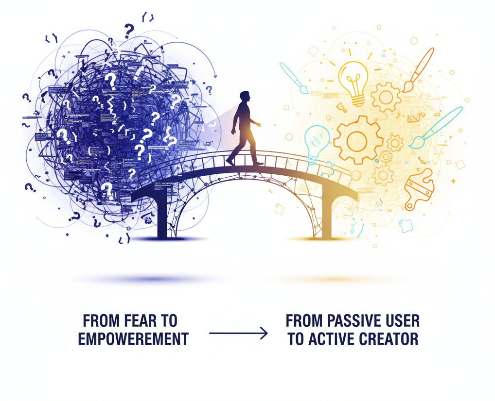
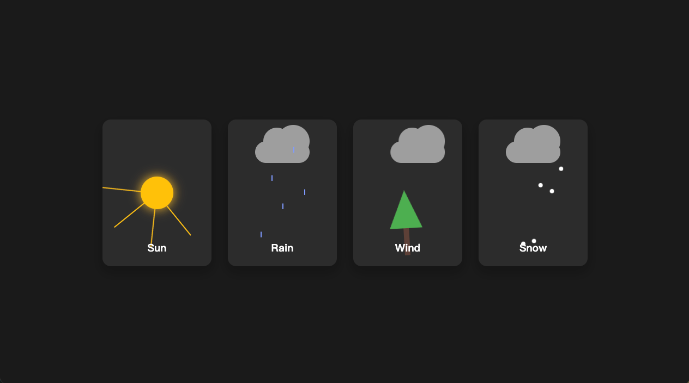
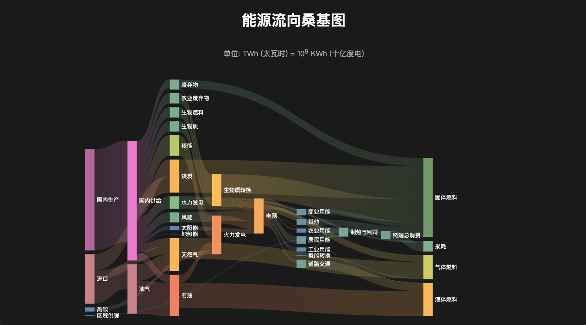
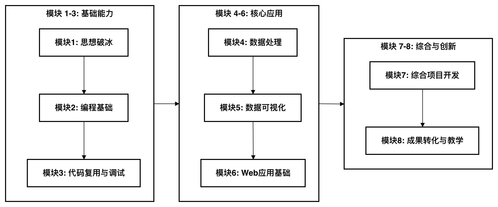
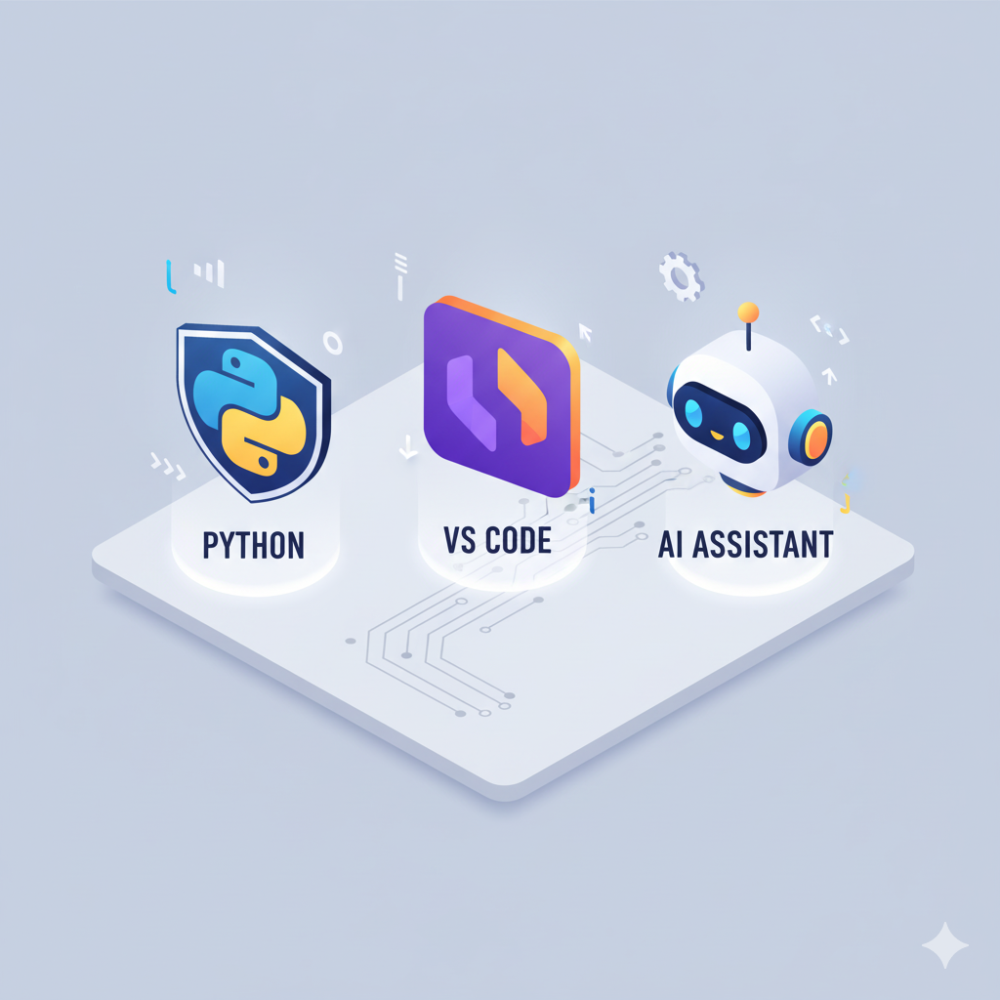

AI赋能软件开发

# 模块一: AI编程新纪元 (思想破冰)
## 第1节课: 导论 & 现场魔法秀

南昌大学计算机系 黎鹰

<!--
- **类型**: 逐字稿
- **内容**: "
  （音乐渐弱，灯光亮起）
  各位老师，大家好！欢迎来到《AI赋能软件开发》的第一堂课。我是黎鹰。

  在接下来的8周里，我将和大家一起，开启一段可能颠覆你对‘编程’和‘创造’认知的旅程。请忘记那些复杂的代码、难懂的语法，今天，我们从一场‘魔法秀’开始。
  "
-->

<!--
- **类型**: 教学设计
- **内容**: |
    ### 教学时间: 1分钟
    ### 开场
    第一页幻灯片的目标是营造一种沉浸感和期待感，而不是传统的“老师好，今天我们讲第一章”的枯燥开场。背景图的选择、标题的层级，都是为了从视觉上就告诉学员：这门课不一样。

    **核心要点**：
    1.  **建立身份**: 明确课程、模块和讲师信息。
    2.  **设定基调**: “思想破冰”和“魔法秀”这两个词，直接定义了第一节课的核心任务——打破思维定式，展示AI编程的惊艳效果，激发学员的好奇心和学习兴趣。
    3.  **降低焦虑**: 开宗明义，这不是一门传统的编程课，目的是让零基础的学员从一开始就放下对“编程”的恐惧。
-->

<!--
- **类型**: 解释
- **内容**: |
    ### 欢迎来到新世界

    亲爱的学员，欢迎你！这一页标志着你学习旅程的正式开始。

    **“思想破冰”** 是我们第一模块的核心目标。传统的编程学习充满了挑战，尤其是对没有技术背景的人来说。我们首先要打破的，就是“编程很难”这块坚冰。

    **“现场魔法秀”** 将通过一系列令人惊叹的现场演示，直观地向你展示AI编程的强大能力。在本节课中，你的任务不是学习如何编码，而是作为一名观众，欣赏和感受当AI成为你的编程伙伴时，创造可以变得多么轻松和有趣。请放松心态，准备迎接惊喜。
-->

---

## **欢迎！这不是一门传统的编程课**

这是一个关于**思维转变**的旅程：

- 从 “我不会编程” 到 **“我能指挥AI编程”**
- 从 “技术恐惧” 到 **“技术赋能”**
- 从 “软件的被动使用者” 到 **“工具的主动创造者”**

<!--
- **类型**: 逐字稿
- **内容**: "
  我们首先要明确，这门课的核心，不是让你去学习如何写代码，而是要完成三个关键的‘思维转变’。

  第一，是从‘我不会编程’的自我怀疑，转变为‘我能指挥AI编程’的自信。你会发现，你缺的不是写代码的能力，而是清晰描述问题的能力。

  第二，是从面对技术的恐惧，转变为利用技术赋能教学和科研的兴奋。AI将成为你的超能力。

  最后，也是最重要的，是从一个软件的被动使用者，转变为一个能够为自己、为学生量身打造工具的主动创造者。这，是我们这门课最终的目标。
  "
-->

<!--
- **类型**: 教学设计
- **内容**: |
    ### 教学时间: 2分钟
    ### 确立核心价值
    这一页是本课程的“价值观宣言”。对于零基础的学员，最大的障碍是心理上的恐惧和自我设限。因此，在展示任何技术细节之前，必须先从思想上为他们“松绑”。

    **核心要点**：
    1.  **重新定义“会编程”**: 将学员的注意力从“写代码”这个行为，转移到“指挥AI”这个更高层次的、更侧重逻辑与沟通的思维活动上。这极大地降低了入门门槛。
    2.  **强调“赋能”而非“学习”**: 课程的价值主张是“技术赋能”，是让你获得解决实际问题的能力，而不是仅仅学会一门技术。这更能激发作为教育工作者的学员的学习动机。
    3.  **点燃“创造者”火焰**: “主动创造者”这个身份，远比“学习者”更具吸引力。它暗示着课程的产出是实实在在的、有用的个人作品，符合“作品导向”的教学哲学。
-->

<!--
- **类型**: 解释
- **内容**: |
    ### 理解三个核心的思维转变

    这三个转变是整个课程的基石，理解它们能帮助你更好地把握学习的重点。

    1.  **从“学写代码”到“学指挥AI”**:
        - **传统**: 学习编程需要记忆大量精确的语法规则（比如括号、分号、关键字），这对初学者非常不友好。
        - **现在**: 你的核心任务是学习如何用清晰、有逻辑的自然语言（就像和人说话一样）来描述你的目标。AI负责将你的“指令”翻译成机器能懂的代码。你的角色从“工人”变成了“指挥家”。

    2.  **从“技术恐惧”到“技术赋能”**:
        - 很多人对写代码感到恐惧，因为它看起来复杂且抽象。
        - AI的出现，让技术变得前所未有的“听话”。你可以让它帮你处理繁琐的数据、制作教学工具、分析文献……技术不再是障碍，而是你能力的放大器。

    3.  **从“使用者”到“创造者”**:
        - 我们每天都在使用各种软件（如Word, Excel），但我们只是被动的使用者，无法改变它们的功能。
        - 掌握AI编程后，当你觉得“要是有个……样的工具就好了”，你将有能力亲手把它创造出来。这种从消费者到创造者的转变，将带给你巨大的成就感。
-->

---

## **现场魔法秀：AI编程的五重“魔法”**

接下来，我们将现场见证AI如何仅凭几句“人话”，就为我们创造出五个风格迥异、逻辑复杂的应用。

1.  **第一重魔法**: 可交互的物理世界
2.  **第二重魔法**: 交互式3D数字模型
3.  **第三重魔法**: 创造性的抽象建模
4.  **第四重魔法**: 富有生命力的UI设计
5.  **第五重魔法**: 交互式的数据可视化

*（本节课，我们将欣赏AI的“表演”，课后你将有机会亲自尝试这些“魔法”）*

<!--
- **类型**: 逐字稿
- **内容**: "
  好了，思想工作做完了，接下来，进入最激动人心的环节——‘现场魔法秀’！

  我将扮演一个‘项目总监’的角色，向我的‘AI程序员’提出五个来自不同学科老师的需求。这些需求在传统开发模式下，每一个都可能需要数周甚至数月的工作量。但今天，我们将见证，AI如何在几分钟内，仅凭我的几句‘人话’，就将它们变为现实。

  请大家放松，尽情欣赏。今天，我们是观众，是魔法的见证者。
  "
-->

<!--
- **类型**: 教学设计
- **内容**: |
    ### 教学时间: 2分钟
    ### 建立认知框架
    这一页是“魔法秀”的目录，其核心教学目标是“建立认知框架”和“管理预期”。

    **核心要点**：
    1.  **结构化展示**: 将演示内容结构化为“五重魔法”，让学员对即将发生的事情有一个清晰的预期，而不是一头雾水地被动观看。
    2.  **覆盖广度**: 五个例子的选择，特意覆盖了从理科（物理）、文科（地理、社会学）到艺术（UI设计）、商科（数据可视化）等不同领域，目的是让所有背景的老师都能看到与自己相关的可能性，产生代入感。
    3.  **预期管理**: 最后一句斜体字非常关键。它告诉学员，今天你们的角色是“欣赏”，而不是“跟练”，避免他们因为看到复杂的效果而产生新的焦虑。同时，也埋下伏笔，“课后你将有机会亲自尝试”，维持了他们的期待感。
-->

<!--
- **类型**: 解释
- **内容**: |
    ### “魔法秀”观看指南

    这五个即将展示的“魔法”，是我们精心挑选的案例，它们分别代表了AI在不同领域的强大能力。观看时，你可以从以下几个角度思考：

    - **能力维度**: 每个“魔法”分别展示了AI的哪种能力？（例如：理解物理规律、处理地理数据、进行艺术创作等）
    - **学科交叉**: 这个案例能否应用到我自己的学科领域？可以用来解决我教学或科研中的什么问题？
    - **人机协作**: 观察讲师是如何向AI下达指令的。这些指令有什么特点？

    **请特别注意**：本节课的目标是“激发兴趣”和“建立信心”。你不需要理解这些“魔法”背后的具体代码实现。你只需要相信，通过本课程的学习，你也能亲自创造出属于自己的“魔法”。
-->

--- 

## **第一重魔法：可交互的物理世界**

**物理老师的需求**：我需要一个能向学生直观演示力学原理的3D沙盒。比如，一个建筑在定向爆破下的结构拆解过程，要求完全符合物理规律，并有爆炸、烟尘等视觉特效。

给AI的“实验设计方案” ：

<pre style="white-space: pre-wrap; margin: 0; padding: 1em; background-color: #f5f5f5; border-radius: 5px; overflow-wrap: break-word; overflow-x: auto;"><code>使用 three.js, cannon-es.js 生成一个震撼的3D建筑拆除演示。
 
## **场景设置：**
- 地面是一个深灰色混凝土平面，尺寸80*80，
- 所有物体严格遵循现实物理规则，包括重力、摩擦力、碰撞检测和动量守恒
 
## **建筑结构：**
一座圆形高层建筑，周长对应20个方块
- 建筑总高度60个方块
- 每层采用砖砌结构，方块与砖结构建筑一致, 错开50%排列，增强结构稳定性
- 建筑外墙使用米色方块
- **重要：方块初始排列时必须确保紧密贴合，无间隙，可以通过轻微重叠或调整半径来实现**
- **重要：建筑初始化完成后，所有方块应该处于物理"睡眠"状态，确保建筑在爆炸前保持完美的静止状态，不会因重力而下沉或松散**
- 建筑砖块之间使用粘性材料填充（不可见），通过高摩擦力（0.8+）和低弹性（0.05以下）来模拟粘合效果
- 砖块在建筑倒塌瞬间不会散掉，而是建筑作为一个整体倒在地面的时候才因受力过大而散掉
 
</code></pre>
<pre style="white-space: pre-wrap; margin: 0; padding: 1em; background-color: #f5f5f5; border-radius: 5px; overflow-wrap: break-word; overflow-x: auto;"><code>## 定向爆破系统：
- 在建筑的第1层的最右侧方块附近安装爆炸装置（不可见）
- 提供操作按钮点击爆炸
- **爆炸时唤醒所有相关方块的物理状态**
- 爆炸点产生半径2的强力冲击波，冲击波影响到的方块, 受到2-5单位的冲击力
 
## **建筑稳定性要求：**
- **确保建筑在未爆炸时完全静止，无任何晃动或下沉**
- **物理世界初始化后给建筑几个物理步骤来自然稳定，或使用睡眠机制**
- **方块间的接触材料应具有高摩擦力和极低弹性，模拟砖块间的砂浆粘合**
 
## **震撼的倒塌效果：**
- 方块在爆炸冲击下不仅飞散，还会在空中翻滚和碰撞
- 烟尘会随着建筑倒塌逐渐扩散，营造真实的拆除现场氛围
 
## **增强的视觉效果：**
- 添加环境光照变化：爆炸瞬间亮度激增，然后被烟尘遮挡变暗
- 粒子系统包括：烟雾、灰尘
 
## **技术要求：**
- 粒子系统用于烟雾和灰尘效果
- 所有代码集成在单个HTML文件中，包含必要的CSS样式
- 添加简单的UI控制：重置按钮、相机角度切换, 爆炸按钮, 鼠标左键控制摄像机角度，右键控制摄像机位置，滚轮控制摄像机焦距
</code></pre>

<!--
- **类型**: 逐字稿
- **内容**: "
  我们的第一位客户，是一位物理老师。他的需求非常具体：他想要一个能模拟定向爆破的3D物理沙盒。请看屏幕，这是我给AI的‘实验设计方案’，也就是我们的Prompt。

  大家注意看，这份方案写得非常详细，就像一份给工程师的设计图纸。我定义了场景、建筑的结构、爆炸的细节，甚至对‘建筑在爆炸前必须保持绝对静止’这样的稳定性要求都做了强调。这说明了什么？——我们和AI协作时，你描述得越精确，AI的执行就越到位。
  "
-->

<!--
- **类型**: 样式替换
- **版本**: [handout, teacher]
- **查找**: |
    

- **替换**: |
    

-->

<!--
- **类型**: 样式替换
- **版本**: [handout, teacher]
- **查找**: |
</code></pre>
<pre style="white-space: pre-wrap; margin: 0; padding: 1em; background-color: #f5f5f5; border-radius: 5px; overflow-wrap: break-word; overflow-x: auto;"><code>
- **替换**: ""
-->

<!--
- **类型**: 换页
- **版本**: [handout, teacher]
-->

<!--
- **类型**: 教学设计
- **内容**: |
    ### 教学时间: 3分钟
    ### 展示“精确描述”的力量
    这个案例的重点不是物理模拟本身，而是展示Prompt的“精确性”和“结构性”。

    **核心要点**：
    1.  **领域相关性**: 这是一个典型的、与学科教学深度结合的需求。它告诉学员，AI编程不是玩具，而是可以用来创造专业教学工具的。
    2.  **Prompt即设计**: 展示的“实验设计方案”实际上就是软件工程中的“需求规格说明书”。通过这个例子，让学员初步感知到，与AI协作的核心，是将模糊的想法转化为清晰、无歧义、结构化的指令。
    3.  **高亮关键指令**: Prompt中用`**重要**`高亮的几个稳定性要求，是这个模拟能否成功的关键。这暗示了在与AI协作时，识别并强调核心约束条件的重要性。
-->

<!--
- **类型**: 解释
- **内容**: |
    ### 案例解析：Prompt即蓝图

    这个案例展示了AI编程的一个核心技巧：**编写高质量的指令（Prompt）**。

    我们给AI的“实验设计方案”就是一种Prompt。请注意它的几个特点：

    1.  **结构化**：使用了清晰的标题（如 `## 场景设置`）来组织需求，就像写一份报告。这有助于AI更好地理解你的意图。
    2.  **精确性**：需求描述非常具体，包含了大量细节（如 `尺寸80*80`, `高度60个方块`, `高摩擦力0.8+`）。你给出的细节越丰富，AI的产出就越接近你的预期。
    3.  **强调约束**: 用 `**重要**` 标出的部分，是这个模拟成败的关键。在向AI提要求时，学会识别并强调这些“关键约束条件”至关重要。

    **核心启示**：与AI协作时，你扮演的是“总设计师”的角色。你的主要工作不是写代码，而是思考并清晰地描述“设计蓝图”（Prompt）。蓝图的质量，直接决定了最终建筑的质量。
-->

---

## **结果：AI构建了“物理沙盒”**

AI收到这份详尽的“脚本”后，为我们生成了一个完整的、可交互的物理模拟世界。

**AI展示了它对复杂需求和专业领域知识（物理引擎）的惊人理解力。**

<!--
- **类型**: 逐字稿
- **内容**: "
  （播放演示动画）
  看！这就是AI根据我们刚才的设计方案，生成的结果。一个完全符合物理规律的模拟世界。建筑在爆炸前纹丝不动，爆炸后，结构应声而解，烟尘效果也非常逼真。这背后，AI不仅理解了我们的要求，还动用了物理引擎（Cannon-es.js）和3D渲染库（Three.js）这些专业知识。而我们，只是提供了清晰的蓝图。
  "
-->

<!--
- **类型**: 教学设计
- **内容**: |
    ### 教学时间: 1分钟
    ### 建立“结果-输入”的强关联
    这一页的核心是验证。它用一个震撼的、符合预期的结果，来证明上一页那个详尽的Prompt是有效的、值得的。

    **核心要点**：
    1.  **即时反馈**: 强有力的视觉结果，能给初学者带来巨大的震撼和信心，让他们直观地感受到AI的能力上限非常高。
    2.  **归因分析**: 明确地将成功的结果归因于“详尽的脚本”。这强化了上一页的核心观点：Prompt的质量决定了输出的质量。
    3.  **引入专业概念**: 简单提及“物理引擎”和“3D渲染库”，是为了让学员意识到，AI能够驾驭和整合非常专业的第三方工具库来完成复杂任务。这拓展了他们对AI能力的想象空间。
-->

<!--
- **类型**: 解释
- **内容**: |
    ### AI的能力：专家知识的调用

    这个结果验证了上一页“Prompt即蓝图”的观点。同时，它也揭示了AI的另一项惊人能力：**调用和整合专业领域的知识与工具**。

    - **物理引擎 (Cannon-es.js)**：这是一个专门用来模拟真实世界物理效果（如重力、碰撞、摩擦力）的程序库。
    - **3D渲染库 (Three.js)**：这是一个用来在网页上绘制三维图形的程序库。

    在传统开发中，要掌握这两个库并让它们协同工作，需要非常专业的工程师花费大量时间。而现在，AI可以根据你的高级指令，自动地为你调用这些专家级工具。

    **核心启示**：你不需要成为所有领域的专家。你只需要清晰地描述你的目标，AI就能为你找到并使用最合适的专业工具来实现它。
-->

---

## **第二重魔法：交互式3D数字模型**

**地理老师的需求**：我需要一个可以交互的3D地球，用来给学生们展示地理信息，并且希望它能自己旋转，背景里还有星星。

**给AI的指令**：
> 请创建一个独立的HTML文件，使用Three.js渲染一个3D地球。这个地球必须有逼真的彩色地球纹理，可以交互（通过鼠标旋转和缩放），并且背景中要带有星星。地球本身也需要缓慢地自转。

<!--
- **类型**: 逐字稿
- **内容**: "
  第二位客户，是一位地理老师。她的需求听起来简单一些：她想要一个交互式的3D数字地球仪。我的指令也相应地变得更简洁，但同样清晰：我指定了要用的技术（Three.js），核心物体（3D地球），关键特征（逼真的纹理、可交互、自转），以及背景元素（星星）。我们来看看AI完成得如何。
  "
-->

<!--
- **类型**: 教学设计
- **内容**: |
    ### 教学时间: 2分钟
    ### 展示“整合外部数据”的能力
    这个案例比上一个简单，但它引入了一个新的维度：整合外部资源（地球纹理图片）。

    **核心要点**：
    1.  **简洁Prompt**: 与上一个复杂的需求相比，这个案例的Prompt相对简洁。这可以让学员理解，Prompt的详略取决于需求的复杂度，并非越长越好。
    2.  **数据与代码分离**: “逼真的彩色地球纹理”这个要求，暗示了程序需要加载一个外部的图片文件。这让学员初步接触到“代码”和“数据”相分离的概念，一个程序不仅包含逻辑，还常常需要消耗外部资源。
    3.  **应用的广泛性**: 数字地球仪是一个非常通用且吸引人的例子，几乎所有老师都能想象出在自己的课堂上使用它的场景，进一步加强了课程的吸引力。
-->

<!--
- **类型**: 解释
- **内容**: |
    ### 案例解析：简洁指令与外部资源

    这个案例的指令（Prompt）比上一个简洁得多。这说明 **Prompt的复杂度应与任务的复杂度相匹配**。对于一个目标明确的常规任务，简单的几句话就足够了。

    这个案例还引入了一个新的概念：**程序 = 代码 + 资源**。

    - **代码**：是程序的逻辑，由AI生成。
    - **资源**：是程序运行时需要用到的外部文件，例如图片、音频、数据文件等。

    指令中的“逼真的彩色地球纹理”，就暗示了AI需要找到一张地球的图片（外部资源），并把它应用到3D模型上。这展示了AI不仅能写代码，还能理解并整合外部资源来完成任务。
-->

---

## **结果：AI生成了“数字地球仪”**

AI不仅理解了3D建模的需求，还正确地引入了“地球纹理”这一外部数据。

**AI展示了它整合外部数据并创造交互式应用的能力。**

<!--
- **类型**: 逐字稿
- **内容**: "
  （展示3D地球）
  请看，一个精美的、正在缓慢自转的3D地球仪就呈现在我们眼前。我们可以用鼠标自由地拖动、缩放它。AI准确地理解了我们的意图，并且自己找到了合适的地球纹理图片，应用到了这个3D模型上。这展示了AI整合外部数据的能力。
  "
-->

<!--
- **类型**: 教学设计
- **内容**: |
    ### 教学时间: 1分钟
    ### 强化“能力维度”的认知
    每个案例后的总结页，都在为一个核心目标服务：帮助学员构建对AI能力的系统认知。

    **核心要点**：
    1.  **总结提炼**: 将具体的案例（数字地球仪）提炼、拔高到一个抽象的能力维度（“整合外部数据并创造交互式应用”）。这种“具体-抽象”的教学方法，有助于学员形成结构化的知识体系。
    2.  **建立信心**: 通过一次次成功的展示，不断强化“AI很强大”的印象，从而让学员对“我指挥AI也能做到”这件事产生更强的信心。
-->

<!--
- **类型**: 解释
- **内容**: |
    ### AI的能力：整合数据与交互

    这个生动的地球仪展示了AI的两项关键能力：

    1.  **数据整合**：AI理解了“地球纹理”的含义，并自动寻找和加载了合适的图片资源，将其“贴”在了3D球体模型上。这在软件开发中被称为“纹理映射”。
    2.  **交互实现**：AI编写了响应用户操作（如鼠标拖动、滚轮缩放）的代码，使得这个应用不再是一个只能看的动画，而是一个可以玩的工具。

    **核心启示**：你可以将AI视为一个全能的助理，它不仅能帮你构建程序的“骨架”（代码逻辑），还能帮你填充“血肉”（数据、图片等资源），并赋予其“灵魂”（交互能力）。
-->

<!--
- **类型**: 样式替换
- **版本**: [handout, teacher]
- **查找**: |
    height:400px
- **替换**: |
    height:360px
-->

---

## **第三重魔法：创造性的抽象建模**

**社会学老师的需求**：我希望能有一种方式，可视化地展示人群中的社交网络，或者知识的传播路径，让学生直观地感受到“连接”的存在。

**给AI的指令**：
> 请创建一个独立的HTML文件，其中包含一个全屏的画布。画布上要有浮动的、发光的粒子动画，当粒子彼此靠近时，它们之间会用线条连接。粒子动画还需要对鼠标的移动做出反应。

<!--
- **类型**: 逐字稿
- **内容**: "
  第三位客户，是一位社会学老师。他的需求非常‘文科’，非常抽象：他想可视化地展示‘连接’。这是一个开放性的、没有标准答案的需求。我的指令也同样是描述性的，我描述了一个视觉现象：发光的粒子、靠近时相连、对鼠标有反应。我并没有告诉AI这代表什么，我只是描述了我想要的画面。
  "
-->

<!--
- **类型**: 教学设计
- **内容**: |
    ### 教学时间: 2分钟
    ### 展示“抽象概念可视化”的能力
    这个案例的独特之处在于它的“开放性”和“艺术性”。它旨在打破学员“AI只能做理工科任务”的刻板印象。

    **核心要点**：
    1.  **文科应用场景**: “社交网络”、“知识传播”是典型的人文社科研究对象。这个案例能极大地激发文科背景教师的兴趣。
    2.  **从“具体”到“抽象”**: 前两个例子都是模拟真实世界（建筑、地球），而这个例子是创造一个不存在的、用于隐喻的视觉模型。它展示了AI不仅能“再现”，还能“表现”。
    3.  **描述性Prompt**: 这个Prompt没有给出精确的物理参数或数据来源，而是用感性的、描述性的语言（“浮动的、发光的粒子”）来定义需求。这告诉学员，与AI的沟通方式是多样的，既可以是精确的“说明书”，也可以是充满想象力的“诗篇”。
-->

<!--
- **类型**: 解释
- **内容**: |
    ### 案例解析：将抽象概念视觉化

    这个案例展示了AI的一项高级能力：**将抽象的、模糊的概念，转化为具体的、可视化的艺术作品**。

    社会学老师的需求“可视化地展示连接”是一个非常抽象的想法。讲师给出的指令，则是对这个抽象想法的一种“视觉转译”。指令中没有包含任何精确的参数，而是使用了描述性的语言，如“浮动的”、“发光的”、“彼此靠近时连接”。

    这说明与AI沟通时，我们有两种主要的指令风格：
    1.  **工程式指令**：精确、量化、结构化，如同第一个建筑拆除的案例。
    2.  **描述式指令**：感性、开放、充满想象力，如此处的粒子动画。

    **核心启示**：AI不仅是一个工程师，也可以是一个艺术家。对于文科、艺术等领域的老师来说，你可以大胆地用充满想象力的语言来描述你想要的视觉效果，AI能够理解并将其实现。
-->

---

## **结果：AI生成了“关系宇宙”**

这个看似抽象的、充满艺术感的“粒子宇宙”，可以完美地用来隐喻各种“关系”的可视化。

**AI展示了它将抽象概念转化为可视化作品的创造力。**

<!--
- **类型**: 逐字稿
- **内容**: "
  （展示粒子动画）
  结果令人惊艳。AI为我们创造了一个充满美感的‘关系宇宙’。你可以把它想象成一个班级里的同学关系网，也可以是社交媒体上的信息传播路径，甚至是不同知识点之间的逻辑联系。AI在这里展示了惊人的创造力，它将一个抽象的概念，成功地进行视觉转译，变成了一个既有信息承载能力，又充满艺术感的作品。
  "
-->

<!--
- **类型**: 教学设计
- **内容**: |
    ### 教学时间: 2分钟
    ### 激发学员的“创造性联想”
    这一页的目的是让学员不仅仅是“看”，更是“想”。

    **核心要点**：
    1.  **开放性诠释**: 讲师在逐字稿中，主动给出了多种诠释方式（“同学关系网”、“信息传播路径”等），目的是引导学员进行发散思维，让他们思考：“这个东西，我能用到我的学科里做什么？”
    2.  **强调“创造力”**: 将AI的能力从“执行”拔高到“创造”的层面。这会进一步激发学员的创作欲望，让他们感觉自己指挥的不是一个工具，而是一个有创造潜能的伙伴。
-->

<!--
- **类型**: 解释
- **内容**: |
    ### AI的能力：艺术性与隐喻

    这个“关系宇宙”是一个强大的视觉隐喻工具。它本身没有特指任何事物，但正因为其抽象性，它可以被用来解释和展示多种多样的“关系”模型：

    - **社会学**：模拟社交网络中个体的连接。
    - **传播学**：展示信息在人群中的传播路径。
    - **教育学**：可视化知识体系中不同概念之间的关联。
    - **生物学**：模拟神经网络中神经元的连接。

    **核心启示**：AI编程不仅能创造出功能性的“工具”，还能创造出充满美感和解释力的“模型”。这为文科、社科和艺术领域的教学与研究，提供了全新的、强大的可视化手段。你可以利用AI，将那些看不见、摸不着的抽象理论，变得直观可感。
-->

---

## **第四重魔法：富有生命力的UI设计**

**美术老师/设计师的需求**：我希望能为我的网页或课件添加一些生动、有趣的视觉元素，比如根据天气动态变化的小卡片，但我不想学复杂的动画软件。

**给AI的指令**：
> 创建一个包含CSS和JavaScript的单一HTML文件，用于生成一组动画天气卡片。每个卡片应通过独特的动画直观地表示一种天气状况：风（移动的云，摇曳的树），雨（下落的雨滴），晴（旋转的光芒），雪（飘落的雪花）。将所有卡片并排显示，背景为深色。所有代码都在一个文件中。

<!--
- **类型**: 逐字稿
- **内容**: "
  第四位客户是一位美术老师，她的需求很直接：不想学复杂技术，但又想做出漂亮的动态效果。她的需求非常适合用纯粹的前端技术（CSS/JS）来实现。我的指令也很明确，描述了四种天气卡片以及它们各自需要表现出的动态特征。
  "
-->

<!--
- **类型**: 教学设计
- **内容**: |
    ### 教学时间: 2分钟
    ### 展示“前端开发与UI设计”能力
    这个案例非常贴近老师们制作课件或网页的实际需求，具有很强的实用性。

    **核心要点**：
    1.  **低代码/无代码场景**: 这个需求的核心是“不想学复杂技术”。它完美地展示了AI如何成为一种“超级视觉外包”，让非技术人员也能创造出专业级的视觉效果。
    2.  **组件化思维**: “一组动画天气卡片”这个概念，向学员初步渗透了“组件化”的开发思想。这些卡片就像一个个独立的积木，可以被轻松地应用到不同的网页或课件中。
    3.  **CSS的艺术性**: 这个例子也展示了，有时候实现惊艳的视觉效果，并不需要动用大型的框架或库，纯粹的CSS和JS也能创造出“魔法”。
-->

<!--
- **类型**: 解释
- **内容**: |
    ### 案例解析：UI设计与组件化

    这个案例非常实用，它展示了AI在**用户界面（UI）设计**和**前端开发**方面的能力。

    美术老师的需求代表了许多非技术人员的共同心声：“我想要好看的效果，但我不想学复杂的工具。”AI完美地解决了这个痛点。

    这个案例也引入了一个重要的软件开发思想：**组件（Component）**。
    - **什么是组件？** 一个组件就是一个独立的、可复用的功能块。这里的每一个天气卡片都是一个组件。
    - **有什么用？** 你可以将这些组件像积木一样，轻松地放到你的网页、课件或教学应用中，而无需关心其内部复杂的实现细节。

    **核心启示**：AI可以成为你的专属设计师和前端工程师，为你快速创造出美观、可复用的视觉组件，极大地美化你的数字化作品。
-->

---

## **结果：AI生成了“天气心情卡片”**

AI利用纯粹的CSS动画，为我们创造了一组生动活泼的UI组件。

**AI展示了它在UI设计和前端开发中的创造力，能够将简单的想法转化为富有生命力的视觉元素。**

<!--
- **类型**: 逐字稿
- **内容**: "
  （展示天气卡片动画）
  大家看，AI用纯粹的CSS动画，就为我们实现了这组非常灵动的‘天气心情卡片’。风、雨、晴、雪，每一种状态都通过独特的动态效果被生动地表现出来。这对于美化我们的课件、网页，或者制作一些教学小工具，都非常有用。
  "
-->

<!--
- **类型**: 教学设计
- **内容**: |
    ### 教学时间: 1分钟
    ### 连接“已知”与“未知”
    老师们可能不熟悉CSS，但都用过PPT里的动画。这个案例起到了一个桥梁作用。

    **核心要点**：
    1.  **降低认知负荷**: 将复杂的CSS动画，类比为PPT动画，让学员在自己熟悉的领域内去理解这个新事物，可以有效降低学习的焦虑感。
    2.  **强调“组件”价值**: 再次强调这些卡片是可复用的“UI组件”，强化了其作为“素材”或“积木”的价值，让学员能立刻想到“这个东西我可以直接拿来用”。
-->

<!--
- **类型**: 解释
- **内容**: |
    ### AI的能力：前端开发的自动化

    你看到的这些流畅动画，主要是由一种名为 **CSS（层叠样式表）** 的技术实现的。在传统开发中，编写这些复杂的动画代码需要耗费大量时间和精力。

    这个案例证明，AI能够胜任专业的前端开发工作，将你关于视觉效果的想法，自动翻译成高质量的CSS和JavaScript代码。

    **核心启示**：制作精美的网页或课件，不再是专业设计师的专利。你可以利用AI，轻松地为你的数字化内容添加丰富的动态效果，提升视觉吸引力和用户体验。这就像拥有了一个不需要支付薪水的7x24小时在线的网页设计师。
-->

<!--
- **类型**: 样式替换
- **版本**: [handout, teacher]
- **查找**: |
    height:400px
- **替换**: |
    height:360px
-->

---

## **第五重魔法：交互式的数据可视化**

**经济学老师的需求**：我需要为我的经济学或社会学课程制作一个数据可视化图表，用来展示一个国家或地区复杂的能源流动情况。图表需要清晰、美观，并且能够交互，让学生可以直观地看到数据的流向和比例。

**给AI的指令**：
> 创建一个独立的HTML文件，使用ECharts图表库来渲染一个桑基图。数据源使用一个复杂的、多层级的能源流向JSON数据集。图表需要适配深色主题，并且可以交互。

<!--
- **类型**: 逐字稿
- **内容**: "
  最后一重魔法，我们来挑战一个专业性非常强的任务。一位经济学老师需要一个复杂的数据可视化图表——桑基图，来展示能源流动。这个任务的难点在于，它不仅要求AI知道什么是桑基图，还得找到或生成符合这种图表格式的复杂数据。我的指令明确了技术库（ECharts）、图表类型（桑基图）和数据要求。
  "
-->

<!--
- **类型**: 教学设计
- **内容**: |
    ### 教学时间: 2分钟
    ### 展示“专业数据处理与可视化”能力
    这是五个案例中技术复杂度最高的，它展示了AI在专业数据科学领域的强大能力，是课程后半段（模块四、五）内容的“终极预告”。

    **核心要点**：
    1.  **引入专业工具库**: “ECharts”是一个业界知名的数据可视化库。这个例子告诉学员，AI不仅能写原生代码，还能熟练使用各种强大的第三方库。
    2.  **数据处理能力**: 这个任务的隐藏难点是“数据处理”。AI需要理解桑基图所需的数据结构（包含节点和链接），并正确地格式化数据。这展示了AI作为“数据分析师”的潜力。
    3.  **课程内容预告**: 这个案例直接对应了教学大纲中的模块五“AI数据分析师(下)”。通过这个惊艳的最终效果，可以极大地激发学员对后续课程的学习兴趣。
-->

<!--
- **类型**: 解释
- **内容**: |
    ### 案例解析：驾驭专业数据科学工具

    这是五个案例中技术含量最高的，它展示了AI在**专业数据分析与可视化**领域的惊人实力。

    - **ECharts**: 一个功能极其强大的、由百度开源的专业数据可视化库。
    - **桑基图 (Sankey Diagram)**: 一种特殊的可视化图表，常用于表示能量、物质或成本的流动。
    - **JSON数据集**: 一种标准的数据交换格式。

    这个任务的难点不仅在于绘图，更在于**数据处理**。AI需要理解桑基图这种复杂图表所需要的数据结构，并正确地生成或处理JSON数据，才能最终渲染成功。

    **核心启示**：AI可以作为你强大的数据分析助理。即使你不是数据科学家，也可以指挥AI使用专业工具库，对复杂数据进行处理和可视化，从而在你的研究和教学中，获得深刻的数据洞察。这部分内容我们将在课程的第四、五模块中深入学习。
-->

---

## **结果：AI绘制了“能量流动桑基图”**

AI不仅找到了合适的图表库和真实的数据集，还正确地处理了数据格式，最终生成了一个极具视觉冲击力的、复杂的数据可视化作品。

**AI展示了它在数据分析、数据处理和高级图表生成方面的专业能力。**

<!--
- **类型**: 逐字稿
- **内容**: "
  （展示桑基图）
  这就是最终结果。一个信息量巨大、视觉效果震撼、并且完全可交互的能源流向图。我们可以清晰地看到能源从生产到消耗的完整路径。AI在这里，扮演了一个高级数据科学家的角色。这对于我们所有需要和数据打交道的老师来说，无疑是一个超级福音。
  "
-->

<!--
- **类型**: 教学设计
- **内容**: |
    ### 教学时间: 2分钟
    ### 完成“信心闭环”
    从第一个物理模拟到最后一个数据科学图表，五个案例难度和专业度层层递进，到这里完成了对学员的“信心构建”的闭环。

    **核心要点**：
    1.  **能力矩阵**: 五个案例共同构成了一个能力矩阵：物理模拟（专业领域）、3D建模（通用交互）、抽象可视化（文科艺术）、UI设计（前端开发）、数据科学（数据处理）。这全面地展示了AI的能力广度与深度。
    2.  **从“魔法”到“工具”**: 在学员心中，AI的形象已经从一个看不懂的“魔法”，转变为一个虽然强大但可理解、可驾驭的“超级工具”。破冰任务完成。
-->

<!--
- **类型**: 解释
- **内容**: |
    ### AI的能力：端到端的数据科学家

    这个案例完美地展示了AI作为“数据科学家”的端到端能力：

    1.  **理解需求**：理解了“能源流动”这个主题和“桑基图”这个专业图表类型。
    2.  **选择工具**：选择了合适的专业图表库 ECharts。
    3.  **寻找/生成数据**：找到了符合桑基图格式的真实数据集。这是最惊人的一步，体现了AI强大的知识储备。
    4.  **处理数据**：将数据处理成图表库可以接收的格式。
    5.  **生成代码**：编写代码来渲染图表，并进行美化（如适配深色主题）。

    **核心启示**：数据分析的整个工作流，从理解问题到最终出图，都可以在AI的辅助下极大地加速。这对于所有需要与数据打交道的教育和研究工作者来说，是一个革命性的效率提升工具。
-->

<!--
- **类型**: 样式替换
- **版本**: [handout, teacher]
- **查找**: |
    height:400px
- **替换**: |
    height:360px
-->

---

## **“魔法”揭秘：什么是AI辅助编程？**

刚才发生的一切，其核心是**人机协作**的新范式。

- **你的角色 (项目总监)**
  - 提出创意、定义问题
  - 清晰描述需求和逻辑
  - 评估最终结果

- **AI的角色 (高效程序员)**
  - 理解你的自然语言需求
  - 快速生成、实现代码
  - 执行重复性、模式化的任务

<!--
- **类型**: 逐字稿
- **内容**: "
  好了，魔法表演结束。现在，我们来揭秘。刚才发生的一切，都不是真正的魔法，而是一种全新的人机协作范式。

  在这个范式里，你的角色变了。你不再是那个需要亲手砌砖的‘建筑工人’，你变成了运筹帷幄的‘项目总监’或‘总设计师’。你的核心工作是提出创意、定义问题、清晰地描述你的设计蓝图，以及在最后验收成果。

  而AI，则扮演了那个能力超强、速度极快、但有点一根筋的‘明星程序员’。它负责理解你的蓝图，并用代码将它实现。你们是伙伴关系。
  "
-->

<!--
- **类型**: 教学设计
- **内容**: |
    ### 教学时间: 3分钟
    ### 定义“人机关系”
    这是本节课最重要的理论升华。在展示了足够多“是什么”之后，必须清晰地定义“如何做”以及“你是谁”。

    **核心要点**：
    1.  **角色重新定位**: “项目总监”这个比喻，极大地提升了学员的自我定位，让他们意识到自己是在从事一项创造性的、高层次的智力活动，而不是在学习一项“搬砖”的技能。
    2.  **明确职责边界**: 清晰地划分了人和AI的职责。人的核心是“思考”（定义问题、描述逻辑），AI的核心是“执行”（生成代码）。这为后续所有课程的教学都奠定了理论基础。
    3.  **建立伙伴关系**: 强调人与AI是“协作”的伙伴关系，而非“替代”关系，这有助于缓解部分学员可能存在的“被AI取代”的深层焦虑。
-->

<!--
- **类型**: 解释
- **内容**: |
    ### 理解新的人机协作关系

    这是本节课最重要的概念。请仔细理解人和AI在新的编程范式中各自扮演的角色。

    **你的角色：项目总监 / 总设计师**
    你的工作聚焦于“思考”和“决策”，这些是机器无法替代的创造性活动。
    - **提出创意**：这是价值的源头。AI不会凭空产生想法，它需要你来定义目标。
    - **清晰描述**：这是实现价值的关键。你需要学习如何将你的想法，转化为AI能理解的、清晰无歧义的指令。这项能力，我们称之为“Prompt Engineering”，是本课程的核心技能之一。
    - **评估结果**：你需要扮演“甲方”的角色，判断AI的产出是否满足你的要求，并提出修改意见。

    **AI的角色：高效程序员 / 超级工具**
    AI负责所有“执行”层面的工作。
    - **理解需求**：它能听懂你的话。
    - **生成代码**：它能快速写出实现功能的代码。
    - **执行重复任务**：所有繁琐、重复、有固定模式的工作，都是AI的强项。

    **核心启示**：编程不再是少数人的专利。只要你能清晰地思考和表达，你就能利用AI这个强大的伙伴，将你的想法变为现实。
-->

---

## **思维的转变：编程学习的颠覆**

| | **传统编程** | **AI辅助编程** |
| :--- | :--- | :--- |
| **核心** | 学习并记忆**语法** | 分析并清晰**描述问题** |
| **角色** | 代码的**编写者** | 解决方案的**设计者** |
| **过程** | 从零开始，逐行构建 | 与AI协作，迭代优化 |
| **门槛** | 陡峭，需要大量时间 | 平缓，即时获得反馈 |

<!--
- **类型**: 逐字稿
- **内容**: "
  这种协作关系，将彻底颠覆我们学习编程的方式。请看这个对比：

  传统编程，核心是学习和记忆语法，你更像一个代码的‘编写者’。而AI辅助编程，核心是分析和描述问题，你变成了解决方案的‘设计者’。

  传统编程，过程是痛苦的、从零开始的。而AI辅助编程，过程是高效的、与AI协作迭代的。

  最关键的是，传统编程的门槛非常陡峭，需要大量时间投入才能看到成果。而AI辅助编程的门槛极其平缓，你几乎可以立刻获得反馈，这种即时满足感，是维持学习热情的关键。
  "
-->

<!--
- **类型**: 教学设计
- **内容**: |
    ### 教学时间: 3分钟
    ### 固化“新旧对比”的认知
    通过一个清晰的表格，将新旧范式进行直接对比，能极大地强化认知，让学员深刻理解这场变革的本质。

    **核心要点**：
    1.  **从“记忆”到“描述”**: 这是核心能力的变化。它告诉学员，未来最重要的能力，不再是记住多少代码，而是能否将你的思想清晰、有条理地表达出来。这对教育工作者而言，是一个巨大的福音，因为“清晰表达”本就是我们的核心专业能力之一。
    2.  **从“编写者”到“设计者”**: 这是身份的跃迁。再次强化了学员作为“创造者”的自我认同。
    3.  **平缓的学习曲线**: “门槛平缓，即时反馈”是AI辅助编程能成功应用于零基础教学的关键。它解决了传统编程教学中“入门难，易放弃”的最大痛点。
-->

<!--
- **类型**: 解释
- **内容**: |
    ### 新旧范式对比解析

    这个表格清晰地揭示了AI给编程学习带来的革命性变化。

    - **核心能力转变**:
      - **过去**: 学习的重点是“语法”，即代码的格式和规则。你需要像学习一门外语一样，记忆大量的单词和语法。
      - **现在**: 学习的重点是“描述问题”。这项能力很多教育工作者早已具备。你需要学习的，只是如何将问题描述得更结构化、更无歧义。

    - **角色身份跃迁**:
      - **过去**: 你是一个“编写者”，大部分时间花在逐行编写和调试代码上。
      - **现在**: 你是一个“设计者”，大部分时间花在思考“做什么”和“如何做”的顶层设计上，具体的代码实现由AI完成。

    - **学习体验改善**:
      - **过去**: 学习曲线陡峭，从写下第一行`hello world`到做出一个有用的工具，需要漫长的时间，很多人在这个过程中就放弃了。
      - **现在**: 学习曲线平缓，AI提供的“即时反馈”让你在学习的每一步都能获得成就感，这极大地激发和维持了学习热情。
-->

---

## **这对你（教育工作者）意味着什么？**

掌握AI编程，你将能够：

- **提升科研效率**: 自动化处理实验数据、文本语料、调查问卷...
- **孵化教学创新**: 为你的课堂量身打造专属的计算器、分析工具、演示软件...
- **赋能你的学生**: 将这种解决问题的新范式传授给学生，培养他们的创新能力。

<!--
- **类型**: 逐字稿
- **内容**: "
  那么，掌握这项新能力，对我们在座的各位教育工作者，到底意味着什么？

  首先，是提升你自己的科研效率。想象一下，过去需要你手动整理几周的实验数据或调查问卷，现在可以让AI在几分钟内帮你自动处理、分析、并生成图表。

  其次，是孵化你的教学创新。你脑海中那些‘要是有个这样的小工具就好了’的想法，现在完全可以亲手实现。为你的物理课做一个专属的模拟器，为你的语文课做一个自动诗词分析工具，都成为了可能。

  最后，你可以将这种新的思维范式，赋能给你的学生，培养他们在新时代下的创新能力和问题解决能力。
  "
-->

<!--
- **类型**: 教学设计
- **内容**: |
    ### 教学时间: 3分钟
    ### 连接“课程价值”与“个人需求”
    这一页的目的是将课程的价值，与学员的三个核心身份（研究者、教学者、育人者）进行强绑定，让课程的价值变得具体、可感。

    **核心要点**：
    1.  **科研效率**: 这是很多高校教师的刚需，能迅速抓住他们的痛点。
    2.  **教学创新**: 这是所有一线教师的追求，展示了将教学想法变为现实的可能性。
    3.  **赋能学生**: 这是教育工作者的终极使命，将课程的价值提升到了“培养下一代”的高度，能引发学员更深层次的共鸣。
-->

<!--
- **类型**: 解释
- **内容**: |
    ### AI编程对教育工作者的三大价值

    掌握AI编程，对你的职业生涯将产生具体而深远的影响。

    1.  **科研的“加速器”**:
        - 想象一下，你可以让AI帮你写一个脚本，自动从上千个PDF文档中提取表格数据；或者帮你分析访谈录音，自动进行文本分类和情感分析。这些在过去需要耗费大量人力的工作，现在都可以自动化完成，让你能更专注于研究本身。

    2.  **教学的“孵化器”**:
        - 你可以为你教的每一门课、每一个知识点，都创造出专属的互动教学工具。例如，为历史课做一个交互式时间轴，为化学课做一个分子结构浏览器，为语言课做一个自动批改发音的小应用。这将极大地提升你的教学效果和课堂吸引力。

    3.  **育人的“新范式”**:
        - 更重要的是，你可以将这种“定义问题-指挥AI-解决问题”的新范式传授给你的学生。这培养的不仅仅是编程技能，更是面向未来的、解决复杂问题的核心素养。
-->

---

## **你的学科，你的魔法**

**这股力量，正在赋能所有学科：**

*   **对于文科教师**: 瞬间分析数百篇数字化文献，自动提取关键词或进行情感分析。
*   **对于理科教师**: 自动处理繁杂的实验数据，从海量数据中绘制图表。
*   **对于经管教师**: 编写一个网络爬虫，实时获取并分析市场数据。
*   **对于艺术教师**: 将一个抽象的设计理念，快速生成数十种视觉方案。

**无论你的领域是什么，AI都能成为你专属的超级研究助理。**

<!--
- **类型**: 逐字稿
- **内容**: "
  请不要认为这只是计算机老师的专利。这股力量正在赋能所有学科。无论你是文科、理科、经管还是艺术老师，AI都能成为你强大的研究助理和教学工具开发者。从分析文献，到处理数据，再到获取市场信息和生成设计方案，它的应用场景，只受限于你的想象力。
  "
-->

<!--
- **类型**: 教学设计
- **内容**: |
    ### 教学时间: 2分钟
    ### 破除“学科壁垒”
    这一页旨在进一步破除学员心中可能存在的“学科壁垒”，让每个人都找到自己的位置。

    **核心要点**：
    1.  **具体案例**: 为不同学科门类提供了非常具体、可操作的应用案例，而不是空泛的口号。
    2.  **身份认同**: “超级研究助理”这个比喻，精准地切中了高校教师的需求，让他们能立刻感受到AI的实用价值。
    3.  **激发想象**: “只受限于你的想象力”这句话，是在鼓励学员开始主动思考AI在自己领域内的应用，将他们从被动的知识接收者，转变为主动的需求发现者。
-->

<!--
- **类型**: 解释
- **内容**: |
    ### AI编程的跨学科应用场景

    AI编程不是计算机专业的特权，它是一种通用的、赋能所有学科的“元能力”。以下是一些具体的应用场景启发：

    - **文科（文学、历史、哲学）**:
      - **数字人文研究**: 对大量古籍、文献进行文本挖掘，分析词频、人物关系网络、思想演变脉络。
      - **语料库构建**: 自动从网络上抓取特定主题的文本，构建个人研究用的语料库。

    - **理科（物理、化学、生物）**:
      - **实验数据自动化**: 编写脚本自动读取仪器生成的原始数据，进行清洗、计算和可视化。
      - **科学计算与模拟**: 进行简单的物理过程模拟、化学反应可视化等。

    - **经管（经济、管理、金融）**:
      - **量化分析**: 对股票数据、财报数据进行自动化分析，生成图表和报告。
      - **舆情监控**: 编写爬虫监控特定商品或公司的社交媒体评论，进行情感分析。

    - **艺术（美术、设计、音乐）**:
      - **生成艺术**: 创作生成式算法艺术作品。
      - **设计辅助**: 快速生成多种配色方案、布局方案或设计元素。

    **核心启示**：请开始思考，在你的学科中，有哪些重复性的、基于规则的工作？有哪些沉睡的数据？这些都是AI可以大展身手的领域。
-->

---

## **我们的学习路径概览**

这是一个从思想到工具，再到创造的完整旅程。

*图：课程学习路径概览*

<!--
- **类型**: 逐字稿
- **内容**: "
  为了实现这一切，我们设计了一条清晰的学习路径。这张图展示了我们整个课程的鸟瞰图。我们将从最基础的编程概念开始，逐步学习数据处理、数据可视化，然后进入Web应用的开发，最终完成一个属于你自己的综合项目。这是一个从思想到工具，再到最终创造的完整旅程。
  "
-->

<!--
- **类型**: 教学设计
- **内容**: |
    ### 教学时间: 2分钟
    ### 提供“学习地图”
    在课程的第一节课，给学员一张清晰的“学习地图”，对于稳定学习心态、建立长期目标至关重要。

    **核心要点**：
    1.  **可视化路径**: 用一张流程图来展示整个课程的结构，比纯文字更直观，更易于理解和记忆。
    2.  **管理学习预期**: 地图清晰地标示了每个阶段的学习重点（编程基础 -> 数据分析 -> Web应用 -> 综合项目），让学员对未来的学习内容和难度有一个科学的预期。
    3.  **建立全局观**: 这张图帮助学员从一开始就建立起对课程的全局观，让他们知道自己当前所学在整个知识体系中的位置，从而减少学习过程中的迷茫感。
-->

<!--
- **类型**: 解释
- **内容**: |
    ### 课程学习地图解读

    这张学习路径图是你未来8周的“导航地图”。它清晰地展示了我们将如何一步步地从零基础走向“初级建筑师”。

    - **模块1-3 (魔法学徒)**:
      - **目标**: 掌握与AI对话的基本方法，学习编程的核心概念（变量、判断、循环、函数），打破对编程的恐惧。
      - **产出**: 你将能指挥AI编写一些简单但实用的脚本，例如批量处理文件。

    - **模块4-6 (作坊工匠)**:
      - **目标**: 学习使用专业的数据分析和Web开发工具库，将你的能力从“处理文件”升级到“分析数据”和“构建应用”。
      - **产出**: 你将能指挥AI对Excel表格进行自动化分析和可视化，并能将你的脚本打包成一个简单的网页工具。

    - **模块7-8 (初级建筑师)**:
      - **目标**: 学习系统性地解决一个复杂问题，完成一个属于你自己的、与学科深度结合的综合项目。
      - **产出**: 一个可以展示、可以使用的“学科知识问答机器人”。

    **核心启示**：课程的设计是循序渐进、层层递进的。请相信这个路径设计，跟随节奏，你将平稳地到达终点。
-->

---

## **课堂互动：你的“痛点”是什么？**

请花两分钟思考一下：

1.  在你的教学或科研中，是否存在大量**重复、耗时**的工作？
2.  你是否曾有一个想法，但因为**技术限制**而无法实现？

*欢迎在课程群或线上讨论区分享，这些都可能成为你未来AI赋能软件开发的灵感来源！*

<!--
- **类型**: 逐字稿
- **内容**: "
  在课程的最后，我想请大家花两分钟，安静地思考一下这两个问题。在你的日常工作中，有没有哪些让你烦恼的、重复性的劳动？你脑海中，有没有一些因为技术原因而被搁置的好点子？

  请把你的思考和痛点，分享到我们的课程群里。这些问题，正是我们学习这门课的最初动力，也极有可能成为你在这门课中的结业项目。让我们从解决自己最真实的问题开始。
  "
-->

<!--
- **类型**: 教学设计
- **内容**: |
    ### 教学时间: 3分钟
    ### 连接“学习”与“应用”
    这是一个非常重要的互动环节，它的目的是将课程学习的“外部动机”转化为“内部动机”。

    **核心要点**：
    1.  **问题导向学习 (PBL)**: 通过引导学员反思自己的“痛点”，将课程的学习目标与解决个人实际问题进行绑定。这是最有效的学习动机激发方式。
    2.  **收集项目灵感**: 这个环节也是在为课程后期的“综合项目”收集素材和灵感。让学员从第一节课就开始构思自己的项目，可以极大地提升课程的参与度和最终的完成质量。
    3.  **建立社群联结**: 鼓励学员在课程群里分享，可以促进学员之间的交流，为建立学习社群打下基础。
-->

<!--
- **类型**: 解释
- **内容**: |
    ### 如何找到你的第一个AI编程项目？

    这个互动环节是为你自己寻找学习的“原动力”。最好的学习项目，永远是能解决自己真实问题的项目。

    **问题1：寻找“重复、耗时”的工作**
    这是发现自动化需求的最佳途径。请仔细盘点你的工作流：
    - 你是否需要每周手动整理和合并多份Excel表格？
    - 你是否需要从大量的学生作业（Word文档）中复制粘贴特定内容？
    - 你是否需要定期去某个网站上手动查找和记录信息？
    **这些重复性工作，都是AI编程最擅长解决的问题。**

    **问题2：唤醒“被搁置”的想法**
    很多时候，我们不是没有好想法，而是被“我不会技术”这个念头所限制。现在，你可以重新审视这些想法：
    - “要是有个能帮学生自动检查论文格式的工具就好了。”
    - “要是有个能根据关键词自动生成练习题的网站就好了。”
    - “要是有个能模拟我实验过程的动画就好了。”
    **这些被技术限制的想法，现在都有了实现的可能。**

    **行动指南**：请务必花时间思考这两个问题，并将你的“痛点”或“想法”记录下来。它将成为你整个课程学习中最宝贵的财富和最强大的驱动力。
-->

---

## **下一步预告**

在下一节课中，我们将亲手搭建自己的AI编程环境。

- **目标**: 安装并配置好所有必需的工具。
- **内容**:
  - 安装 Python
  - 安装 VS Code 编辑器
  - 安装并授权 Qwen Code AI助手

为创造属于你自己的“魔法”做好准备！

<!--
- **类型**: 逐字稿
- **内容**: "
  思想破冰就到这里。下一节课，我们将正式进入实操环节，我会带领大家一步一步，在自己的电脑上，搭建起我们专属的‘魔法实验室’——安装Python、VS Code和AI助手。

  感谢大家的参与，我们下节课见！
  "
-->

<!--
- **类型**: 教学设计
- **内容**: |
    ### 教学时间: 1分钟
    ### 清晰的“行为召唤”
    课程的结尾需要一个清晰、具体、可执行的“下一步”，让学员明确知道下节课要做什么。

    **核心要点**：
    1.  **明确任务**: 清晰地列出了下节课的三个核心安装任务，让学员有备而来。
    2.  **从“看”到“做”**: 明确地告知学员，课程将从“思想破冰”进入“动手实操”的阶段，完成了学习节奏的转换。
    3.  **保持激励**: “为创造属于你自己的‘魔法’做好准备！”这句话，再次强化了课程的创造者导向，并保持了学员的学习热情和期待感。
-->

<!--
- **类型**: 解释
- **内容**: |
    ### 为下一课做准备

    第一节课的“思想破冰”至此结束。从下一节课开始，我们将进入动手实践环节。

    **下一课的目标非常明确**：在你的电脑上，搭建好进行AI编程所需的所有基础环境。这就像一个魔法师在施法前，需要准备好自己的魔杖和法术书。

    **你需要做什么？**
    - **课前准备**：如果可能，可以尝试提前访问Python和VS Code的官方网站，对它们有一个初步的印象。但这并非必须，课上会提供详细的指导。
    - **保持耐心**：环境安装过程有时会因为个人电脑设置不同而遇到一些小问题，请保持耐心，助教和老师会协助你解决。

    **核心启示**：搭建环境是所有创造的起点。请务必跟上下一节课的节奏，确保你的“魔法实验室”顺利建成。准备好从一名观众，转变为一名真正的“魔法学徒”吧！
-->