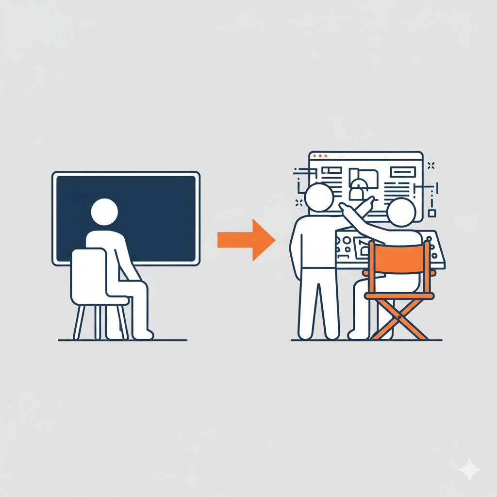
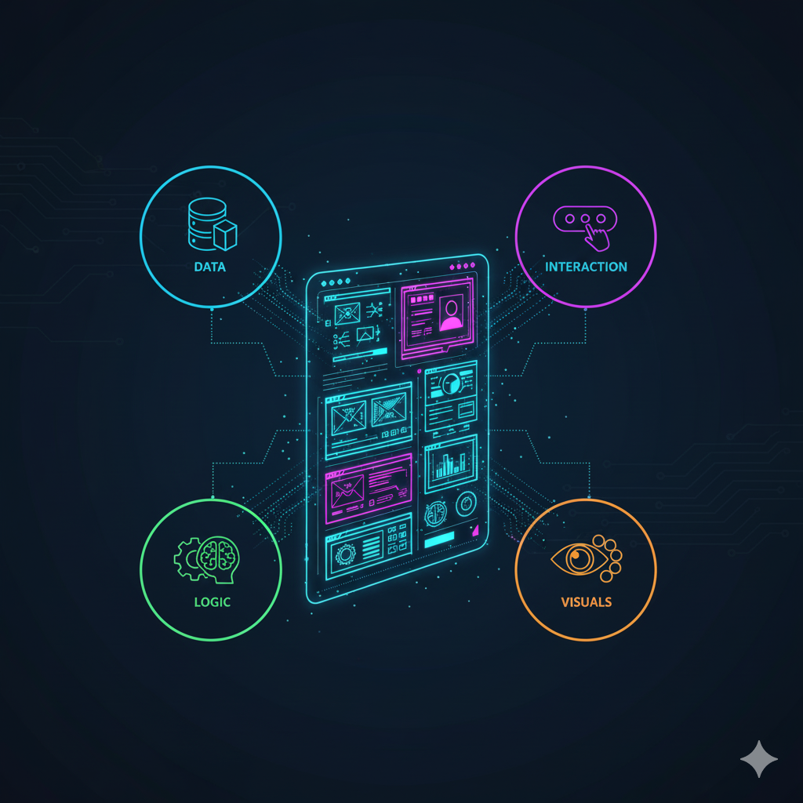
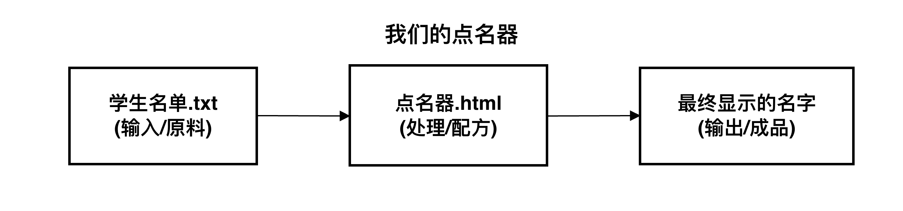
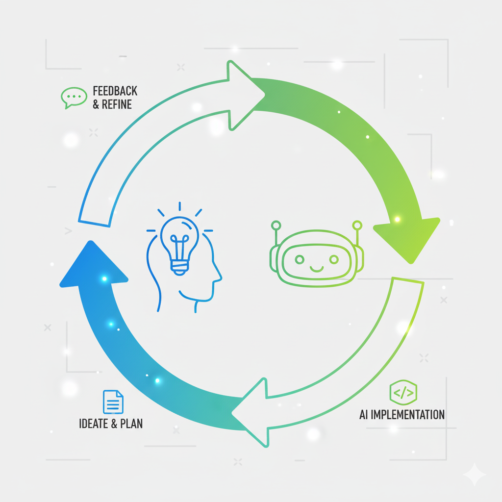
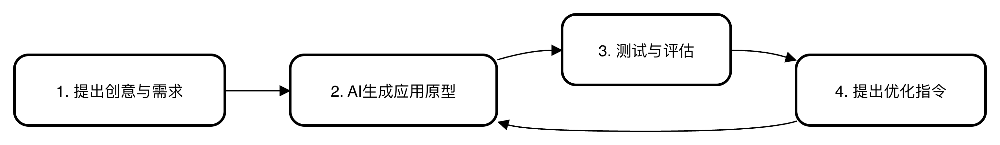

AI赋能软件开发

# 模块一: AI编程新纪元 (思想破冰)
## 第3节课: 你的第一个AI应用：可视化随机点名器

南昌大学计算机系 黎鹰

<!--
- **类型**: 逐字稿
- **内容**: |
  （音乐）各位老师，大家好，欢迎回到我们的第三节课。
  上一节课，我们成功搭建了属于自己的“魔法工作室”，并召唤出了AI编程助手。
  今天，我们将完成一次重要的角色升级：不再仅仅是体验AI的“魔法”，而是要第一次作为一名“产品总监”，指挥你的AI开发团队，从零到一，为我们自己的课堂创造一个真正实用、可视化的教学工具——随机点名器。
-->

<!--
- **类型**: 教学设计
- **内容**: |
  ### 教学时间: 1分钟
  ### 开场：承前启后，设定目标
  本页作为第三节课的开场，旨在快速回顾上节课的成果，并清晰地设定本节课更具创造性的目标。

  **核心要点**：
  1.  **回顾与衔接**: 确认学员已完成环境搭建，并将其从“魔法学徒”的角色自然地过渡到本节课的“产品总监”。
  2.  **目标具体化**: “可视化随机点名器”是一个非常具体、贴近教学场景的目标，能让学员立刻理解本节课的产出和价值。
  3.  **角色升级**: 强调从“体验”到“创造”的角色转变，提升学员的参与感和主人翁意识。
-->

<!--
- **类型**: 解释
- **内容**: |
  ### 从“体验者”到“创造者”
  欢迎来到第三节课！在上一课中，我们已经成功搭建了与AI协作所需的环境。这节课，我们将利用这个环境，完成从“体验”到“创造”的关键一步。

  我们将要创造的“随机点名器”，是一个看似简单却五脏俱全的完整软件应用。它包含了数据（学生名单）、交互（按钮）、逻辑（随机选取）和视觉呈现（滚动动画）。

  通过这个项目，你将第一次完整地体验到作为一名“产品设计师”或“项目总监”，如何将一个想法变为现实的全过程。
-->

---

## **本节课目标：创造你的第一个实用教学工具**

在本节课中，我们将完成一次角色的重要升级：

从上一节课单纯体验AI的“即兴魔法”，**转变为第一次作为“产品总监”，指挥AI为你从零到一创造一个真正实用、可视化的教学应用**。

你将扮演“**产品总监**”的角色，你的任务是提出清晰的需求，AI则会作为你的“全栈开发团队”，负责实现一切。

<!--
- **类型**: 逐字稿
- **内容**: |
  是的，你没听错，是“产品总监”。
  在今天的课堂上，你的身份不再是“代码学习者”，而是这个“随机点名器”项目的产品总监。
  你的核心任务，不再是去思考如何写代码，而是思考“我想要一个什么样的产品？”，然后清晰地把你的需求提出来。
  而你身边的AI编程助手，就是你的“全栈开发团队”，它能力超群、随叫随到，负责实现你提出的所有需求。
  让我们一起体验一下这种全新的创造模式。
-->

<!--
- **类型**: 教学设计
- **内容**: |
  ### 教学时间: 2分钟
  ### 确立核心隐喻与角色定位
  本页的核心是强化“产品总监 vs AI开发团队”这一隐喻，为整个课程的“人机协作”模式奠定基调。

  **核心要点**：
  1.  **角色扮演**: 让学员代入“产品总监”的角色，可以有效地将他们的注意力从对“写代码”的恐惧，转移到他们相对熟悉的“提要求”、“沟通协调”等活动上。
  2.  **能力拆分**: 清晰地界定人（提需求）和AI（实现）的职责，让学员明白自己应该聚焦于“想清楚”，而不是“做出来”。
  3.  **降低心理门槛**: “全栈开发团队”的比喻，极大地增强了学员的信心，让他们感觉自己拥有了强大的技术后盾。
-->

<!--
- **类型**: 解释
- **内容**: |
  ### 理解“产品总监”的角色
  在软件开发行业中，“产品总监”或“产品经理”是一个至关重要的角色。他们负责：
  - **发现问题**: 洞察用户的痛点和需求。
  - **定义产品**: 设计产品的功能和形态，决定“做什么”和“不做什么”。
  - **沟通协调**: 将产品的需求清晰地传达给开发团队。

  在AI辅助编程的新范式下，你学习的核心正是“产品总监”的思维方式。AI负责技术实现，而你负责定义产品的灵魂。今天的练习，就是一次产品总监的“迷你实战演练”。
-->

---

## **真实场景：让课堂点名变得有趣！**

想象一下，传统的点名方式可能是……

- 拿着纸质名单，逐个念名字（耗时、单调）
- 随机叫学号（缺乏仪式感）

**我们的愿景**：创造一个充满动感和趣味的“随机点名器”，在屏幕上快速滚动学生的名字，最后随机定格。让每一次点名，都像一次激动人心的抽奖！

<!--
- **类型**: 逐字稿
- **内容**: |
  好，各位“产品总监”，我们的第一个项目来了。
  我们来解决一个教学中的真实痛点：课堂点名。传统的点名方式，要么是逐个念名字，很单调；要么是随机叫学号，缺乏点仪式感。
  我们今天的愿景，就是要把它变得有趣。我们想创造一个充满动感、类似“老虎机”抽奖效果的点名器。当按下开始，所有学生的名字在屏幕上飞速滚动，再次按下，屏幕定格在一个“幸运儿”身上。
  让每一次点名，都变成一次小小的、激动人心的课堂事件。
-->

<!--
- **类型**: 教学设计
- **内容**: |
  ### 教学时间: 2分钟
  ### 建立需求背景与价值主张
  本页旨在将项目与学员的真实工作场景深度绑定，并清晰地阐述产品的“价值主张”。

  **核心要点**：
  1.  **场景代入**: 通过描述“传统点名方式”的痛点，快速引发学员的共鸣。
  2.  **价值主张**: “让课堂点名变得有趣！”和“激动人心的抽奖”，清晰地定义了产品要创造的核心价值——提升课堂的趣味性和仪式感。
  3.  **视觉对比**: 图片直观地展示了从“无聊”到“有趣”的转变，强化了产品的吸引力。
-->

<!--
- **类型**: 解释
- **内容**: |
  ### 为什么从“痛点”和“愿景”开始？
  所有成功的软件产品，都源于对一个“痛点”的深刻理解，并为之提供一个有吸引力的“愿景”。
  - **痛点 (Pain Point)**: 用户在特定场景下感到的不便、不满或低效。在这里，痛点是“传统点名方式单调、缺乏仪式感”。
  - **愿景 (Vision)**: 对解决了痛点之后美好状态的描绘。在这里，愿景是“像激动人心的抽奖一样的点名体验”。

  在启动任何一个项目前，先花时间清晰地定义“痛点”和“愿景”，是产品设计的第一步，也是最重要的一步。
-->

---

## **解构魔法：先搭“骨架”（数据与交互）**

在告诉AI“做什么”之前，我们先像产品经理一样，把“大想法”拆解成“小零件”。

**我们的愿景：** 一个充满动感和趣味的随机点名器。

**首先，思考它的基本框架：**

1.  **“原料”是什么？** -> 点名器需要“认识”所有学生。
    -   **特性1 (数据)**：程序必须能**读取一份学生名单**。

2.  **“开关”在哪里？** -> 我们需要一种方式来命令它“开始”和“停止”。
    -   **特性2 (交互)**：需要一个 **“开始/停止”按钮**。

<!--
- **类型**: 逐字稿
- **内容**: |
  一个好的产品总监，不会直接把“我要一个抽奖式的点名器”这样模糊的想法扔给开发团队。他会先把这个大想法，拆解成一个个具体的小零件。这个过程，我们称之为“需求解构”。
  让我们一起来做这件事。
  首先，我们来搭建这个程序最基本的“骨架”。任何一个程序，都离不开“数据”和“交互”。
  它的“原料”，也就是数据是什么？显然，是我们的学生名单。所以，第一个特性就明确了：程序必须能读取一份学生名单。
  它的“开关”，也就是我们和它交互的方式是什么？最直接的，就是点一个按钮。所以，第二个特性是：需要一个“开始/停止”按钮。
-->

<!--
- **类型**: 教学设计
- **内容**: |
  ### 教学时间: 3分钟
  ### 教授“需求分析”的核心方法
  本页开始引导学员进行结构化的思考，将一个模糊的想法分解为具体、可实现的功能点。这是编程思维的核心训练。

  **核心要点**：
  1.  **引入“解构”思想**: 将“需求分析”包装成“解构魔法”，生动易懂。
  2.  **建立基本模型**: 提出任何程序都包含的两个基本要素“数据（原料）”和“交互（开关）”，为学员提供一个分析问题的通用框架。
  3.  **从具体到抽象**: 将“学生名单”抽象为“数据”，将“按钮”抽象为“交互”，培养学员的抽象思维能力。
-->

<!--
- **类型**: 解释
- **内容**: |
  ### 编程思维：分解问题
  将一个大而复杂的问题，分解成一系列小而简单的、可以独立解决的子问题，是计算机科学和软件工程中最核心的思维方式之一，我们称之为“**分解 (Decomposition)**”。

  在这里，我们将“制作一个随机点名器”这个大问题，分解成了几个更小的特性。

  我们首先关注的是所有应用最基础的两个部分：
  - **数据 (Data)**: 程序需要处理的信息。没有数据，程序就无事可做。在这里就是学生名单。
  - **交互 (Interaction)**: 用户与程序沟通的方式。没有交互，用户就无法控制程序。在这里就是按钮。

  先定义好这两部分，就等于为我们的应用搭建好了“骨架”。
-->

---

## **解构魔法：再填充“功能”与“外观”**

有了骨架，我们再为它实现核心功能与视觉外观。

3.  **它“做什么”？（核心功能）** -> 核心功能是从名单里随机挑出一个。
    -   **特性3 (逻辑)**：当停止时，程序能**最终确定一个随机名字**。

4.  **如何让它“有趣”？（视觉外观）** -> 要有动态效果，而不是瞬间完成。
    -   **特性4 (视觉)**：在挑选过程中，名字要像老虎机一样**快速滚动**。
      
<!--
- **类型**: 逐字稿
- **内容**: |
  骨架搭好了，我们来为它填充血肉，也就是“功能”和“外观”。
  这个程序最核心的功能是什么？当然是“随机”。所以，第三个特性，也就是核心逻辑是：当用户点击停止时，程序必须能最终确定一个随机的名字。
  但光有这个还不够，我们的愿景是让它“有趣”。如何实现有趣？通过视觉效果。所以第四个特性是：在挑选过程中，名字不能是瞬间出现的，而是要像老虎机一样快速滚动，营造出紧张感和期待感。
  看，骨架、功能、外观，都有了。
-->

<!--
- **类型**: 教学设计
- **内容**: |
  ### 教学时间: 2分钟
  ### 引入“逻辑”与“视觉”的分离
  本页继续进行需求解构，引入了“功能逻辑”和“视觉表现”这两个同样重要的维度。

  **核心要点**：
  1.  **功能与形式分离**: 清晰地区分了“它做什么（逻辑）”和“它看起来怎么样（视觉）”，这是一种非常重要的设计思想，有助于学员理解软件的不同层次。
  2.  **连接愿景**: 将“快速滚动”这个视觉特性，与之前定义的“有趣”这个愿景联系起来，让学员理解每一个设计决策都应该服务于最初的目标。
-->

<!--
- **类型**: 解释
- **内容**: |
  ### 软件的不同层次：逻辑与表现
  在搭建好“数据”和“交互”的骨架后，我们需要填充另外两个关键部分：
  - **逻辑 (Logic)**: 也常被称为“业务逻辑”，是程序的核心算法和规则，它定义了程序“做什么”。在这里，核心逻辑就是“从列表中随机选择一个元素”。
  - **表现 (Presentation/View)**: 指程序呈现给用户的视觉界面和体验。在这里，就是“快速滚动的动画效果”。

  在现代软件开发中，将**逻辑**和**表现**分离是一种非常重要的设计原则。逻辑关注的是“正确性”，而表现关注的是“用户体验”。我们今天的小应用，就同时包含了这两个方面。
-->

---

## **从要素到需求**

看，通过这四步，我们就把一个模糊的想法，变成了一份清晰的功能清单。

这份清单组合起来，就形成了一份完美的“产品需求文档”，也就是我们接下来在“动手环节”要交给AI的、清晰无误的指令！

<!--
- **类型**: 逐字稿
- **内容**: |
  好了，各位产品总监，请看。就通过刚才这简单的四步分析，我们已经把一个模糊的愿景，变成了一份包含数据、交互、逻辑、视觉四个方面的、清晰的功能清单。
  这份清单，就是一份完美的“产品需求文档”。
  它就是我们接下来要交给AI的、清晰无误的“设计蓝图”。有了这份蓝图，我们的AI开发团队就能精确地开展工作了。
-->

<!--
- **类型**: 教学设计
- **内容**: |
  ### 教学时间: 2分钟
  ### 总结“需求分析”过程
  本页是对前面几页“解构”过程的总结，旨在固化学员对“将想法转化为需求”这一过程的理解。

  **核心要点**：
  1.  **过程回顾**: 总结了从“模糊想法”到“清晰功能清单”的转化过程，强化了学员刚刚习得的思维方法。
  2.  **引入专业术语**: 正式地将“功能清单”等同于“产品需求文档”，让学员认识到他们刚才所做的，就是一项专业的产品设计工作，增强其成就感。
  3.  **建立因果关系**: 强调了“清晰的指令”是得到好结果的前提，为下一步的动手环节做好铺垫。
-->

<!--
- **类型**: 解释
- **内容**: |
  ### 什么是“产品需求文档”(PRD)？
  “产品需求文档 (Product Requirements Document)”是软件工程中用于沟通产品需求的标准文档。它详细描述了产品的功能、特性、行为和设计，是开发团队、测试团队和项目管理团队共同的工作依据。

  我们刚才通过四步分析得到的功能清单，就是一份最简化的PRD。它的核心价值在于：
  - **澄清思想**: 强迫我们把模糊的想法变得具体。
  - **统一共识**: 确保“产品总监”（你）和“开发团队”（AI）对要做的东西有完全一致的理解。
  - **规避风险**: 避免因为需求不明确而导致开发出错误的产品，浪费时间和资源。

  学会撰写清晰的需求，是与AI高效协作的第一步。
-->

---

## **动手环节：三步创造你的应用**

现在，让我们进入VS Code，打开下方的集成终端，启动 `qwen` 助手，然后一步步创造奇迹。

<!--
- **类型**: 逐字稿
- **内容**: |
  理论学习结束！现在，让我们切换到VS Code，进入动手环节。
  请大家启动qwen助手，让我们一步一步，把刚才设计的蓝图变为现实。
-->

<!--
- **类型**: 教学设计
- **内容**: |
  ### 教学时间: 1分钟
  ### 场景切换
  一个简单的过渡页，清晰地告知学员从“理论学习”进入“动手实践”阶段，帮助他们调整状态。
-->

<!--
- **类型**: 解释
- **内容**: |
  ### 准备就绪
  现在，我们将进入本节课的动手实践环节。请按照以下步骤准备好你的环境：
  1. 打开VS Code。
  2. 通过顶部菜单 `终端(Terminal)` -> `新建终端(New Terminal)` 打开集成终端。
  3. 在终端中输入 `qwen` 并按回车，启动AI助手。
  4. 等待 `>` 提示符出现，表示AI助手已准备好接收你的指令。
-->

---

### **第一步：创建你的班级花名册**

根据我们刚才分析的 **特性1 (数据)**，我们的应用需要一份“原料”——学生名单。所以，我们的第一步，就是指挥AI为我们准备这份数据。在 `qwen` 提示符后，输入指令：

> `请帮我创建一个名为 students.txt 的文件, 里面包含30个随机的中文名字, 每个名字占一行。`

**魔法时刻**: AI会向你确认“是否允许创建文件”，输入 `y` 并回车。你会立刻在VS Code左侧的文件列表中看到 `students.txt` 文件！

**小贴士 (Pro Tip):**
之后在你自己的课堂上，你可以直接从教务系统或Excel中，复制学生名单，然后粘贴到这个 `students.txt` 文件里，点名器就可以马上为你所用了！

<!--
- **类型**: 逐字稿
- **内容**: |
  动手第一步：准备“原料”。
  根据我们分析的第一个特性，程序需要一份学生名单。我们现在让AI为我们虚构一份。
  请大家复制屏幕上的指令：“请帮我创建一个名为 students.txt 的文件, 里面包含30个随机的中文名字, 每个名字占一行。” 粘贴到qwen的提示符后面，然后按回车。
  AI会请求你的许可，输入y并回车。
  （等待）
  请看VS Code的左侧文件列表，是不是瞬间多了一个`students.txt`？你可以点开它看看，AI为你生成了30个随机名字。我们的“原料”准备好了！
  大家要注意下面这个小贴士，课后你只需要把这个文件里的内容，换成你你自己班级真实的名单，这个应用就完全变成你自己的了。
-->

<!--
- **类型**: 教学设计
- **内容**: |
  ### 教学时间: 5分钟
  ### 第一个具体的动手任务
  这个任务的目标是让学员成功地生成应用所需的数据文件。

  **核心要点**:
  1.  **连接理论**: 明确指出这一步对应的是之前分析的“特性1 (数据)”，让学员理解每一步操作的目的性。
  2.  **指令清晰**: 提供的指令简单、明确，成功率高。
  3.  **即时反馈**: 结果（生成`students.txt`文件）是即时的、可见的，能迅速给予学员正向反馈。
  4.  **引导实际应用**: “小贴士”部分非常关键，它将练习与学员的实际工作联系起来，展示了工具的真实可用性，极大地提升了学习动机。
-->

<!--
- **类型**: 解释
- **内容**: |
  ### 理解数据与代码的分离
  这一步我们创建了一个独立的 `students.txt` 文件，而不是将学生名单直接写入程序代码中。这是一种非常重要的编程实践，称为“**数据与代码分离**”。

  **这样做的好处是**：
  - **灵活性**：当你的学生名单变化时（例如下学期换了一个班），你只需要修改 `students.txt` 这个数据文件，而完全不需要触碰和改动程序的核心代码（`点名器.html`）。
  - **可维护性**：程序逻辑和具体数据各司其职，使得代码更清晰，更容易管理和维护。

  在未来，你会看到这种分离思想的广泛应用，比如网站的文字内容和网站的程序代码是分开的，游戏的关卡设计和游戏引擎是分开的。
-->

---
### **第二步：构建并启动点名器**

数据“原料”已经备好。现在，我们要将分析出的另外三个特性——**特性2 (交互)**、**特性3 (逻辑)** 和 **特性4 (视觉外观)**——打包成一个完整的需求，一次性地交给AI，让它为我们构建应用本身。请注意，我们在最后增加了一条【输出指令】：

> `请帮我创建一个名为 "点名器.html" 的文件。这个程序需要读取同目录下的 students.txt 文件来获取所有学生名单。网页上要有一个“开始/停止”按钮。第一次点击按钮，网页会像老虎机一样快速随机滚动学生名字；再次点击，滚动停止，并最终显示一个随机选中的名字。`
>
> `【输出指令】: 创建完成后，请立刻在默认浏览器中打开这个 "点名器.html" 文件。`

<!--
- **类型**: 逐字稿
- **内容**: |
  好，原料备好，现在进入主菜。
  我们要把刚才分析的另外三个特性——按钮、随机逻辑和滚动动画，全部打包成一个完整的需求，一次性地交给AI。
  请看我屏幕上的这段Prompt，它清晰地描述了我们对这个点名器网页的所有要求。
  特别注意，我们在最后增加了一条“输出指令”，要求AI在创建完文件后，立刻帮我们打开它。这体现了AI作为“自动化助手”的能力。
  请大家完整地复制这段指令，粘贴到qwen提示符后，然后回车。
-->

<!--
- **类型**: 教学设计
- **内容**: |
  ### 教学时间: 4分钟
  ### 核心指令的下达
  这是本节课的核心环节，学员将之前分析的所有需求点综合成一个完整的Prompt，并交给AI执行。

  **核心要点**:
  1.  **综合应用**: 指导学员将之前分解的多个特性，重新组合成一个结构化的、完整的指令。这是一个“分解-整合”的完整思维闭环。
  2.  **引入“行动指令”**: 明确指出`【输出指令】`的作用，让学员意识到可以命令AI执行“编码”之外的“行动”（如打开文件），拓展他们对AI能力的认知。
  3.  **提供完整范本**: 提供可以直接复制的完整Prompt，确保学员在此关键步骤的成功率。
-->

<!--
- **类型**: 解释
- **内容**: |
  ### 剖析“点名器”的Prompt
  这个Prompt是我们这节课“产品设计”的最终成果。让我们再次剖析它的构成，这对于你未来独立与AI协作至关重要：
  - **定义数据源**: `需要读取同目录下的 students.txt 文件` -> 明确了程序的输入。
  - **定义交互界面**: `网页上要有一个“开始/停止”按钮` -> 明确了用户如何与程序互动。
  - **定义核心逻辑**: `再次点击，滚动停止，并最终显示一个随机选中的名字` -> 明确了程序的核心功能。
  - **定义视觉表现**: `像老虎机一样快速随机滚动学生名字` -> 明确了用户体验和视觉要求。
  - **定义后续动作**: `【输出指令】: 创建完成后，请立刻...打开这个...文件` -> 告诉AI完成任务后还需要做什么。

  一个高质量的Prompt，就像一份给专业开发者的清晰需求文档，是项目成功的关键。
-->

---
### **第三步：见证奇迹**

同样，在 `qwen` 提示符后粘贴以上指令并回车，然后在AI请求权限时输入 `y` 批准。

接下来，你什么都不用做！

AI创建完文件后，会**自动调用你的默认浏览器，为你打开 `点名器.html`**。你的第一个AI教学应用，就这样在你眼前诞生并运行了！

<!--
- **类型**: 逐字稿
- **内容**: |
  回车之后，AI会再次向你展示它的行动计划，并请求你的批准。这说明它即将对你的电脑进行操作。
  我们输入 y，批准它。
  接下来，请大家放下键盘和鼠标，见证奇迹的时刻到了。
  （等待AI执行）
  看！你的浏览器是不是自动弹出了一个网页？网页上是不是已经有了按钮和内容？
  点击一下“开始/停止”按钮试试看！
  恭喜你！你的第一个、亲手创造的AI教学应用，就这样诞生了！
-->

<!--
- **类型**: 教学设计
- **内容**: |
  ### 教学时间: 3分钟
  ### “收获”与“验证”
  本页的目的是引导学员验证AI的执行结果，并最大化他们的成就感。

  **核心要点**:
  1.  **营造高潮**: “见证奇迹”、“你什么都不用做”等语言，旨在营造一种轻松而又充满期待的氛围，让最终结果的出现充满仪式感。
  2.  **结果验证**: 引导学员观察“浏览器自动打开”这一现象，并尝试与应用交互（“点击按钮试试”），完成对项目成果的最终验证。
  3.  **强化“创造者”身份**: “在你眼前诞生并运行了”、“你的第一个AI教学应用”，这些话语都在不断强化和肯定学员作为“创造者”的身份和成就。
-->

<!--
- **类型**: 解释
- **内容**: |
  ### AI的“行动能力”
  这个环节最神奇的地方在于，AI不仅为你生成了代码，还**自动打开了浏览器**来运行它。

  这表明我们使用的`qwen-code`助手不仅是一个“代码生成器”，更是一个“**AI智能代理 (AI Agent)**”。它具备执行shell命令的能力，可以代表你在电脑上执行某些操作，例如：
  - 创建、删除、移动文件
  - 启动程序
  - 运行代码

  这种“行动能力”是新一代AI工具的核心特征。它使得AI不再仅仅是一个被动的知识库，而是一个可以主动帮助你完成任务的“数字员工”。当然，所有这些操作都会在你的明确批准下进行，确保安全。
-->

---

### **所有程序的“秘密配方”**

祝贺你，刚刚你不仅创造了一个应用，更在不经意间，实践了所有程序开发共同的“秘密配方”！

让我们回顾一下“随机点名器”的工作过程：

*图：程序的“输入-处理-输出”模型*

<!--
- **类型**: 逐字稿
- **内容**: |
  各位老师，请先从刚才成功的喜悦中稍微平复一下。让我们来复盘一下，刚才我们到底做了什么？
  我们创造了一个应用，更重要的是，我们不经意间，实践了所有计算机程序背后共同的“秘密配方”——“输入-处理-输出”模型。
  我们的点名器，它的“输入”是什么？是那个`students.txt`文件。它的“处理”过程是什么？是你点击按钮后，它在内部进行的随机滚动和选择。它的“输出”是什么？是最终显示在屏幕上的那个名字。
  输入、处理、输出。这就是一切程序的本质。
-->

<!--
- **类型**: 教学设计
- **内容**: |
  ### 教学时间: 3分钟
  ### 理论升华（一）：引入IPO模型
  在学员获得巨大成就感的时刻，及时进行理论升华，能取得事半功倍的效果。本页将具体实践抽象为通用的“输入-处理-输出 (IPO)”模型。

  **核心要点**:
  1.  **时机恰当**: 在成功的实践后立刻进行理论总结，学员的学习意愿和接受度最高。
  2.  **模型简化**: IPO模型是计算机科学的基础，这里用“秘密配方”的比喻和极简的图示，让零基础学员可以轻松理解。
  3.  **案例关联**: 将IPO的每一个环节都与学员刚刚完成的“点名器”案例一一对应，让抽象理论变得具体可感。
-->

<!--
- **类型**: 解释
- **内容**: |
  ### 计算机科学的基石：输入-处理-输出 (IPO) 模型
  **输入-处理-输出 (Input-Process-Output, IPO)** 模型是描述计算机程序如何工作的最基本、最核心的模型。无论程序多么复杂，其本质都可以被简化为这三个阶段：
  - **输入 (Input)**: 程序从外部世界获取数据和指令。来源可以是：键盘输入、鼠标点击、文件、数据库、网络传感器等。在我们的案例中，输入是 `students.txt` 文件和用户的按钮点击。
  - **处理 (Process)**: 程序根据预设的逻辑和算法，对输入数据进行操作、计算、转换。在我们的案例中，处理过程是读取文件内容、在内存中形成一个列表、然后从中随机选择一项。
  - **输出 (Output)**: 程序将处理结果返回给外部世界。形式可以是：显示在屏幕上、写入文件、打印、播放声音、控制硬件等。在我们的案例中，输出是显示在屏幕上的那个最终选定的名字。

  理解IPO模型，是你开始用“计算机的方式”思考问题的起点。
-->

---

### **编程的核心思维：定义起点和终点**

发现了吗？任何程序，本质上都是一个“转换器”，它接收一些**输入**，通过一系列**处理**，最终产生一些**输出**。

这就是编程最核心的思维方式：
在动手开始写第一行代码之前，专业的开发者会先清晰地定义两件事：
1.  **起点 (输入):** 我要处理的“原料”是什么？（是`students.txt`文件）
2.  **终点 (输出):** 我最终要得到什么“成品”？（是一个在屏幕上显示的名字）

只有当起点和终点都无比清晰时，我们才开始思考中间的“**处理**”过程（例如，需要一个按钮、需要一个滚动动画等）。

这个 **“先定义起点和终点，再规划中间路径”** 的思维习惯，就是“编程思维”的精髓。掌握了它，你就能应对任何复杂的编程挑战。

<!--
- **类型**: 逐字稿
- **内容**: |
  这个“秘密配方”告诉我们一个极其重要的思维习惯，这也是专业程序员和业余爱好者最大的区别。
  那就是，在动手之前，要先想清楚两件事：我的起点是什么？我的终点是什么？
  也就是，我的输入是什么？我想要的输出又是什么？
  对于点名器，起点是`students.txt`文件，终点是屏幕上显示的一个名字。当我们把起点和终点都定义得无比清晰之后，中间的“处理”过程——比如需要一个按钮、需要滚动动画——就自然而然地浮现出来了。
  请大家记住这个思维习惯：“先两头，再中间”。这是“编程思维”的精髓，远比学习任何具体的代码语法都重要。
-->

<!--
- **类型**: 教学设计
- **内容**: |
  ### 教学时间: 3分钟
  ### 理论升华（二）：教授核心编程思维
  本页在IPO模型的基础上，提炼出更具操作性的方法论——“先定义起点和终点”。

  **核心要点**:
  1.  **方法论提炼**: 将IPO模型转化为一个可执行的思维步骤，即“先两头，再中间”，极具实践指导意义。
  2.  **再次关联案例**: 再次使用点名器的例子来解释这个思维习惯，反复加深学员的理解。
  3.  **价值拔高**: 将这个思维习惯定义为“编程思维的精髓”，并强调其比具体语法更重要，旨在引导学员关注更高层次的思维能力培养，而不是陷入代码细节。
-->

<!--
- **类型**: 解释
- **内容**: |
  ### 为什么“先定义起点和终点”如此重要？
  “先定义输入和输出，再设计处理过程”的思维方式，在软件工程中被称为“**面向接口编程**”或“**黑盒设计**”的简化体现。它之所以高效，是因为：
  1.  **锚定目标**: 它强迫你从一开始就明确最终目标，避免在开发过程中迷失方向。如果不知道要去哪里，任何一条路都可能是错的。
  2.  **简化问题**: 当输入和输出被清晰定义后，“处理”过程就被限定在一个“黑盒子”里。你需要解决的问题范围被大大缩小了，你只需要思考“如何将给定的输入转化为期望的输出”，而无需思考其他无关问题。
  3.  **便于测试**: 清晰的输入和输出定义，使得测试变得非常容易。你可以准备一组输入，然后检查程序的输出是否符合预期。

  养成这个习惯，不仅能让你在编程时思路更清晰，在日常工作和生活中处理复杂问题时，同样大有裨益。
-->

---

## **开启对话：如果初版不完美怎么办？**

AI生成的初版应用，是一个优秀的“草稿”，但它可能并不完美。这恰恰是“人机协作”的价值所在！

如果效果不符合预期，我们不需要修改代码，而是继续**与AI对话**，提出你的优化意见：

- **优化动画**：“动画太快了，眼睛看不清，请让名字闪动的速度慢一点。”
- **优化样式**：“选中的名字不够突出。请让最终选中的学生名字，用红色、更大的字号显示。”
- **增加内容**：“请在页面的最上方，增加一个标题‘课堂随机点名器’。”

**记住：AI编程是一个持续对话、不断优化的过程。**

<!--
- **类型**: 逐字稿
- **内容**: |
  好了，我们的应用诞生了。但也许你觉得它还不够完美。比如动画太快了，或者最终选中的名字不够突出。
  这时候我们该怎么办？去研究复杂的代码吗？
  不需要！这正是AI编程最美妙的地方。我们不需要去修改代码，我们只需要继续和AI“对话”。
  AI生成的第一个版本，看作是一个“草稿”。我们的工作，就是基于这个草稿，向它提出修改意见。
  比如，你可以直接告诉它：“动画太快了，慢一点。”或者，“让选中的名字变红、变大。”
  记住，AI编程不是一次性的命令，而是一个持续对话、不断迭代优化的过程。AI是你的伙伴，有想法就尽管告诉它。
-->

<!--
- **类型**: 教学设计
- **内容**: |
  ### 教学时间: 3分钟
  ### 教授“迭代优化”的方法
  本页旨在管理学员对AI输出的预期，并教授他们如何通过对话来进行迭代优化。

  **核心要点**:
  1.  **预期管理**: 明确告诉学员AI的初版是“草稿”，不完美是正常的。这可以有效防止学员因AI输出不完美而感到的挫败感。
  2.  **教授方法**: 提供了三个非常具体、清晰的优化指令范例，分别对应动画速度（逻辑）、样式（CSS）和内容（HTML），让学员知道可以从哪些方面提出修改意见。
  3.  **强化核心理念**: “AI编程是一个持续对话、不断优化的过程”这句话是本页的核心，是对“人机协作”模式的进一步深化。
-->

<!--
- **类型**: 解释
- **内容**: |
  ### 迭代开发：从“草稿”到“成品”
  很少有软件产品能够一次性开发完美。无论是传统开发还是AI开发，**迭代 (Iteration)** 都是一个必不可少的过程。

  **迭代的循环过程如下**：
  1.  **构建 (Build)**: 基于初始需求，快速构建一个可用的最小版本（我们称之为“草稿”或“原型”）。
  2.  **评估 (Evaluate)**: 使用和测试这个版本，找到它的不足之处。
  3.  **反馈 (Feedback)**: 将不足之处整理成新的、具体的修改需求。
  4.  **重复**: 将新的需求再次交给“开发团队”（AI），构建下一个版本。

  在AI辅助编程中，这个迭代循环的速度被极大地加快了。因为从“反馈”到“构建新版本”的过程，可能只需要几秒钟。学会与AI进行多轮对话来优化你的应用，是本课程需要掌握的一项核心技能。
-->

---

## **下一步挑战：从“好用”到“好玩”**

我们的点名器已经诞生，但它还能变得更好！你可以课后尝试向AI提出这些“进阶需求”：

- **挑战1 (增加幸运感)**：
  > “当我停止滚动，选中一个学生时，可不可以给他加上一些庆祝的动画特效，比如撒花或者闪光？”

- **挑战2 (避免重复)**：
  > “在一节课中，我不想重复点到同一个人。你能帮我实现这个功能吗？”

这些挑战将引导你探索更复杂的编程逻辑，也是我们后续课程会深入学习的方向。

<!--
- **类型**: 逐字稿
- **内容**: |
  为了让大家更好地练习与AI对话，我在这里给大家留两个课后挑战。
  你可以试着向AI提出这两个进阶需求。第一个挑战是关于视觉效果的，增加“幸运感”。第二个挑战是关于程序逻辑的，避免重复点名，这会更难一些。
  大家可以把这两个指令发给AI，看看它会如何修改你的程序。
  不用担心失败，这个练习的目的是让你体验如何提出更复杂的需求，并观察AI如何应对。这些更复杂的逻辑，也是我们后续课程会深入讲解的内容。
-->

<!--
- **类型**: 教学设计
- **内容**: |
  ### 教学时间: 2分钟
  ### 提供“延伸学习”路径
  本页为学有余力的学员提供课后探索的方向，并巧妙地预告了后续课程的内容。

  **核心要点**:
  1.  **学习分层**: “挑战”任务为不同水平的学员提供了差异化的学习路径，满足了高阶学员的探索欲。
  2.  **需求升级**: 两个挑战分别代表了“视觉效果”和“程序逻辑”的升级。特别是“避免重复”，它引入了“状态管理”这一更复杂的编程概念，是很好的进阶练习。
  3.  **内容预告**: “也是我们后续课程会深入学习的方向”这句话，是在告诉学员，即使现在做不出来也没关系，课程后面会教，从而管理好学员的预期，避免挫败感。
-->

<!--
- **类型**: 解释
- **内容**: |
  ### 挑战解析：引入“状态”的概念
  这两个挑战比我们课上做的要复杂，它们引入了更高级的编程概念。

  - **挑战1 (庆祝特效)**: 这个需求会涉及到更复杂的CSS动画或JavaScript动态DOM操作。AI需要生成代码，在特定事件（选中名字）发生后，动态地创建或显示一些新的视觉元素（如撒花效果）。

  - **挑战2 (避免重复)**: 这个需求从根本上改变了程序的逻辑。为了实现“不重复”，程序需要“**记住**”已经被点到过的学生。在编程中，我们把这种需要被程序记住并随时间变化的信息称为“**状态 (State)**”。
    
    为了管理这个“状态”，AI可能需要这样做：
    1.  在内存中创建一个“已点名列表”。
    2.  每次点名前，从“总名单”中剔除“已点名列表”中的学生。
    3.  点名结束后，将新选中的学生加入到“已点名列表”中。

  “状态管理”是所有复杂应用都需要面对的核心问题，我们将在后续课程中花更多时间来学习它。
-->

---

## **你已掌握AI应用开发的核心！**

通过今天的练习，你已经体验了AI时代全新的软件开发模式：

*图：AI时代全新的软件开发模式*

你不再是代码的实现者，而是**创意的掌舵人**和**产品的决策者**。

<!--
- **类型**: 逐字稿
- **内容**: |
  让我们再次回顾一下今天所做的一切。
  我们从一个想法开始，将它解构成清晰的需求，然后通过Prompt指挥AI生成初版，最后通过对话不断迭代优化。
  这个“想法 -> 解构 -> 指令 -> 迭代”的循环，就是AI时代全新的软件开发模式。
  在这个模式中，你的价值得到了极大的放大。你不再是那个埋头写代码的技术人员，你变成了把握方向的“创意掌舵人”和决定产品成败的“决策者”。
-->

<!--
- **类型**: 教学设计
- **内容**: |
  ### 教学时间: 1分钟
  ### 总结与升华
  本页是对本节课学习成果的最终总结与升华，旨在固化新的开发模式认知，并再次强化学员的价值感。

  **核心要点**:
  1.  **流程固化**: 通过可视化的流程图，将本节课的核心工作流（想法->解构->指令->迭代）清晰地固化下来，便于学员记忆和复用。
  2.  **价值重申**: 再次强调学员的新角色——“创意的掌舵人”和“产品的决策者”，给予他们最高的价值肯定。
  3.  **完成闭环**: 与课程开始时“产品总监”的角色设定遥相呼应，形成完美的教学闭环。
-->

<!--
- **类型**: 解释
- **内容**: |
  ### AI时代的软件开发新范式
  今天你亲身体验的软件开发流程，代表了AI时代的一个根本性转变。
  - **从“以代码为中心”到“以意图为中心”**: 传统编程的核心是代码，你需要用精确的语法来表达逻辑。现在，核心是“意图(Intent)”，你只需要用自然语言清晰地表达你的目标，AI会负责将其转换为代码。
  - **从“长时间开发周期”到“实时迭代”**: 传统模式下，一个小的修改也可能需要数小时或数天。在AI辅助下，你可以在几分钟甚至几秒钟内，通过一次对话就完成一次迭代。
  - **开发技能的“民主化”**: 过去，只有少数经过专业训练的程序员才能创造软件。现在，任何能够清晰思考和表达的人，都有可能成为软件的创造者。

  你今天掌握的，不仅仅是制作一个点名器的方法，而是未来十年最重要的创造力模式之一。
-->

---

## **下一步预告**

这节课，我们创造了一个完整的应用。
在下一节课，也是模块一的最后一节课中，我们将：

- **分享**彼此创造的点名器和心得。
- **探讨**AI编程带来的全新视角。
- **总结**第一个模块的收获，并展望后续的精彩旅程。

<!--
- **类型**: 逐字稿
- **内容**: |
  非常棒的练习，各位！
  这节课，我们一起创造了一个完整的、属于我们自己的应用。
  在下一节课，也就是我们第一模块的最后一课，我们将会轻松一些。我们主要的任务是“分享”和“探讨”。大家可以展示一下自己的点名器（特别是做了课后挑战的同学），分享一下这几节课以来的心得体会。我们也会一起探讨一下AI编程给我们带来的新视角。
  最后，我们会对整个思想破冰模块做一个总结，并为大家预告后面更精彩的模块内容。
  感谢大家，我们下节课见！
-->

<!--
- **类型**: 教学设计
- **内容**: |
  ### 教学时间: 1分钟
  ### 承上启下，布置课后任务
  本页作为课程的结尾，清晰地预告了下一节课的内容，并暗示了课后任务。

  **核心要点**:
  1.  **明确预告**: 清晰地列出了下一节课的三个核心活动（分享、探讨、总结），让学员有备而来。
  2.  **鼓励分享**: “分享彼此创造的点名器”这个活动，会激励学员在课后去完成和优化自己的挑战任务，将学习从课内延伸到课外。
  3.  **节奏转换**: 明确下一节课将从“动手”切换到“分享与讨论”，帮助学员调整学习预期。
-->

<!--
- **类型**: 解释
- **内容**: |
  ### 学习金字塔：分享是最好的学习
  下一节课我们将进入“分享”和“探讨”环节。这并不仅仅是一个“汇报”，它其实是学习过程中最重要的一环。

  根据“学习金字塔”理论，**“教授他人”或“立即应用”** 是知识留存率最高的方式。当你准备向他人分享你的作品和心得时，你会不自觉地对知识进行更深层次的复盘、整理和内化。

  **课后建议**:
  1.  一定要亲手完成本节课的动手环节。
  2.  尝试完成“下一步挑战”中的至少一个。
  3.  思考一下在本节课的体验中，哪个环节让你印象最深？是AI的强大能力？还是你自己作为“产品总监”的体验？
  
  准备好你的想法，期待在下节课听到你的分享！
-->
