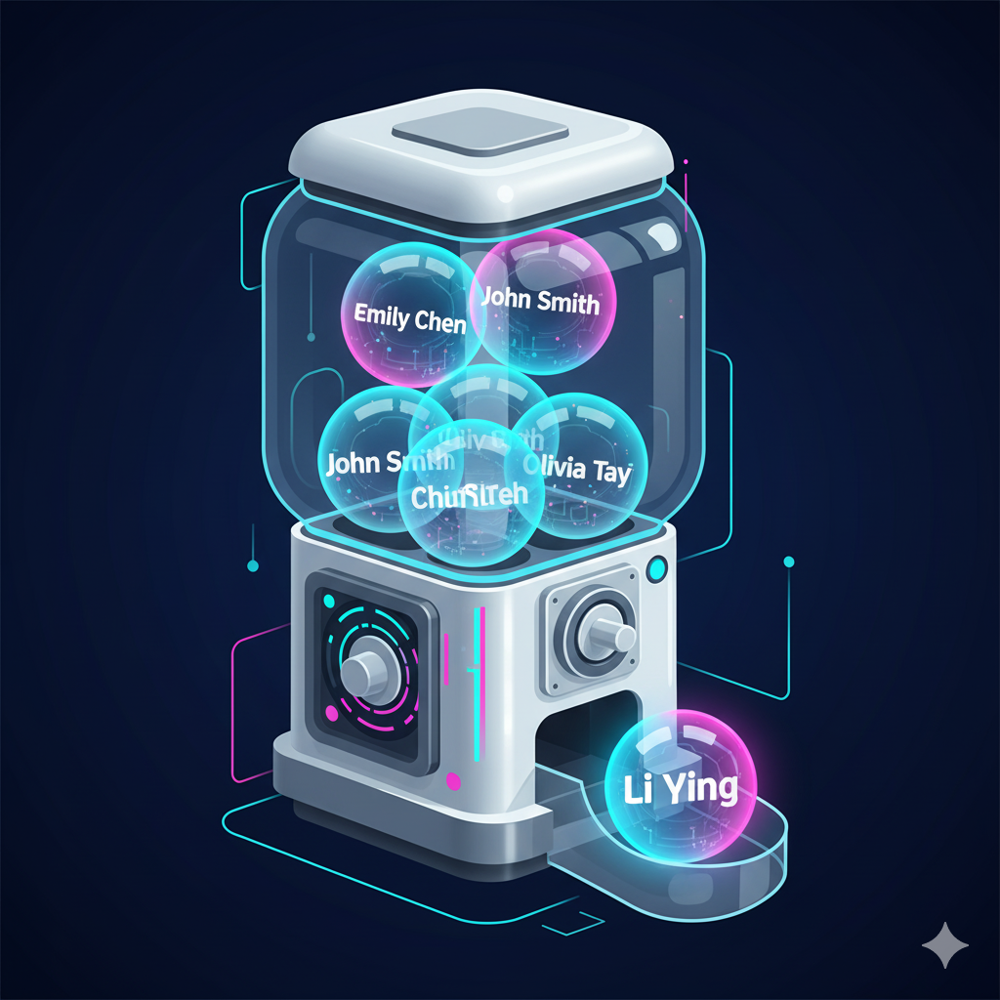
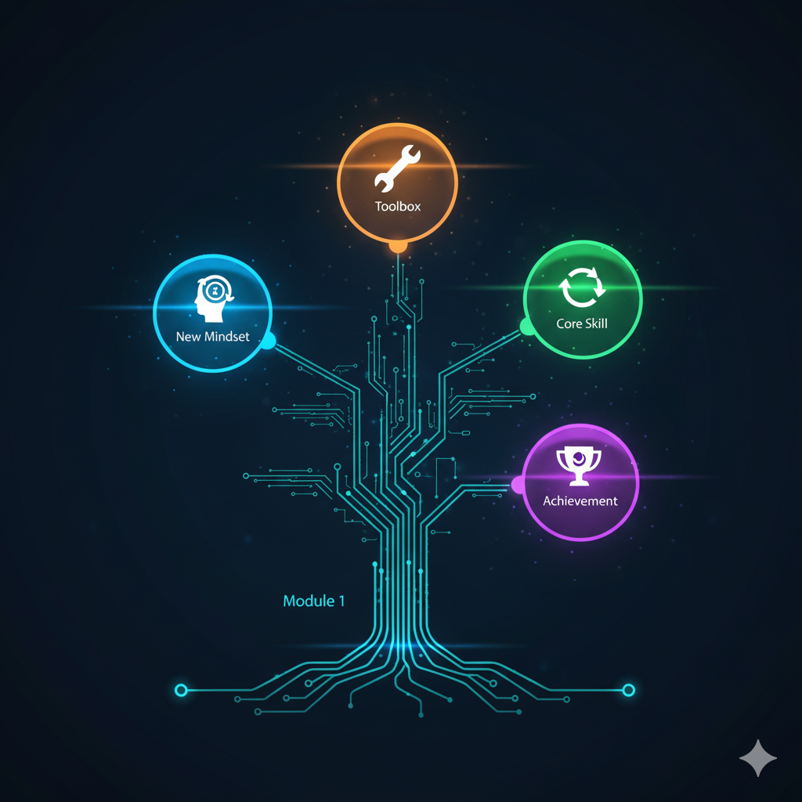
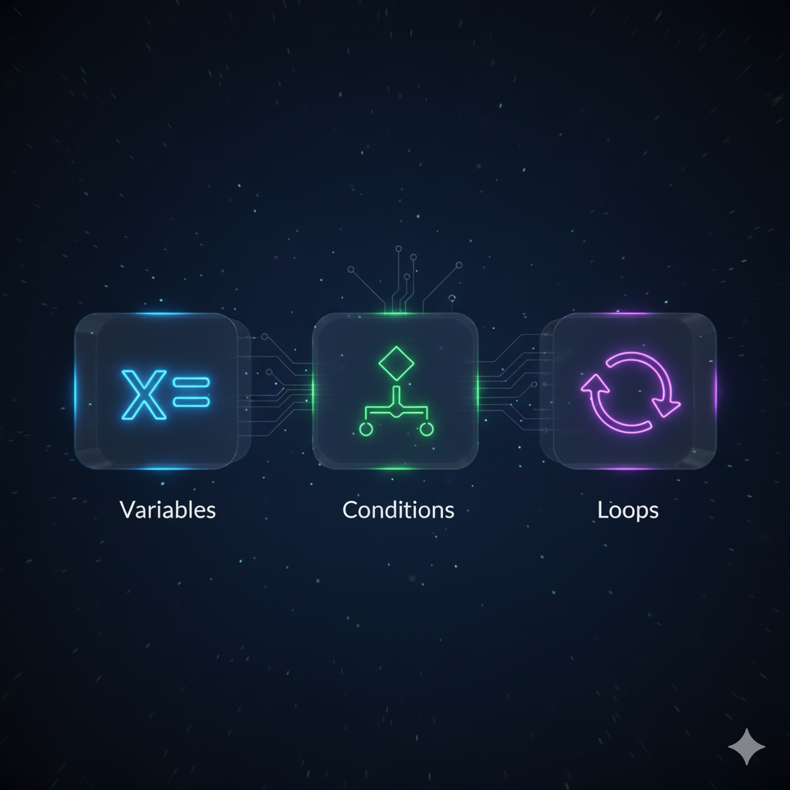

AI赋能软件开发

# 模块一: AI编程新纪元 (思想破冰)
## 第4节课: 首个AI应用发布会 & 创造者心得

南昌大学计算机系 黎鹰

<!--
- **类型**: 逐字稿
- **内容**: |
  （音乐）各位老师，大家好！欢迎来到我们第一模块的最后一节课，也是最特别的一节课。
  今天，我们不学新东西，不做新练习。我们来做一件更有仪式感的事：为我们上一节课亲手创造的“随机点名器”，举办一场盛大的“产品发布会”，并分享我们作为“创造者”的心得体会！
-->

<!--
- **类型**: 教学设计
- **内容**: |
  ### 教学时间: 1分钟
  ### 开场：奠定“庆祝”与“反思”的基调
  本页作为模块一的收官课程，核心目标是从“教与学”的模式，平滑过渡到“分享与庆祝”的模式。

  **核心要点**：
  1.  **明确课程性质**: 开宗明义，告知学员本节课的性质是“分享”和“总结”，而不是学习新技能，帮助学员放松心态，调整预期。
  2.  **强化身份认同**: “首个AI应用发布会”和“创造者心得”这两个标题，旨在强化和肯定学员在上节课中获得的“创造者”身份，给予他们强烈的价值感和仪式感。
  3.  **营造氛围**: 背景图片和标题都旨在营造一种轻松、愉悦、充满成就感的社区氛围。
-->

<!--
- **类型**: 解释
- **内容**: |
  ### 学习的闭环：回顾、分享与内化
  欢迎来到模块一的最后一课。在软件开发和项目管理中，一个项目结束后，团队通常会举行一个“复盘会议”，来回顾过程、总结经验、庆祝成功。这节课，就是我们第一个项目的“复盘大会”。

  学习不仅仅是吸收新知识，更重要的是对所学知识进行**回顾(Review)**、**分享(Share)**和**内化(Internalize)**。通过向他人展示你的作品，倾听他人的经验，和反思自己的心路历程，你能将知识和技能更深刻地烙印在自己的脑海里。今天，让我们一起完成这个学习的闭环。
-->

---

## **本节课目标：庆祝我们的“首个产品发布会”！**

**欢迎来到模块一的总结分享会，暨我们的“首个产品发布会”！**

这堂课很特别，我们的核心任务不是编写新代码，而是完成三项更有意义的活动：

1.  **庆祝 (Celebrate)**：像发布新产品一样，展示和体验彼此的“可视化随机点名器”。
2.  **分享 (Share)**：交流在创造过程中的“Wow!”、“Aha!”和“Uh-oh...”时刻。
3.  **反思 (Reflect)**：探讨这次经历如何颠覆了我们对“编程”和“创造”的看法。

<!--
- **类型**: 逐字稿
- **内容**: |
  我们今天的“发布会”有三个核心环节。
  首先，是“庆祝”。我们每个人都是产品经理，我们要像真正的产品发布会一样，展示和体验彼此的作品。
  第二，是“分享”。我们会一起聊一聊，在创造的过程中，哪些瞬间让你感到惊喜，哪些地方让你恍然大悟，又遇到了哪些让你头疼的小麻烦。
  最后，是“反思”。我们会一起升华一下，探讨这次“人机协作”的经历，是如何改变了我们过去对“编程”和“创造”的固有看法的。
-->

<!--
- **类型**: 教学设计
- **内容**: |
  ### 教学时间: 2分钟
  ### 清晰地构建课堂议程
  本页用三个关键词“庆祝”、“分享”、“反思”，清晰地定义了本节课的三个主要环节。

  **核心要点**：
  1.  **结构化**: 将一整节课的内容结构化为三个清晰的环节，让学员对课程流程一目了然，有稳定的预期。
  2.  **正向引导**: “庆祝”、“分享”、“反思”这三个词本身都是非常积极和富有建设性的，能引导课堂走向一个开放、包容、正向的氛围。
  3.  **情绪递进**: 三个环节的设计遵循了情绪递进的规律：从庆祝具体的作品，到分享个人的体验，再到反思抽象的观念，逐层深入。
-->

<!--
- **类型**: 解释
- **内容**: |
  ### 本节课的三个核心环节
  - **庆祝 (Celebrate)**: 学习需要正反馈。公开展示和庆祝你的第一个“作品”，是获取成就感、建立自信心的最佳方式。同时，通过观摩他人的作品，你也能获得新的灵感。
  
  - **分享 (Share)**: 分享是知识网络化的过程。当你分享你的经验时，你是在巩固自己的理解；当你倾听他人分享时，你是在吸收他人的智慧。特别是对“Aha!”（领悟）和“Uh-oh...”（困难）时刻的分享，能极大地加速整个学习共同体的成长。
  
  - **反思 (Reflect)**: 这是学习的最高层次。它要求我们从具体的“术”（如何做一个点名器），上升到抽象的“道”（AI编程的本质是什么，它如何改变我们的工作）。具备反思能力，才能将一次学习的经验，迁移到未来的无数次创造中。
-->

---

## **环节一：应用博览会 (App Fair)**

**第一步：画廊漫步 (5分钟)**

欢迎来到我们的“首个AI应用发布会”！首先，请大家将自己的点名器运行起来，截一张最酷的图，发布到我们的班级群/讨论区中！

同时，请像逛画展一样，去欣赏、点赞、评论其他同学的作品。

**第二步：明星产品路演**

接下来，我们将从“画廊”中，邀请几位同学自愿上台（共享屏幕），向大家展示你的“可视化随机点名器”并分享心情！

<!--
- **类型**: 逐字稿
- **内容**: |
  好，发布会正式开始！环节一，应用博览会！
  首先，我们进行一个5分钟的“画廊漫步”。请大家运行你的点名器，截一张你认为最酷的或者最有代表性的图，然后把它发到我们的班级群里。这就像把你的作品挂在了我们的线上画廊。
  发完之后，请花几分钟时间，去欣赏一下其他同学的作品，为你认为有趣的创意点赞，或者留下你的评论。
  （等待5分钟）
  好的，我们的画廊现在琳琅满目！接下来，进入路演环节。有没有哪位同学，愿意自告奋勇，作为我们的“明星产品经理”，上台来共享屏幕，给大家现场演示一下你的作品，并简单分享一下你的心情？
-->

<!--
- **类型**: 教学设计
- **内容**: |
  ### 教学时间: 8分钟
  ### 设计低门槛的参与式活动
  “应用博览会”旨在用一种游戏化的、低压力的方式，鼓励所有学员展示自己的成果。

  **核心要点**：
  1.  **分层参与**: “画廊漫步”（发截图）是一个几乎没有门槛的参与方式，确保了100%的学员都能参与进来，获得展示机会。“明星产品路演”则为学有余力或表达欲强的学员提供了展示的舞台。这种分层设计能调动所有人的积极性。
  2.  **社区互动**: “点赞、评论”的设计，是在主动营造积极、互助的社区学习氛围。
  3.  **时间控制**: 明确“5分钟”的时间限制，有助于教师控制课堂节奏，确保活动高效进行。
-->

<!--
- **类型**: 解释
- **内容**: |
  ### Showcase: 开发者社区的传统
  “Showcase”（展示）或“Demo Day”（演示日）是开发者社区和创业孵化器中的一个悠久传统。开发者们会定期向社区展示他们近期完成的作品，交流想法，并获取反馈。
  
  **“画廊漫步”的价值**：
  - **快速概览**: 让我们能在短时间内看到班级同学创意的多样性。
  - **建立安全感**: 对于不善言辞或对作品不够自信的同学，发一张截图是分享成果的、心理负担最小的方式。
  
  **“路演”的价值**：
  - **深度交流**: 现场演示能更直观地展示应用的交互和效果。
  - **锻炼表达**: “向他人介绍自己的作品”本身就是产品经理和创造者的一项核心能力。
-->

---

## **环节二：导演幕后访谈**

每一个作品背后，都有一位出色的“导演”。现在，让我们一起聊聊幕后的故事。

**请分享你的：**

1.  **“Wow!” 时刻** 🤩
    - *看到什么时最惊喜？*
2.  **“Aha!” 时刻** 🤔
    - *领悟到了什么妙招？*
3.  **“Uh-oh...” 时刻** 😅
    - *遇到了什么小麻烦？*

<!--
- **类型**: 逐字稿
- **内容**: |
  非常感谢同学们的精彩展示！每一个作品背后，都有一次独特的创造之旅。现在，我们进入“导演幕后访谈”环节。
  我想请大家，特别是刚才几位分享的同学，也包括所有在座的老师，用这个简单的框架来回顾一下你的这段旅程。
  第一个，“Wow!”时刻，在整个过程中，最让你感到惊喜、或者惊叹“哇，这都可以”的瞬间是什么？
  第二个，“Aha!”时刻，有没有哪个瞬间让你恍然大悟，好像突然想通了什么诀窍或道理？
  第三个，“Uh-oh...”时刻，有没有遇到什么让你卡住一下，或者哭笑不得的小麻烦？
  我们来聊聊这些幕后故事。
-->

<!--
- **类型**: 教学设计
- **内容**: |
  ### 教学时间: 8分钟
  ### 提供结构化的反思框架
  本页旨在引导学员进行有结构的、有深度的过程反思，而不是泛泛而谈。

  **核心要点**：
  1.  **情感化框架**: “Wow!”、“Aha!”、“Uh-oh...”这个框架非常直观，且富含情感色彩。它鼓励学员分享个人化的、真实的感受，而不是做正式的“学习汇报”。
  2.  **全面覆盖**: 这个框架覆盖了学习过程中的三个关键体验：正向的情感体验（Wow），认知上的突破（Aha），以及遇到的障碍（Uh-oh）。这使得反思更为全面。
  3.  **引导积极归因**: 通过首先分享积极的“Wow”和“Aha”时刻，可以将整个访谈的基调定在积极和成长上，使得分享“Uh-oh”时刻也变成了一种对“如何克服困难”的探讨，而不是单纯的抱怨。
-->

<!--
- **类型**: 解释
- **内容**: |
  ### 复盘：将经验转化为能力
  如果说动手实践是将知识转化为技能，那么复盘就是将技能转化为可以迁移的能力。这个“Wow/Aha/Uh-oh”框架，是个人和团队进行复盘的经典工具。
  - **“Wow!” 时刻 (Peak Moments & Strengths)**: 关注和分享这些高峰体验，可以帮助我们识别哪些方法是有效的，哪些是能带来巨大价值的。这有助于我们固化成功的模式。
  - **“Aha!” 时刻 (Insights & Learnings)**: 这是学习发生的关键信号。分享这些“顿悟”的瞬间，会让整个团队的认知水平得到提升。别人的“Aha”时刻，可能正是你卡住的关键。
  - **“Uh-oh...” 时刻 (Challenges & Opportunities)**: 诚实地面对遇到的困难，是成长的第一步。通过讨论这些“小麻烦”，我们可以共同寻找解决方案，并识别出未来需要改进和深入学习的方向。这也是发现学习需求和课程改进点的宝贵来源。
-->

---

## **环节三：进阶功能头脑风暴**

在上一节课的结尾，我们留下了两个有趣的进阶挑战。今天我们不检验结果，我们来一起**思考实现思路**。

**挑战1 (增加幸运感)**：
> “如果要给选中的学生加上‘撒花’特效，我们应该怎么用自然语言，向AI描述这个视觉需求？”

**挑战2 (避免重复)**：
> “那么，‘避免重复点名’这个功能，大家觉得它实现的难点在哪里？它要求程序必须具备一种什么样的新能力？”

<!--
- **类型**: 逐字稿
- **内容**: |
  非常真实的分享！现在，让我们从“回顾过去”转向“展望未来”。
  上节课我们留了两个进阶挑战。今天我们不看大家有没有做出来，我们来做一次“产品经理头脑风暴”。我们一起来探讨，如果要实现这两个功能，我们应该如何向AI下达指令？
  先看第一个，视觉需求，“增加幸运感”。如果你要给AI提这个需求，你会怎么说？关键点在哪里？
  （引导学生讨论，比如要说清楚“什么时候”出现特效，“什么样”的特效）
  好，再来看第二个，逻辑需求，“避免重复”。大家觉得这个功能的难点是什么？和我们之前做的相比，它对程序提出了一种什么样的新要求？
  （引导学生讨论，引出程序需要有“记忆能力”这个关键点）
-->

<!--
- **类型**: 教学设计
- **内容**: |
  ### 教学时间: 4分钟
  ### 引导高阶思维：从“做什么”到“如何定义”
  本环节旨在拔高学员的思维层次，从“实现一个功能”提升到“如何清晰地定义一个复杂功能”，为下一模块的学习做铺垫。

  **核心要点**：
  1.  **聚焦“思路”而非“结果”**: 明确说明“不检验结果，只思考思路”，降低学员的压力，将他们的注意力引导到更高阶的“需求定义”和“问题分解”能力上。
  2.  **区分需求类型**: 通过两个挑战的对比，引导学员自然地辨析“视觉需求”和“逻辑需求”的异同，前者更侧重“描述”，后者更侧重“步骤”。
  3.  **启发式提问**: 教师的提问是开放式的（“怎么用自然语言描述？”、“难点在哪里？”），旨在激发学员的思考和讨论，而不是灌输标准答案。
-->

<!--
- **类型**: 解释
- **内容**: |
  ### 定义需求的两种类型：视觉型 vs. 逻辑型
  通过这两个挑战的对比，我们可以看到在向AI提需求时，通常会遇到两种不同类型的需求：
  - **视觉型需求 (Presentation Requirement)**: 这类需求主要关注“看起来怎么样”。
    - **定义要点**: 通常需要用丰富的、描述性的语言来定义效果。关键在于描述清楚 **“何时 (When)”** 触发、**“什么样 (What)”** 的效果、**“如何 (How)”** 表现（如动画速度、颜色、持续时间等）。
    - **例子**: “撒花特效”、“金色的闪光”、“更柔和的动画”。

  - **逻辑型需求 (Logic/Functional Requirement)**: 这类需求主要关注“如何工作”，即内在的规则和步骤。
    - **定义要点**: 通常需要像写流程一样，用清晰的、有时序的、无歧义的步骤来描述。关键在于定义好 **“第一步做什么”、“第二步做什么”、“如果遇到...情况该怎么办”**。
    - **例子**: “避免重复点名”就需要定义一系列的检查、判断、更新步骤。
  
  学会在Prompt中清晰地区分和定义这两种需求，是成为AI编程高手的关键一步。
-->

---

### **挑战参考答案 (1/2): 视觉需求**

刚才我们一起探讨了实现思路，现在，让我们看看一份比较专业的“产品需求文档”（Prompt）会怎么写。

**对于“增加幸运感” (视觉需求):**
> 这是一个纯粹的视觉需求。我们可以这样对AI说：
>
> `“请优化我们之前的点名器。当名字滚动停止，最终选定一个名字后，请在那个名字周围增加一个持续1-2秒的、明亮的、金色的闪光或撒花庆祝动画效果。”`
>
> *（关键：清晰描述**触发时机**、**动画效果**和**持续时间**。）*

<!--
- **类型**: 逐字稿
- **内容**: |
  大家讨论得非常好。我们来看一个参考答案。
  对于视觉需求，一个专业的Prompt通常会包含这几个要素：触发时机——“当名字滚动停止后”；动画效果——“金色的闪光或撒花”；以及持续时间——“持续1-2秒”。
  把这些关键点描述清楚，AI就能最大程度地理解你的意图。
-->

<!--
- **类型**: 教学设计
- **内容**: |
  ### 教学时间: 1分钟
  ### 提供Prompt范例（视觉类）
  在学员讨论结束后，提供一个高质量的Prompt范例，可以帮助他们固化认知，并学习到专业的需求描述方法。
  
  **核心要点**：
  1.  **展示“专业范本”**: 给出一个结构清晰、要素齐全的Prompt，作为学员未来模仿的标杆。
  2.  **提炼关键要素**: 明确总结出定义一个视觉需求的关键三要素（“触发时机”、“动画效果”、“持续时间”），为学员提供一个可复用的“清单”，便于他们未来检查自己的Prompt是否完备。
-->

<!--
- **类型**: 解释
- **内容**: |
  ### 精确描述视觉需求的技巧
  一个好的视觉需求Prompt，通常遵循一个简单的结构：**“在[时机]，发生[效果]，持续[多久]”**。
  - **时机 (Trigger)**: `当名字滚动停止，最终选定一个名字后...` 这告诉AI在什么时候执行这个动画，是程序逻辑与视觉效果的连接点。
  - **效果 (Effect)**: `...明亮的、金色的闪光或撒花庆祝动画效果。` 这是对视觉效果本身的具体描述。描述得越生动、越具体（例如使用“金色”、“明亮”等词），AI的发挥空间就越精确。
  - **参数 (Parameters)**: `...持续1-2秒...` 这为动画提供了量化指标，使其行为更可控。
  
  在描述视觉需求时，多运用感官和场景化的词汇，可以帮助AI更好地捕捉你想要营造的“氛围感”。
-->

---

### **挑战参考答案 (2/2): 逻辑需求**

**对于“避免重复” (逻辑需求):**
> 这是一个逻辑需求，更复杂。我们需要引导AI“记住”已经点过的名字。可以这样分步说：
>
> `“首先，请在程序里创建一个空的列表，用来存放‘已被点过’的名字。`
>
> `第二，当我们随机挑选名字时，如果发现这个名字已经存在于‘已被点过’的列表中，就请重新挑选，直到找到一个不在列表中的名字为止。`
>
> `第三，当一个新名字被选中并显示后，请立刻将这个名字加入到‘已被点过’的列表中。”`
>
> *（关键：我们将一个复杂任务，拆解成了清晰的、有时序的**逻辑步骤**。这正是模块二要深入学习的思维方式！）*

<!--
- **类型**: 逐字稿
- **内容**: |
  我们再来看更复杂的逻辑需求。正如大家刚才讨论的，难点在于让程序有“记忆”。
  我们看这个参考答案，它没有直接说“你要有记忆”，而是把这个需求，翻译成了三个清晰的、有时序的计算机操作步骤：
  第一，创建一个“容器”（列表）用来记忆。
  第二，做选择前，先检查一下“容器”。
  第三，选择完成后，把新结果放进“容器”。
  看，我们通过这种“步骤化”的思考方式，就把一个复杂的需求，拆解成了AI可以理解的指令。这也是我们下一个模块要重点训练的编程思维。
-->

<!--
- **类型**: 教学设计
- **内容**: |
  ### 教学时间: 2分钟
  ### 提供Prompt范例（逻辑类）
  这个范例旨在向学员展示如何定义一个复杂的、包含状态管理的逻辑需求。

  **核心要点**：
  1.  **展示“算法思维”**: 这个分步的Prompt，本质上就是用自然语言在描述一个“算法”。它向学员展示了“编程思维”的核心——将一个任务分解为一系列精确的、有时序的步骤。
  2.  **引入“状态”概念**: 通过“创建列表”、“检查列表”、“加入列表”这三个步骤，非常直观地向学员引入了程序需要“记忆”和“状态管理”的概念。
  3.  **承前启后**: 明确指出“这正是模块二要深入学习的思维方式”，为下一个模块的学习建立了强烈的动机和清晰的衔接。
-->

<!--
- **类型**: 解释
- **内容**: |
  ### 算法思维：用步骤描述逻辑
  这个“避免重复”的例子，完美地诠释了什么是“**算法思维 (Algorithmic Thinking)**”——即能够将一个任务（无论多复杂），分解为一系列有限的、明确的、可执行的步骤。

  我们给AI的这个三步指令，就是一个简单的算法。让我们再深入看一下：
  - **`“首先，...创建一个空的列表...”`**: 这是**初始化**步骤。程序需要一个地方来“记忆”，我们称之为“状态（State）”。这个列表就是用来保存我们程序的状态的。
  - **`“第二，...如果发现...就请重新挑选...”`**: 这是**条件判断 (Condition)** 和 **循环 (Loop)**。程序需要根据一个条件（名字是否在列表中）来决定下一步的行动（重新挑选）。
  - **`“第三，...将这个名字加入到列表中。”`**: 这是**状态更新 (State Update)**。程序在完成一次操作后，需要更新自己的“记忆”。

  初始化、条件判断、循环、状态更新，这些正是我们将在模块二中深入学习的编程核心概念。通过这个例子，你已经对它们有了直观的感受。
-->

---

## **环节四：创意风暴 & 导师魔法秀**

大家都成功地让名字“动”了起来，创造了属于自己的动态点名器，非常好！

我们刚才在“应用博览会”上，可能已经看到了几种不同的视觉效果。其实，随机过程的乐趣，其表现形式远不止我们已经看到的这些。

让我们打开思路，看一些其他的可能性...

<!--
- **类型**: 逐字稿
- **内容**: |
  好了，关于上节课的挑战我们讨论到这里。大家已经做得非常棒了。
  我们都成功地实现了“老虎机”式的滚动效果，但在“应用博览会”的环节，我看到有些同学已经开始发挥创意，做出了不同的视觉效果。
  这启发了我，一个“随机选择”的过程，它的表现形式，可以有多少种可能性？让我们来一场“创意风暴”，拓展一下思路。
-->

<!--
- **类型**: 教学设计
- **内容**: |
  ### 教学时间: 1分钟
  ### 激发创意，拓展边界
  在学员已有的成功基础上，本环节旨在通过“创意风暴”来进一步激发他们的想象力，并为接下来的“导师演示”做铺垫。

  **核心要点**：
  1.  **肯定现有成果**: 首先肯定学员已有的“老虎机”式实现，给予价值感。
  2.  **引入新维度**: 提出“随机性的表现形式”这一新维度，引导学员从“实现功能”的思维，转向“创意表达”的思维。
  3.  **开放式提问**: “看一些其他的可能性...”是一个开放式的邀请，旨在激发学员的好奇心。
-->

<!--
- **类型**: 解释
- **内容**: |
  ### 从功能到体验：分离逻辑与表现
  这个环节的核心思想，是再次强调我们在上节课提到的“**逻辑与表现分离**”的设计原则。
  - **核心逻辑**: 从一个列表中随机选择一个项目。这个逻辑是稳定的，不变的。
  - **视觉表现**: 如何将这个“随机选择”的过程展示给用户。这个表现层是千变万化的。
  
  一个优秀的“产品总监”或“创造者”，不仅要能设计出核心逻辑，更要懂得如何通过富有创意的视觉表现来提升产品的用户体验，让一个“好用”的工具，同时变得“好玩”和“有趣”。接下来的几页，就是一些关于“视觉表现”的创意启发。
-->

---

### **创意构思：随机性的表现形式 (1/2)**

- **自然与有机类 (雅致、静谧)**
  - **蒲公英飞絮**: 带名字的种子在空中飞舞，最终一粒缓缓飘落。
  - **瓶中萤火虫**: 满瓶飞舞的萤火虫，最终只留一只在瓶中发光。
  - **星空与流星**: 流星划过天际，精准落在某颗“学生”星星上。
- **科技与未来类 (酷炫、硬核)**
  - **代码/矩阵雨**: 学生名字组成代码雨下落，最终一个高亮。
  - **DNA序列解码**: 名字作为基因序列在DNA双螺旋上滚动，最终解码出一段。
  - **星际跃迁**: 飞船在名字星球间穿梭，最终停靠在一个星系前。

<!--
- **类型**: 样式替换
- **版本**: [handout, teacher]
- **查找**: |
    

- **替换**: |
    

-->

---

### **创意构思：随机性的表现形式 (2/2)**

- **游戏与趣味类 (活泼、有趣)**
  - **扭蛋机/盲盒**: 摇晃机器，掉出一个扭蛋，打开显示名字。
  - **街机角色选择**: 选择框在角色矩阵上疯狂跳动，最终定格。
  - **刮刮乐**: 刮开涂层，显示下面的名字。
- **艺术与抽象类 (高级、有设计感)**
  - **水墨散开**: 墨滴在宣纸上散开，名字若隐若现，最终形成书法。
  - **照片马赛克**: 无数模糊色块洗牌变换，最终拼成一幅艺术图。

<!--
- **类型**: 逐字稿
- **内容**: |
  （快速展示两页创意构思）
  大家看，同样是“随机”，我们可以把它包装成蒲公英飞舞的雅致，也可以是代码雨的酷炫；可以做成一个盲盒扭蛋机的趣味，也可以是水墨散开的艺术感。
  这些天马行空的创意，你都可以尝试用自然语言去描述，然后交给AI，看看它能为你实现到什么程度。这正是AI赋能创造的魅力所在，它极大地拉近了“想法”与“现实”之间的距离。
-->

<!--
- **类型**: 教学设计
- **内容**: |
  ### 教学时间: 2分钟 (两页合计)
  ### 拓展创意思维的边界
  这两页幻灯片通过密集的、可视化的创意轰炸，旨在快速拓展学员对“可能性”的认知。

  **核心要点**：
  1.  **分类展示**: 将创意分为“自然”、“科技”、“游戏”、“艺术”四大类，有助于学员结构化地吸收信息，并能快速找到自己感兴趣的方向。
  2.  **视觉辅助**: 每个类别都配有高质量的图片，视觉化地传达了创意的核心意象，比纯文字描述更具冲击力和启发性。
  3.  **激发行动**: 目的不是让学员觉得“这太难了”，而是让他们感到“哇，这个好酷，我也想试试！”，激发他们课后继续探索和实践的欲望。
-->

<!--
- **类型**: 解释
- **内容**: |
  ### 主题化设计：为你的应用注入灵魂
  这些创意构思不仅仅是“换皮肤”，它们体现了一种“**主题化设计 (Thematic Design)**”的思路。为你的应用设定一个主题，可以让它的体验更统一、更沉浸、更有情感共鸣。
  
  在向AI描述这些复杂创意时，可以运用“**类比（Analogy）**”和“**场景化描述（Scenario Description）**”的技巧。
  - **类比**: 直接告诉AI，你想要的效果“**像...一样**”。例如：“我想要一个像‘黑客帝国’里那样的代码雨效果”。
  - **场景化描述**: 为AI描绘一整个场景。例如：“想象一个宁静的夜晚，天空中布满了星星，每一颗星星代表一个学生的名字。当点名开始时，一道流星会划过天际...”
  
  通过这种富有想象力的沟通方式，你可以引导AI进行更具创造性的工作。
-->

---

### **导师魔法秀：Pro版点名器演示**

为了给大家一个更直观的感受，我将其中一种创意（例如“星空流星”）和我们提到的进阶功能（例如“避免重复”）结合起来，实现了一个Pro版的点名器。

我们一起来看一下，一个经过精心设计和功能迭代的应用，能达到什么样的效果……

**(此处为教师演示环节)**

<!--
- **类型**: 逐字稿
- **内容**: |
  光说不练假把式。为了让大家更直观地感受，我把刚才的“星空流星”这个创意，和“避免重复”这个进阶功能结合起来，花了一点时间，让AI帮我实现了一个Pro版的点名器。
  接下来，就是“导师魔法秀”时间。我们一起来看一下，当我们有了一个清晰的创意，并与AI进行了几轮迭代优化之后，我们的应用最终能达到一个什么样的效果。
  （开始进行Pro版点名器的现场演示）
-->

<!--
- **类型**: 教学设计
- **内容**: |
  ### 教学时间: 3分钟
  ### 展示“天花板”，激发“愿景”
  在进行了充分的创意激发后，“导师魔法秀”环节旨在通过一个高质量的成品，向学员展示本阶段能力的“天花板”，给他们树立一个可以追求的愿景。

  **核心要点**：
  1.  **成果展示**: 一个惊艳的、超出预期的Demo，是激发学员学习热情的最强催化剂。
  2.  **连接理论**: 导师应在演示时，口头说明这个Pro版是如何结合了“创意构思”（如星空主题）和“进阶功能”（如避免重复）的，将演示与之前的教学内容联系起来。
  3.  **榜样作用**: 导师亲自演示，其本身就是一种“以身作则”，表明导师也在使用同样的方法与AI协作，这能极大地增强学员对课程方法论的信任感。
-->

<!--
- **类型**: 解释
- **内容**: |
  ### 迭代的力量：从“原型”到“产品”
  这个“Pro版”点名器与我们上节课做的“初版”点名器之间的差距，就体现了“**迭代开发 (Iterative Development)**”的力量。
  - **初版 (Prototype)**: 目标是快速验证核心功能是否可行。它可能很简单，甚至有些粗糙，但它能工作。
  - **迭代版 (Polished Version)**: 在初版的基础上，通过多轮的“**反馈-修改**”循环，不断地增加新功能、优化用户体验、美化视觉设计，最终从一个“可用的原型”演变为一个“好用的产品”。
  
  导师的这个演示，旨在告诉你，你上节课创造的，是一个非常有价值的“原型”。以此为起点，通过与AI的持续对话，你完全有能力将其打磨成一个令人惊艳的“产品”。
-->

---

## **跨越鸿沟：AI如何赋能我们成为创造者**

过去，编程的“鸿沟”——海量语法、抽象逻辑、繁琐环境——将许多有创意的想法挡在门外。

现在，AI为我们架起了桥梁。它成为我们的“首席翻译官”，负责将我们的**想法和意图**，转化为机器能懂的**代码**。

**这是一种能力的“平权”**：我们不再需要成为程序员，也能指挥机器去建造。我们的核心任务，是学会分析并拆解问题，然后清晰地向AI传达我们的设计。

<!--
- **类型**: 逐字稿
- **内容**: |
  （演示结束）
  通过这几节课的体验，我希望大家能感受到一个深刻的变化。
  在过去，我们这些非计算机专业的人，脑海中即便有再多奇思妙想，和“用软件实现它”之间，都隔着一道深深的鸿沟。这道鸿沟，就是海量的编程语法、抽象的逻辑和繁琐的环境配置。
  但现在，AI为我们架起了一座跨越鸿沟的桥梁。它成为了我们的“首席翻译官”，我们只需要专注于自己的想法和意图，AI就会负责把它翻译成机器能懂的代码。
  这是一种前所未有的“能力平权”。创造软件的权利，不再是少数程序员的专利。我们每一个善于思考、善于表达的人，都获得了指挥机器去创造的能力。
-->

<!--
- **类型**: 教学设计
- **内容**: |
  ### 教学时间: 2分钟
  ### 模块核心思想升华
  在所有活动和演示结束后，本页旨在对整个“思想破冰”模块的核心思想进行终极升华和总结。

  **核心要点**：
  1.  **“鸿沟”隐喻**: 用“鸿沟”和“桥梁”这个强大的隐喻，来形象化地总结AI编程带来的革命性变化，易于理解和记忆。
  2.  **重新定义核心能力**: 再次强调，新的核心能力是“分析问题”和“清晰传达”，而不是“记忆语法”，巩固学员的信心。
  3.  **价值拔高**: “能力的平权”这个说法，将AI编程的意义从“一个好用的工具”提升到了“赋予普通人创造能力”的更高层面，能引发学员更深层次的共鸣和认同。
-->

<!--
- **类型**: 解释
- **内容**: |
  ### 范式转移：从“学习语法”到“表达意图”
  我们正在经历一场从“**以语法为中心 (Syntax-centric)**”到“**以意图为中心 (Intent-centric)**”的编程范式转移。
  - **旧范式**: 创造者必须学习机器的语言（编程语法），将自己的想法翻译给机器。这个翻译过程是主要瓶颈。
  - **新范式**: 创造者用自己最擅长的自然语言来表达自己的“意图 (Intent)”，AI负责将这个意图翻译给机器。瓶颈从“懂不懂语法”转移到了“能不能清晰地表达意图”。
  
  这带来的最大变化，就是“**创造力的民主化**”。过去，只有掌握了特定编程语言的“祭司”（程序员），才能与机器沟通。现在，任何能够清晰思考和表达的人，都获得了与机器沟通、指挥其创造的能力。这是一个全新的、充满机遇的时代。
-->

---

## **人机协作：我们的核心价值在哪里？**

AI是强大的工具，但它无法替代你，因为它缺少：

- **领域专业知识**
- **批判性思维与共情**
- **创新与愿景**

> AI是强大的画笔，而你，是挥舞画笔的艺术家。

<!--
- **类型**: 逐字稿
- **内容**: |
  听到这里，可能有些老师会想：既然AI这么强大，那我们的价值又在哪里呢？
  这是一个非常好的问题。AI是强大的工具，但它永远无法替代你。因为它缺少三样最宝贵的东西：
  第一，你的领域专业知识。你对你的学科、你的学生的理解，是AI没有的。
  第二，你的批判性思维与共情能力。判断一个东西是好是坏、是否对学生有帮助，这种价值判断，AI做不到。
  第三，也是最重要的，创新与愿景。提出那个最初的、闪光的想法，是“人”最核心的价值。
  请记住，AI是那支无比强大的画笔，但你，永远是那位决定画什么的、挥舞画笔的艺术家。
-->

<!--
- **类型**: 教学设计
- **内容**: |
  ### 教学时间: 2分钟
  ### 解答深层焦虑，确立人类价值
  本页旨在正面回应学员心中可能存在的“被AI取代”的深层焦虑，清晰地定义在人机协作中，人类不可替代的价值。

  **核心要点**：
  1.  **直面问题**: 主动提出“我们的价值在哪里”这个问题，表明教师理解并重视学员的顾虑。
  2.  **价值锚定**: 将人类的价值锚定在“领域知识”、“批判性思维/共情”和“创新/愿景”这三个AI难以企及的高层次能力上。这对于作为教育工作者的学员来说，极具说服力。
  3.  **精妙比喻**: “AI是画笔，你是艺术家”这个比喻，形象、优雅且极具力量感，是本页乃至本模块的点睛之笔，能极大地提升学员的自我价值认同。
-->

<!--
- **类型**: 解释
- **内容**: |
  ### 人类在AI时代的独特价值
  在与AI协作时，你的价值不在于执行，而在于以下三个层面：
  1.  **领域专业知识 (Domain Expertise)**: AI虽然拥有海量的通用知识，但它缺乏你在特定学科领域（如特定时期的历史、某种细胞的生物学特性、某个经济学流派的观点）深耕多年所形成的深刻洞察和隐性知识。你的专业知识是为AI设定正确方向和约束的“罗盘”。
  2.  **批判性思维与共情 (Critical Thinking & Empathy)**: AI可以生成内容，但它没有价值观，无法判断“好”与“坏”。它会一本正经地胡说八道。你需要运用你的批判性思维来审视和验证AI的输出。同时，你也需要运用你的共情能力，来判断你创造出的东西，是否真正符合你的学生或用户的需求和情感。
  3.  **创新与愿景 (Innovation & Vision)**: AI无法凭空产生目的和意义。它不会主动去发现一个值得解决的问题，更不会为一个领域提出一个高瞻远瞩的发展愿景。定义问题、树立愿景、提出那个“从0到1”的原创想法，是人类创造者永恒的核心价值。
-->

---

## **模块一总结：我们收获了什么？**

✅ **一种新思维**
   - 理解了人机协作的编程新范式。

✅ **一套工具箱**
   - 成功搭建了AI编程工作环境。

✅ **一个核心技能**
   - 亲身体验了完整的应用开发循环。

✅ **一份巨大的成就感**
   - 创造了属于自己的第一个可视化AI应用。

<!--
- **类型**: 逐字稿
- **内容**: |
  好了，到这里，我们整个“思想破冰”模块就全部结束了。让我们来盘点一下我们的“宝箱”，我们到底收获了什么？
  首先，是一种新思维。我们理解了AI时代人机协作的编程新范式。
  其次，是一套工具箱。我们每个人的电脑上，都有了一套可以立即开始创造的AI编程工作环境。
  再次，是一个核心技能。我们亲手走完了一个从想法到产品、再到迭代的完整开发循环。
  最后，也是最宝贵的，是一份巨大的成就感。我们每个人都创造出了属于自己的第一个AI应用。
  为大家鼓掌！
-->

<!--
- **类型**: 教学设计
- **内容**: |
  ### 教学时间: 1分钟
  ### 系统性地总结模块收获
  在模块的最后，用一页清晰的幻灯片，系统性地为学员总结本模块的收获，能极大地提升他们的获得感和满足感。

  **核心要点**：
  1.  **多维度总结**: 总结的维度覆盖了“思维”、“工具”、“技能”、“情感”四个层面，让学员感觉到收获是全方位的、立体的。
  2.  **清晰的可视化**: “✅”清单加上“宝箱”的配图，在视觉上就传递出一种“收获满满”的感觉，非常直观。
  3.  **正向强化**: 再次肯定学员的成就，给予积极的正向反馈，为模块画上一个圆满的句号。
-->

<!--
- **类型**: 解释
- **内容**: |
  ### 你的收获清单
  让我们来详细解读一下你在本模块的四项核心收获：
  - **一种新思维**: 你不再认为编程是少数人的专利，而是理解了“编程即对话”的新范式。你认识到，你的核心任务是清晰地表达意图，而不是记忆语法。
  - **一套工具箱**: 你拥有了一个现代化的、功能强大的AI编程环境（VS Code + AI助手 + Python）。这个“工作室”是你未来所有创造的起点。
  - **一个核心技能**: 你实践了“想法 -> 解构 -> 指令 -> 迭代”这一核心的应用开发流程。这个技能可以被复用到你未来的任何一个项目中。
  - **一份巨大的成就感**: 这种“我能行”的感受，是打破“技术恐惧”、开启后续学习之路最宝贵的燃料。请一定珍视和记住这份感觉。
-->

---

## **下一步预告：模块二 - 与AI对话 (编程基础)**

思想破冰之后，我们将开始了解编程的一些“核心规则”。

我们将学习如何下达更精确的指令，在指挥AI使用**变量、条件、循环**等核心概念的过程中，真正理解它们的作用和威力！

<!--
- **类型**: 逐字稿
- **内容**: |
  模块一“思想破冰”的旅程愉快地结束了。从下一节课开始，我们将进入模块二——与AI对话。
  在模块二中，我们将开始接触编程最核心、最基础的“三大定律”——变量、条件和循环。我们不会像传统课程那样去死记硬背它们的语法，而是会学习如何去指挥AI使用它们，并在使用的过程中，真正理解它们的作用和威力。
  这将让我们有能力构建更复杂、更智能的应用。
  思想的坚冰已经打破，让我们一起期待下一段更精彩的旅程！下课！
-->

<!--
- **类型**: 教学设计
- **内容**: |
  ### 教学时间: 1分钟
  ### 承前启后，建立学习动机
  作为最后一页，它的核心任务是“承前启后”——总结过去，并为下一阶段的学习建立强烈的动机。
  
  **核心要点**：
  1.  **明确主题**: 清晰地预告了模块二的主题是“与AI对话”，以及核心内容是“编程基础（变量、条件、循环）”。
  2.  **建立学习动机**: 它没有简单地罗列知识点，而是强调了学习这些知识点的“目的”——“下达更精确的指令”、“理解它们的作用和威力”。这让学员明白，学习这些规则是为了让自己变得更强大。
  3.  **教学法重申**: 再次强调了本课程的教学方法——“在指挥AI使用的过程中理解”，而不是死记硬背，给学员吃下一颗定心丸，让他们对看起来很技术的模块二也不会感到恐惧。
-->

<!--
- **类型**: 解释
- **内容**: |
  ### 展望模块二：掌握编程的“语法”
  如果说模块一我们学习的是如何与AI“对话”，那么模块二我们将学习如何让我们的“对话”更精确、更高效。我们将接触到编程世界最核心的三个概念：
  - **变量 (Variables)**: 让程序能够“记忆”和“存储”信息。就像我们在“避免重复点名”挑战中需要的那个“已点名列表”。
  - **条件 (Conditions)**: 让程序能够“判断”和“决策”。例如，“**如果**学生是男生，就显示蓝色；**否则**显示红色”。
  - **循环 (Loops)**: 让程序能够“重复”执行任务。例如，“对名单上的**每一个**学生，都检查他是否交了作业”。
  
  掌握了这三个“核心规则”，你就掌握了向AI下达几乎所有精确指令的能力，也就真正敲开了创造复杂应用的大门。
-->

---

# 课后练习

*小提示：别忘了，你的AI编程助手也是一位出色的学伴和老师！ 当你对这些练习题有任何疑惑时，随时可以和它讨论，让它引导你完成思考。*

<!--
- **类型**: 样式替换
- **版本**: [handout, teacher]
- **查找**: |
    font-size: 24px;
- **替换**: |
    font-size: 18px;
-->

---

## ****课后练习：“回响”——从“痛点”到“可编程时刻”****

还记得第一节课我们讨论的“痛点”吗？那时，我们只是感性地描述了我们遇到的麻烦。

现在，我们已经掌握了“输入-处理-输出”这个强大的思维工具。请你**重新审视当初的那个“痛点”**，或者发现一个新的，并尝试用我们新学到的思维框架来“解构”它：

- **输入 (Input):** 要处理的“原料”是什么？
- **处理 (Process):** 核心的转换步骤是什么？
- **输出 (Output):** 最终想得到的“成品”是什么？

这个从“感性诉苦”到“理性分析”的转变，标志着你已经从一个“问题拥有者”，**蜕变为一个“解决方案的设计者”**。

请带着你的这份“IPO分析报告”，满怀信心地进入模块二的学习！

---

### **课后练习：可选挑战 (1/2)**

如果你对我们课堂上讨论的两个进阶挑战意犹未尽，可以尝试完成下面这个“思考题”。这会极大地锻炼你“拆解复杂逻辑”的能力。

#### **挑战一：增加“幸运感”**
> *请用IPO模型分析，为点名器增加“撒花特效”需要改变什么？*
> - **输入 (Input):** 和原来相比，输入有变化吗？（提示：没有）
> - **输出 (Output):** 最终的“成品”增加了什么？（提示：视觉上增加了动画）
> - **处理 (Process):** “配方”需要增加哪个步骤？请用自然语言描述这个新增的步骤。（提示：参考我们课上展示的“参考答案”Prompt）

---

### **课后练习：可选挑战 (2/2)**

#### **挑战二：实现“避免重复”**
> *这是真正的挑战！请用IPO模型分析，并思考“处理”过程的巨大变化。*
> - **输入 (Input):** 为了“记住”点过的名字，我们的程序是否需要一个新的“输入”？（提示：是的，一个用于记录的、会动态变化的列表）
> - **输出 (Output):** 输出有变化吗？（提示：没有，依然是一个名字）
> - **处理 (Process):** 这是最复杂的部分。请尝试用我们课上学到的“分步拆解”方法，描述一下新的“处理”流程是怎样的？

完成这个思考题后，你对模块二要学习的“变量”和“逻辑”，会有更深刻的渴望！
