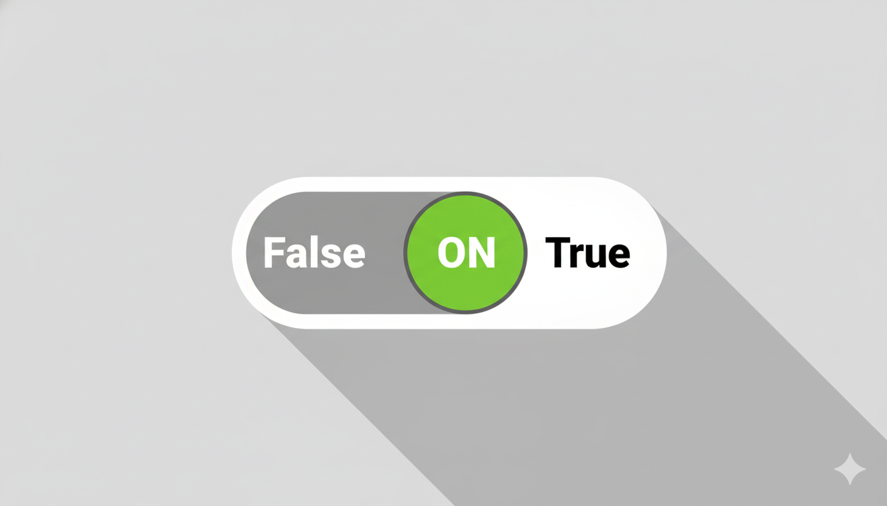
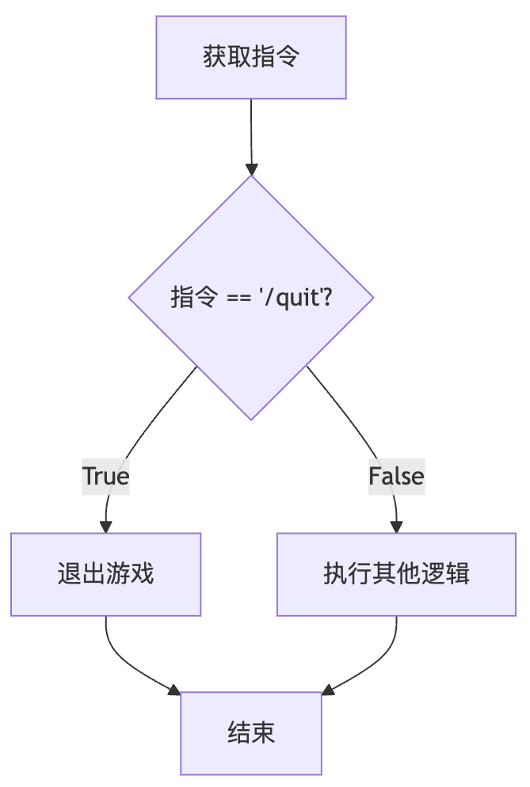
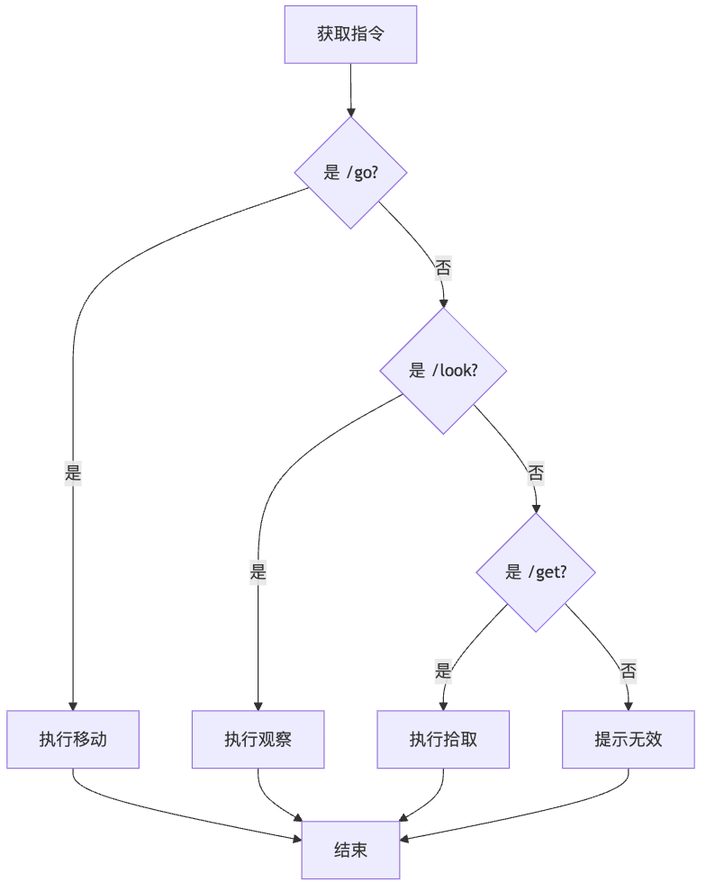

<style>
/* --- 布局辅助样式 --- */
.columns {
  display: grid;
  grid-template-columns: repeat(2, minmax(0, 1fr));
  gap: 1rem;
}
.columns pre code {
  white-space: pre-wrap !important;
  overflow-wrap: break-word !important;
}
/* --- 列表缩进样式修正 --- */
ul, ol {
  padding-inline-start: 25px; /* 减小列表的左侧缩进 */
}
.columns.ratio-4-6 { grid-template-columns: 4fr 6fr; }
.columns.ratio-6-4 { grid-template-columns: 6fr 4fr; }
.columns.ratio-3-7 { grid-template-columns: 3fr 7fr; }
.columns.ratio-7-3 { grid-template-columns: 7fr 3fr; }
.align-top    { display: flex; align-items: flex-start; }
.align-middle { display: flex; align-items: center; }
.align-bottom { display: flex; align-items: flex-end; }
.align-left   { display: flex; justify-content: flex-start; }
.align-center { display: flex; justify-content: center; }
.align-right  { display: flex; justify-content: flex-end; }
.align-top-left     { display: flex; justify-content: flex-start; align-items: flex-start; }
.align-top-center   { display: flex; justify-content: center;  align-items: flex-start; }
.align-top-right    { display: flex; justify-content: flex-end;   align-items: flex-start; }
.align-middle-left  { display: flex; justify-content: flex-start; align-items: center; }
.align-middle-center{ display: flex; justify-content: center;  align-items: center; }
.align-middle-right { display: flex; justify-content: flex-end;   align-items: center; }
.align-bottom-left  { display: flex; justify-content: flex-start; align-items: flex-end; }
.align-bottom-center{ display: flex; justify-content: center;  align-items: flex-end; }
.align-bottom-right { display: flex; justify-content: flex-end;   align-items: flex-end; }
.tip {
  background-color: #f0f8ff;
  border-left: 5px solid #1e90ff;
  padding: 15px;
}
.insight {
  background-color: #eefcff; 
  border-left: 5px solid #17a2b8; 
  padding: 15px; 
}
.key-point {
  background-color: #fffbe6; 
  border-left: 5px solid #ffc107; 
  padding: 15px; 
}
.tip p, .tip li,
.insight p, .insight li,
.key-point p, .key-point li {
  font-size: inherit !important;
}
.styled-div p, 
.styled-div li, 
.styled-div ol, 
.styled-div ul, 
.styled-div blockquote {
  font-size: inherit !important;
}
</style>


<style scoped>
h1{
  color: #F5F5F5; /* 设置文字颜色为白色 */
  text-shadow: 2px 2px 8px rgba(0, 0, 0, 0.8); /* 添加一个柔和的深色阴影 */
}
h2 {
  color: #E0E0E0; /* 设置文字颜色为白色 */
  text-shadow: 2px 2px 8px rgba(0, 0, 0, 0.8); /* 添加一个柔和的深色阴影 */
}
.course-title {
  position: absolute;
  top: 60px;
  left: 80px;
  background-color: rgba(0, 0, 0, 0.4);
  color: #fff;
  padding: 8px 15px;
  border-radius: 5px;
  font-size: 22px;
  font-weight: bold;
  letter-spacing: 1px;
  border-left: 5px solid #4CAF50; /* 用一条强调色作为装饰 */
}
</style>

<div class="course-title">AI赋能软件开发</div>

# 模块二：与AI对话——学习编程的核心规则
## 第6节课：赋予世界规则——指令解析与条件判断

<div style="position: absolute; bottom: 40px; left: 80px; color: rgba(255, 255, 255, 0.8); font-size: 18px; font-family: sans-serif;">
南昌大学计算机系 黎鹰
</div>

<!--
- **类型**: 逐字稿
- **内容**: | 
  （音乐）各位老师好！欢迎回到我们的课程。
  在上一节课，我们扮演“世界架构师”，成功地用变量和字典为我们的武侠世界绘制了一幅静态的“蓝图”。
  但那个世界是死的，它只是一个只能看、不能玩的“固定剧本”。
  这节课，我们将迈出关键一步，学习如何为这个世界注入规则。我们将学会如何让程序听懂我们的指令，并做出判断和选择。
-->

<!--
- **类型**: 教学设计
- **内容**: | 
  ### 教学时间: 1分钟
  ### 开场：承前启后，引入新主题
  本页作为第6节课的开篇，核心目标是快速回顾上一节课的成果和局限，并清晰地引出本节课的核心主题——“规则”与“判断”。

  **核心要点**：
  1.  **回顾与衔接**: 用“静态蓝图”和“固定剧本”来回顾上一节课的成果与痛点，自然地引出本节课的学习动机——让世界“活”起来。
  2.  **引入核心概念**: “规则”、“判断”、“选择”，这些关键词清晰地预告了本节课将要学习的核心内容——条件判断。
  3.  **设定目标**: “让程序听懂我们的指令”是一个非常具体且有吸引力的目标，能迅速抓住学员的注意力。
-->

<!--
- **类型**: 解释
- **内容**: | 
  ### 从“数据”到“逻辑”
  上一节课，我们学习了如何用“数据结构”（主要是字典）来**描述**一个静态的世界。我们关注的是“世界是什么样子的”。

  从这一节课开始，我们将进入“逻辑”的领域。我们将学习如何用“控制流”语句来**定义**世界的“行为”。我们将关注“世界如何运转”。

  具体来说，我们将学习编程中最核心的控制流语句——`if-else`条件判断。它能让我们的程序根据不同的输入和状态，执行不同的代码路径，从而实现最基础的交互性。这是从一个“静态展示”程序，迈向一个“动态交互”应用的关键一步。
-->

---

## **回顾：一个“固定剧本”的世界**

<div class="columns ratio-6-4">
<div style="font-size: 0.85em;">

在上一节课，我们取得了巨大的进步！

我们成功地用“字典”绘制了一幅宏大的“世界蓝图”，并让玩家“降生”在了世界上。

但是，我们的程序就像一个“**固定剧本**”。
- **情节是固定不变的**：程序从第一行开始，沿着唯一的路径执行到最后一行，然后就结束了。
- **无法响应玩家**：它不能暂停下来等待我们的指令，更不能根据我们的想法产生任何分支或改变。

这种**单向、不可交互的执行流程**，是它无法成为真正“游戏”的根本原因。

**我们如何让程序“暂停”下来，聆听我们的指令，并据此走向不同的未来呢？**

</div>
<div>


</div>
</div>

<!--
- **类型**: 逐字稿
- **内容**: | 
  让我们再次明确一下上一节课结束时我们面临的“痛点”。
  我们用字典构建了可以变得很宏大的世界蓝图，结构清晰，易于扩展。但是，当我们运行程序时，它只是把开场白打印出来，然后就结束了。
  它就像一个只会走直线的机器人，无法根据路况拐弯。它更像一本只能从头读到尾的小说，而不是一个可以玩的“游戏”。
  问题的根源在于，我们的程序是“单向”的，是“不可交互”的。
  所以，我们这节课要解决的核心问题就是：如何让程序停下来，听我们说话，并且根据我们说的话，做出不同的反应？
-->

<!--
- **类型**: 教学设计
- **内容**: | 
  ### 教学时间: 1分钟
  ### 强化痛点，建立学习动机
  本页完全复用了上一节课结尾的“痛点”幻灯片，其目的是在本节课的一开始，就立刻重新聚焦于问题，强化上一节课留下的“认知不满足感”，从而为本节课的新知识建立最强大、最直接的学习动机。

  **核心要点**：
  1.  **重复与强调**: 通过重复，将“固定剧本”、“单向、不可交互”这个核心痛点深深植入学员的认知。
  2.  **聚焦问题**: 在引入任何解决方案之前，先让学员再次清晰地认识到当前程序最致命的缺陷。
  3.  **提出引导性问题**: “我们如何让程序‘暂停’下来...”这个问题，直接指向了本节课需要解决的两个关键技术点：获取用户输入 (`input`) 和根据输入做判断 (`if-else`)。
-->

<!--
- **类型**: 解释
- **内容**: | 
  ### 程序的流程控制：顺序结构
  我们到目前为止编写的所有代码，都遵循一种最简单的执行流程，叫做“**顺序结构 (Sequential Structure)**”。

  它的特点是：代码严格地按照从上到下的物理顺序，一行一行地被执行，没有任何“分支”或“回头路”。

  这种结构是所有程序的基础，但仅有顺序结构是远远不够的。一个真正有用的程序，必须能够根据外部的输入或内部的状态，来动态地改变它的执行路径。为了实现这一点，我们就必须学习另外两种最基本的流程控制结构：“选择结构”和“循环结构”。本节课，我们聚焦于前者。
-->

---

## **本节课目标：指挥AI构建“规则”与“选择”**

为了让世界“活”起来，我们必须为它建立“**规则**”，让它能根据情况做出“**选择**”。

本节课，我们将学习“指挥AI的三大核心指令”中的第二个：

### **条件判断 (If-Else)**
- **作用**：在程序中建立“**决策点**”，赋予程序“**选择**”的能力。
- **你的新能力**：
  1. **定义“规则”**：学会用“如果玩家输入的是`/go`指令，就...”的结构，向AI清晰地描述游戏规则。
  2. **审查“逻辑”**：审查AI代码中的“决策逻辑”是否符合你的游戏设计。

**最终，你将能指挥AI，为你的武侠世界创造出第一个“指令解析器”！**

<!--
- **类型**: 逐字稿
- **内容**: | 
  好，为了解决刚才的问题，我们这节课的目标非常明确。
  我们要学习“三原色”中的第二个——条件判断。
  它的作用，就是在我们的程序里，建立一个个“决策点”，让程序拥有“选择”的能力。
  通过这节课，你将获得两项新能力：第一，学会如何向AI清晰地描述游戏规则，比如“如果玩家输入/go，就...”。第二，也是更重要的，当你拿到AI生成的代码时，你将有能力去审查其中的“决策逻辑”是否符合你的设计。
  课程结束时，我们将共同指挥AI，创造出我们武侠世界的第一个核心部件——“指令解析器”。
-->

<!--
- **类型**: 教学设计
- **内容**: | 
  ### 教学时间: 2分钟
  ### 清晰化本节课的学习目标与产出
  本页的核心目标是清晰地告诉学员“我们这节课要学什么”以及“学完能做什么”。

  **核心要点**：
  1.  **呼应模块框架**: “指挥AI的三大核心指令中的第二个”这句话，将本节课内容置于整个模块的宏大框架之下，让学员有清晰的全局感。
  2.  **明确核心概念**: 明确指出本节课的核心是“条件判断 (If-Else)”。
  3.  **能力化目标**: 将学习目标描述为两项可习得的“新能力”（定义规则、审查逻辑），而不是干巴巴的知识点。这更能激发学员的学习热情。
  4.  **具象化产出**: “指令解析器”是一个非常具体、可检查的产出物。它让学员从一开始就知道本节课的最终目标是什么，有助于他们集中注意力。
-->

<!--
- **类型**: 解释
- **内容**: | 
  ### 什么是“指令解析器”？
  “指令解析器 (Command Parser)”是文本冒险游戏（以及所有命令行工具）的核心组件之一。它的工作流程通常如下：
  1.  **接收输入**: 从用户那里获取一个字符串（例如，玩家输入的 `"/go east"`）。
  2.  **解析指令**: 分析这个字符串，识别出其中的“动词”（`/go`）和可能的“宾语”（`east`）。
  3.  **分发逻辑**: 根据识别出的“动词”，将程序的执行“分发”到不同的处理模块（例如，如果动词是`/go`，就调用处理玩家移动的逻辑；如果动词是`/look`，就调用处理观察的逻辑）。

  我们本节课的目标，就是利用`If-Else`语句，构建一个最基础的、能够识别`/quit`, `/look`, `/go`这三个核心指令的解析器。
-->

---

## **情景带入：我们身边的“游戏规则”**

其实，“如果...就...”的决策规则，早已贯穿我们玩过的所有游戏中。

- **角色扮演游戏**
  - **如果** `玩家选择的职业是“法师”`，**就** `初始智力+10`。
  - **如果** `玩家的等级低于10级`，**就** `无法进入“高级地下城”`。

- **策略游戏**
  - **如果** `我方单位是“骑兵”且攻击目标是“弓箭手”`，**就** `伤害加成50%`。
  - **如果** `地图上的资源“木材”少于100`，**就** `高亮显示所有树木`。

这些游戏规则，正是我们为“游戏世界”这个**问题**所建立的**抽象规则**。编程的核心，就是将我们为现实世界中各类问题所建立的规则，用代码精确地实现出来。

<!--
- **类型**: 逐字稿
- **内容**: | 
  其实，“如果...就...”这种条件判断的逻辑，我们每个人都早已烂熟于心。
  回想一下我们玩过的任何一款游戏。比如角色扮演游戏里，“如果你的职业是法师，初始智力就加10”。“如果你的等级不够，就不能进某个地图”。
  再比如策略游戏里，“如果兵种相克，伤害就有加成”。“如果资源快没了，系统就会给你高亮提示”。
  这些我们习以为常的游戏规则，本质上都是一条条的条件判断。编程的核心工作之一，就是把我们为现实问题设计的这些规则，用代码精确地翻译给计算机听。
-->

<!--
- **类型**: 教学设计
- **内容**: | 
  ### 教学时间: 1分钟
  ### 从生活经验出发，建立直观理解
  本页的目标是在引入任何技术概念之前，通过学员熟悉的游戏场景，为“条件判断”这个抽象概念建立一个直观、感性的认识。

  **核心要点**：
  1.  **关联已有经验**: 从学员大概率玩过的游戏类型（RPG、策略游戏）入手，能迅速引发共鸣。
  2.  **具体化案例**: 提供了四个非常具体、易于理解的游戏规则案例，将抽象的`If-Then`逻辑与生动的游戏体验联系起来。
  3.  **理论升华**: 在案例之后，及时进行总结，将“游戏规则”提升到“为问题建立抽象规则”的高度，并点明“编程的核心是实现规则”，赋予了编程这项活动更深刻的意义。
-->

<!--
- **类型**: 解释
- **内容**: | 
  ### 逻辑与编程
  编程在很大程度上，就是将人类的“逻辑”形式化的过程。
  - **人类逻辑**: 我们通常用自然语言来描述规则，例如“如果下雨，我就带伞”。这种描述有时可能是模糊的。
  - **程序逻辑**: 计算机要求逻辑必须是精确的、无歧义的。编程语言（如Python）提供了一套严格的语法（如`if-else`语句），来让我们形式化地表达这些逻辑。

  本页的例子展示了如何将非正式的游戏设计规则，转化为一种更接近程序逻辑的“伪代码”。
  - **伪代码 (Pseudocode)**: 一种介于自然语言和编程语言之间，用来描述算法思路的非正式语言。例如 `如果 玩家等级 < 10, 就 提示“无法进入”` 就是一种伪代码。在指挥AI时，我们写的指令（Prompt）在很多时候都扮演着伪代码的角色。
-->

---

## **概念拆解：程序的“判断题”**

计算机是如何做出“判断”的呢？在执行 `if` 语句前，它会先求解一个答案只有 **“真” (True)** 或 **“假” (False)** 的“判断题”。

<div class="columns" style="font-size: 0.9em;">
<div>

**例1：判断玩家指令 (文本比较)**
`command == "/quit"`
这句代码是在**提问**：
> “变量 `command` 里的文本，**是不是等于** `"/quit"` 这个词？”

- 若 `command` 是 `"/quit"`，答案为 **`True`**。
- 若 `command` 是 `"/look"`，答案为 **`False`**。

</div>
<div>

**例2：判断玩家等级 (数值比较)**
`player_level >= 10`
这句代码也是在**提问**：
> “变量 `player_level` 里的数字，**是不是大于或等于** `10`？”

- 若 `player_level` 是 `15`，答案为 **`True`**。
- 若 `player_level` 是 `5`，答案为 **`False`**。

</div>
</div>

<div class="insight" style="margin-top: 1rem;">

💡 **核心定义**：`==`(等于)、`!=`(不等于)、`>`(大于)、`<`(小于)、`>=`(大于等于) 这些符号，是程序用来进行“是/非”判断的工具，它们统称为“**比较运算符**”。
</div>

<!--
- **类型**: 样式替换
- **版本**: [handout, teacher]
- **查找**: |
    <div class="insight" style="margin-top: 1rem;">
- **替换**: |
    <div class='insight' style="margin-top: 1rem;font-size: 0.6em;">
-->

<!--
- **类型**: 逐字稿
- **内容**: | 
  我们怎么让程序做出‘判断’呢？其实非常简单，我们只需要向它提一个答案只有‘是’或‘否’的‘判断题’。
  看左边的例子，`command == “/quit”`。注意，这里是两个等号。它不是在下命令，而是在 提问 。它在问计算机：“`command`这个变量里的内容，是不是等于`/quit`这个词？” 计算机检查后，会给我们一个答案，要么是“真”，要么是“假”。
  再看右边的例子，`player_level >= 10`。它同样是在提问：“`player_level`这个变量里的数字，是不是大于或者等于10？” 答案也只能是“真”或“假”。
  这些用来提问的符号，比如两个等号、大于号、小于号，就是我们程序里的“判断工具”，它们有个正式的名字，叫“比较运算符”。正是这些简单的“判断题”，构成了所有复杂逻辑的起点。
-->

<!--
- **类型**: 教学设计
- **内容**: | 
  ### 教学时间: 2分钟
  ### 拆解核心概念：条件表达式
  本页的核心目标是将`if`语句的“条件”部分拆解出来，让学员理解其本质是一个结果为“真”或“假”的表达式。

  **核心要点**：
  1.  **“判断题”比喻**: 这个比喻非常生动，它将一个技术概念（条件表达式）转化为一个学生非常熟悉的生活概念，极大地降低了理解门槛。
  2.  **区分比较与赋值**: 明确强调`==`（比较）和`=`（赋值）的区别，这是初学者最容易犯错的地方之一，需要反复强调。
  3.  **覆盖两种核心场景**: 案例覆盖了最常见的两种比较：字符串比较（判断指令）和数字比较（判断等级），具有代表性。
  4.  **引入术语**: 在学员理解了概念后，在`insight`框中及时引入“比较运算符”这个正式术语，帮助学员建立专业词汇。
-->

<!--
- **类型**: 解释
- **内容**: | 
  ### 条件表达式与比较运算符
  在`if`语句中，`if`关键字后面的部分被称为“**条件表达式 (Conditional Expression)**”。这是一个特殊的表达式，它的计算结果永远是一个“布尔值”，即`True`或`False`。

  构建条件表达式最常用的工具就是“**比较运算符 (Comparison Operators)**”：
  - `==` : 等于。检查两边的值是否相等。
  - `!=` : 不等于。检查两边的值是否**不**相等。
  - `>`  : 大于。
  - `<`  : 小于。
  - `>=` : 大于或等于。
  - `<=` : 小于或等于。

  **重要提示**：初学者最常犯的错误之一，就是在需要进行相等比较的`if`语句中，误用了一个等号`=`（赋值）而不是两个等号`==`（比较）。这个错误在很多语言中都会导致难以发现的Bug，需要特别警惕。
-->

---

## **核心概念1：布尔值——只有“真”或“假”的世界**

在Python中，`True` 和 `False` 这两个特殊的“答案”，是一种全新的数据类型，叫做“**布尔值 (Boolean)**”。

布尔值是程序世界的逻辑基石，它代表了所有“判断题”的最终结果。

你可以亲自在命令行中运行 `python` 后，将以下代码复制到Python的`>>>`提示符后按回车验证一下：

<div class="columns">
<div>

**代码示例**
```python
# 我们可以直接打印出一个“判断题”的答案
command = "/quit"

print("指令是不是'/quit'?", command == "/quit")

print("指令是不是'/look'?", command == "/look")

print("玩家等级是不是大于10?", 15 > 10)
```

</div>
<div>

**输出结果**
```text
指令是不是'/quit'? True
指令是不是'/look'? False
玩家等级是不是大于10? True
```

</div>
</div>

<!--
- **类型**: 逐字稿
- **内容**: | 
  我们刚才说的“真”和“假”，在Python里是两个非常特殊的“值”，它们就是`True`和`False`。
  它们共同构成了一种全新的数据类型，叫做“布尔值”。这个名字是为了纪念逻辑学大师乔治·布尔。
  布尔值，就是所有“判断题”的唯一答案，是整个程序逻辑大厦的基石。
  大家可以立刻动手感受一下。在VS Code的终端里输入`python`进入交互环境，然后把左边的代码一行一行地复制进去，看看它的输出结果，是不是和右边一样。你会亲眼看到，`command == "/quit"`这个“问题”，它的“答案”就是`True`。
-->

<!--
- **类型**: 教学设计
- **内容**: | 
  ### 教学时间: 2分钟
  ### 正式引入“布尔值”
  本页的目标是正式地、清晰地引入“布尔值”这一核心数据类型。

  **核心要点**：
  1.  **正式定义**: 明确指出`True`和`False`是一种名为“布尔值 (Boolean)”的新数据类型。
  2.  **强调其重要性**: 用“逻辑基石”来形容布尔值的重要性。
  3.  **提供即时反馈的实践**: “在Python交互环境中验证”是一种极佳的实践方式。它非常轻量，不需要创建文件，学员可以立刻看到代码`15 > 10`的计算结果就是`True`，这种即时反馈能极大地巩固他们对概念的理解。
-->

<!--
- **类型**: 解释
- **内容**: | 
  ### 布尔类型 (`bool`)
  布尔（Boolean）是代表“真值”的数据类型，它只有两个值：`True` 和 `False`。在Python中，它的类型名是`bool`。

  任何值为`True`或`False`的表达式，我们都称之为“**布尔表达式 (Boolean Expression)**”。我们上一页学习的、由比较运算符构成的“条件表达式”，就是最常见的一种布尔表达式。

  **布尔值在Python中的一些特性**：
  - 它们是关键字，所以首字母必须大写 (`True`, `False`)。
  - 在进行数学运算时，`True`可以被当作整数`1`，`False`可以被当作整数`0`。例如 `True + True` 的结果是 `2`。但在实际编程中，我们应该极力避免这种用法，因为它会降低代码的可读性。
-->

---

## **核心概念2：布尔的本质——逻辑开关**

“真”与“假”是抽象的逻辑概念。在程序中，它们就像一个最简单的“**逻辑开关**”。

一个开关，只有“**开**”和“**关**”两种状态，绝不可能存在第三种。

- **`True`** 就等同于“**开**”：条件满足，执行这条路。
- **`False`** 就等同于“**关**”：条件不满足，不走这条路，去别处看看。

<div class="align-middle-center">



</div>

我们写的 `if score >= 60:`，本质上就是在检查“及格”这个逻辑开关是否被打开。理解了这一点，`if`语句就变得非常简单。

<!--
- **类型**: 逐字稿
- **内容**: | 
  布尔值的`True`和`False`听起来有点抽象。我们如何更直观地理解它呢？
  我最喜欢的一个比喻，就是把它看成一个最简单的“逻辑开关”，就像我们家里的电灯开关一样。
  一个开关，只有“开”和“关”两种状态，不可能有半开半关。
  `True`就代表开关是“开”的，表示条件满足了，我们可以走这条路。
  `False`就代表开关是“关”的，表示条件不满足，这条路不通，我们得看看有没有别的路可走。
  所以，当我们写`if score >= 60`的时候，我们本质上就是在问电脑：“‘及格’这个开关，现在是开着还是关着？”
  理解了“逻辑开关”这个比喻，`if`语句的所有秘密就都被你洞悉了。
-->

<!--
- **类型**: 教学设计
- **内容**: | 
  ### 教学时间: 1分钟
  ### 建立强大的心智模型
  本页的核心目标是为学员建立一个关于“布尔值”和“条件判断”的、强大而简单的心智模型 (Mental Model)。

  **核心要点**：
  1.  **核心比喻**: “逻辑开关”是一个极佳的比喻。它简单、直观、人人都能理解，并且能非常准确地映射`if`语句的行为（二选一，路径选择）。
  2.  **强化二元性**: “绝不可能存在第三种”这句话，强化了布尔逻辑的二元性，帮助学员建立非黑即白的程序思维。
  3.  **连接概念与语法**: 最后一句“我们写的 `if score >= 60:`...”将抽象的“逻辑开关”比喻与具体的代码语法连接了起来，让学员能立刻应用这个心智模型去理解代码。
-->

<!--
- **类型**: 解释
- **内容**: | 
  ### 心智模型 (Mental Model)
  心智模型是人们在头脑中建立的、用于解释和预测外部世界如何运作的内部认知框架。在学习编程时，为抽象概念建立正确、简单的心智模型至关重要。

  - **“变量是数据盒”** 是我们为变量建立的心智模型。
  - **“字典是带标签的储物柜”** 是我们为字典建立的心智模型。
  - **“布尔值是逻辑开关”** 则是我们为条件判断建立的心智模型。

  一个好的心智模型能让你在遇到新问题时，不依赖于死记硬背的语法规则，而是通过模型进行推理，从而找到解决方案。例如，当你需要程序在三个选项中选择一个时，“逻辑开关”模型会自然地引导你思考：“我需要检查一串开关，第一个开了就走第一条路，否则就检查第二个开关...”——这就是`if-elif-else`的内在逻辑。
-->

---

## **核心语法1：用 `If-Else` 搭建第一个“T字路口”**

理解了布尔值和开关，`If-Else` 的工作原理就变得非常简单：**它就是在检查一个“开关”是开着还是关着。** 请将代码复制到Python的>>>提示符后运行，理解一下程序逻辑：

<div class="columns">
<div class="styled-div" style="font-size:0.8em">

**设计逻辑**

> **如果** `玩家输入的指令` 是 `"/quit"`，
> **就** `退出游戏`；
> **否则**，
> **就** `继续游戏`。

**程序中的逻辑**
```python
command = "/go east"

# 计算机算出 command == "/quit" 是 False (开关是关的)
if command == "/quit": 
    # 因为开关是关的，所以这部分代码被跳过
    print("你退出了江湖...")
else: 
    # 程序走到这里，执行这个代码块
    print("游戏继续...")
```

</div>
<div class="align-middle-center" style="flex-direction: column;">


**决策的可视化流程图**

</div>
</div>

<!--
- **类型**: 逐字稿
- **内容**: | 
  有了“逻辑开关”这个强大的心智模型，我们来看`if-else`这个最基础的语法。它就是我们程序里的第一个“T字路口”。
  看左边的代码。我们先设置指令是`/go east`。然后，`if`语句开始检查`command == "/quit"`这个“开关”。
  显然，`/go east`不等于`/quit`，所以这个“开关”是关的（结果是`False`）。
  因此，`if`下方的、缩进的代码块被完全跳过，程序根本不会去看它。
  然后程序来到`else`这里，`else`的意思就是“否则”，也就是“如果上面的开关是关的，那就走我这条路”。于是，`else`下方的代码被执行，屏幕上打印出“游戏继续...”。
  右边的流程图，非常清晰地展示了这个“二选一”的决策过程。
-->

<!--
- **类型**: 教学设计
- **内容**: | 
  ### 教学时间: 3分钟
  ### 讲解基础的If-Else语法
  本页的目标是清晰地讲解最基础的`if-else`二元选择结构。

  **核心要点**：
  1.  **应用心智模型**: 开头第一句话就立刻应用了上一页建立的“逻辑开关”心智模型来解释`if-else`，加强了知识的连贯性。
  2.  **三位一体的解释**: 通过“设计逻辑（伪代码）”、“程序逻辑（真实代码+注释）”和“可视化流程图”这三种方式，从不同维度解释同一个概念，确保所有学员都能理解。
  3.  **强调缩进**: Python中的缩进是语法的一部分，非常重要。代码示例中清晰的缩进，以及注释中“缩进的代码块”的说法，都在潜移默化地强调这一点。
-->

<!--
- **类型**: 解释
- **内容**: | 
  ### `if-else` 语法详解
  `if-else` 语句用于在两个代码块之间做出选择。

  **语法结构**：
  ```python
  if <条件表达式>:
      # 条件为 True 时执行的代码块
      # 这个代码块必须缩进
      ...
  else:
      # 条件为 False 时执行的代码块
      # 这个代码块也必须缩进
      ...
  ```
  - **冒号 (`:`)**: `if`和`else`行的末尾都必须有一个冒号，这是Python语法的规定，表示接下来是一个代码块。
  - **缩进 (Indentation)**: Python使用缩进来定义代码块的范围，而不是像其他语言那样使用大括号`{}`。同一个代码块中的所有语句必须具有相同的缩进量（通常是4个空格）。缩进是Python语法强制的一部分，不正确的缩进会导致程序错误。
-->

---

## **核心语法2：用 `elif` 搭建“立交桥”**

如果我们的指令不止两种呢？比如，我们需要处理 `/go`, `/look`, `/get` 等多种指令。

这时，我们就需要使用 `elif` (else if的缩写) 来搭建更复杂的“**立交桥**”，进行多轮判断。

<div class="columns">
<div>

**更复杂的指令解析**
（ 请继续复制代码，观察执行结果）
```python
command = "/look"

if command == "/go": # 第1个判断
    print("处理移动逻辑...")
elif command == "/look": # 如果第1个判断为假，则进行第2个判断
    print("处理观察逻辑...")
elif command == "/get": # 如果前2个判断都为假，则进行第3个判断
    print("处理拾取逻辑...")
else: # 如果以上所有判断都为假
    print("无效的指令！")
```

</div>
<div class="align-middle-center" style="flex-direction: column;">


**“立交桥”的可视化流程图**

</div>
</div>

<!--
- **类型**: 逐字稿
- **内容**: | 
  T字路口只能解决“二选一”的问题。但我们的游戏指令显然不止两种。我们需要一个更复杂的结构，就像一座“立交桥”，来实现多重判断。
  这个工具就是`elif`，它是`else if`的缩写。
  我们来看左边的代码。程序会像过关一样，从上到下依次检查。
  首先，判断`command`是不是`/go`？不是，跳过。
  接着，进入第一个`elif`，判断`command`是不是`/look`？是的！开关打开了。于是，程序执行`elif`下方的代码，打印“处理观察逻辑...”。
  最关键的是，一旦有一个“开关”被打开，整个“立交桥”的检查就结束了！后面的`elif`和`else`会被完全跳过。
  如果所有`if`和`elif`的开关都是关的，程序最后才会走到`else`这条“默认道路”上。
-->

<!--
- **类型**: 教学设计
- **内容**: | 
  ### 教学时间: 3分钟
  ### 讲解多路选择结构
  本页的目标是在`if-else`的基础上，引入`elif`，讲解多路选择的实现方式。

  **核心要点**：
  1.  **“立交桥”比喻**: 这是一个从“T字路口”自然延伸而来的比喻，生动地描述了多路选择的复杂性。
  2.  **强调执行顺序**: 通过逐字稿的讲解，清晰地传达了`if-elif-else`结构的一个核心特点：条件是**从上到下依次检查**的，并且**一旦满足一个，其余的就不再检查**。
  3.  **流程图辅助**: 对于这种稍复杂的逻辑，流程图的价值变得更大，它能非常直观地展示程序的执行路径。
-->

<!--
- **类型**: 解释
- **内容**: | 
  ### `if-elif-else` 链
  这个结构用于在一系列互斥的条件中，选择一个来执行。

  **语法结构**：
  ```python
  if <条件1>:
      # 条件1为True时执行
  elif <条件2>:
      # 条件1为False，但条件2为True时执行
  elif <条件3>:
      # 条件1和2都为False，但条件3为True时执行
  ...
  else:
      # 以上所有条件都为False时执行
  ```
  - **执行逻辑**: Python解释器会从上到下顺序评估每个条件。一旦找到第一个为`True`的条件，它就会执行对应的代码块，然后**完全跳出整个`if-elif-else`链**。如果没有任何一个`if`或`elif`的条件为`True`，那么`else`代码块（如果存在的话）就会被执行。
  - **`else`是可选的**: 你可以有一个没有`else`的`if-elif`链。在这种情况下，如果所有条件都为`False`，那么整个结构就不会执行任何代码。
-->

---

## **核心语法3：用 `and` / `or` 组合判断**

有时，一个简单的“判断题”不足以描述我们的规则。我们需要组合多个条件。

- **`and` (并且)**：要求**所有**子问题都为 `True`，最终答案才是 `True`。
  - `(玩家等级 > 10) and (拥有“公会徽章”)` -> 两个都得满足。

- **`or` (或者)**：只要**任何一个**子问题为 `True`，最终答案就是 `True`。
  - `(职业 == "法师") or (智力 > 15)` -> 满足一个就行。

`and` 和 `or` 就像连词，让我们可以提出更复杂的“判断题”。

<!--
- **类型**: 逐字稿
- **内容**: | 
  有时，我们的游戏规则会更复杂。比如，“玩家等级大于10级，**并且**拥有公会徽章，才能进入某个副本”。或者，“玩家职业是法师，**或者**智力大于15，就可以学习这个技能”。
  为了实现这种复杂的判断，Python提供了两个逻辑连词：`and`和`or`。
  `and`非常严格，它要求它连接的所有“判断题”的答案都必须是`True`，最终结果才是`True`。只要有一个是`False`，整个就是`False`。
  `or`则非常宽容，只要它连接的“判断题”中，有任何一个的答案是`True`，最终结果就是`True`。
  `and`和`or`让我们可以把简单的判断题，组合成复杂的“论述题”。
-->

<!--
- **类型**: 教学设计
- **内容**: | 
  ### 教学时间: 2分钟
  ### 引入逻辑运算符
  本页的目标是介绍`and`和`or`这两个核心的逻辑运算符，让学员学会构建复合条件。

  **核心要点**：
  1.  **从需求出发**: 从“一个简单的判断题不足以...”这个需求出发，自然地引出需要组合多个条件。
  2.  **清晰的定义**: 对`and`（并且）和`or`（或者）的定义清晰、准确，并用一句话总结了它们的核心要求（“所有都为True” vs “任何一个为True”）。
  3.  **场景化举例**: 提供的两个游戏场景例子（进副本、学技能）非常贴切，能帮助学员在具体情境中理解`and`和`or`的用途。
-->

<!--
- **类型**: 解释
- **内容**: | 
  ### 逻辑运算符 (Logical Operators)
  逻辑运算符用于组合或修改布尔表达式。Python主要有三个逻辑运算符：
  - **`and`**: 逻辑“与”。`A and B` 为 `True`，当且仅当 `A` 和 `B` 都为 `True`。
  - **`or`**: 逻辑“或”。`A or B` 为 `True`，只要 `A` 或 `B` 中至少有一个为 `True`。
  - **`not`**: 逻辑“非”。`not A` 会将 `A` 的布尔值取反。如果 `A` 是 `True`，`not A` 就是 `False`，反之亦然。

  **短路求值 (Short-circuit Evaluation)**:
  这是一个重要的优化特性。
  - 对于 `A and B`，如果 `A` 被计算为 `False`，Python解释器将**不会**再去计算 `B`，因为整个表达式的结果已经确定为 `False`。
  - 对于 `A or B`，如果 `A` 被计算为 `True`，Python解释器将**不会**再去计算 `B`，因为整个表达式的结果已经确定为 `True`。
  这个特性在某些高级编程技巧中非常有用。
-->

---

## **模式转换：从“学习语法”到“指挥AI”**

我们已经掌握了 `if-else` 的核心逻辑。从现在开始，我们不再逐行编写代码，而是转换角色，作为“游戏设计师”**通过自然语言指挥AI完成整个程序**。

接下来，我们将通过两步指令，让AI为我们构建出完整的游戏循环和指令解析器。

<div class="insight" style="margin-top: 1rem; font-size:0.9em;">

💡 **请注意：**

1.  **关注“指令”，而非“代码”**：你的核心任务是思考并写下清晰的、给AI的**指令**（Prompt）。
2.  **AI的代码可能包含“超前”内容**：为了让程序完整运行，AI可能会使用我们尚未学过的知识（例如 `startswith()` 方法）。
3.  **学会“忽略”**：你**完全可以忽略**那些看不懂的代码！只需关注AI生成的代码中，和你刚刚学过的 `if-else` 相关的部分即可。
4.  **保持“好奇”**：如果你对“超前”的代码感兴趣，这正是绝佳的预习机会！大胆地复制那段代码，向AI提问：“请用初学者能听懂的语言，解释这段代码是什么意思？”

</div>

<!--
- **类型**: 样式替换
- **版本**: [handout, teacher]
- **查找**: |
    <div class="insight" style="margin-top: 1rem; font-size:0.9em;">
- **替换**: |
    <div class='insight' style="margin-top: 1rem;font-size: 0.6em;">
-->

<!--
- **类型**: 逐字稿
- **内容**: | 
  好的，理论知识已经足够了。我们已经掌握了`if-else`的核心逻辑。
  从现在开始，我们再次进行“模式转换”。我们不再纠结于语法的细节，而是切换回“游戏设计师”的角色，通过清晰的自然语言指令，指挥我们的AI程序员来完成整个程序。
  在接下来的动手环节，请大家特别注意这几点。第一，你的核心任务是写好给AI的“指令”，而不是代码。第二，AI为了让程序跑起来，可能会用一些我们没学过的“超前”知识，比如一个叫`startswith`的方法。第三，对于这些看不懂的代码，你可以完全“忽略”它！我们只关注`if-else`那部分就行。最后，如果你对这些“超前”知识感到好奇，那就大胆地问AI，这是最好的预习方式！
-->

<!--
- **类型**: 教学设计
- **内容**: | 
  ### 教学时间: 2分钟
  ### 动手环节前的“心理建设”
  本页是一个非常重要的“过渡”和“心理建设”幻灯片，它在理论学习和动手实践之间搭建了一座桥梁。

  **核心要点**：
  1.  **明确角色转换**: 清晰地告诉学员，接下来的学习模式将从“学习语法”切换到“指挥AI”，这符合我们课程的核心理念。
  2.  **管理学习预期**: “AI的代码可能包含‘超前’内容”这一点至关重要。它提前为学员打了“预防针”，避免了他们在看到不认识的代码时产生焦虑或挫败感。
  3.  **教授学习方法**: “学会‘忽略’”和“保持‘好奇’”这两点，是在教授一种高效的、以我为主的AI辅助学习方法。它鼓励学员聚焦于当前的学习目标，同时利用AI进行自主探索，而不是被AI的输出牵着鼻子走。
-->

<!--
- **类型**: 解释
- **内容**: | 
  ### 学习的“脚手架”
  这个教学设计方法，运用了教育学中的“**脚手架 (Scaffolding)**”理论。
  - **脚手架理论**: 指的是为了帮助学习者完成他们独立无法完成的任务，而提供的一种临时性的、结构化的支持。当学习者能力提升后，这些“脚手架”可以被逐渐移除。

  在这个阶段，我们：
  - **提供“脚手架”**: 我们为你提供了结构清晰的、高质量的Prompt指令。你不需要从零开始思考如何指挥AI。
  - **移除“脚手架”**: 我们鼓励你“忽略”AI产出中的复杂细节（例如`startswith`方法）。这些细节可以看作是AI为你搭建的、你暂时无需理解的“脚手架”，它帮助你将核心的`if-else`逻辑构建在一个可运行的程序之上。

  通过这种方式，你可以专注于核心概念的实践，而不会被次要的技术细节所淹没，从而大大提高学习效率和学习兴趣。
-->

---

## **第一步：让世界“聆听”一次指令**

我们向AI发出第一个指令。这个指令的目标是：让游戏能**执行一次完整的交互**：显示场景、获取指令、并根据最简单的 `/quit` 指令做出反应。

> **我们的指令 (Prompt):**
>
> 请在现有代码基础上进行修改。我需要程序能实现一次完整的单次交互：
> 1.  首先根据 `player_location` 变量，打印出当前地点的描述。
> 2.  然后使用 `input()` 函数来获取玩家的输入，并将输入的内容存入一个名为 `command` 的变量中。
> 3.  最后，使用 `if` 语句判断：如果玩家输入的 `command` 等于 `"/quit"`，就打印 "你退出了江湖..."。

<!--
- **类型**: 逐字稿
- **内容**: | 
  好了，让我们开始动手。
  我们的第一步，是让这个世界能“聆听”我们一次。目标是实现一次完整的交互：显示场景、等待我们输入、然后根据一个最简单的指令`/quit`做出反应。
  现在，请大家打开VS Code，在上一节课我们创建的世界地图代码基础上，向你的AI助手，完整地复制并发送这段指令。
  注意看这个指令的写法，它非常清晰地分了三步，定义了程序应该做什么，这正是“架构师”的思维方式。
-->

<!--
- **类型**: 教学设计
- **内容**: | 
  ### 教学时间: 4分钟
  ### 两步式动手任务 (第一步)
  将一个大的动手任务分解为两个小步骤，是降低学员认知负荷、保证其获得持续正反馈的有效方法。

  **核心要点**：
  1.  **小步快跑**: 第一步的目标非常小、非常聚焦——只处理`/quit`这一个指令。这确保了学员能快速地获得一个成功的、可运行的中间产物，从而建立信心。
  2.  **结构化Prompt**: 再次为学员提供了高质量的、结构化的Prompt范例，让他们在模仿中不断内化这种“将需求分解为步骤”的思维模式。
  3.  **引入新函数**: 这个指令自然地引入了一个新的、至关重要的函数`input()`，让学员在任务驱动中学习新知识。
-->

<!--
- **类型**: 解释
- **内容**: | 
  ### `input()` 函数
  `input()` 是Python中用于获取用户输入的内置函数。
  - **工作方式**: 当程序执行到 `input()` 函数时，它会暂停运行，并在终端（控制台）显示一个光标，等待用户输入文本。用户输入完毕并按下“回车”键后，`input()`函数会将用户输入的所有内容（无论输入了什么）作为一个**字符串**返回。
  - **带提示的输入**: 你可以在`input()`函数的括号里放一个字符串作为参数，这个字符串会作为提示语显示给用户。例如：`name = input("请输入你的名字: ")`。

  `input()`函数是我们构建任何交互式命令行程序的“耳朵”，它让程序从一个只会“说”的机器，变成了一个能“听”我们说话的伙伴。
-->

---

## **AI的实现与我们的关注点**

<div style="font-size:0.85em;">

AI根据我们的指令，生成了如下的单次交互脚本（注意：AI生成有一定随机性，内容可能稍有不同）。

```python
# ... (之前的世界定义代码) ...

# 根据 player_location 变量的值，从 world 字典中获取玩家所在地的描述，并打印出来
print("\n=== 武侠世界 ===")
print(world[player_location]['description'])

# 获取玩家输入
command = input("\n请输入指令（输入/quit退出）：")

# 判断玩家输入
if command == "/quit":
    print("你退出了江湖...")  
```

<div class="insight">

✅ **我们的关注点：**

我们看到，程序现在是一个简单的、从上到下执行一次的脚本。`if command == "/quit":` 这一行精确地实现了我们“判断退出指令”的设计意图。这就足够了！

</div>
</div>

<!--
- **类型**: 样式替换
- **版本**: [handout, teacher]
- **查找**: |
    <div class="insight">
- **替换**: |
    <div class='insight' style="font-size: 0.6em;">
-->

<!--
- **类型**: 逐字稿
- **内容**: | 
  好的，AI应该已经给出了它的代码。我们来看一下。
  代码的逻辑和我们的指令完全一致：先打印描述，然后用`input`获取指令，最后用一个`if`语句来判断是不是`/quit`。
  现在，请大家把AI生成的完整代码（包括上一节课的`world`字典）复制到一个`.py`文件中，然后运行它。
  你会发现，程序打印出地点描述后，就停下来等待你输入了。你输入`/quit`试试，它会打印“你退出了江湖...”。你输入别的任何东西，它会什么也不做就直接结束。
  我们成功了！我们的程序第一次“听懂”了我们的话！我们只需要关注`if`这一行，它精确地实现了我们的设计意图。
-->

<!--
- **类型**: 教学设计
- **内容**: | 
  ### 教学时间: 1分钟
  ### 验证第一步成果并聚焦核心
  本页的目标是展示第一步任务的成功结果，并引导学员将注意力聚焦到与本节课核心知识点最相关的代码上。

  **核心要点**：
  1.  **提供标准答案**: 展示AI生成的标准代码，让学员可以对比自己的结果，进行验证。
  2.  **引导关注点**: `insight`框中的“我们的关注点”部分，明确地告诉学员，在AI生成的一堆代码中，你现阶段只需要看懂`if command == "/quit":`这一行就足够了。这极大地降低了学员的学习焦虑，让他们能聚焦于核心。
  3.  **建立正反馈**: “这就足够了！”、“我们成功了！”等语言，为学员完成第一步任务提供了强烈的正向反馈和成就感。
-->

<!--
- **类型**: 解释
- **内容**: | 
  ### 代码审查 (Code Review) 的第一步：意图对齐
  我们现在做的，就是最基本的一种代码审查：**检查代码的实现是否与设计的意图对齐**。

  - **设计意图**: 在我们的Prompt中，“如果玩家输入的 `command` 等于 `"/quit"`，就打印 ‘你退出了江湖...’”。
  - **代码实现**: `if command == "/quit": print("你退出了江湖...")`

  通过对比，我们发现代码精确地、无歧义地实现了我们的设计意图。在现阶段，这就是代码审查的全部。我们暂时不需要关心代码写得是否“优雅”或“高效”，我们只关心它是否“正确地”完成了我们交代的任务。
-->

---

## **第二步：实现完整的指令解析**

<div style="font-size:0.85em;">

很好，我们的程序已经能响应最基础的 `/quit` 指令了。接下来，我们向AI发出第二个指令，要求它在 `if` 语句后面，用 `elif` 和 `else` 补完所有我们设计好的游戏规则，构建一个完整的指令解析器。

> **我们的指令 (Prompt):**
>
> 非常棒！现在请在 `if` 语句后面继续添加 `elif` 和 `else` 分支，来实现对其他指令的解析：
> 1.  如果玩家输入 `"/look"`，就重新打印当前地点的描述。
> 2.  如果玩家输入的是以 `"/go"` 开头的指令（例如 `"/go east"`），就解析出后面的方向。然后检查这个方向是否是当前地点的一个有效出口。
>     - 如果是有效出口，就更新 `player_location` 变量为新的地点ID，并打印一句提示，比如“你来到了[新地点名称]...”。
>     - 如果不是有效出口，就打印“你不能往那个方向走。”
> 3.  对于所有其他无法识别的指令，用 `else` 分支打印“无效的指令！”。

</div>

<!--
- **类型**: 逐字稿
- **内容**: | 
  第一步成功了，我们信心大增。现在，让我们来完成第二步，构建一个完整的指令解析器。
  请大家再次向AI发出指令。这一次，我们的指令更复杂了。我们要求它在刚才的`if`语句后面，用`elif`和`else`来补完其他所有规则。
  我们来看一下这个指令。第一条，处理`/look`。第二条，处理`/go`，这里面的逻辑比较复杂，我们甚至用了一个嵌套的“如果...就...”来描述它。第三条，用`else`来处理所有其他情况。
  这个Prompt，就是一份优秀的设计文档。现在，把它发给你的AI程序员吧！
-->

<!--
- **类型**: 教学设计
- **内容**: | 
  ### 教学时间: 5分钟
  ### 两步式动手任务 (第二步)
  本页是动手任务的第二部分，其目标是在第一步的基础上，构建一个功能完整的、多路选择的指令解析器。

  **核心要点**：
  1.  **渐进式复杂性**: 任务的复杂性是逐渐增加的。这个Prompt比第一个要复杂得多，特别是`/go`指令的处理，它包含了一个“嵌套”的条件判断（先判断是不是`/go`，再判断出口是否有效）。
  2.  **训练逻辑分解**: 这个Prompt本身就是一个极佳的逻辑分解范例。它教给学员如何将一个复杂的需求（处理玩家移动），分解为一系列更小的、可执行的逻辑步骤。
  3.  **覆盖所有情况**: `else`分支的引入，是在训练学员一种重要的编程思维——**完备性**，即要考虑到所有可能的情况，包括非法的、预料之外的输入。
-->

<!--
- **类型**: 解释
- **内容**: | 
  ### 嵌套条件判断
  在我们的Prompt中，处理`/go`指令的逻辑实际上是一个“**嵌套 (Nested)**”的条件判断。
  - **外层判断**: `如果玩家输入的是以 "/go" 开头的指令...`
  - **内层判断**: `如果是有效出口... 否则...`

  在代码中，这通常会体现为在一个`if`或`elif`的代码块内部，出现了另一个`if-else`结构。例如：
  ```python
  elif command.startswith("/go "):
      # 外层判断为True后，进入这个代码块
      direction = ...
      if direction in exits: # 内层判断
          # ...
      else:
          # ...
  ```
  嵌套是构建复杂逻辑的基本手段。理论上，你可以无限层地嵌套下去，但过深的嵌套（通常超过2-3层）会使代码变得难以阅读和理解，我们应该尽量避免。
-->

---

## **AI的最终代码与审查**

AI迅速迭代生成了包含完整逻辑的、有详细注释的最终代码，质量很高。

<style scoped>
.small-code pre, .small-code code {
  font-size: 0.72em;
  line-height: 0.9;
}
</style>

<div class="small-code">

```python
# ... (前面是没有变化的代码) ...
# 判断玩家输入
if command == "/quit":
    print("你退出了江湖...")
elif command == "/look":
    # 重新打印当前地点的描述
    print(world[player_location]['description'])
elif command.startswith("/go "):
    # 解析方向参数
    direction = command.split(" ", 1)[1]  # 获取/go后面的部分，例如"east"
    
    # 检查这个方向是否是当前地点的一个有效出口
    if direction in world[player_location]['exits']:
        # 更新 player_location 变量为新的地点ID
        new_location = world[player_location]['exits'][direction]
        player_location = new_location
        
        # 打印提示
        print(f"你来到了{new_location}...")
    else:
        # 不是有效出口，打印错误信息
        print("你不能往那个方向走。")
else:
    # 对于所有其他无法识别的指令，打印无效指令提示
    print("无效的指令！")

```

</div>

<!--
- **类型**: 逐字稿
- **内容**: | 
  好，AI已经生成了最终的代码。我们可以看到，它精确地按照我们的`if-elif-else`设计，实现了对不同指令的判断。
  对于`/go`指令，它还使用了一个嵌套的`if-else`来处理“出口有效”和“出口无效”这两种情况。
  现在，请大家再次运行完整的代码。试一试输入`/look`，输入一个有效的方向比如`/go east`，再输入一个无效的方向比如`/go north`，最后输入一些胡言乱语。看看程序的反应是否和我们预期的完全一致。
-->

<!--
- **类型**: 教学设计
- **内容**: | 
  ### 教学时间: 1分钟
  ### 展示最终成果并引导测试
  本页展示了整个动手任务的最终代码成果，并引导学员进行测试。

  **核心要点**：
  1.  **展示完整方案**: 提供了包含所有逻辑的最终代码，作为学员参考和学习的“标杆”。
  2.  **引导多场景测试**: 逐字稿中引导学员测试多种情况（look, go-valid, go-invalid, other），这本身就是在教授“软件测试”的基本思想——覆盖不同的执行路径。
  3.  **建立成就感**: 当学员发现程序的行为和预期完全一致时，他们会获得巨大的成就感，从而极大地激发他们继续学习的动力。
-->

<!--
- **类型**: 解释
- **内容**: | 
  ### 代码细节解读
  让我们来解读一下AI可能使用的一些我们没学过的“超前”知识：
  - **`command.startswith("/go ")`**: 这是一个字符串方法，它检查`command`这个字符串**是否**以`"/go "`（注意后面有个空格）开头。这是一个比我们自己用`split`来判断更健壮、更优雅的方式。
  - **`command.split(" ", 1)`**: 这也是一个字符串方法。`split(" ")`会用空格来“切分”字符串，并返回一个包含所有部分的列表。例如，`"/go east".split(" ")`会返回`['/go', 'east']`。后面的参数`1`表示“最多只切分1次”，这是一个小优化。
  - **`[1]`**: 这是列表的“索引”操作，`[1]`表示获取列表中的第2个元素（因为索引是从0开始的）。所以`['/go', 'east'][1]`的结果就是`'east'`。
  - **`if direction in world[player_location]['exits']:`**: 这是一个非常Pythonic的写法。它检查`direction`这个变量的值（比如`'east'`）是否存在于`exits`字典的**键 (keys)** 中。

  即使不理解这些细节，我们也能通过`if/elif/else`的结构看懂代码的主干逻辑。而如果你对这些细节感兴趣，现在就可以向AI提问，让它为你详细解释。
-->

---

## **作为“设计师”的最终审查**

<div class="columns">
<div style="font-size:0.82em">

现在，请扮演“游戏设计师”的角色，对AI生成的最终代码进行**逻辑审查**。

你不需要理解每一行代码的技术细节，但你需要通过输入和输出的内容确认：

-   [✅] `"/quit"` 的逻辑对吗？
-   [✅] `"/look"` 的逻辑对吗？
-   [✅] `"/go"` 的逻辑是否完整？
    -   有没有处理无效方向（比如 `/go north`）？
    -   有没有处理错误指令（比如 `/go` 后面没跟方向）？
-   [✅] 对所有其他指令，是不是提示了“无效指令”？

</div>
<div class="align-middle-center" style="flex-direction: column;">


**你的核心价值：代码评审与逻辑验收。** AI负责实现代码，你负责确保代码的逻辑符合你的设计蓝图。

</div>
</div>

<!--
- **类型**: 逐字稿
- **内容**: | 
  测试完成后，让我们正式地进行一次“代码评审”。
  请大家像一个真正的游戏设计师一样，看着左边的这份“验收清单”，逐一确认AI的工作成果。
  `/quit`的逻辑对吗？对了。`/look`的逻辑对吗？也对了。
  `/go`的逻辑是否完整？我们测试了有效方向和无效方向，都处理了。
  对于其他所有指令，是不是都提示了“无效指令”？是的。
  非常好！AI程序员通过了我们的验收。
  请大家体会一下这个过程。我们虽然没有亲手写大部分代码，但我们定义了规则，并通过测试和审查，最终对代码的质量进行了验收。这就是“设计师”和“架构师”的核心价值。
-->

<!--
- **类型**: 教学设计
- **内容**: | 
  ### 教学时间: 2分钟
  ### 强化“设计师”角色与核心价值
  本页旨在通过一个正式的“审查”环节，强化学员作为“设计师”的角色定位，并再次明确其核心价值。

  **核心要点**：
  1.  **角色扮演**: “请扮演‘游戏设计师’的角色”这句话，再次将学员代入到我们设定的角色中。
  2.  **清单式审查**: 提供一个清晰的Checklist，将模糊的“审查”任务，分解为一系列具体的、可操作的检查项。
  3.  **价值锚定**: 右栏的文字和图片，再次强调并总结了本阶段学员的核心价值——“代码评审与逻辑验收”，将实践活动与我们之前定义的“人机协作新模式”理论联系起来。
-->

<!--
- **类型**: 解释
- **内容**: | 
  ### 测试与验收
  软件开发中，在代码完成后，必须经过严格的“**测试 (Testing)**”和“**验收 (Acceptance)**”。
  - **单元测试**: 程序员对自己编写的最小代码单元（如一个函数）进行的测试。
  - **集成测试**: 将多个代码单元组合起来，测试它们协同工作的能力。
  - **系统测试**: 对整个软件系统进行的端到端测试，模拟真实用户的使用场景。
  - **验收测试 (UAT - User Acceptance Testing)**: 由最终用户或产品负责人进行的测试，以确认软件是否满足最初的设计需求。

  我们刚才手动输入各种指令来测试程序行为的过程，就是一种最简化的“系统测试”和“验收测试”。我们作为“产品负责人”（游戏设计师），亲自验证了AI程序员的交付成果是否满足我们的需求文档（我们的Prompt）。
-->

---

## **价值升华：你是“游戏规则”的唯一制定者**

<div class="columns">

<div>

我们来回顾一下这节课的人机协作流程：
1.  **你 (设计师)**：提出 `/look` 和 `/go` 的核心玩法规则。
2.  **AI (程序员)**：根据你的规则，生成了包含 `if/elif/else` 的代码。
3.  **你 (审查者)**：检查AI的代码逻辑，确保它符合你的预期，没有产生类似“原地踏步”的Bug。

AI能不知疲倦地编写代码，但它没有灵魂，没有世界观。它不知道“光明顶”和“武当山”哪个更应该是正派，也不知道你的游戏中，“/look”一下是否应该消耗体力。

**这些，只有你——游戏世界的设计师和规则的唯一制定者——才能决定。**

</div>
<div class="align-middle-center" style="flex-direction: column;">


<div class="insight" style="margin-top: 0.2rem;">

💡 **AI负责实现，你负责想象。** 你的核心价值，在于为代码注入灵魂——**创造**规则、构建体验、讲述故事。
</div>

</div>
</div>

<!--
- **类型**: 样式替换
- **版本**: [handout, teacher]
- **查找**: |
    <div class="insight" style="margin-top: 0.2rem;">
- **替换**: |
    <div class='insight' style="font-size: 0.6em;margin-top: 0.2rem;">
-->

<!--
- **类型**: 样式替换
- **版本**: [handout, teacher]
- **查找**: |
    <div>
- **替换**: |
    <div class="styled-div" style="font-size: 0.65em">
-->

<!--
- **类型**: 逐字稿
- **内容**: | 
  让我们再次升华一下。回顾我们这节课的人机协作流程。
  第一步，你作为设计师，提出了核心玩法规则。
  第二步，AI作为程序员，根据规则生成了代码。
  第三步，你作为审查者，检查了代码逻辑。
  在这个流程中，我们必须清醒地认识到，AI能做什么，不能做什么。AI可以帮我们实现任何我们描述出来的规则，但它本身没有灵魂，没有世界观。
  它不知道你的游戏中，“look”一下是否应该消耗体力。它不知道“华山”和“魔教”哪个是正派。这些，都必须由你，游戏世界规则的唯一制定者，来决定。
  AI负责实现，而你，负责想象。你的核心价值，就是为代码注入灵魂：创造规则、构建体验、讲述故事。
-->

<!--
- **类型**: 教学设计
- **内容**: | 
  ### 教学时间: 2分钟
  ### 课程核心思想的再次升华
  本页是本节课的“顶点”，旨在将学员的认知从“学会了if-else”提升到“理解了我在AI时代的价值”。

  **核心要点**：
  1.  **流程回顾**: 清晰地回顾了本节课的“设计-编码-审查”三步人机协作流程。
  2.  **点明AI的局限性**: “没有灵魂，没有世界观”这句话，一针见血地指出了当前AI的根本局限，从而反衬出人类的独特价值。
  3.  **锚定人类的创造性价值**: 用非常感性的语言（“注入灵魂”、“创造规则”、“构建体验”、“讲述故事”），将人类的价值定位在“创造性”和“设计感”上，给予学员极大的价值肯定。
  4.  **视觉与文字的统一**: “为机器人心脏绘制蓝图”的图片，与“为代码注入灵魂”的文字形成了完美的隐喻统一，极具感染力。
-->

<!--
- **类型**: 解释
- **内容**: | 
  ### 人类智能与人工智能的协作
  本页探讨的是人机协作的本质。在可预见的未来，AI（特指大型语言模型）与人类的最佳协作模式，是一种“**意图对齐 (Intent Alignment)**”的伙伴关系。
  - **人类**: 负责产生**意图 (Intent)**。这包括：
    - **创造力**: 提出全新的想法、世界观、故事。
    - **领域知识**: 运用特定领域的专业知识（例如，你的学科知识、游戏设计知识）来设定背景和规则。
    - **价值观与审美**: 做出关于“好”与“坏”、“美”与“丑”的判断。
    - **最终决策**: 对AI提供的选项和最终产出，拥有最终的决定权和责任。
  - **AI**: 负责将人类的意图**实现 (Implementation)**。这包括：
    - **代码生成**: 将自然语言描述的逻辑，翻译成精确的、可执行的代码。
    - **知识检索**: 快速提供关于语法、函数、算法等技术细节的知识。
    - **方案探索**: 在人类的指导下，生成多种不同的实现方案，供人类选择。

  你的核心竞争力，在于不断提升自己“产生高质量意图”以及“鉴别AI实现质量”的能力。
-->

---

## **本节课总结：我们获得了什么？**

<div class="columns ratio-6-4">

<div style="font-size: 0.9em;">

在本节课，我们为游戏世界装上了“规则引擎”，你作为“游戏设计师”的核心能力也得到了升级：

- **获得了“规划”能力**
  - 你学会了如何将现实世界的游戏规则，翻译成程序可以理解的 `If-Else` 决策路径。
- **获得了“审查”能力**
  - 你掌握了审查AI代码“设计蓝图”中**核心交互逻辑**的方法，确保AI的决策符合你的设计意图。

你不再只是一个被动的旁观者，而是能主动为你的世界**制定规则、定义交互**的创造者——哪怕目前，这还只是“一瞬间”的交互。

</div>

<div class="align-middle-center">


</div>

</div>

<!--
- **类型**: 样式替换
- **版本**: [handout, teacher]
- **查找**: |
    <div style="font-size: 0.9em;">
- **替换**: |
    <div class="styled-div" style="font-size: 0.65em">
-->

<!--
- **类型**: 逐字稿
- **内容**: | 
  好了，让我们来盘点一下这节课的收获。
  这节课，我们为游戏世界装上了“规则引擎”。更重要的是，你作为“游戏设计师”的能力得到了升级。
  你获得了“规划”能力，学会了如何把脑海中的规则，翻译成程序能理解的`If-Else`决策路径。
  你获得了“审查”能力，学会了如何审查AI生成的代码，确保它的逻辑符合你的设计。
  你不再只是一个旁观者，而是能主动为你的世界制定规则、定义交互的创造者。虽然，我们目前还只能实现“一瞬间”的交互。
-->

<!--
- **类型**: 教学设计
- **内容**: | 
  ### 教学时间: 1分钟
  ### 总结本节课的核心能力收获
  本页旨在用简洁的语言，为学员总结本节课获得的核心技能，强化其获得感。

  **核心要点**：
  1.  **能力化总结**: 再次将学习成果总结为“规划能力”和“审查能力”这两项可迁移的技能，而不是知识点。
  2.  **关键词强化**: “规则引擎”、“决策路径”、“核心交互逻辑”等关键词，回顾并强化了本节课的核心概念。
  3.  **肯定并埋下伏笔**: “你不再只是一个被动的旁观者...”这句话给予了学员极大的肯定和价值感。而最后“哪怕目前，这还只是‘一瞬间’的交互”这句话，则巧妙地指出了当前方案的局限性，为下一节课的内容埋下了伏笔。
-->

<!--
- **类型**: 解释
- **内容**: | 
  ### 本节课技能树
  - **概念理解**:
    - [✅] 理解了什么是“条件判断”。
    - [✅] 掌握了“布尔值” (`True`/`False`) 的概念和“逻辑开关”的心智模型。
  - **语法知识**:
    - [✅] 了解了比较运算符 (`==`, `>`) 和逻辑运算符 (`and`, `or`)。
    - [✅] 掌握了 `if-else` 和 `if-elif-else` 的基本语法结构。
  - **人机协作能力**:
    - [✅] 实践了如何将一个包含条件逻辑的复杂需求，分解为结构化的Prompt。
    - [✅] 实践了如何通过“测试”和“提问”，来“审查”和“验收”AI生成的代码。

  这些技能共同构成了你作为“AI时代创造者”的核心能力基础。
-->

---

## **下一步预告：从“时间切片”到“时间流逝”**

<div class="columns ratio-6-4">

<div style="font-size: 0.9em;">

我们已经能让世界响应我们的指令了！这是一个巨大的进步！

但是，我们的程序依然只能表现世界运转的**一个极短的“时间切片”**。它接收一次指令，执行一次判断，然后整个世界的“时间”就停止了。

**如何让时间真正“流动”起来？**

我们如何为这个世界装上“心跳”，让它不再是执行一次就结束的“切片”，而是能持续运转、让玩家沉浸其中探索的“时间流”？

为了让世界拥有“心跳”，下一节课，我们将学习指挥AI的三大核心指令中的最后一个——**循环**！

</div>

<div class="align-middle-center">


</div>

</div>

<!--
- **类型**: 逐字稿
- **内容**: | 
  我们取得了巨大的进步，但离一个真正的游戏，还差最后，也是最关键的一步。
  我们现在的程序，只能响应我们一次指令。执行完一次判断后，整个世界的时间就停止了。它只是一个“时间切片”，而不是一条“时间长河”。
  如何让时间真正地“流动”起来？如何为我们的世界装上永不停歇的“心跳”？
  为了解决这个终极问题，下一节课，我们将学习“三原色”中的最后一个，也是最强大的一个——循环！
  感谢大家，我们下节课见！
-->

<!--
- **类型**: 教学设计
- **内容**: | 
  ### 教学时间: 1分钟
  ### 制造悬念，预告下一课
  本页作为本节课的结尾，其核心目标是制造一个新的、更强的“痛点”，并清晰地预告下一节课的主题，激发学员持续学习的欲望。

  **核心要点**：
  1.  **肯定现有成果**: “我们已经能让世界响应我们的指令了！这是一个巨大的进步！”——先扬后抑，让学员在获得满足感的同时，更容易接受新的挑战。
  2.  **制造新的“痛点”**: “时间切片” vs “时间流”的比喻非常生动，它让学员能直观地感受到当前程序“无法持续运行”的致命缺陷。
  3.  **引入终极悬念**: “为世界装上‘心跳’”这个比喻，将“循环”这个技术概念包装得极具吸引力和重要性。
  4.  **呼应模块目标**: “三大核心指令中的最后一个”这句话，让学员意识到下一节课将是本模块理论学习的高潮和收官，从而产生更高的期待。
-->

<!--
- **类型**: 解释
- **内容**: | 
  ### 展望：循环结构
  我们目前所学的“顺序结构”和“选择结构”，已经能让我们构建出具有一定逻辑的程序。但它们构建的程序都是“一次性”的，执行一次就会结束。

  为了让程序能够“持续运行”，我们需要引入第三种流程控制结构——“**循环结构 (Loop/Iteration Structure)**”。

  下一节课，我们将学习Python中两种最主要的循环——`for`循环和`while`循环。它们能让我们的程序：
  - **`for`循环**可以“挨个处理”一个集合中的所有元素（例如，遍历并显示背包里的所有物品）。
  - **`while`循环**则可以“只要条件为真就一直运行”，从而构建出游戏的核心引擎（例如，`while 游戏未结束:` 就不断地接收和处理玩家指令）。

  掌握了循环，我们就能将之前所有的“时间切片”连接起来，形成一条真正“流动”的时间线。我们的武侠世界，将第一次拥有自己的“心跳”，成为一个可以让玩家沉浸其中、持续探索的真正世界。
-->