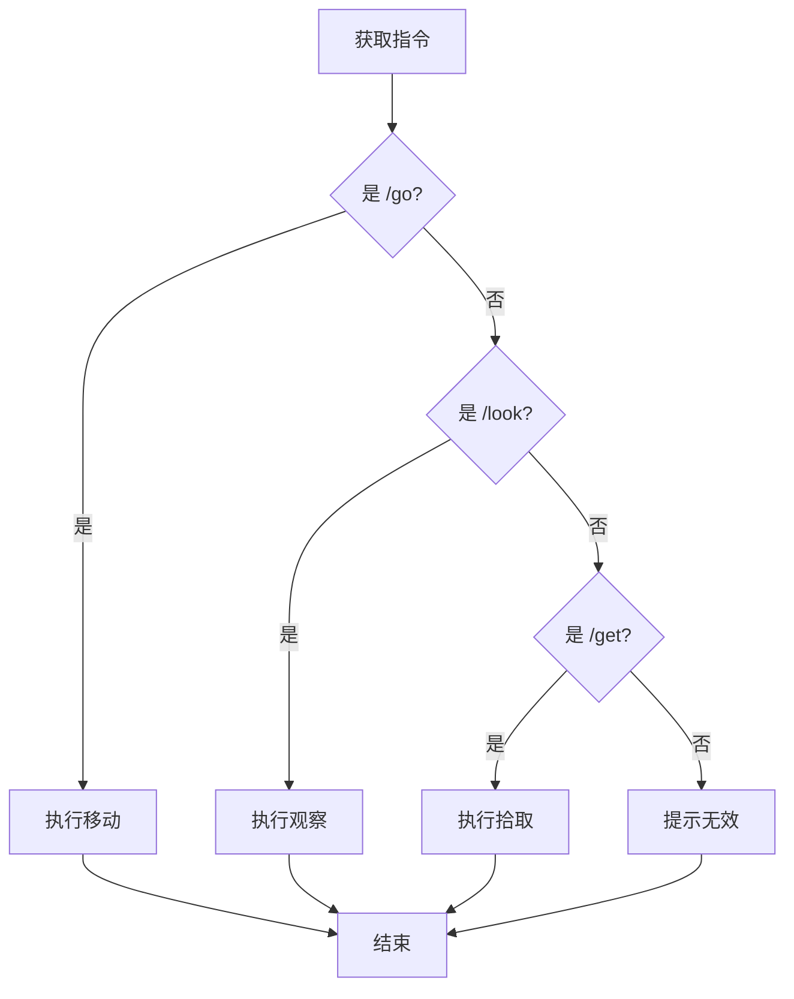

<style>
/* --- 布局辅助样式 --- */
.columns {
  display: grid;
  grid-template-columns: repeat(2, minmax(0, 1fr));
  gap: 1rem;
}
.columns pre code {
  white-space: pre-wrap !important;
  overflow-wrap: break-word !important;
}
/* --- 列表缩进样式修正 --- */
ul, ol {
  padding-inline-start: 25px; /* 减小列表的左侧缩进 */
}
.columns.ratio-4-6 { grid-template-columns: 4fr 6fr; }
.columns.ratio-6-4 { grid-template-columns: 6fr 4fr; }
.columns.ratio-3-7 { grid-template-columns: 3fr 7fr; }
.columns.ratio-7-3 { grid-template-columns: 7fr 3fr; }
.align-top    { display: flex; align-items: flex-start; }
.align-middle { display: flex; align-items: center; }
.align-bottom { display: flex; align-items: flex-end; }
.align-left   { display: flex; justify-content: flex-start; }
.align-center { display: flex; justify-content: center; }
.align-right  { display: flex; justify-content: flex-end; }
.align-top-left     { display: flex; justify-content: flex-start; align-items: flex-start; }
.align-top-center   { display: flex; justify-content: center;  align-items: flex-start; }
.align-top-right    { display: flex; justify-content: flex-end;   align-items: flex-start; }
.align-middle-left  { display: flex; justify-content: flex-start; align-items: center; }
.align-middle-center{ display: flex; justify-content: center;  align-items: center; }
.align-middle-right { display: flex; justify-content: flex-end;   align-items: center; }
.align-bottom-left  { display: flex; justify-content: flex-start; align-items: flex-end; }
.align-bottom-center{ display: flex; justify-content: center;  align-items: flex-end; }
.align-bottom-right { display: flex; justify-content: flex-end;   align-items: flex-end; }
.tip {
  background-color: #f0f8ff;
  border-left: 5px solid #1e90ff;
  padding: 15px;
}
.insight {
  background-color: #eefcff; 
  border-left: 5px solid #17a2b8; 
  padding: 15px; 
}
.key-point {
  background-color: #fffbe6; 
  border-left: 5px solid #ffc107; 
  padding: 15px; 
}
</style>


<style scoped>
h1{
  color: #F5F5F5; /* 设置文字颜色为白色 */
  text-shadow: 2px 2px 8px rgba(0, 0, 0, 0.8); /* 添加一个柔和的深色阴影 */
}
h2 {
  color: #E0E0E0; /* 设置文字颜色为白色 */
  text-shadow: 2px 2px 8px rgba(0, 0, 0, 0.8); /* 添加一个柔和的深色阴影 */
}
.course-title {
  position: absolute;
  top: 60px;
  left: 80px;
  background-color: rgba(0, 0, 0, 0.4);
  color: #fff;
  padding: 8px 15px;
  border-radius: 5px;
  font-size: 22px;
  font-weight: bold;
  letter-spacing: 1px;
  border-left: 5px solid #4CAF50; /* 用一条强调色作为装饰 */
}
</style>

<div class="course-title">AI赋能软件开发</div>

# 模块二：与AI对话——学习编程的核心规则
## 第6节课：赋予世界规则——指令解析与条件判断

<div style="position: absolute; bottom: 40px; left: 80px; color: rgba(255, 255, 255, 0.8); font-size: 18px; font-family: sans-serif;">
南昌大学计算机系 黎鹰
</div>

---

## **回顾：一个“固定剧本”的世界**

<div class="columns">
<div style="font-size: 0.85em;">

在上一节课，我们取得了巨大的进步！

我们成功地用“字典”绘制了一幅宏大的“世界蓝图”，并让玩家“降生”在了世界上。

但是，我们的程序就像一个“**固定剧本**”。
- **情节是固定不变的**：程序从第一行开始，沿着唯一的路径执行到最后一行，然后就结束了。
- **无法响应玩家**：它不能暂停下来等待我们的指令，更不能根据我们的想法产生任何分支或改变。

这种**单向、不可交互的执行流程**，是它无法成为真正“游戏”的根本原因。

**我们如何让程序“暂停”下来，聆听我们的指令，并据此走向不同的未来呢？**

</div>
<div>


</div>
</div>

---

## **本节课目标：指挥AI构建“规则”与“选择”**

为了让世界“活”起来，我们必须为它建立“**规则**”，让它能根据情况做出“**选择**”。

本节课，我们将学习“指挥AI的三大核心指令”中的第二个：

### **条件判断 (If-Else)**
- **作用**：在程序中建立“**决策点**”，赋予程序“**选择**”的能力。
- **你的新能力**：
  1. **定义“规则”**：学会用“如果玩家输入的是`/go`指令，就...”的结构，向AI清晰地描述游戏规则。
  2. **审查“逻辑”**：审查AI代码中的“决策逻辑”是否符合你的游戏设计。

**最终，你将能指挥AI，为你的武侠世界创造出第一个“指令解析器”！**

---

## **情景带入：我们身边的“游戏规则”**

其实，“如果...就...”的决策规则，早已贯穿我们玩过的所有游戏中。

- **角色扮演游戏**
  - **如果** `玩家选择的职业是“法师”`，**就** `初始智力+10`。
  - **如果** `玩家的等级低于10级`，**就** `无法进入“高级地下城”`。

- **策略游戏**
  - **如果** `我方单位是“骑兵”且攻击目标是“弓箭手”`，**就** `伤害加成50%`。
  - **如果** `地图上的资源“木材”少于100`，**就** `高亮显示所有树木`。

这些游戏规则，正是我们为“游戏世界”这个**问题**所建立的**抽象规则**。编程的核心，就是将我们为现实世界中各类问题所建立的规则，用代码精确地实现出来。

---

## **概念拆解：程序的“判断题”**

计算机是如何做出“判断”的呢？在执行 `if` 语句前，它会先求解一个答案只有 **“真” (True)** 或 **“假” (False)** 的“判断题”。

<div class="columns" style="font-size: 0.9em;">
<div>

**例1：判断玩家指令 (文本比较)**
`command == "/quit"`
这句代码是在**提问**：
> “变量 `command` 里的文本，**是不是等于** `"/quit"` 这个词？”

- 若 `command` 是 `"/quit"`，答案为 **`True`**。
- 若 `command` 是 `"/look"`，答案为 **`False`**。

</div>
<div>

**例2：判断玩家等级 (数值比较)**
`player_level >= 10`
这句代码也是在**提问**：
> “变量 `player_level` 里的数字，**是不是大于或等于** `10`？”

- 若 `player_level` 是 `15`，答案为 **`True`**。
- 若 `player_level` 是 `5`，答案为 **`False`**。

</div>
</div>

<div class="insight" style="margin-top: 1rem;">

💡 **核心定义**：`==`(等于)、`!=`(不等于)、`>`(大于)、`<`(小于)、`>=`(大于等于) 这些符号，是程序用来进行“是/非”判断的工具，它们统称为“**比较运算符**”。
</div>

---

## **核心概念1：布尔值——只有“真”或“假”的世界**

在Python中，`True` 和 `False` 这两个特殊的“答案”，是一种全新的数据类型，叫做“**布尔值 (Boolean)**”。

布尔值是程序世界的逻辑基石，它代表了所有“判断题”的最终结果。

你可以亲自在命令行中运行 `python` 后，将以下代码复制到Python的`>>>`提示符后按回车验证一下：

<div class="columns">
<div>

**代码示例**
```python
# 我们可以直接打印出一个“判断题”的答案
command = "/quit"

print("指令是不是'/quit'?", command == "/quit")

print("指令是不是'/look'?", command == "/look")

print("玩家等级是不是大于10?", 15 > 10)
```

</div>
<div>

**输出结果**
```text
指令是不是'/quit'? True
指令是不是'/look'? False
玩家等级是不是大于10? True
```

</div>
</div>

---

## **核心概念2：布尔的本质——逻辑开关**

“真”与“假”是抽象的逻辑概念。在程序中，它们就像一个最简单的“**逻辑开关**”。

一个开关，只有“**开**”和“**关**”两种状态，绝不可能存在第三种。

- **`True`** 就等同于“**开**”：条件满足，执行这条路。
- **`False`** 就等同于“**关**”：条件不满足，不走这条路，去别处看看。

<div class="align-middle-center">


</div>

我们写的 `if score >= 60:`，本质上就是在检查“及格”这个逻辑开关是否被打开。理解了这一点，`if`语句就变得非常简单。

---

## **核心语法1：用 `If-Else` 搭建第一个“T字路口”**

理解了布尔值和开关，`If-Else` 的工作原理就变得非常简单：**它就是在检查一个“开关”是开着还是关着。** 请将代码复制到Python的>>>提示符后运行，理解一下程序逻辑：

<div class="columns" style="font-size: 0.8em;">
<div>

**设计逻辑**

> **如果** `玩家输入的指令` 是 `"/quit"`，
> **就** `退出游戏`；
> **否则**，
> **就** `继续游戏`。

**程序中的逻辑**
```python
command = "/go east"

# 计算机算出 command == "/quit" 是 False (开关是关的)
if command == "/quit": 
    # 因为开关是关的，所以这部分代码被跳过
    print("你退出了江湖...")
else: 
    # 程序走到这里，执行这个代码块
    print("游戏继续...")
```

</div>
<div>

**决策的可视化流程图**

```mermaid
graph TD
    A[获取指令] --> B{指令 == "/quit"?};
    B-- True --> C[退出游戏];
    B-- False --> D[执行其他逻辑];
    C --> E[结束];
    D --> E;
```

</div>
</div>

---

## **核心语法2：用 `elif` 搭建“立交桥”**

如果我们的指令不止两种呢？比如，我们需要处理 `/go`, `/look`, `/get` 等多种指令。

这时，我们就需要使用 `elif` (else if的缩写) 来搭建更复杂的“**立交桥**”，进行多轮判断。

<div class="columns">
<div>

**更复杂的指令解析**
（ 请继续复制代码，观察执行结果）
```python
command = "/look"

if command == "/go": # 第1个判断
    print("处理移动逻辑...")
elif command == "/look": # 如果第1个判断为假，则进行第2个判断
    print("处理观察逻辑...")
elif command == "/get": # 如果前2个判断都为假，则进行第3个判断
    print("处理拾取逻辑...")
else: # 如果以上所有判断都为假
    print("无效的指令！")
```

</div>
<div>

**“立交桥”的可视化流程图**


</div>
</div>

---

## **核心语法3：用 `and` / `or` 组合判断**

有时，一个简单的“判断题”不足以描述我们的规则。我们需要组合多个条件。

- **`and` (并且)**：要求**所有**子问题都为 `True`，最终答案才是 `True`。
  - `(玩家等级 > 10) and (拥有“公会徽章”)` -> 两个都得满足。

- **`or` (或者)**：只要**任何一个**子问题为 `True`，最终答案就是 `True`。
  - `(职业 == "法师") or (智力 > 15)` -> 满足一个就行。

`and` 和 `or` 就像连词，让我们可以提出更复杂的“判断题”。

---

## **模式转换：从“学习语法”到“指挥AI”**

我们已经掌握了 `if-else` 的核心逻辑。从现在开始，我们不再逐行编写代码，而是转换角色，作为“游戏设计师”**通过自然语言指挥AI完成整个程序**。

接下来，我们将通过两步指令，让AI为我们构建出完整的游戏循环和指令解析器。

<div class="insight" style="margin-top: 1rem; font-size:0.9em;">

💡 **请注意：**

1.  **关注“指令”，而非“代码”**：你的核心任务是思考并写下清晰的、给AI的**指令**（Prompt）。
2.  **AI的代码可能包含“超前”内容**：为了让程序完整运行，AI可能会使用我们尚未学过的知识（例如 `startswith()` 方法）。
3.  **学会“忽略”**：你**完全可以忽略**那些看不懂的代码！只需关注AI生成的代码中，和你刚刚学过的 `if-else` 相关的部分即可。
4.  **保持“好奇”**：如果你对“超前”的代码感兴趣，这正是绝佳的预习机会！大胆地复制那段代码，向AI提问：“请用初学者能听懂的语言，解释这段代码是什么意思？”

</div>

---

## **第一步：让世界“聆听”一次指令**

我们向AI发出第一个指令。这个指令的目标是：让游戏能**执行一次完整的交互**：显示场景、获取指令、并根据最简单的 `/quit` 指令做出反应。

> **我们的指令 (Prompt):**
>
> 请在现有代码基础上进行修改。我需要程序能实现一次完整的单次交互：
> 1.  首先根据 `player_location` 变量，打印出当前地点的描述。
> 2.  然后使用 `input()` 函数来获取玩家的输入，并将输入的内容存入一个名为 `command` 的变量中。
> 3.  最后，使用 `if` 语句判断：如果玩家输入的 `command` 等于 `"/quit"`，就打印 "你退出了江湖..."。

---

## **AI的实现与我们的关注点**

<div style="font-size:0.85em;">

AI根据我们的指令，生成了如下的单次交互脚本（注意：AI生成有一定随机性，内容可能稍有不同）。

```python
# ... (之前的世界定义代码) ...

# 根据 player_location 变量的值，从 world 字典中获取玩家所在地的描述，并打印出来
print("\n=== 武侠世界 ===")
print(world[player_location]['description'])

# 获取玩家输入
command = input("\n请输入指令（输入/quit退出）：")

# 判断玩家输入
if command == "/quit":
    print("你退出了江湖...")  
```

<div class="insight">

✅ **我们的关注点：**

我们看到，程序现在是一个简单的、从上到下执行一次的脚本。`if command == "/quit":` 这一行精确地实现了我们“判断退出指令”的设计意图。这就足够了！

</div>
</div>

---

## **第二步：实现完整的指令解析**

<div style="font-size:0.85em;">

很好，我们的程序已经能响应最基础的 `/quit` 指令了。接下来，我们向AI发出第二个指令，要求它在 `if` 语句后面，用 `elif` 和 `else` 补完所有我们设计好的游戏规则，构建一个完整的指令解析器。

> **我们的指令 (Prompt):**
>
> 非常棒！现在请在 `if` 语句后面继续添加 `elif` 和 `else` 分支，来实现对其他指令的解析：
> 1.  如果玩家输入 `"/look"`，就重新打印当前地点的描述。
> 2.  如果玩家输入的是以 `"/go"` 开头的指令（例如 `"/go east"`），就解析出后面的方向。然后检查这个方向是否是当前地点的一个有效出口。
>     - 如果是有效出口，就更新 `player_location` 变量为新的地点ID，并打印一句提示，比如“你来到了[新地点名称]...”。
>     - 如果不是有效出口，就打印“你不能往那个方向走。”
> 3.  对于所有其他无法识别的指令，用 `else` 分支打印“无效的指令！”。

</div>

---

## **AI的最终代码与审查**

AI迅速迭代生成了包含完整逻辑的、有详细注释的最终代码，质量很高。

<style scoped>
.small-code pre, .small-code code {
  font-size: 0.72em;
  line-height: 0.9;
}
</style>

<div class="small-code">

```python
# ... (前面是没有变化的代码) ...
# 判断玩家输入
if command == "/quit":
    print("你退出了江湖...")
elif command == "/look":
    # 重新打印当前地点的描述
    print(world[player_location]['description'])
elif command.startswith("/go "):
    # 解析方向参数
    direction = command.split(" ", 1)[1]  # 获取/go后面的部分，例如"east"
    
    # 检查这个方向是否是当前地点的一个有效出口
    if direction in world[player_location]['exits']:
        # 更新 player_location 变量为新的地点ID
        new_location = world[player_location]['exits'][direction]
        player_location = new_location
        
        # 打印提示
        print(f"你来到了{new_location}...")
    else:
        # 不是有效出口，打印错误信息
        print("你不能往那个方向走。")
else:
    # 对于所有其他无法识别的指令，打印无效指令提示
    print("无效的指令！")

```

</div>

---

## **作为“设计师”的最终审查**

<div class="columns" style="font-size: 0.8em;">
<div>

现在，请扮演“游戏设计师”的角色，对AI生成的最终代码进行**逻辑审查**。

你不需要理解每一行代码的技术细节，但你需要通过输入和输出的内容确认：

-   [✅] `"/quit"` 的逻辑对吗？

-   [✅] `"/look"` 的逻辑对吗？

-   [✅] `"/go"` 的逻辑是否完整？

    -   有没有处理无效方向（比如 `/go north`）？

    -   有没有处理错误指令（比如 `/go` 后面没跟方向）？

-   [✅] 对所有其他指令，是不是提示了“无效指令”？

</div>
<div class="align-top-center" style="flex-direction: column;">


<div class="insight" style="margin-top: 1rem;">

💡 **你的核心价值：代码评审与逻辑验收。** AI负责实现代码，你负责确保代码的逻辑符合你的设计蓝图。
</div>

</div>
</div>

---

## **价值升华：你是“游戏规则”的唯一制定者**

<div class="columns">
<div>

我们来回顾一下这节课的人机协作流程：
1.  **你 (设计师)**：提出 `/look` 和 `/go` 的核心玩法规则。
2.  **AI (程序员)**：根据你的规则，生成了包含 `if/elif/else` 的代码。
3.  **你 (审查者)**：检查AI的代码逻辑，确保它符合你的预期，没有产生类似“原地踏步”的Bug。

AI能不知疲倦地编写代码，但它没有灵魂，没有世界观。它不知道“光明顶”和“武当山”哪个更应该是正派，也不知道你的游戏中，“/look”一下是否应该消耗体力。

**这些，只有你——游戏世界的设计师和规则的唯一制定者——才能决定。**

</div>
<div class="align-top-center" style="flex-direction: column;">


<div class="insight" style="margin-top: 1rem;">

💡 **AI负责实现，你负责想象。** 你的核心价值，在于为代码注入灵魂——**创造**规则、构建体验、讲述故事。
</div>

</div>
</div>


---

## **本节课总结：我们获得了什么？**

<div class="columns">

<div style="font-size: 0.9em;">

在本节课，我们为游戏世界装上了“规则引擎”，你作为“游戏设计师”的核心能力也得到了升级：

- **获得了“规划”能力**
  - 你学会了如何将现实世界的游戏规则，翻译成程序可以理解的 `If-Else` 决策路径。
- **获得了“审查”能力**
  - 你掌握了审查AI代码“设计蓝图”中**核心交互逻辑**的方法，确保AI的决策符合你的设计意图。

你不再只是一个被动的旁观者，而是能主动为你的世界**制定规则、定义交互**的创造者——哪怕目前，这还只是“一瞬间”的交互。

</div>

<div>


</div>

</div>

---

## **下一步预告：从“时间切片”到“时间流逝”**

<div class="columns">

<div style="font-size: 0.9em;">

我们已经能让世界响应我们的指令了！这是一个巨大的进步！

但是，我们的程序依然只能表现世界运转的**一个极短的“时间切片”**。它接收一次指令，执行一次判断，然后整个世界的“时间”就停止了。

**如何让时间真正“流动”起来？**

我们如何为这个世界装上“心跳”，让它不再是执行一次就结束的“切片”，而是能持续运转、让玩家沉浸其中探索的“时间流”？

为了让世界拥有“心跳”，下一节课，我们将学习指挥AI的三大核心指令中的最后一个——**循环**！

</div>

<div>


</div>

</div>
