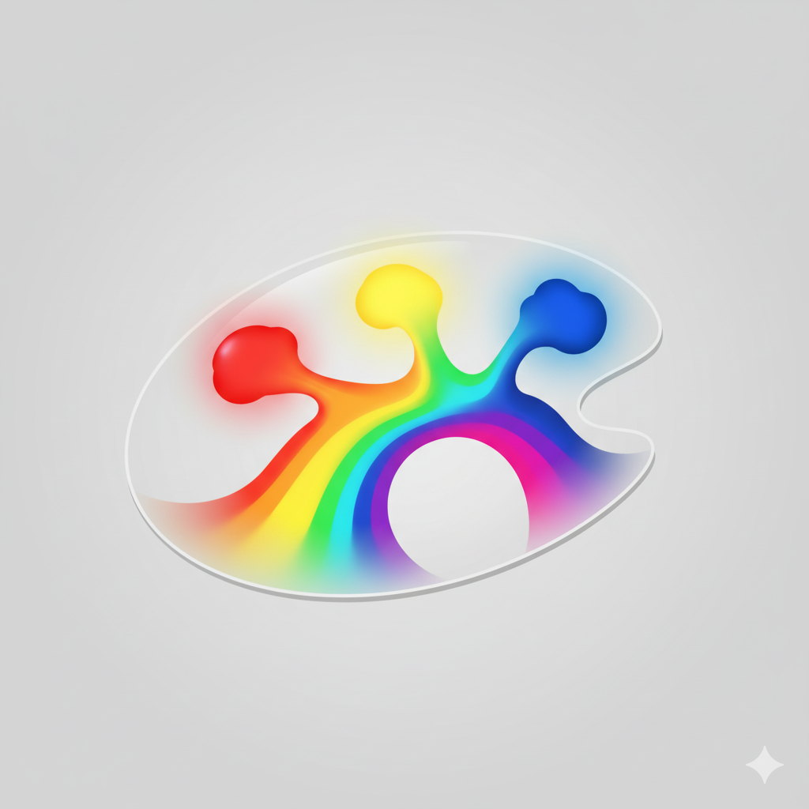
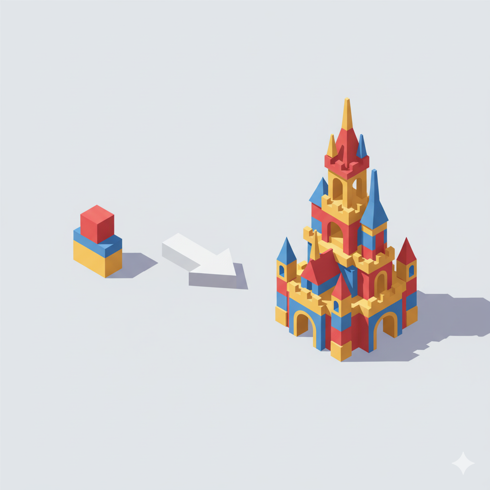
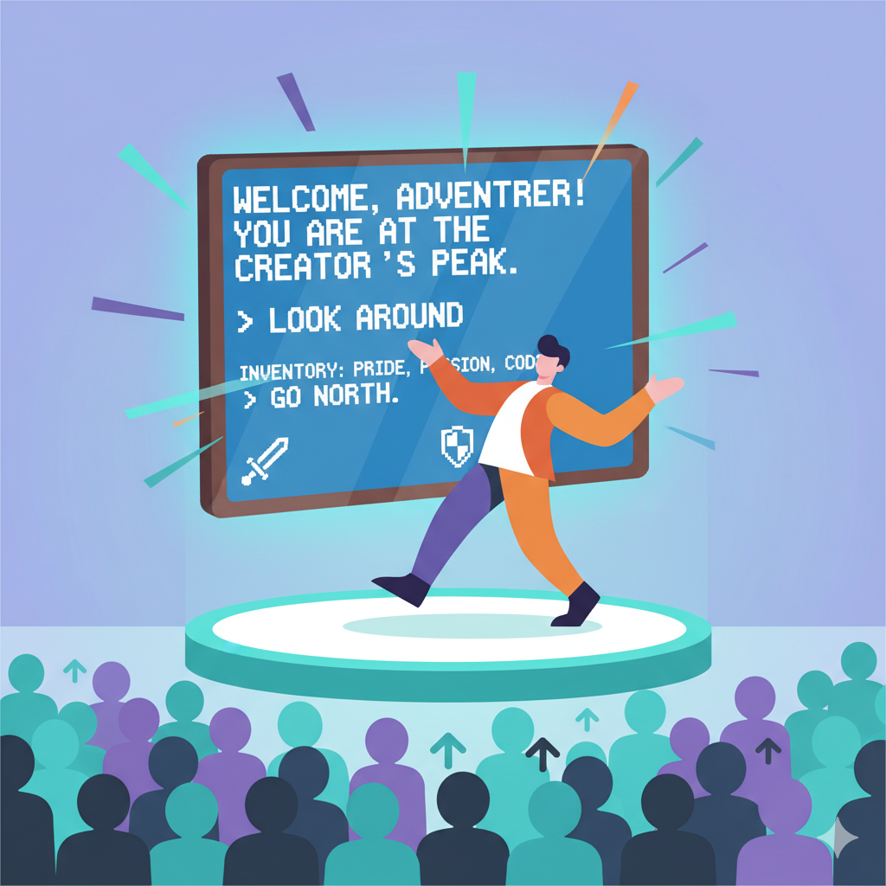
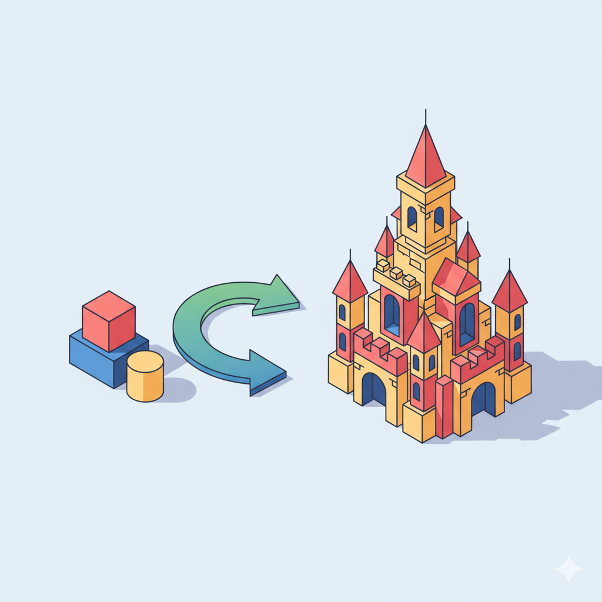

<style>
/* --- 布局辅助样式 --- */
.columns {
  display: grid;
  grid-template-columns: repeat(2, minmax(0, 1fr));
  gap: 1rem;
}
.columns pre code {
  white-space: pre-wrap !important;
  overflow-wrap: break-word !important;
}
/* --- 列表缩进样式修正 --- */
ul, ol {
  padding-inline-start: 25px; /* 减小列表的左侧缩进 */
}
.columns.ratio-4-6 { grid-template-columns: 4fr 6fr; }
.columns.ratio-6-4 { grid-template-columns: 6fr 4fr; }
.columns.ratio-3-7 { grid-template-columns: 3fr 7fr; }
.columns.ratio-7-3 { grid-template-columns: 7fr 3fr; }
.align-top    { display: flex; align-items: flex-start; }
.align-middle { display: flex; align-items: center; }
.align-bottom { display: flex; align-items: flex-end; }
.align-left   { display: flex; justify-content: flex-start; }
.align-center { display: flex; justify-content: center; }
.align-right  { display: flex; justify-content: flex-end; }
.align-top-left     { display: flex; justify-content: flex-start; align-items: flex-start; }
.align-top-center   { display: flex; justify-content: center;  align-items: flex-start; }
.align-top-right    { display: flex; justify-content: flex-end;   align-items: flex-start; }
.align-middle-left  { display: flex; justify-content: flex-start; align-items: center; }
.align-middle-center{ display: flex; justify-content: center;  align-items: center; }
.align-middle-right { display: flex; justify-content: flex-end;   align-items: center; }
.align-bottom-left  { display: flex; justify-content: flex-start; align-items: flex-end; }
.align-bottom-center{ display: flex; justify-content: center;  align-items: flex-end; }
.align-bottom-right { display: flex; justify-content: flex-end;   align-items: flex-end; }
.tip {
  background-color: #f0f8ff;
  border-left: 5px solid #1e90ff;
  padding: 15px;
}
.insight {
  background-color: #eefcff; 
  border-left: 5px solid #17a2b8; 
  padding: 15px; 
}
.key-point {
  background-color: #fffbe6; 
  border-left: 5px solid #ffc107; 
  padding: 15px; 
}
.tip p, .tip li,
.insight p, .insight li,
.key-point p, .key-point li {
  font-size: inherit !important;
}
.styled-div p, 
.styled-div li, 
.styled-div ol, 
.styled-div ul, 
.styled-div blockquote {
  font-size: inherit !important;
}
</style>


<style scoped>
h1{
  color: #F5F5F5; /* 设置文字颜色为白色 */
  text-shadow: 2px 2px 8px rgba(0, 0, 0, 0.8); /* 添加一个柔和的深色阴影 */
}
h2 {
  color: #E0E0E0; /* 设置文字颜色为白色 */
  text-shadow: 2px 2px 8px rgba(0, 0, 0, 0.8); /* 添加一个柔和的深色阴影 */
}
.course-title {
  position: absolute;
  top: 60px;
  left: 80px;
  background-color: rgba(0, 0, 0, 0.4);
  color: #fff;
  padding: 8px 15px;
  border-radius: 5px;
  font-size: 22px;
  font-weight: bold;
  letter-spacing: 1px;
  border-left: 5px solid #4CAF50; /* 用一条强调色作为装饰 */
}
</style>

<div class="course-title">AI赋能软件开发</div>

# 模块二：与AI对话——学习编程的核心规则
## 第8节课: 模块收官项目：创造你自己的江湖传说

<div style="position: absolute; bottom: 40px; left: 80px; color: rgba(255, 255, 255, 0.8); font-size: 18px; font-family: sans-serif;">
南昌大学计算机系 黎鹰
</div>

<!--
- **类型**: 逐字稿
- **内容**: |
  （音乐）各位老师好！欢迎来到我们模块二的最后一节课，也是最激动人心的一节课——我们的模块收官项目！
  在之前的课程中，我们已经学习了变量、条件和循环，集齐了创世的“三原色”。
  这节课，我们将不再学习任何新的语法，而是将我们所有的知识和技能融会贯通，扮演“游戏设计师”的角色，亲手为我们的武侠世界增添独一无二的色彩，创造属于我们自己的江湖传说！
-->

<!--
- **类型**: 教学设计
- **内容**: |
  ### 教学时间: 1分钟
  ### 开场：宣告项目课的开始
  本页作为模块二的收官项目课，其核心目标是营造一种“毕业设计”的仪式感和兴奋感。

  **核心要点**：
  1.  **承上启下**: 快速回顾之前学过的“三原色”，强调本节课是知识的“融会贯通”，而非学习新知。
  2.  **降低焦虑**: 明确告知“不学任何新语法”，可以有效降低学员对项目课的畏难情绪。
  3.  **角色扮演**: 赋予学员“游戏设计师”的角色，激发他们的创造欲和主人翁意识。
  4.  **设定目标**: “创造你自己的江湖传说”这个目标宏大而富有吸引力，能迅速点燃学员的热情。
-->

<!--
- **类型**: 解释
- **内容**: |
  ### 项目课的意义
  项目课（Project-based Learning）是检验和巩固知识的最佳方式。与之前单点知识的学习不同，项目课要求你：
  1.  **综合运用**: 将多个独立的知识点（变量、条件、循环）组合起来，解决一个更复杂、更完整的问题。
  2.  **主动设计**: 从“学习者”转变为“创造者”，你需要自己做出设计决策（例如，你想为游戏增加什么功能）。
  3.  **问题解决**: 在实践中，你几乎一定会遇到预料之外的问题和Bug，这个过程将极大地锻炼你分析和解决问题的能力。

  本节课的目标，就是让你在AI的辅助下，完整地体验一次“从想法到实现”的迷你开发周期。
-->

---

## **回顾：我们已集齐创世的“三原色”**

<div class="columns ratio-6-4">
<div style="font-size: 0.85em;">

在今天的前面几节课，我们已经掌握了构建任何复杂程序的“创世之力”：

- **变量 (Variables)**
  - 赋予世界“**地图**”与“**状态**”。

- **条件 (Conditions)**
  - 赋予世界“**规则**”与“**选择**”。

- **循环 (Loops)**
  - 赋予世界“**心跳**”与“**时间**”。

这节课，我们不学任何新语法。我们的任务，是像一位真正的“游戏设计师”，将这三种最基本的能力**组合**起来，为我们的武侠世界增添独一无二的细节与创意。

</div>
<div class="align-middle-center">



</div>
</div>

<!--
- **类型**: 逐字稿
- **内容**: |
  在开始动手之前，让我们再次回顾一下我们手中已经拥有的强大武器。
  我们已经集齐了创世的“三原色”：
  通过变量，我们为世界绘制了“地图”，定义了“状态”。
  通过条件判断，我们为世界建立了“规则”，赋予了它“选择”的能力。
  通过循环，我们为世界注入了“心跳”，让“时间”得以流逝。
  这节课，我们的任务就是把这三种颜色调和在一起，画出属于我们自己的、独一无二的画作。
-->

<!--
- **类型**: 教学设计
- **内容**: |
  ### 教学时间: 2分钟
  ### 知识回顾与信心建立
  本页的核心目标是在项目开始前，快速回顾本模块的核心知识，并建立学员的信心。

  **核心要点**：
  1.  **系统性回顾**: 将之前三节课的核心内容高度概括为“三原色”，并用关键词（地图、规则、心跳）进行总结，帮助学员快速回顾并形成知识体系。
  2.  **“三原色”比喻**: 这个比喻非常强大，它暗示了学员手中工具的“基础性”和“无限可能性”，能极大地激发他们的创造欲。
  3.  **强调“组合”**: 明确指出本节课的核心是“组合”而非“学习新知”，将学员的注意力引导到如何创造性地应用已有知识上。
-->

<!--
- **类型**: 解释
- **内容**: |
  ### 结构化程序设计
  “变量、条件、循环”这三个概念，是“结构化程序设计”理论的基石。该理论指出，任何复杂的算法逻辑，都可以由三种基本控制结构组合而成：
  1.  **顺序 (Sequence)**: 代码从上到下依次执行。
  2.  **选择 (Selection)**: 即条件判断（`if-else`），根据条件选择不同的执行路径。
  3.  **重复 (Repetition)**: 即循环（`for`, `while`），重复执行某段代码。

  这意味着，你现在掌握的工具虽然简单，但理论上已经足以构建出任何复杂的程序。本节课的挑战，就是对你“组合”这些基本结构，解决实际问题的能力的第一次综合考验。
-->

---

## **项目使命：从“引擎”到“游戏”**

<div class="columns ratio-6-4">
<div>

在前三节课，我们已经成功构建了一个“**迷你游戏引擎**”。它拥有了地图、状态、规则和心跳，已经是一个“可运行”的框架。

但是，这个世界还很原始，还不能称之为一个“游戏”。

这节课，我们的使命就是扮演“**关卡设计师**”和“**剧情策划**”的角色，为这个框架填充血肉，注入灵魂，把它从一个“引擎”变成一个真正“好玩”的“游戏”。

**你的世界，你做主！**

</div>
<div class="align-middle-center">


</div>
</div>

<!--
- **类型**: 逐字稿
- **内容**: |
  我们前三节课的成果，可以看作是一个“迷你游戏引擎”。它有了骨架，能跑起来了。
  但是，这个世界还很空洞，很原始，还不能算是一个真正的“游戏”。
  所以，我们这节课的使命，就是完成一次角色的转变。从之前的“引擎工程师”，转变为“关卡设计师”和“剧情策划”。
  我们要为这个光秃秃的框架，填充上血肉，注入灵魂，让它从一个能运行的“引擎”，变成一个真正“好玩”的“游戏”。
  你的世界，你做主！
-->

<!--
- **类型**: 教学设计
- **内容**: |
  ### 教学时间: 2分钟
  ### 明确项目目标与角色转换
  本页旨在清晰地定义本次项目课的核心任务，并再次进行角色转换，激发学员的创造性。

  **核心要点**：
  1.  **区分“引擎”与“游戏”**: 这个对比非常重要。它让学员理解到，一个可运行的程序框架（引擎）和一个有趣的产品（游戏）之间，还存在着“内容”和“设计”的鸿沟。
  2.  **引入新角色**: “关卡设计师”和“剧情策划”这两个新角色，引导学员的思维从“如何实现功能”转向“如何让游戏更好玩”，从技术思维转向设计思维和产品思维。
  3.  **赋予自主权**: “你的世界，你做主！”这句话，给予了学员极大的创造自由度和主人翁感。
-->

<!--
- **类型**: 解释
- **内容**: |
  ### 游戏开发中的角色分工
  在专业的游戏开发团队中，通常有明确的角色分工：
  - **游戏引擎程序员 (Engine Programmer)**: 负责开发和维护游戏的基础框架，如图形渲染、物理模拟、内存管理等。我们前几节课构建的循环和指令解析器，就属于最基础的引擎功能。
  - **游戏玩法程序员 (Gameplay Programmer)**: 负责实现游戏的核心玩法和逻辑，例如角色的技能、战斗系统、任务流程等。
  - **关卡设计师 (Level Designer)**: 负责设计游戏中的具体关卡，包括地图布局、敌人配置、谜题设计等。
  - **剧情策划 (Narrative Designer/Writer)**: 负责编写游戏的故事情节、角色对话、世界观设定等。

  在本节课，你将一人分饰多角，同时扮演“玩法程序员”、“关卡设计师”和“剧情策划”，来丰富你的游戏世界。
-->

---

## **本次创意工坊的“技术起点”**

<div class="columns ratio-6-4">
<div style="font-size: 0.88em;">

在开始挥洒创意之前，让我们先明确我们这节课工作的“地基”。

我们每个人的手中，都应该已经拥有一个来自上一节课的、初级的“**迷你游戏引擎**”。它应该具备：

- 一个用`字典`和`列表`构建的 `world` 世界蓝图。
- 一个 `while True` 的游戏主循环，让世界持续运转。
- 一个能响应 `/go`、`/look`（可显示物品）和 `/quit` 指令的 `if-elif-else` 解析器。

这节课，我们就是在这个坚实的地基上，添砖加瓦，描绘属于我们自己的多彩世界！

</div>
<div class="align-middle-center">



</div>
</div>

<!--
- **类型**: 逐字稿
- **内容**: |
  在大家开始动手之前，我们先统一一下“技术起点”。
  每个人的电脑上，都应该有一个来自上一节课的、可以正常运行的“迷你游戏引擎”。
  我们来检查一下这个“地基”是否牢固。它应该具备三个核心要素：
  第一，有一个用字典和列表构建的`world`蓝图。
  第二，有一个`while True`的游戏主循环。
  第三，有一个能处理`/go`, `/look`, `/quit`这三个基本指令的解析器。
  如果你上一节课的练习没有成功，没关系，可以向老师或助教寻求帮助，拿到这份基础代码。
  我们这节课的所有创意，都是在这个坚实的地基上添砖加瓦。
-->

<!--
- **类型**: 教学设计
- **内容**: |
  ### 教学时间: 2分钟
  ### 统一技术基线
  本页的目标是在开放式项目开始前，确保所有学员都有一个统一、可用的代码基础。

  **核心要点**：
  1.  **“地基”比喻**: 将基础代码比作“地基”，形象地说明了其重要性，也暗示了本节课的工作是在其上“添砖加瓦”，而非推倒重来。
  2.  **清单式检查**: 清晰地列出了基础代码应具备的三个核心要素，方便学员自我检查。
  3.  **提供支持**: 考虑到部分学员可能没有跟上，主动提出可以寻求帮助，获取基础代码，确保了所有学员都能参与到项目课中，体现了教学的包容性。
-->

<!--
- **类型**: 解释
- **内容**: |
  ### 基线代码 (Baseline Code)
  在软件开发中，“基线”或“基线代码”指的是一个项目的某个稳定、可运行的版本，它通常作为新功能开发或下一个迭代周期的起点。

  我们上一节课完成的“迷你游戏引擎”，就是我们本次项目课的“基线代码”。它包含了我们这个模块所学的所有核心知识点：
  - **数据结构**: `world` 字典，`items` 列表。
  - **控制流**: `while True` 循环，`if-elif-else` 条件判断。
  - **输入/输出**: `input()` 和 `print()`。

  从这个基线出发，你可以专注于添加新的“功能”，而不需要从零开始重写基础框架。这是迭代开发模式的典型实践。
-->

---

## **核心方法论：两阶段提示词实践法**

这节课，我们采用一种全新的训练方法，来体验AI辅助开发的两种不同模式。对于你选择的任何一个挑战，都需要分两步完成。

<div class="columns" style="font-size: 0.75em;">
<div>

### **第一阶段：“愿景驱动”** (先有)
1.  **目标**：快速验证想法，获得即时反馈。
2.  **方法**：用**纯自然语言**向AI描述你的**最终目的**。
    > **Prompt示例**：
    > 你好，我想让我的游戏能拾取物品，比如输入‘/take sword’，地上的剑就到我包里了。
3.  **产出**：一个能运行的脚本，但你可能不完全理解其内部逻辑。
4.  **关键后续**：拿到代码后，立刻追问AI：
    > 请一步步向我解释你刚刚生成的代码，特别是处理‘/take’指令的部分，它的逻辑是什么？

</div>
<div>

### **第二阶段：“设计驱动”** (再好)
1.  **目标**：掌握逻辑，精准控制，产出高质量代码。
2.  **方法**：**另起一个会话**，像架构师一样，给出**清晰、分步**的指令。
    > **Prompt示例**：
    > 请帮我实现`/take`指令：1. 为玩家创建名为`inventory`的空列表... 2. 检查指令是否为两部分... 3. 检查物品是否存在... 4. 写入到新的脚本...
3.  **产出**：一个你完全理解的、逻辑严谨的脚本。
4.  **核心价值**：通过这个过程，你将真正**驾驭**AI，而不仅仅是**使用**它。

</div>
</div>

<!--
- **类型**: 样式替换
- **版本**: [handout, teacher]
- **查找**: |
    <div>
- **替换**: |
    <div class="styled-div" style="font-size: 0.8em;">
- **次数**: *
-->

<!--
- **类型**: 逐字稿
- **内容**: |
  好，这节课我们来尝试一种全新的训练方法，我称之为“两阶段提示词实践法”。
  对于你选择的任何一个挑战，我们都分两步走。
  第一阶段，叫“愿景驱动”，目标是“先有”。你就像一个产品经理，用最口语化、最直接的自然语言告诉AI你的最终目的。比如，“我想让游戏能捡东西”。AI会很快给你一个能运行的脚本。但你可能看不懂里面的所有细节。所以，关键的后续一步是，拿到代码后，立刻让AI给你解释它的逻辑。
  第二阶段，叫“设计驱动”，目标是“再好”。在理解了逻辑之后，你另起一个会话，这次你扮演“架构师”，给出清晰的、分步骤的指令，让AI按照你的设计思路来生成代码。
  通过这两个阶段的对比，你将深刻地体会到，什么是“使用”AI，什么是“驾驭”AI。
-->

<!--
- **类型**: 教学设计
- **内容**: |
  ### 教学时间: 5分钟
  ### 教授核心元技能：两种Prompt模式
  本页是本次项目课的核心教学法，旨在让学员亲身体验并对比两种与AI协作的模式。

  **核心要点**：
  1.  **方法论构建**: 将实践过程提炼为“两阶段提示词实践法”，并赋予其“愿景驱动（先有）”和“设计驱动（再好）”的名称，易于理解和记忆。
  2.  **对比学习**: 通过并列对比，清晰地展示了两种模式在“目标”、“方法”、“产出”和“价值”上的巨大差异。
  3.  **强调“解释”环节**: 在第一阶段，特别强调了“追问AI解释代码”这一关键后续步骤。这是利用AI进行学习的核心技巧，能帮助学员快速地从“黑箱使用者”转变为“白箱理解者”。
  4.  **锚定核心价值**: 在第二阶段，明确点出其核心价值是“驾驭”AI，与课程的终极目标相呼应。
-->

<!--
- **类型**: 解释
- **内容**: |
  ### 两种协作模式的深度解析
  这两种模式代表了与AI协作的两种不同层次和场景：

  - **“愿景驱动” (Vision-Driven / Declarative)**:
    - **特点**: 你只声明“**做什么 (What)**”，而将“**如何做 (How)**”的细节完全交给AI。
    - **优点**: 速度极快，非常适合早期创意探索、快速原型验证、或处理你不关心实现细节的一次性任务。
    - **缺点**: 产出代码的质量和逻辑可能不可控，你对代码的理解是“被动”的。

  - **“设计驱动” (Design-Driven / Imperative)**:
    - **特点**: 你不仅定义“做什么”，更重要的是定义了“**如何做**”的详细步骤和逻辑。
    - **优点**: 你对代码有完全的掌控力，产出的代码逻辑严谨、符合你的设计，并且你对代码的理解是“主动”的。
    - **缺点**: 需要你对问题有更深入的思考和分解，前期花费的时间更多。

  一个成熟的AI协作者，应该能根据任务的性质，在这两种模式之间灵活切换。
-->

---

## **挑战菜单：选择你的任务！**

<div style="font-size: 0.75em">

现在，进入开放式的“**创意工坊**”。请在你已有的代码基础上，**任选以下列表中的一项**，并使用我们刚刚学习的“**两阶段提示词实践法**”来完成它。（**开始之前记得先备份当前版本,方便失败时复制备份的内容到实验用的脚本文件中**）

### **创意功能列表 (任选一项)**

1.  **实现 `/take [物品名]` 指令**
    - 效果：让玩家可以从当前地点拾取物品，并放入背包。
    - 核心逻辑：物品从`world`中的`items`列表，移动到玩家的`inventory`列表。
2.  **实现 `/inventory` 或 `/i` 指令**
    - 效果：让玩家可以查看自己背包`inventory`里的所有物品。
    - 核心逻辑：使用`for`循环遍历`inventory`列表并打印。
3.  **实现 `/drop [物品名]` 指令**
    - 效果：让玩家可以从背包中丢弃物品，物品会出现在当前地点。
    - 核心逻辑：`/take`指令的逆向操作。
4.  **实现“斜杠指令” (例如 `/salute`)**
    - 效果：输入`/salute`或`/meditate`等指令，打印一段有趣的描述性文字。
    - 核心逻辑：增加几个简单的`elif`分支，匹配特定指令并打印固定文本。
</div>

<!--
- **类型**: 样式替换
- **版本**: [handout, teacher]
- **查找**: |
    <div style="font-size: 0.75em">
- **替换**: |
    <div class="styled-div" style="font-size: 0.6em;">
- **次数**: *
-->

<!--
- **类型**: 逐字稿
- **内容**: |
  好了，方法论我们已经掌握了。现在，就进入我们今天的开放式“创意工坊”环节。
  这里有一个“挑战菜单”，列出了四个你可以为你的游戏世界增加的创意功能。请大家任选其中一项，然后用我们刚刚学的“两阶段提示词实践法”来完成它。
  在开始之前，我强烈建议大家先备份一下你当前的可用代码，比如复制到一个新的文本文件里。这样，万一在实验中把代码改乱了，我们也能轻松地恢复。
  这四个挑战，难度各不相同，大家可以根据自己的兴趣来选择。比如`/take`指令逻辑最复杂，而“斜杠指令”最简单。
  现在，请选择你的任务，开始你的创世之旅吧！
-->

<!--
- **类型**: 教学设计
- **内容**: |
  ### 教学时间: 3分钟
  ### 开放式、选择性的项目实践
  本页是项目实践的核心环节，其设计旨在给予学员充分的自主性和选择权。

  **核心要点**：
  1.  **“菜单”式选择**: 提供一个“挑战菜单”，而不是规定所有人都做同一个任务。这种选择性可以更好地匹配不同学员的兴趣和学习进度，提高参与感。
  2.  **明确任务细节**: 每个挑战都清晰地描述了“效果”和“核心逻辑”，为学员提供了足够的脚手架，让他们不至于无从下手。
  3.  **风险提示**: “开始之前记得先备份”这是一个非常重要、非常专业的实践提示。它教给学员版本控制的基本思想，并降低他们“怕改错”的恐惧心理。
  4.  **难度分层**: 四个挑战在逻辑复杂度上是不同的（例如，`take`涉及两个列表的修改，而`salute`只是一个简单的`elif`），这实际上形成了一个隐性的难度分层，让不同水平的学员都能找到适合自己的挑战。
-->

<!--
- **类型**: 解释
- **内容**: |
  ### 各挑战的核心技术点
  - **`/take`**: 这是最有挑战性的任务。它需要你处理：
    - 字符串解析：从 `"/take sword"` 中分离出 `"sword"`。
    - 条件判断：检查物品是否存在于房间的 `items` 列表中。
    - 列表操作：从 `items` 列表中移除（`remove()`），并添加到 `inventory` 列表中（`append()`）。
  - **`/inventory`**: 这个任务相对简单，核心是：
    - 条件判断：检查 `inventory` 列表是否为空。
    - `for` 循环：遍历 `inventory` 列表并打印每一项。
  - **`/drop`**: 这是 `/take` 的逆向逻辑，技术点类似，是很好的巩固练习。
  - **斜杠指令**: 这是最简单的任务，只需要增加 `elif command == "/salute":` 这样的分支即可。非常适合用来快速体验“两阶段法”的流程。
-->

---

## **实践参考：`take`指令的两阶段实现**

如果你在实践中遇到困难，可以参考`take`指令的两阶段实现过程，它清晰地展示了两种Prompt风格的差异。

<div class="columns">
<div>

#### **第一阶段：“愿景驱动” Prompt**
> “我想在我的文本游戏中加入一个拾取物品的功能。比如，如果地上有‘一把生锈的剑’，我输入‘/take 一把生锈的剑’，这把剑就应该从地上消失，然后出现在我的背包里。如果地上没有这个东西，就告诉我‘这里没有这个东西’。”

**➡️ 目标：快速获得一个能用的原型。**

</div>
<div style="font-size: 0.7em;">

#### **第二阶段：“设计驱动” Prompt**
> “请帮我实现`/take`指令，逻辑如下：
> 1. 在`while`循环前，创建一个名为`inventory`的空列表。
> 2. 在主循环中，为以`'/take '`开头的指令增加`elif`分支。
> 3. 在分支中，先分离出玩家想拾取的物品名。
> 4. 检查该物品是否存在于当前房间的`items`列表中。
> 5. 如果存在，就从`items`列表移除，并添加到`inventory`列表，然后打印成功信息。
> 6. 如果不存在，就打印‘这里没有这个东西。’”

**➡️ 目标：产出逻辑严谨、自己完全掌控的代码。**

</div>
</div>

<!--
- **类型**: 样式替换
- **版本**: [handout, teacher]
- **查找**: |
    <div style="font-size: 0.7em;">
- **替换**: |
    <div class="styled-div" style="font-size: 0.6em;">
- **次数**: *
-->

<!--
- **类型**: 逐字稿
- **内容**: |
  如果大家在实践中，特别是对于`/take`这个比较复杂的指令，感到有些无从下手，这里有一个参考。
  这页幻灯片清晰地展示了实现`/take`指令时，“愿景驱动”和“设计驱动”这两种Prompt的巨大差异。
  左边，是“愿景驱动”的Prompt，非常口语化，就像在和朋友聊天，描述一个故事。它的目标是让AI快速给你一个能用的原型。
  右边，是“设计驱动”的Prompt，非常结构化，逻辑清晰，一步一步地告诉AI应该怎么做。它的目标是产出一段你完全理解和掌控的代码。
  大家可以仔细体会这两种风格的差异，并在自己的实践中进行模仿和应用。
-->

<!--
- **类型**: 教学设计
- **内容**: |
  ### 教学时间: 15分钟
  ### 提供范例，降低难度
  本页作为一个“参考”或“脚手架”，其目标是在开放式探索中为可能遇到困难的学员提供支持。

  **核心要点**：
  1.  **具体范例**: 针对最复杂的`/take`指令，提供了一个完整的两阶段Prompt范例，这可以作为学员模仿的“模板”。
  2.  **强化对比**: 将两种风格的Prompt并列放置，能让学员最直观地感受到从“模糊愿景”到“清晰设计”的思维转变过程。
  3.  **重申目标**: 在每个Prompt下方，再次强调了该阶段的核心目标（“快速原型” vs “完全掌控”），巩固了之前建立的方法论。
-->

<!--
- **类型**: 解释
- **内容**: |
  ### Prompt 风格分析
  - **“愿景驱动” Prompt**:
    - **特点**: 充满了具体的“**示例**”（如果地上有...，我输入...，它就应该...）。这种“**示例驱动 (Example-driven)**”的提问方式，对于大型语言模型非常有效，因为它能帮助AI快速理解你的意图。
    - **风险**: AI可能会为了实现你的示例，而做出一些“黑箱”式的实现，或者引入一些你未预料到的复杂逻辑。

  - **“设计驱动” Prompt**:
    - **特点**: 是一种“**算法描述**”。你实际上是在用自然语言，为AI编写一份“伪代码”或“操作手册”。
    - **优势**: 你对最终的代码结构有完全的预期和控制。AI在这里扮演的是一个“翻译官”的角色，将你的逻辑翻译成Python语法。这使得最终的代码更容易被你理解和维护。
-->

--- 

## **“我的江湖”作品发布会**

<div class="columns ratio-6-4">
<div style="font-size: 0.85em;">

在大家实现自己的创意后，我们将举办一个“**我的江湖”作品发布会**。

我们将邀请几位老师，自愿上台（共享屏幕），向大家展示你用“两阶段法”完成的作品：

- 你选择了哪个挑战？最终实现了什么效果？
- 对比两个阶段的Prompt，你有什么不同的体验和感悟？
- **“愿景驱动”的Prompt**为你带来了什么便利或困惑？
- **“设计驱动”的Prompt**有什么优势和缺点？
- 这个过程，如何改变了你对“与AI协作”的看法？

**这将是你第一次，作为一名驾驭AI的架构师，分享你的思考与洞见！**

</div>
<div class="align-middle-center">



</div>
</div>

<!--
- **类型**: 逐字稿
- **内容**: |
  （在学员实践一段时间后）
  好了，各位“游戏设计师”，大家的创世之旅进行得如何？
  接下来，我们要进入一个更激动人心的环节——“我的江湖”作品发布会！
  我希望能邀请几位老师，自愿上台，通过共享屏幕，来向大家展示你的作品。
  你不需要展示完美的代码，我们更关心的是你的思考过程。你可以和大家分享：你选了哪个挑战？实现了什么效果？最重要的是，对比两个阶段的Prompt，你有什么不同的体验和感悟？“愿景驱动”的Prompt是更方便还是更让你困惑？“设计驱动”的Prompt又有什么好处和坏处？
  这将是你第一次，作为一名驾驭AI的架构师，向同行分享你的思考与洞见！有没有哪位同学愿意第一个来？
-->

<!--
- **类型**: 教学设计
- **内容**: |
  ### 教学时间: 5分钟
  ### 同行学习与反思分享
  本页旨在通过一个“作品发布会”的形式，将个人的实践学习，转化为一个集体的、分享反思的学习体验。

  **核心要点**：
  1.  **成果展示**: 为学员提供一个展示自己劳动成果的舞台，能极大地满足其成就感。
  2.  **引导深度反思**: 提供的分享要点，不是关注“代码写得好不好”，而是关注“两种模式的体验和感悟”、“对AI协作看法的改变”等更深层次的“元认知”问题。这引导学员从“做事”上升到“思考”。
  3.  **同行学习 (Peer Learning)**: 其他学员通过聆听分享，可以了解到不同挑战的实现思路，以及同学对两种协作模式的真实感受，这比老师单方面的讲解更具说服力和启发性。
  4.  **价值肯定**: “这将是你第一次，作为一名驾驭AI的架构师...”这句话，给予了分享者极高的价值肯定和荣誉感。
-->

<!--
- **类型**: 解释
- **内容**: |
  ### 元认知与学习共同体
  - **元认知 (Metacognition)**: 指的是“关于认知的认知”，即对自己思考过程的思考。本次发布会引导你反思“两种Prompt模式的差异”，就是在进行一次关于“如何更好地与AI协作”的元认知活动。培养元认知能力，是成为高效学习者的关键。

  - **学习共同体 (Learning Community)**: 通过分享和讨论，学员之间不再是孤立的学习者，而是形成了一个共同探索、互相启发的“学习共同体”。在这种氛围中，知识的流动是多向的，每个人既是学习者，也是贡献者。这能极大地提升整体的学习效果和课堂的凝聚力。
-->

---

## **头脑风暴：你的“自动化”时刻**

<div class="columns ratio-6-4">
<div style="font-size: 0.8em;">

在你成功地为游戏世界注入“心跳”之后，你已经真正掌握了“自动化”的魔法。现在，让我们将这份能力照进现实。

**在你的教学或科研中，有没有哪一件让你感到烦恼的、需要手动重复的任务，是可以用我们学到的“循环”和“条件”来解决的？**

- 是不是需要**为全班**学生的作业（文件名），逐一检查是否符合“学号-姓名”的格式？
- 是不是需要**从大量的**文件存档，找出所有提到自己名字的文件？
- 是不是需要**对一个文件夹里**的所有图片，凡是大于10MB的，就把它移动到“高清图片”文件夹？

**把你的想法分享出来，它可能就是你的下一个AI应用！**

</div>
<div class="align-middle-center" style="flex-direction: column;">


<div class="tip" style="margin-top: 20px; font-size: 0.9em;">
<strong>点子示例</strong><br>
指挥AI写一个脚本，遍历一个文件夹里的所有文件名，如果文件名不包含“最终版”三个字，就把它移动到`待检查`文件夹。
</div>

</div>
</div>

<!--
- **类型**: 样式替换
- **版本**: [handout, teacher]
- **查找**: |
    <div class="tip" style="margin-top: 20px; font-size: 0.9em;">
- **替换**: |
    <div class="tip" style="margin-top: 20px; font-size: 0.6em;">
- **次数**: *
-->

<!--
- **类型**: 逐字稿
- **内容**: |
  非常好！通过刚才的分享，我们看到了各种各样的创意。
  现在，我想请大家暂停一下，从我们的武侠世界里跳出来，回到我们自己的现实世界。
  你已经掌握了“自动化”的魔法。现在，让我们把这个魔法照进现实。请大家花一分钟时间，进行一次头脑风暴：在你的日常教学或者科研工作中，有没有哪一件让你感到烦恼的、需要手动重复的任务，是可以用我们今天学到的“循环”和“条件”来解决的？
  比如，是不是要挨个检查全班同学的作业文件名格式？是不是要从一大堆文档里找到包含某个关键词的文件？是不是要整理图片？
  把你的想法分享出来，它可能就是你自己的第一个、真正能解决你实际问题的AI应用！
-->

<!--
- **类型**: 教学设计
- **内容**: |
  ### 教学时间: 2分钟
  ### 知识迁移与应用启发
  本页的核心目标是引导学员将课堂上学到的编程知识，迁移到他们自己的实际工作场景中，实现“学以致用”。

  **核心要点**：
  1.  **价值外溢**: 将编程能力的价值，从“做好玩的游戏”，延伸到“解决真实工作烦恼”，极大地提升了课程的实用性和学员的学习动机。
  2.  **场景启发**: 提供了三个非常具体、贴近教师日常工作的自动化场景（检查作业、查找文件、整理图片），作为“引子”，启发学员进行联想和思考。
  3.  **强调核心技术**: 在每个场景描述中，都加粗了“为全班”、“从大量的”、“对一个文件夹里”等词语，这些都明确指向了“循环”这一核心技术。
  4.  **提供具体点子**: “点子示例”提供了一个非常具体、可操作的想法，进一步降低了学员思考的门槛，让他们能更快地产生自己的创意。
-->

<!--
- **类型**: 解释
- **内容**: |
  ### 脚本自动化 (Scripting Automation)
  我们这节课构建的，本质上是一个“**脚本 (Script)**”。脚本通常指用来“自动化”一系列任务的、相对简短的程序。
  脚本自动化在日常工作和科研中应用极其广泛，它可以：
  - **文件/文件夹管理**: 批量重命名、移动、复制、删除文件。
  - **文本处理**: 从大量的文本文件中提取信息、替换内容、格式化报告。
  - **数据处理**: 自动化地从Excel或CSV文件中读取数据，进行计算和分析。
  - **Web自动化**: 控制浏览器自动访问网页、填写表单、抓取数据（这需要更高级的库）。

  你今天学到的“循环”和“条件”，是实现所有这些自动化任务的逻辑核心。识别出你工作中的“重复性”和“规则性”任务，是开启自动化之路的第一步。
-->

---

## **Aha! 时刻：编程的秘密**

<div class="columns ratio-6-4">
<div>

大家发现了吗？

我们这节课**没有学习任何新的语法**！

我们只是将已知的“三原色”——变量、条件、循环——以一种有意义的方式**组合**了起来。

这就是编程最深刻，也最美妙的秘密：

> **用有限的、简单的规则，去创造和应对无限复杂的世界。**

掌握了“组合”的技巧，你就掌握了编程的精髓。

</div>
<div class="align-middle-center">



</div>
</div>

<!--
- **类型**: 逐字稿
- **内容**: |
  在课程的最后，我想和大家分享一个“Aha! 时刻”。
  大家发现了吗？我们这节项目课，其实没有学习任何一行新的语法！
  我们只是把之前学过的“三原色”——变量、条件、循环——以一种更有意义的方式“组合”了起来。
  这就是编程最深刻，也最美妙的秘密：用有限的、简单的规则，去创造和应对无限复杂的世界。
  就像乐高积木，规则只有几种，但组合起来，却能创造出城堡、飞船，创造出无限的可能。
  掌握了“组合”的技巧，你就掌握了编程的精髓。
-->

<!--
- **类型**: 教学设计
- **内容**: |
  ### 教学时间: 1分钟
  ### 思想升华：揭示“组合”的力量
  本页旨在项目课的结尾，进行一次思想上的升华，揭示编程的本质在于“组合”。

  **核心要点**：
  1.  **制造“Aha! 时刻”**: 通过“我们没有学习任何新的语法！”这个惊奇的发现，引导学员顿悟到，他们能力的提升并非来自新知识的堆砌，而是来自对旧知识的灵活运用。
  2.  **揭示深刻哲理**: 将编程的秘密总结为“用有限的规则，创造无限的世界”，这是一个非常深刻且富有启发性的哲学观点，能极大地提升课程的格局。
  3.  **强化核心比喻**: 再次使用“乐高积木”这个比喻，与“三原色”相呼应，将“组合创造复杂性”这一核心思想视觉化、形象化。
-->

<!--
- **类型**: 解释
- **内容**: |
  ### 计算思维：组合与抽象
  本页揭示了“计算思维 (Computational Thinking)”中的两个核心概念：
  - **组合 (Composition)**: 将简单、已有的部分（如变量、条件、循环）组合起来，构建出更复杂的系统。这是解决复杂问题的基本策略。我们这节课将多个`elif`分支组合成一个指令解析器，就是“组合”的体现。

  - **抽象 (Abstraction)**: 忽略细节，关注本质。在下一个模块，我们将学习“函数”，它是编程中最重要的抽象工具。我们可以将一个复杂的“组合”（例如处理`/take`指令的所有逻辑）打包成一个简单的函数，以后我们只需要“调用”这个函数名，而无需关心其内部的复杂组合。

  “组合”让我们能从小到大构建复杂系统，“抽象”则让我们能管理这种复杂性，而不被细节淹没。这两者是软件工程中相辅相成的核心思想。
-->

---

## **模块二总结：从“魔法观众”到“世界架构师”**

<div class="columns ratio-6-4">
<div style="font-size: 0.85em;">

**祝贺你，完成了模块二的全部旅程！**

让我们回顾一下这条充满挑战与惊喜的成长之路：

- **第5节 (变量)**
  - 我们学会了用“**蓝图**”来描绘世界，让程序拥有了记忆。
- **第6节 (条件)**
  - 我们学会了为世界添加“**规则**”，赋予了程序决策的能力。
- **第7节 (循环)**
  - 我们为世界注入了“**心跳**”，让程序拥有了持续运转的动力。
- **第8节 (项目)**
  - 我们最终将所有能力融会贯通，成为了能主导游戏世界、充满创意的“**设计师**”。

</div>
<div class="align-middle-center">


</div>
</div>

<!--
- **类型**: 逐字稿
- **内容**: |
  好了，各位老师，祝贺大家，成功完成了我们模块二的全部旅程！
  让我们一起回顾一下这条成长之路。
  在第5节课，我们学习了变量，学会了用“蓝图”来描绘世界。
  在第6节课，我们学习了条件，为世界添加了“规则”。
  在第7节课，我们学习了循环，为世界注入了“心跳”。
  在今天的第8节课，我们把所有能力融会贯通，最终成为了一名真正的“游戏设计师”。
  大家已经从一个只能惊叹于AI能力的“魔法观众”，成长为了一名能读懂并设计程序逻辑的“世界架构师”。为大家的进步喝彩！
-->

<!--
- **类型**: 教学设计
- **内容**: |
  ### 教学时间: 1分钟
  ### 模块总结与价值肯定
  本页作为模块二的最后一页，其核心目标是系统性地总结本模块的学习成果，并给予学员强烈的价值肯定和成就感。

  **核心要点**：
  1.  **里程碑式总结**: 清晰地列出了本模块四节课的核心主题和价值（蓝图、规则、心跳、设计师），帮助学员回顾并巩固整个模块的知识体系。
  2.  **呼应开篇**: “从‘魔法观众’到‘世界架构师’”这个标题，与模块开篇时“从‘产品总监’到‘首席架构师’”的角色转变相呼应，形成完美的闭环，展示了学员在本模块的成长。
  3.  **视觉化成长**: “成长路径图”这张图片，直观地展示了学员一步步“登山”的过程，极具仪式感和成就感。
-->

<!--
- **类型**: 解释
- **内容**: |
  ### 模块二知识体系复盘
  本模块，你已经掌握了编程最核心的“控制流”和“数据结构”基础。
  - **数据结构 (Data Structures)**:
    - 你学会了如何使用**变量**存储单个数据。
    - 你学会了如何使用**列表**存储有序的集合。
    - 你学会了如何使用**字典**存储键值对，为复杂实体建模。
  - **控制流 (Control Flow)**:
    - 你掌握了**顺序结构**（代码默认执行方式）。
    - 你掌握了**选择结构**（`if-elif-else`），让程序学会做决策。
    - 你掌握了**循环结构**（`for`和`while`），让程序学会重复执行任务。

  这些知识共同构成了你理解和编写任何程序逻辑的基础。你已经不再是一个门外汉，而是真正踏入了编程世界的大门。
-->

---

## **新的“痛点”：臃肿的主循环**

<div class="columns ratio-6-4">
<div style="font-size: 0.8em;">

我们构建的武侠世界取得了显著的进展！

但是，作为一个追求卓越的“架构师”，你很快会发现一个新的痛点：我们的“游戏主循环”开始变得**臃肿和混乱**了。

想象一下，如果我们未来要增加10个、20个指令，我们的主循环代码会变成什么样？
```python
while True:
    # ...
    if command.startswith("/go "):
        # 处理go的一大段代码
    elif command.startswith("/take "):
        # 处理take的一大段代码
    elif command.startswith("/drop "):
        # 处理drop的一大段代码
    elif command.startswith("/talk "):
        # 处理talk的一大段代码
    # ... 更多更多的elif
```

</div>
<div class="align-middle-center" style="flex-direction: column;">


<p style="margin-top: 1rem; font-size: 0.9em;">这就像一个<strong>杂乱无章的巨大抽屉</strong>，所有东西都堆在一起，找起来费劲，改起来也容易出错。</p>

</div>
</div>

<!--
- **类型**: 逐字稿
- **内容**: |
  在我们庆祝模块二的成功时，一个追求卓越的“架构师”，应该已经敏锐地发现了新的“痛点”。
  那就是，我们的游戏主循环，开始变得越来越臃肿和混乱了。
  大家可以想象一下，我们现在只实现了三四个指令。如果未来我们要增加十个、二十个指令，我们的`while`循环里面，会变成一个无比巨大的`if-elif-elif...`长链。
  所有的逻辑都堆在一起，就像一个杂乱无章的巨大抽屉。当你想修改其中一个指令的逻辑时，你得在这个巨大的代码块里翻找半天，而且一不小心就可能改错地方。
  这个新的痛点，我们该如何解决呢？
-->

<!--
- **类型**: 教学设计
- **内容**: |
  ### 教学时间: 1分钟
  ### 制造新的认知冲突，引出下一模块
  本页的设计与之前课程的结尾页一脉相承，其核心目标是在一个模块成功结束后，立刻制造一个新的、更高级的“痛点”，从而为下一个模块的学习建立强烈的动机。

  **核心要点**：
  1.  **肯定现有成就**: “取得了显著的进展！”——先扬后抑，让学员在接受新问题时不会感到挫败。
  2.  **预见未来问题**: 将问题从“当前”延伸到“未来”（增加10个、20个指令），让学员意识到当前架构的“可扩展性”问题。
  3.  **生动比喻**: “臃肿和混乱”、“杂乱无章的巨大抽屉”等比喻，让学员能直观地感受到代码质量下降带来的痛苦。
  4.  **代码示例**: 通过展示一个不断变长的`if-elif`链，将这种“混乱”具象化。
-->

<!--
- **类型**: 解释
- **内容**: |
  ### 代码质量与“代码味道”
  我们遇到的新痛点，是软件工程中一个关于“**代码质量 (Code Quality)**”的核心问题。高质量的代码不仅功能正确，还应该具备：
  - **可读性 (Readability)**: 容易被人类理解。
  - **可维护性 (Maintainability)**: 容易被修改和扩展。

  当代码变得“臃肿”和“混乱”时，它的可读性和可维护性就急剧下降。在软件工程中，我们把这种预示着深层问题的代码特征，称为“**代码味道 (Code Smell)**”。
  - **过长的函数/方法**: 我们的`while`循环体现在就有点过长了。
  - **巨大的`if-elif-else`链**: 这是另一种常见的“代码味道”，它违反了“单一职责原则”。

  闻到“代码味道”，并用“重构”的手段去消除它，是优秀程序员必备的素养。
-->

---

## **下一步预告：模块三 - 代码复用与人机协作**

<div class="columns ratio-6-4">
<div style="font-size: 0.9em;">

为了解决“功能代码”级别的重复和混乱问题，并进一步提升我们与AI的协作效率，在下一个模块，我们将学习：

- **函数 (Functions)**
  - 学会如何将一段代码“**打包**”成一个可以随时调用、重复使用的“**功能积木**”。

- **与AI结对调试 (Pair Debugging)**
  - 当我们的“积木”出现问题时，如何引导AI**自我检查**、**修复代码**，让你真正成为AI的“项目经理”。

**我们即将从“游戏设计师”，升级为更全能的“AI开发主管”！**

</div>
<div class="align-middle-center">


</div>
</div>

<!--
- **类型**: 逐字稿
- **内容**: |
  为了解决这个“代码臃肿”的新问题，并进一步提升我们与AI的协作效率，在下一个模块，我们将学习一个全新的、极其重要的概念——函数。
  函数，能让我们把一段代码“打包”成一个可以重复使用的“功能积木”。比如，我们可以把处理`/go`指令的所有代码，打包成一个叫`handle_go`的积木。这样，我们的主循环就会变得非常清爽。
  同时，我们还将学习更高级的人机协作技巧——与AI结对调试。当我们的“积木”出问题时，如何引导AI自己去检查、自己去修复，让你真正成为AI的“项目经理”。
  在模块三，我们将再次迎来角色升级，从“游戏设计师”，升级为更全能的“AI开发主管”！请大家保持期待，我们下个模块见！
-->

<!--
- **类型**: 教学设计
- **内容**: |
  ### 教学时间: 1分钟
  ### 预告下一模块，完成课程闭环
  本页作为模块二的终点和模块三的起点，其核心目标是清晰地预告下一模块的内容，并展示它如何解决我们刚刚提出的“痛点”。

  **核心要点**：
  1.  **问题-解决方案结构**: 将“函数”作为解决“臃肿主循环”问题的终极方案来引入，逻辑清晰，动机充足。
  2.  **核心比喻**: “打包”、“功能积木”是非常经典且有效的比喻，它让学员能直观地理解函数“代码复用”和“封装”的核心价值。
  3.  **人机协作升级**: 明确指出模块三将学习“与AI结对调试”，这预示着人机协作的模式将进入一个更高级、更主动的阶段。
  4.  **角色升级**: “从‘游戏设计师’，升级为更全能的‘AI开发主管’”——用一次激动人心的“角色升级”，为模块二画上圆满句号，并为模块三建立强烈的期待感。
-->

<!--
- **类型**: 解释
- **内容**: |
  ### 模块三核心概念展望
  - **函数 (Function)**: 函数是组织好的、可重复使用的，用来实现单一，或相关联功能的代码段。它是现代编程语言中进行“**抽象**”和“**模块化**”的最基本单位。通过将代码封装进函数，我们可以：
    - **提高代码复用性**: 同一段逻辑无需重复编写。
    - **提高代码可读性**: 主循环将由一系列高层次的函数调用组成，逻辑一目了然。
    - **降低维护成本**: 修改一个功能的逻辑，只需在其对应的函数内部进行，不会影响到其他部分。

  - **调试 (Debugging)**: 寻找并修复代码中错误的过程。与AI结对调试，指的是利用AI的分析能力，来帮助我们定位和修复Bug。这是一种能极大提升开发效率的新型工作范式。
-->
