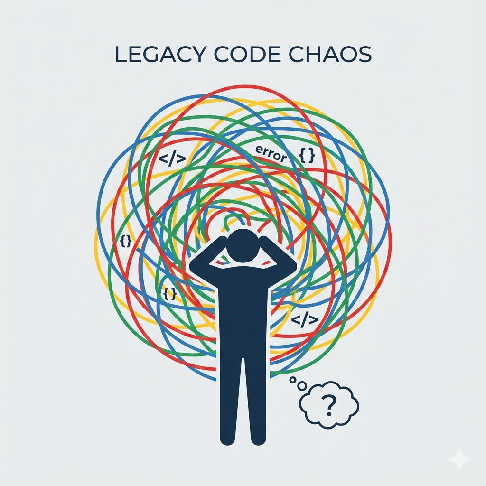
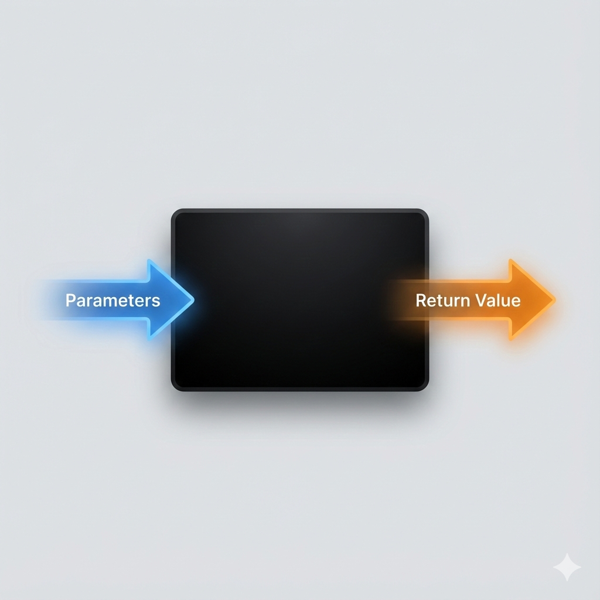

<style>
/* --- 布局辅助样式 --- */
.columns {
  display: grid;
  grid-template-columns: repeat(2, minmax(0, 1fr));
  gap: 1rem;
}
.columns pre code {
  white-space: pre-wrap !important;
  overflow-wrap: break-word !important;
}
pre, code {                                                                                          
  white-space: pre-wrap !important;                                                                  
  word-wrap: break-word !important;                                                                  
                                                                             
}     
/* --- 列表缩进样式修正 --- */
ul, ol {
  padding-inline-start: 25px; /* 减小列表的左侧缩进 */
}
.columns.ratio-4-6 { grid-template-columns: 4fr 6fr; }
.columns.ratio-6-4 { grid-template-columns: 6fr 4fr; }
.columns.ratio-3-7 { grid-template-columns: 3fr 7fr; }
.columns.ratio-7-3 { grid-template-columns: 7fr 3fr; }
.align-top    { display: flex; align-items: flex-start; }
.align-middle { display: flex; align-items: center; }
.align-bottom { display: flex; align-items: flex-end; }
.align-left   { display: flex; justify-content: flex-start; }
.align-center { display: flex; justify-content: center; }
.align-right  { display: flex; justify-content: flex-end; }
.align-top-left     { display: flex; justify-content: flex-start; align-items: flex-start; }
.align-top-center   { display: flex; justify-content: center;  align-items: flex-start; }
.align-top-right    { display: flex; justify-content: flex-end;   align-items: flex-start; }
.align-middle-left  { display: flex; justify-content: flex-start; align-items: center; }
.align-middle-center{ display: flex; justify-content: center;  align-items: center; }
.align-middle-right { display: flex; justify-content: flex-end;   align-items: center; }
.align-bottom-left  { display: flex; justify-content: flex-start; align-items: flex-end; }
.align-bottom-center{ display: flex; justify-content: center;  align-items: flex-end; }
.align-bottom-right { display: flex; justify-content: flex-end;   align-items: flex-end; }
.tip {
  background-color: #f0f8ff;
  border-left: 5px solid #1e90ff;
  padding: 15px 15px 0.1px; 
}
.insight {
  background-color: #eefcff; 
  border-left: 5px solid #17a2b8; 
  padding: 15px 15px 0.1px; 
}
.key-point {
  background-color: #fffbe6; 
  border-left: 5px solid #ffc107; 
  padding: 15px 15px 0.1px; 
}
.tip p, .tip li,
.insight p, .insight li,
.key-point p, .key-point li {
  font-size: inherit !important;
}
.styled-div p, 
.styled-div li, 
.styled-div ol, 
.styled-div ul, 
.styled-div blockquote {
  font-size: inherit !important;
}
</style>


<style scoped>
h1{
  color: #F5F5F5; /* 设置文字颜色为白色 */
  text-shadow: 2px 2px 8px rgba(0, 0, 0, 0.8); /* 添加一个柔和的深色阴影 */
}
h2 {
  color: #E0E0E0; /* 设置文字颜色为白色 */
  text-shadow: 2px 2px 8px rgba(0, 0, 0, 0.8); /* 添加一个柔和的深色阴影 */
}
.course-title {
  position: absolute;
  top: 60px;
  left: 80px;
  background-color: rgba(0, 0, 0, 0.4);
  color: #fff;
  padding: 8px 15px;
  border-radius: 5px;
  font-size: 22px;
  font-weight: bold;
  letter-spacing: 1px;
  border-left: 5px solid #4CAF50; /* 用一条强调色作为装饰 */
}
</style>

<div class="course-title">AI赋能软件开发</div>

# 模块三: 代码复用与人机协作
## 第9节课: 核心概念：函数——代码的“积木”

<div style="position: absolute; bottom: 40px; left: 80px; color: rgba(255, 255, 255, 0.8); font-size: 18px; font-family: sans-serif;">
南昌大学计算机系 黎鹰
</div>

<!--
- **类型**: 逐字稿
- **内容**: |
  （开场音乐）各位老师好，欢迎来到我们模块三的第一节课！
  在模块二，我们已经成功扮演了“游戏设计师”，搭建了一个能跑起来的武侠世界。从这节课开始，我们将迎来一次全新的角色升级。
  我们将学习如何整理我们的代码，让它变得更专业、更强大。而我们学习的第一个核心概念，就是“函数”——一种能让我们的代码像乐高积木一样，可以随意组合、重复使用的强大魔法。
  让我们开始吧！
-->

<!--
- **类型**: 教学设计
- **内容**: |
  ### 教学时间: 1分钟
  ### 开场：函数——代码的“积木”
  本页作为课程开场，核心目标是点明本节课的核心概念“函数”，并用“积木”这一核心比喻，建立学员对函数功能（封装与复用）的初步、直观印象。

  **核心要点**:
  1. **点明主题**: 清晰地揭示本节课的主角是“函数”。
  2. **建立比喻**: 引入“积木”的核心比喻，将抽象的函数概念与具体、可感的对象联系起来。
  3. **激发兴趣**: 预示着学员将要学习一种强大的代码组织工具。
-->

<!--
- **类型**: 解释
- **内容**: |
  ### 模块化与代码复用
  本节课的核心“函数”，是实现“**模块化编程 (Modular Programming)**”的基础。模块化思想旨在将一个大型、复杂的软件系统，拆分成一个个独立的、功能明确的、可交互的“模块”。这样做的好处是：
  1.  **降低复杂度**: 每个模块只关注自己的功能，使得我们可以独立地思考和解决问题，而不用一次性面对整个系统的复杂性。
  2.  **提升复用性**: 一个设计良好的模块（如一个计算特定税率的函数），可以在多个不同的项目中被重复使用，避免重复“造轮子”。
  3.  **便于协作**: 在团队开发中，不同的开发者可以分工负责不同的模块，并行开发，提高效率。

  **函数，就是我们在Python中能创建的最小、最基础的“模块”。**
-->

---

## **回顾：新的“痛点”——臃肿的主循环**

<div class="columns ratio-6-4">
<div style="font-size: 0.8em;">

在模块二的结尾，我们构建了一个可以持续运行的武侠世界，取得了巨大进展！

但是，作为一个追求卓越的“架构师”，我们发现了一个新的痛点：我们的“游戏主循环”开始变得**臃肿和混乱**了。

所有的游戏逻辑——处理`/go`、`/look`、`/take`、`/drop`——都堆积在 `while` 循环内部，形成了一个巨大的 `if-elif-else` 长链。

```python
while True:
    # ...
    if command.startswith("/go "):
        # 处理go的一大段代码
    elif command.startswith("/take "):
        # 处理take的一大段代码
    # ... 更多更多的elif
```

这就像一个**杂乱无章的巨大抽屉**，所有东西都堆在一起，找起来费劲，改起来也容易出错。

</div>
<div class="align-middle-center" style="flex-direction: column;">



<p style="margin-top: 1rem; font-size: 0.9em;">我们该如何为这个混乱的“抽屉”进行整理和归类呢？</p>

</div>
</div>

<!--
- **类型**: 逐字稿
- **内容**: |
  我们刚刚在模块二取得了巨大的成功，构建了一个能运行的世界！但作为一位追求卓越的架构师，让我们先来审视一下成功背后隐藏的新‘痛点’。
  大家还记得吗？我们的游戏主循环，那个`while True`，里面堆满了各种`if-elif-else`，它变得越来越长，越来越臃肿。
  现在我们只有四五个指令，如果未来有四五十个呢？修改一个地方都心惊胆战。
  这就像一个塞满了各种杂物的抽屉，找东西费劲，还容易把别的东西弄乱。
  这个新的痛点，就是我们本节课要解决的核心问题。我们该如何优雅地整理这个‘抽屉’呢？
-->

<!--
- **类型**: 教学设计
- **内容**: |
  ### 教学时间: 2分钟
  ### 回顾痛点：臃肿的主循环
  本页的核心目标是承上启下，通过回顾模块二结尾留下的“代码臃肿”这一痛点，并借助“杂乱的抽屉”比喻，来激发学员学习新知识（代码组织方法）的强烈动机。

  **核心要点**:
  1. **连接过去**: 从学员已有的体验（模块二的代码）出发，引出新的问题。
  2. **痛点可视化**: 用“杂乱的抽屉”比喻，让“代码混乱”这一抽象问题变得具体可感。
  3. **建立动机**: 清晰地提出“我们该如何整理？”这一问题，为引入“函数”这一解决方案做铺垫。
-->

<!--
- **类型**: 解释
- **内容**: |
  ### 代码异味与技术债
  软件工程中，我们把这种预示着深层问题的代码特征，称为“**代码异味 (Code Smell)**”。我们遇到的“臃肿的主循环”，就是一种典型的代码异味，叫做“**过长方法 (Long Method)**”。它违反了“单一职责”的原则，让一段代码承担了过多的功能。

  如果放任“代码异味”不管，项目就会积累下“**技术债 (Technical Debt)**”。就像现实中的债务一样，现在为了图快而写的“烂代码”，将来需要花费更多的时间和精力去维护和修改。我们这节课学习函数，就是一次主动的“**重构 (Refactoring)**”，一次对代码质量的投资，是在“偿还”技术债。
-->

---

## **本节课目标：学会“打包”与“复用”**

为了解决“代码臃肿”的问题，我们需要学习一种全新的、极其重要的编程思想：**封装 (Encapsulation)**。

本节课，我们将学习实现“封装”的核心工具：

### **函数 (Function)**
- **它是什么**：一个被命名的、可重复使用的“**代码包裹**”或“**功能积木**”。
- **你的新能力**：
  1. **封装逻辑**：学会将一段具体的业务逻辑（如处理`/go`指令的所有代码）“打包”成一个独立的函数。
  2. **简化流程**：通过“调用”函数，让你的主循环变得像“总指挥”一样清晰、简洁。

**最终，你将能指挥AI，将你的游戏引擎重构为一个由多个“功能积木”搭建而成的、结构清晰的系统。**

<!--
- **类型**: 逐字稿
- **内容**: |
  为了解决这个“代码臃肿”和“抽屉混乱”的问题，我们需要学习一种全新的、极其重要的编程思想，叫做“封装”。
  听起来很专业，但它的本质很简单，就是“打包”。
  今天，我们学习实现“封装”的核心工具，就是“函数”。
  你可以把它想象成一个“代码包裹”，或者一个“功能积木”。
  学完这节课，你将获得两项新能力：第一，学会把一段段具体的逻辑，“打包”成独立的函数。第二，通过“调用”这些包裹，让你原来混乱的主循环，变得像一个“总指挥”一样，只负责发号施令，清晰又简洁。
  最终，你将能指挥AI，把你的游戏，重构成一个由多个“功能积木”搭建起来的、结构清晰的系统。
-->

<!--
- **类型**: 教学设计
- **内容**: |
  ### 教学时间: 2分钟
  ### 设定目标：学会“打包”与“复用”
  本页旨在明确本节课的核心学习目标。通过引入“封装”思想和“函数”概念，并使用“代码包裹”和“功能积木”等比喻，清晰地定义学员将要掌握的“封装逻辑”和“简化流程”两项新能力。

  **核心要点**:
  1. **引入核心思想**: 正式提出“封装”这一重要的编程思想。
  2. **定义核心概念**: 将“函数”定义为实现封装的工具。
  3. **明确能力产出**: 清晰地告知学员，学完本节课后，他们将能“封装逻辑”和“简化流程”。
-->

<!--
- **类型**: 解释
- **内容**: |
  ### 抽象与封装
  - **抽象 (Abstraction)**: 编程中的“抽象”指的是忽略一个主题中与当前目标无关的复杂细节，只关注与目标相关的核心概念。例如，当我们开车时，我们只关心方向盘、油门、刹车（抽象接口），而不需要关心发动机内部的活塞运动和燃料燃烧（实现细节）。

  - **封装 (Encapsulation)**: “封装”是实现“抽象”的一种技术手段。它将数据（属性）和操作数据的方法（函数）捆绑在一起，并对外部世界隐藏其内部的实现细节。一个函数就是最基本的封装形式：调用者只需要知道函数名和参数（接口），而不需要关心函数内部是如何实现的（实现细节）。

  本节课，我们学习用函数去“封装”逻辑，本质上就是在进行一次“抽象”的实践。
-->

---

## **核心比喻：从“菜谱”到“微波炉”**

<div class="columns" style="font-size: 0.85em;">
<div>

### **没有函数之前**
我们的代码就像一本详细的“**菜谱**”。每次想“加热食物”，都必须从头到尾把所有步骤（拿出盘子、放入食物、设置时间、开始加热...）念一遍。

```python
# 第一次加热
print("拿出盘子")
print("放入剩菜")
print("设置1分钟")
print("开始加热")

# 第二次加热
print("拿出盘子")
print("放入牛奶")
print("设置30秒")
print("开始加热")
```
**问题**：重复、繁琐、容易出错。

</div>
<div style="font-size: 0.95em;">

### **有了函数之后**
函数就像一台“**微波炉**”。我们把所有加热步骤都“封装”在了微波炉内部。

现在，我们只需要“**调用**”它，并告诉它要加热的“**参数**”（食物和时间），它就能自动完成所有内部步骤。

```python
def heat_food(food, time):
    print("拿出盘子")
    print(f"放入{food}")
    print(f"设置{time}")
    print("开始加热")

# 调用函数
heat_food("剩菜", "1分钟")
heat_food("牛奶", "30秒")
```
**优势**：简洁、易用、一次定义、随处复用。

</div>
</div>

<!--
- **类型**: 逐字稿
- **内容**: |
  为了让大家更直观地理解函数，我们来看一个生活中的比喻。
  在没有函数之前，我们的代码就像一本详细的“菜谱”。比如，我想热一份剩菜，我就得把菜谱从头到尾念一遍：拿出盘子、放入剩菜、设置1分钟、开始加热。等一下我想热一杯牛奶，我又得把菜谱再念一遍：拿出盘子、放入牛奶、设置30秒、开始加热。这里面有大量的步骤是重复的，非常繁琐，而且万一哪天加热步骤变了，比如要先盖盖子，我就得修改所有地方，很容易改漏。
  而有了函数之后，它就像一台“微波炉”。我们把所有加热的步骤，一次性地“封装”在了微波炉内部。现在，我只需要“调用”这台微波炉，并告诉它两个“参数”：我要加热的“食物”是什么，以及要加热的“时间”是多久。剩菜，1分钟，叮！牛奶，30秒，叮！
  代码变得极其简洁，而且非常容易使用。我们定义一次，就可以在任何地方重复使用。这就是函数的威力！
-->

<!--
- **类型**: 教学设计
- **内容**: |
  ### 教学时间: 3分钟
  ### 核心比喻：从“菜谱”到“微波炉”
  本页通过“菜谱 vs 微波炉”这一生动、具体的比喻，让学员深刻理解函数是如何解决“代码重复”这一核心问题的。通过前后对比，直观展示函数在提升代码简洁性和复用性方面的巨大价值。

  **核心要点**:
  1. **问题具象化**: 将没有函数的重复代码比作“菜谱”，步骤繁琐。
  2. **方案具象化**: 将使用函数封装的代码比作“微波炉”，功能强大且使用简单。
  3. **引入关键概念**: 在比喻中自然地引入“调用(Call)”和“参数(Parameter)”的概念。
-->

<!--
- **类型**: 解释
- **内容**: |
  ### DRY原则
  这个比喻完美地诠释了软件开发中一个极其重要的原则：**DRY (Don't Repeat Yourself)**，即“不要重复你自己”。

  DRY原则的核心思想是，系统中的每一处知识都必须具有单一、无歧义、权威的表示。换句话说，任何一段逻辑、一个配置、一个算法，都应该只在一个地方定义。如果你发现自己在复制粘贴代码，那几乎总是违反了DRY原则的信号。

  **违反DRY的危害**:
  - **维护困难**: 如果一段逻辑被复制了10次，当需求变更时，你就必须找到并修改所有这10个地方，很容易出错或遗漏。
  - **代码臃肿**: 大量的重复代码会迅速增加代码库的体积。
  - **逻辑不一致**: 在修改多个副本时，很容易因为疏忽导致某些副本没有被更新，从而产生逻辑不一致的Bug。

  函数是实践DRY原则最基本、最强大的工具。
-->

---

## **函数的“解剖学”：定义与调用**

一个函数主要由两部分组成：**定义** 和 **调用**。

<div class="columns" style="font-size: 0.8em;">
<div>

### **1. 定义函数 (Define)**
这是在“**创造工具**”。我们使用 `def` 关键字，为一段代码赋予一个名字，并规定它需要哪些“原料”（参数）。

```python
# def 关键字，表示“我要定义一个函数”
# handle_look 是我们为这个功能起的名字
# () 里是“参数列表”，是它工作需要的“原料”
def handle_look(world, player_location):
    
    # 缩进的代码块，是这个函数的“功能主体”
    print("--- 观察四周 ---")
    print(world[player_location]['description'])
    # ... (更多处理逻辑)
```

</div>
<div>

### **2. 调用函数 (Call)**
这是在“**使用工具**”。我们通过写下函数的名字，并提供它需要的具体“原料”（参数），来执行它内部封装的所有代码。

```python
# 在主循环中
# ...
elif command == "/look":
    # 调用我们定义的函数
    # 并把当前的世界地图和玩家位置作为“原料”传给它
    handle_look(world, player_location)
```

</div>
</div>

<div class="insight">

💡 **核心思想**：**定义**只发生一次，就像你只买一台微波炉。而**调用**可以发生无数次，就像你可以随时用这台微波炉加热任何东西。
</div>

<!--
- **类型**: 样式替换
- **版本**: [handout, teacher]
- **查找**: |
    <div class="insight">
- **替换**: |
    <div class='insight' style="margin-top: 1rem;font-size: 0.6em;">
-->

<!--
- **类型**: 逐字稿
- **内容**: |
  好，我们来看一下函数的“解剖学”。一个函数主要就两个动作：定义和调用。
  首先是“定义函数”，你可以理解为这是在“创造工具”。我们用`def`这个关键字，告诉Python：“嘿，我要定义一个函数了！”然后，我们给这个功能起一个名字，比如`handle_look`，清晰地描述它的作用。在名字后面的括号里，我们定义这个函数工作时，需要从外界提供哪些“原料”，这些原料就叫“参数”。最后，所有缩进的代码块，就是这个函数具体要做的事情，我们叫它“函数体”。
  创造完工具后，我们就可以“调用函数”了，也就是“使用工具”。在主循环里，当我们需要执行观察的功能时，我们不再写一大堆逻辑，而是直接写下我们刚才定义好的函数的名字`handle_look`，并把`world`和`player_location`这两个它需要的具体“原料”传递给它。
  这个核心思想一定要记住：定义只发生一次，就像你只买一台微波炉。而调用可以发生无数次，就像你可以随时用这台微波炉加热任何东西。
-->

<!--
- **类型**: 教学设计
- **内容**: |
  ### 教学时间: 3分钟
  ### 函数解剖：定义与调用
  本页旨在清晰地拆解函数的两大核心环节。通过将“定义”比作“创造工具”，将“调用”比作“使用工具”，来帮助学员建立心智模型，并结合代码实例，讲解`def`、函数名、参数等基本语法。

  **核心要点**:
  1. **环节拆分**: 明确区分“定义(Define)”和“调用(Call)”两个核心动作。
  2. **建立心智模型**: 用“创造工具 vs 使用工具”的比喻来帮助理解。
  3. **语法讲解**: 结合代码，点出`def`关键字、函数名、参数、函数体等关键语法元素的含义。
  4. **固化思想**: 用“买一次微波炉，用无数次”的比喻，强化“一次定义，多次调用”的核心思想。
-->

<!--
- **类型**: 解释
- **内容**: |
  ### 函数签名、参数与作用域
  - **函数签名 (Function Signature)**: 通常指函数的名称和它的参数列表（参数的类型、顺序和数量）。函数签名是函数的唯一标识。在很多静态类型语言中，函数签名还包括返回值的类型。

  - **形参与实参 (Parameter vs. Argument)**:
    - **形式参数 (Parameter)**: 定义函数时，写在函数名后括号里的变量，如 `world`, `player_location`。它们是函数内部的“占位符”，规定了该函数需要接收什么样的数据。
    - **实际参数 (Argument)**: 调用函数时，传递给函数的具体值或变量。它们是填充“占位符”的真实“原料”。

  - **作用域 (Scope)**: 指的是一个变量能够被访问的区域。
    - **全局作用域 (Global Scope)**: 在程序的任何地方都能被访问的变量（如我们定义在最外层的`world`字典）。
    - **局部作用域 (Local Scope)**: 在函数内部定义的变量，只在该函数内部有效，函数执行结束后就会被销毁。函数的参数也属于局部作用域。这就像微波炉内部的转盘，只有微波炉自己知道它的存在。这种机制避免了不同函数间的变量名冲突，是封装思想的重要体现。
-->

---

## **重构第一步：将`/look`指令封装成函数**

让我们从最简单的`/look`指令开始，亲手实践一次“封装”的过程。

<div class="columns">
<div>

#### **重构前 (Before)**
主循环的`elif`分支中，堆砌着所有处理观察的逻辑。

```python
# 主循环
while True:
    # ...
    elif command == "/look":
        # 所有细节都堆在这里
        print(world[player_location]['description'])
        if 'items' in world[player_location]:
            for item in world[player_location]['items']:
                print(f"你看到了: {item}")
        # ... 更多代码
```

</div>
<div>

#### **重构后 (After)**
主循环变得非常“干净”，只负责调用函数。所有实现细节都被“藏”在了函数内部。

```python
# 1. 在主循环外部，定义函数
def show_room_details(world, player_location):
    print(world[player_location]['description'])
    if 'items' in world[player_location]:
        for item in world[player_location]['items']:
            print(f"你看到了: {item}")
    # ... 更多代码

# 2. 在主循环内部，调用函数
while True:
    # ...
    elif command == "/look":
        show_room_details(world, player_location)
```

</div>
</div>

<!--
- **类型**: 逐字稿
- **内容**: |
  理论说完了，我们来亲手实践一次。
  我们从最简单的`/look`指令开始。大家看左边，这是重构前的样子，在`while`循环的`elif`分支里，堆着所有处理观察的逻辑代码。
  现在看右边，是重构后的样子。我们分两步走：
  第一步，在主循环的外部，我们用`def`定义了一个名为`show_room_details`的函数，然后把原来`elif`里的所有逻辑代码，原封不动地“剪切”并“粘贴”到这个函数内部。
  第二步，回到主循环内部，原来那一大堆代码的位置，现在只需要一行！我们直接“调用”刚刚定义好的`show_room_details`函数。
  大家直观地感受一下，重构后的主循环是不是一下子就变得非常“干净”了？所有关于“如何显示房间细节”的逻辑，都被“藏”进了函数这个“黑箱”里。主循环只负责在适当的时候，按下“显示房间细节”这个按钮。
-->

<!--
- **类型**: 教学设计
- **内容**: |
  ### 教学时间: 2分钟
  ### 案例演示：封装`/look`指令
  本页通过一个具体的“重构”前后对比，让学员直观地看到函数封装给代码结构带来的巨大改善。核心是展示原本混乱的逻辑块如何被一行简洁的函数调用所替代。

  **核心要点**:
  1. **前后对比**: 采用“Before/After”的结构，视觉冲击力强，效果一目了然。
  2. **展示收益**: 清晰地展示了重构后的代码变得更“干净”，实现细节被“藏”起来，主干逻辑更清晰。
  3. **建立感性认识**: 让学员在亲眼所见中，体会到函数封装带来的“代码变整洁”的直观好处。
-->

<!--
- **类型**: 解释
- **内容**: |
  ### 重构 (Refactoring)
  本页我们进行的“封装”操作，是“**重构**”的一种。

  **重构**是一个严格定义的过程，指的是**在不改变代码外在行为的前提下，对其内部结构进行修改，以提高其可读性、可维护性和代码质量。**

  重构的关键在于“**不改变外在行为**”。也就是说，对于用户（或程序的其他部分）来说，重构前和重构后，程序的功能是完全一样的。`/look`指令在重构前后，打印出的内容没有任何变化。但对于开发者来说，代码的内部结构却变得更清晰、更易于管理了。

  重构是软件开发中一项至关重要的日常活动。优秀的程序员会像整理房间一样，持续不断地对代码进行小范围的重构，以防止“技术债”的累积。我们刚才做的，就是一次最基本、也最常见的重构手法：**提取函数 (Extract Method/Function)**。
-->

---

## **重构的价值：清晰的“指挥中心”**

<div style="font-size: 0.75em;">

经过函数封装的重构后，我们的游戏主循环，从一个混乱的“大车间”，变成了一个清晰的“**指挥中心**”。

```python
# 重构后的主循环
while True:
    command = input("> ")

    if command == "/quit":
        handle_quit() # 调用“处理退出”的函数
    
    elif command.startswith("/go"):
        handle_go(command, world, player_location) # 调用“处理移动”的函数

    elif command.startswith("/take"):
        handle_take(command, world, player_location) # 调用“处理拾取”的函数

    elif command == "/look":
        handle_look(world, player_location) # 调用“处理观察”的函数
        
    else:
        handle_unknown_command() # 调用“处理未知指令”的函数
```

**架构师的视角**：现在，主循环只负责“**分发任务**”，而不关心任务的“**具体实现**”。这使得代码的逻辑层次变得极为清晰，极大地提升了可读性和可维护性。

</div>

<!--
- **类型**: 逐字稿
- **内容**: |
  当我们把所有指令都用函数封装起来之后，我们的游戏主循环会变成什么样呢？
  请看！它从一个所有工人挤在一起、噪音轰鸣的“大车间”，变成了一个干净、整洁、视野开阔的“指挥中心”。
  现在，这个`while`循环的核心逻辑一目了然：接收玩家指令，然后根据指令的类型，把任务“分发”给对应的函数去处理。
  它自己不再关心“移动”到底是怎么实现的，“拾取”的具体步骤是什么。它只负责“分发任务”。
  这种逻辑上的分层，是专业软件开发的标志。从一个“架构师”的视角来看，这样的代码可读性极强，而且未来如果我想修改“移动”的逻辑，我只需要去`handle_go`函数里修改，完全不会影响到其他部分。这就是高质量代码的魅力。
-->

<!--
- **类型**: 教学设计
- **内容**: |
  ### 教学时间: 2分钟
  ### 价值升华：清晰的“指挥中心”
  本页旨在从架构层面升华函数封装的价值。通过展示一个完全重构后的理想主循环，引入“指挥中心”的比喻，让学员理解代码分层和“分离关注点”的重要思想。

  **核心要点**:
  1. **架构视角**: 将学员的视角从“实现一个功能”提升到“设计一个系统”的高度。
  2. **强化比喻**: 将主循环比作“指挥中心”，将函数调用比作“分发任务”，生动地解释了代码分层的概念。
  3. **引入专业思想**: 首次引入“分离关注点”（Separation of Concerns）这一重要的软件设计原则，提升课程的理论深度。
-->

<!--
- **类型**: 解释
- **内容**: |
  ### 分离关注点 (Separation of Concerns, SoC)
  这是软件设计中最核心、最古老的原则之一。它主张将一个复杂的系统划分为不同的部分，每个部分只处理一个**关注点**。

  一个“关注点”是指影响代码的一组信息。在我们的例子中：
  - 主循环的“关注点”是：**接收用户输入，并将指令路由或分发给正确的处理器**。
  - `handle_go`函数的“关注点”是：**处理与“移动”相关的所有逻辑**。
  - `handle_look`函数的“关注点”是：**处理与“观察”相关的所有逻辑**。

  通过函数封装，我们成功地将“指令分发”和“具体指令处理”这两个不同的“关注点”分离开来。

  **SoC的好处**:
  - **可理解性**: 每个部分都更简单，更容易被理解。
  - **可维护性**: 修改一个关注点（如修改移动逻辑），不会意外地影响到另一个关注点（如观察逻辑）。
  - **可复用性**: 单一的、功能内聚的模块更容易被复用。
-->

---

## **动手环节(1/2)：指挥AI进行“封装”**

<div style="font-size: 0.85em;">

现在，让我们指挥AI，将我们臃肿的主循环，重构为由函数驱动的清晰结构。

**你的任务：**
指导AI将处理`/look`和`/go`指令的逻辑，分别封装到独立的函数中。

> **我们的指令 (Prompt):**
>
> 请帮我重构现有的武侠游戏脚本，以提升代码的结构和可读性。具体要求如下：
> 1.  创建一个名为 `handle_look` 的函数。将主循环中处理 `/look` 指令的所有逻辑代码，都移动到这个函数内部。
> 2.  创建一个名为 `handle_go` 的函数。将主循环中处理 `/go` 指令的所有逻辑代码，都移动到这个函数内部。
> 3.  修改主循环的 `if-elif` 结构：在对应的指令判断分支下，改为“调用”你刚刚创建的相应函数。
> 4.  请仔细思考这两个函数需要哪些“外部信息”（例如`world`地图、`player_location`等）才能正常工作，并为它们设计合理的“参数”。
</div>

<!--
- **类型**: 逐字稿
- **内容**: |
  理论和价值我们都明白了，现在是时候亲自动手，指挥我们的AI助手来完成这次重构了。
  这是我们的任务：我们要指导AI，将我们脚本中处理`/look`和`/go`这两个指令的逻辑，分别封装到独立的函数里。
  大家看，我们给AI的指令，不再是“帮我实现一个功能”，而是像一个项目经理给程序员下达指令一样，非常清晰、分步、且有条理。
  我们要求它：第一，创建`handle_look`函数，并把逻辑移进去。第二，创建`handle_go`函数，也把逻辑移进去。第三，修改主循环，改为“调用”这两个函数。
  最关键的是第四点，我们要求AI“仔细思考”并“设计合理的参数”。这是在引导AI进行更高层次的思考，而不仅仅是机械地翻译代码。
  现在，请大家打开第9节课的起始代码，然后向你的AI助手，发出这个指令吧！
-->

<!--
- **类型**: 教学设计
- **内容**: |
  ### 教学时间: 5分钟
  ### 动手环节：指挥AI进行封装
  本页是第一个动手实践环节，核心是引导学员通过编写一个结构化的Prompt，指挥AI完成一次完整的代码封装重构任务，将理论知识转化为实践能力。

  **核心要点**:
  1. **任务导向**: 给予学员一个明确、具体的重构任务。
  2. **Prompt即教学**: 提供的Prompt范例本身就是一次高质量需求的教学，它将一个大任务分解为多个清晰的步骤。
  3. **聚焦“参数”**: Prompt的第4点，引导学员开始思考函数与外部世界的数据交换，为后续理解“参数”这一核心概念埋下伏笔。
-->

<!--
- **类型**: 解释
- **内容**: |
  ### Prompt的层次
  这个Prompt范例，展示了一种“**设计驱动**”的提问方式。与之前模块我们可能使用的“**愿景驱动**”的Prompt（例如：“帮我把代码变得更整洁”）相比，它的特点是：
  - **指令性强**: 使用“创建”、“移动”、“修改”等动词，明确告知AI要执行的操作。
  - **步骤清晰**: 将一个大的重构任务，分解为多个可执行的小步骤。
  - **包含设计约束**: 不仅告诉AI“做什么”，还告诉它“怎么做”（例如，要创建指定名字的函数，要思考参数）。

  这种提问方式，能让你对AI的产出有更强的控制力，使得AI生成的代码更符合你的预期。作为“AI开发主管”，你需要熟练掌握这种编写清晰、结构化需求的能力。
-->

---

<style scoped>
.styled-box {
  font-size: 0.4em;
}
</style>

## **动手环节(2/2)：审查AI的“设计”**

<div style="font-size: 0.7em;">

AI会根据你的指令，生成重构后的代码。现在，你的任务是作为“架构师”，审查它的设计。

**审查清单：**
1.  **函数定义是否正确？**
    - AI是否使用了 `def` 关键字？
    - 函数名 (`handle_look`, `handle_go`) 是否清晰？
2.  **逻辑是否被正确移动？**
    - 原本在`elif`块中的代码，是否被完整地移动到了函数内部，并保持了正确的缩进？
3.  **函数调用是否正确？**
    - 主循环中是否正确地调用了这两个函数？
4.  **参数设计是否合理？ (最关键)**
    - AI为这两个函数设计了哪些参数？
    - 你能理解为什么需要这些参数吗？（例如，`handle_go`为什么不仅需要`world`和`player_location`，还需要`command`本身？）


<div class="key-point">

  ⚠️ **核心挑战**：理解“参数”是函数最核心、也最难理解的概念。它是外部世界与函数内部世界沟通的“唯一桥梁”。大胆地向AI提问：“请解释一下，你为什么为`handle_go`函数设计了这三个参数？它们分别起什么作用？”
</div>

</div>

<!--
- **类型**: 样式替换
- **版本**: [handout, teacher]
- **查找**: |
    <div class="key-point">
- **替换**: |
    <div class='key-point' style="margin-top: 1rem;font-size: 0.6em;">
-->

<!--
- **类型**: 逐字稿
- **内容**: |
  AI很快就会给你返回重构后的代码。现在，我们的角色要立刻切换，从“指令下达者”切换为“架构师”或“代码审查者”。
  我们不能满足于代码能跑，而是要主动去审查AI的设计。这里有一份审查清单，大家可以对照着检查：
  函数定义对不对？逻辑是不是都移进去了？主循环里的调用写对了吗？
  最重要的，是第四点：参数设计是否合理？
  这是本节课最核心，也最难理解的概念。参数，是函数这个“黑箱”与外部世界沟通的唯一桥梁。函数内部需要的所有信息，都必须通过参数传进去。
  大家可以看看AI为`handle_go`函数设计了哪些参数，并思考一下，为什么需要这些参数？
  如果想不明白，不要自己瞎猜，这正是我们利用AI学习的绝佳机会！大胆地向AI追问，比如：“请解释一下，你为什么为`handle_go`函数设计了这三个参数？它们分别起什么作用？”

  这里我给大家一个思考的线索：`/go`这个动作，与`/look`或`/inventory`这些指令不同，它自身的信息是不完整的。我们不仅需要知道玩家要“走”，还需要知道他“往哪里走”。这个“方向”信息，就藏在原始的`command`输入中。函数需要通过某种方式获取到它。

  当然，一个优秀的设计可能会更进一步。AI不一定会直接传递整个`command`字符串，它也可能在主循环里就把方向解析出来，然后只传递一个语义更明确的`direction`参数给函数。这也是你们在审查代码时可以留意的，看看你们的AI选择了哪种方案，并思考不同方案的优劣。
-->

<!--
- **类型**: 教学设计
- **内容**: |
  ### 教学时间: 4分钟
  ### 动手环节：审查AI的设计并理解“参数”
  本页的核心是引导学员审查AI生成的代码，并聚焦于理解“参数”这一最核心、最难的概念。通过提供“审查清单”和提问模板，培养学员的代码阅读能力和利用AI进行深度学习的能力。

  **核心要点**:
  1. **角色转换**: 让学员扮演“架构师”的角色，从被动接受代码转变为主动审查代码。
  2. **结构化审查**: 提供“审查清单”，将模糊的“审查”任务分解为具体的检查点，降低认知负荷。
  3. **聚焦难点**: 明确指出“参数”是本节课的难点和核心，并提供向AI提问的范例，示范如何利用AI作为学习工具来攻克难点。
-->

<!--
- **类型**: 解释
- **内容**: |
  ### 值传递 vs. 引用传递
  关于参数传递，编程语言主要有两种方式：
  - **值传递 (Pass by Value)**: 函数接收的是实参的一个“副本”。在函数内部修改参数，**不会**影响到函数外部的原始变量。这就像你把一份文档复印给了同事，他在复印件上修改，不会影响你的原件。
  - **引用传递 (Pass by Reference)**: 函数接收的是实参的“内存地址”，即变量的“引用”。在函数内部修改参数，**会**影响到函数外部的原始变量。这就像你把一个在线文档的链接分享给了同事，他通过链接直接修改了云端的同一份文档。

  Python的参数传递机制比较特殊，官方称之为“**按对象引用传递 (Pass by Object Reference)**”。可以简化理解为：
  - 对于**不可变类型**（如数字、字符串、元组），其行为类似于“值传递”。
  - 对于**可变类型**（如列表、字典），其行为类似于“引用传递”。

  在我们的例子中，`world`（字典）和`inventory`（列表）都是可变类型。因此，当我们将它们作为参数传递给函数时，函数内部对它们的修改（如`items.remove()`）会直接影响到原始的`world`和`inventory`。理解这一点，对于编写正确的Python代码至关重要。
-->

---

## **函数的“返回值”：从函数内部“递出”结果**

<div style="font-size: 0.75em;">


我们的函数现在像一个“黑箱”，能接收外部的“原料”（参数），然后在内部处理。

但如果函数内部产生了新的结果（例如，玩家移动后，`player_location`更新了），它该如何将这个新结果“**递回**”给外部世界呢？

答案是：**`return` 语句**。
</div>

<div class="columns">
<div>

```python
# handle_go 函数内部
def handle_go(command, world, current_loc):
    # ... (一堆处理逻辑)
    
    if direction_is_valid:
        new_loc = ... # 计算出新的地点
        print("你移动到了...")
        return new_loc # 将新地点作为“结果”返回
    else:
        print("无法移动...")
        return current_loc # 移动失败，将旧地点原样返回

# 主循环中
while True:
    # ...
    elif command.startswith("/go"):
        # “接收”函数返回的结果，并用它更新主循环中的状态
        player_location = handle_go(...)
```

</div>
<div class="align-middle-center">



</div>
</div>

<!--
- **类型**: 逐字稿
- **内容**: |
  我们已经学会了如何通过“参数”把信息“递给”函数。但反过来，如果函数内部产生了新的结果，比如玩家移动后，他的位置`player_location`更新了，函数该如何把这个新结果“递回”给外部的主循环呢？
  答案就是`return`语句，也就是“返回值”。
  我们来看`handle_go`函数的例子。在函数内部，当移动成功时，我们不再去直接修改外部的变量，而是用`return`，把计算出的新地点`new_loc`作为结果“返回”。如果移动失败，我们就把旧的地点`current_loc`原样返回。
  相应地，在主循环中，当我们调用`handle_go`函数时，我们需要用一个变量（这里还是叫`player_location`）去“接收”它返回的结果。
  这样，`player_location = handle_go(...)`就完成了一次完整的数据交换：主循环通过参数把旧位置传给函数，函数经过计算，再通过返回值把新位置传回给主循环，由主循环来完成最终的更新。这个“传入-处理-传出”的流程非常重要。
-->

<!--
- **类型**: 教学设计
- **内容**: |
  ### 教学时间: 3分钟
  ### 核心概念：函数的“返回值”
  本页旨在引入函数的第二个核心概念——返回值`return`。通过“黑箱”和“递回结果”的比喻，清晰地展示“传入参数 -> 处理 -> 传出结果 -> 外部接收”的完整数据流。

  **核心要点**:
  1. **提出问题**: 从“函数如何将内部结果递回给外部”这一问题出发，自然地引出`return`的必要性。
  2. **可视化数据流**: “黑箱”图非常直观地展示了参数（输入）和返回值（输出）在函数边界内外的数据流动。
  3. **闭环展示**: 代码示例清晰地展示了函数内部`return new_loc`和外部`player_location = handle_go(...)`的“传出-接收”完整闭环。
-->

<!--
- **类型**: 解释
- **内容**: |
  ### 函数的输入与输出
  至此，我们学习了函数与外部世界交互的两种通道：
  - **输入**: 通过**参数 (Parameters/Arguments)** 接收数据。
  - **输出**: 通过**返回值 (Return Value)** 传递结果。

  一个设计良好的函数，应该像一个纯粹的“数据处理器”。它接收输入，进行处理，然后返回输出，而不应该偷偷地去修改函数外部的状态（这被称为“副作用”）。

  在Python中：
  - 函数可以没有参数。
  - 函数可以没有`return`语句。如果一个函数执行完毕时没有遇到`return`，它会自动返回一个特殊的值`None`。
  - `return`语句一旦被执行，函数会立刻终止，并返回指定的值。
  - 函数可以返回任何类型的数据，包括数字、字符串、列表、字典，甚至另一个函数。
-->

---

## **迭代指令：用`return`重构`handle_go`**

现在，让我们用更专业的“返回值”方式，来重构我们的`handle_go`函数。

> **我们的迭代指令 (Prompt):**
>
> 请再次重构我的`handle_go`函数，让它的职责更纯粹。
> 1.  在`handle_go`函数中，当移动成功时，不要直接修改全局的`player_location`变量。相反，函数应该使用`return`语句，返回计算出的`new_location`。
> 2.  如果移动失败，函数应该`return`旧的、未发生改变的`player_location`。
> 3.  修改主循环中调用`handle_go`函数的代码：它现在需要“接收”`handle_go`函数的返回值，并用这个返回值来更新主循环中的`player_location`变量。

**思考：** 为什么要这么做？这种修改，让`handle_go`函数的“职责”发生了什么变化？

<!--
- **类型**: 逐字稿
- **内容**: |
  好，理解了返回值的概念后，我们再来向AI下达一次“迭代指令”。
  所谓“迭代”，就是我们不推倒重来，而是在现有代码的基础上，提出新的、更精细的需求，让AI帮我们一步步优化。
  这次我们的指令非常明确，就是要用`return`返回值的方式，来重构`handle_go`函数，让它的职责更纯粹。
  我们告诉AI：第一，移动成功时，不要在函数里面偷偷修改变量了，而是用`return`把新位置返回出来。第二，移动失败时，也要用`return`把旧位置原样返回。第三，主循环里调用函数的地方，要去“接收”这个返回值，并用它来更新自己的状态。
  这个Prompt本身，就是一份非常专业的需求文档。请大家把它发给AI。

  （稍作停顿，等待AI生成代码）

  拿到AI返回的新代码后，请先别急着运行。我们先作为“架构师”来审查它。请大家仔细看看，AI是否正确地：1. 在函数内部使用了 `return` 来返回新旧位置？2. 在主循环中，用 `player_location` 变量接收了函数的返回值？

  在大家审查代码的同时，请重点思考幻灯片下面的那个问题：我们为什么要这么做？这种修改，让 `handle_go` 函数的“职责”发生了什么本质上的变化？带着这个思考，我们将在下一页一起揭晓答案。
-->

<!--
- **类型**: 教学设计
- **内容**: |
  ### 教学时间: 4分钟
  ### 动手环节：使用`return`迭代重构
  本页是第二个动手实践环节，目标是引导学员通过编写迭代指令，亲手实践如何使用`return`语句来重构函数，使其职责更纯粹。

  **核心要点**:
  1. **迭代式开发**: 教学员通过追加需求的方式，对现有代码进行优化，体验“迭代开发”的过程。
  2. **Prompt即算法**: 提供的Prompt范例通过分步指令，实际上是在用自然语言描述一个算法，潜移默化地培养学员的算法思维。
  3. **埋下伏笔**: 最后的“思考题”引导学员思考重构带来的“职责”变化，为下一页升华到“单一职责原则”做铺垫。
-->

<!--
- **类型**: 解释
- **内容**: |
  ### 全局变量 vs. 局部变量
  - **全局变量 (Global Variable)**: 在程序顶层（任何函数之外）定义的变量。理论上，它可以在程序的任何地方被读取和修改。我们之前的`player_location`就是一个全局变量。
  - **局部变量 (Local Variable)**: 在函数内部定义的变量（包括参数）。它只在函数内部有效。

  **为什么应尽量避免在函数内部修改全局变量？**
  1.  **降低可读性**: 如果一个函数悄悄地修改了外部的全局变量（这种行为被称为“**副作用 (Side Effect)**”），代码的逻辑会变得非常隐晦和难以追踪。你必须阅读函数的每一行代码，才能知道它对外部世界造成了什么影响。
  2.  **增加耦合度**: 函数与它所修改的全局变量产生了紧密的“**耦合**”。这使得函数无法被独立地测试和复用。你不能把它拿到另一个没有定义那个全局变量的项目中使用。
  3.  **易于出错**: 在大型项目中，多个函数可能会在不经意间修改同一个全局变量，导致难以预料的、灾难性的Bug。

  通过使用“参数”传入数据，并通过“返回值”传出结果，可以最大限度地减少函数对全局变量的依赖，使其成为一个独立的、可预测的“纯函数”。
-->

---

<style scoped>
.styled-box {
  font-size: 0.4em;
}
</style>

## **架构师的思考：单一职责原则**

<div class="columns ratio-6-4">
<div style="font-size: 0.75em;">

刚才的重构，体现了软件设计中一条极其重要的原则：**单一职责原则 (Single Responsibility Principle)**。

#### **重构前**
`handle_go` 函数做了**两件**事：
1.  计算新位置。
2.  修改外部世界的状态（直接修改了`player_location`）。

#### **重构后**
`handle_go` 函数现在只做**一件**事：
1.  根据输入，计算并返回一个结果。

它变成了一个“**纯函数**”，一个纯粹的“计算工具”。它不再关心外部世界的状态，也不再有“副作用”。

这种“高内聚、低耦合”的设计，使得函数更容易被理解、测试和复用。这是衡量代码质量的核心标准。

</div>
<div class="align-middle-center">


</div>
</div>

<!--
- **类型**: 样式替换
- **版本**: [handout, teacher]
- **查找**: |
    <div style="font-size: 0.75em;">
- **替换**: |
    <div class="styled-div" style="font-size: 0.5em;">
-->

<!--
- **类型**: 逐字稿
- **内容**: |
  刚才的“思考题”，答案就在这里。我们刚才的重构，其实是在遵循一条极其重要的软件设计原则——单一职责原则。
  大家看，重构前，`handle_go`函数实际上做了两件事：第一，它负责计算新位置；第二，它还负责修改外部世界的状态，也就是直接修改了`player_location`这个变量。它就像一把瑞士军刀，功能很多，但职责很混乱。
  重构后，`handle_go`函数现在只做一件事：根据你给它的输入，进行计算，然后返回一个结果。它变成了一个纯粹的“计算工具”，就像一把扳手，功能单一，但职责清晰。它不再关心外部世界是什么样的，也不再偷偷修改外部的东西，我们称之为没有“副作用”。
  这种“高内聚、低耦合”的设计，是衡量代码质量的核心标准，也是我们作为“架构师”所追求的目标。
-->

<!--
- **类型**: 教学设计
- **内容**: |
  ### 教学时间: 2分钟
  ### 理论升华：单一职责原则
  本页旨在将`return`的实践升华到软件设计的理论高度。通过引入“单一职责原则”和“纯函数”的概念，并借助“瑞士军刀 vs 扳手”的比喻，让学员理解代码质量的核心标准。

  **核心要点**:
  1. **理论联系实践**: 将刚才的重构实践与经典的“单一职责原则”联系起来，让学员知其然并知其所以然。
  2. **引入高级概念**: 引入“纯函数”、“副作用”、“高内聚、低耦合”等专业术语（点到为止），拓展学员的知识边界。
  3. **生动比喻**: “瑞士军刀 vs 扳手”的比喻，让“功能混杂”与“功能单一”的优劣对比一目了然。
-->

<!--
- **类型**: 解释
- **内容**: |
  ### 软件设计原则
  - **单一职责原则 (Single Responsibility Principle, SRP)**: 一个模块（如一个函数或一个类）应该只对一类用户或一个功能负责。通俗地说，它应该只有一个“引起变化的原因”。在我们的例子中，`handle_go`函数现在只因“计算移动逻辑”的改变而改变，而不再因“外部状态管理方式”的改变而改变。

  - **纯函数 (Pure Function)**: 一个函数如果满足以下两个条件，就被认为是纯函数：
    1.  **相同的输入永远产生相同的输出**。
    2.  **没有可观察到的副作用**（不修改外部变量、不进行I/O操作如打印等）。
    我们重构后的`handle_go`（如果我们忽略其中的`print`语句）就非常接近一个纯函数。纯函数具有极强的可预测性、可测试性和可组合性，是函数式编程范式的核心。

  - **高内聚，低耦合 (High Cohesion, Low Coupling)**: 这是衡量软件设计质量的通用标准。
    - **高内聚**: 指一个模块内部的各个元素（代码、数据）彼此紧密相关，共同完成一个单一的功能。我们的新`handle_go`函数内聚性很高。
    - **低耦合**: 指模块与模块之间的依赖关系很弱。通过使用参数和返回值，我们大大降低了`handle_go`函数与主循环之间的耦合度。
-->

---

## **本节总结：我们获得了什么？**

<div class="columns ratio-6-4">
<div style="font-size: 0.82em;">

在本节课，我们掌握了整理代码、提升架构的终极武器——**函数**。

- **一个核心思想：封装**
  - 我们学会了将混乱的逻辑“打包”成独立的、可复用的“功能积木”。

- **两种核心操作：定义与调用**
  - 掌握了 `def` (创造工具) 和 `call` (使用工具) 的基本模式。

- **一种架构能力：重构**
  - 你第一次作为“架构师”，通过函数封装，将一个混乱的程序**重构**成了一个结构清晰、职责分明的系统。你的代码质量和你的思维层次，都得到了质的飞跃。

</div>
<div class="align-middle-center">


</div>
</div>

<!--
- **类型**: 逐字稿
- **内容**: |
  好了，我们来总结一下本节课的收获。
  今天，我们掌握了整理代码、提升架构的终极武器——函数。
  我们理解了一个核心思想：封装，也就是把代码“打包”成“功能积木”。
  我们掌握了两种核心操作：用`def`来“定义”或“创造”工具，以及通过函数名来“调用”或“使用”工具。
  最重要的是，我们获得了一种架构师的核心能力：重构。你第一次作为“架构师”，亲手把一个混乱的程序，重构成了一个结构清晰、职责分明的系统。
  可以说，通过这节课，你的代码质量和你的思维层次，都实现了一次质的飞跃。恭喜大家！
-->

<!--
- **类型**: 教学设计
- **内容**: |
  ### 教学时间: 1分钟
  ### 总结：盘点本节课收获
  本页旨在通过结构化的清单和可视化的“宝箱”，为学员系统性地总结本节课在思维、工具和能力上的核心收获，强化其获得感。

  **核心要点**:
  1. **结构化总结**: 从“思想”、“操作”、“能力”三个维度进行总结，层次清晰。
  2. **关键词强化**: 再次强调“封装”、“重构”、“架构师”等本节课的核心关键词。
  3. **正向反馈**: 使用“宝箱”图片和积极的措辞，给予学员强烈的正向激励和满足感。
-->

<!--
- **类型**: 解释
- **内容**: |
  ### 知识体系复盘
  本节课，你学习了“**函数式分解 (Functional Decomposition)**”这一核心编程范式。这意味着你开始学习将一个大的问题，分解为一个个更小的、可以被函数解决的子问题。

  你接触到的软件工程概念包括：
  - **思想**: 封装 (Encapsulation), 抽象 (Abstraction), 分离关注点 (SoC), 单一职责原则 (SRP)。
  - **原则**: DRY (Don't Repeat Yourself)。
  - **实践**: 重构 (Refactoring), 提取函数 (Extract Function)。
  - **术语**: 代码异味 (Code Smell), 技术债 (Technical Debt), 副作用 (Side Effect), 纯函数 (Pure Function), 高内聚低耦合。

  虽然你不需要立刻记住所有这些术语，但理解它们背后的思想，将为你成为一名优秀的AI赋能开发者奠定坚实的理论基础。
-->

---

## **下一步预告：当“积木”出错了怎么办？**

<div class="columns ratio-6-4">
<div style="font-size: 0.9em;">

我们已经学会了如何创造和使用“功能积木”。

但是，如果我们的积木本身就有问题呢？如果AI给我们的函数，在某些情况下会“崩溃”怎么办？

- 当程序因为一个错误而意外终止时，我们该如何看懂那些天书般的“**错误信息**”？
- 我们该如何向AI准确地描述问题，并**引导它自我修复**，而不是我们自己去修改代码？

下一节课，我们将学习一项至关重要的人机协作技能：**与AI结对调试 (Pair Debugging)**，让你从“代码的使用者”，真正升级为AI的“**项目经理**”。

</div>
<div class="align-middle-center">


</div>
</div>

<!--
- **类型**: 逐字稿
- **内容**: |
  在我们为自己的进步感到高兴的同时，一个新的、更现实的问题又出现了。
  我们学会了创造和使用“功能积木”，但如果这个积木本身就是坏的呢？如果AI给我们的函数，在某些特殊情况下会“崩溃”怎么办？
  当程序崩溃时，屏幕上会冒出一堆像天书一样的“错误信息”，我们该如何看懂它？更重要的是，我们该如何向AI准确地描述这个问题，并引导它自己去修复，而不是我们自己手忙脚乱地去改代码？
  这就是我们下一节课要学习的核心技能：与AI结对调试。我们将再次迎来角色升级，从“架构师”升级为AI的“项目经理”。请大家保持期待，我们下节课见！
-->

<!--
- **类型**: 教学设计
- **内容**: |
  ### 教学时间: 1分钟
  ### 承前启后：预告“与AI结对调试”
  本页作为课程结尾，核心是承上启下。通过提出“如果积木出错了怎么办？”这一新的痛点，自然地引出下一节课“调试”的主题，并预告新的角色升级（项目经理），激发学员的学习期待。

  **核心要点**:
  1. **制造新痛点**: 提出一个学员在实践中必然会遇到的现实问题——“代码出错”，从而创造学习新知识的内在需求。
  2. **引出新主题**: 清晰地预告下一节课的主题是“与AI结对调试”。
  3. **建立新期待**: 预告学员将要解锁“项目经理”这一新角色，维持课程的趣味性和学员的进阶动机。
-->

<!--
- **类型**: 解释
- **内容**: |
  ### 软件开发生命周期：测试与调试
  一个完整的软件开发过程，不仅仅是“写代码”。一个简化的生命周期包括：
  1.  **需求分析**: 我们想做什么？
  2.  **设计**: 我们该怎么做？（我们画的蓝图、对函数的规划都属于设计）
  3.  **实现 (Implementation)**: 编写代码。
  4.  **测试 (Testing)**: 验证代码是否按预期工作。
  5.  **调试 (Debugging)**: 当测试发现问题时，定位并修复错误的过程。
  6.  **维护 (Maintenance)**: 在软件发布后，持续修复问题和增加新功能。

  我们下一节课要学习的“调试”，是软件质量保障环节中不可或缺的一环。学会调试，意味着你开始具备独立完成一个小型软件开发全周期的能力。
-->