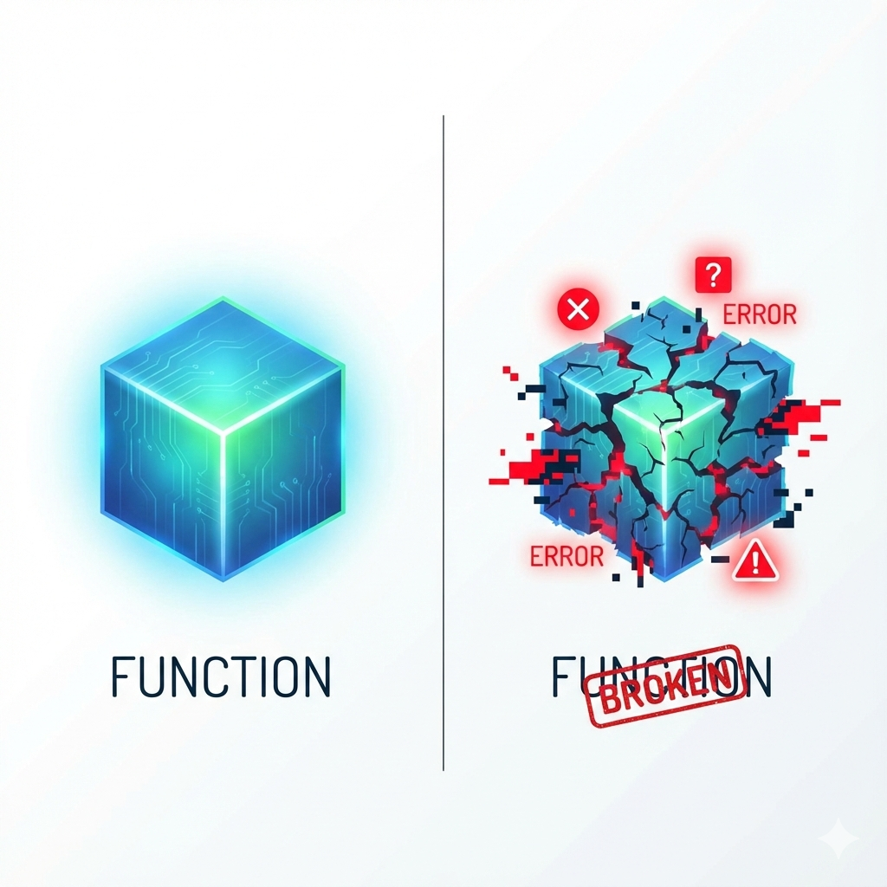
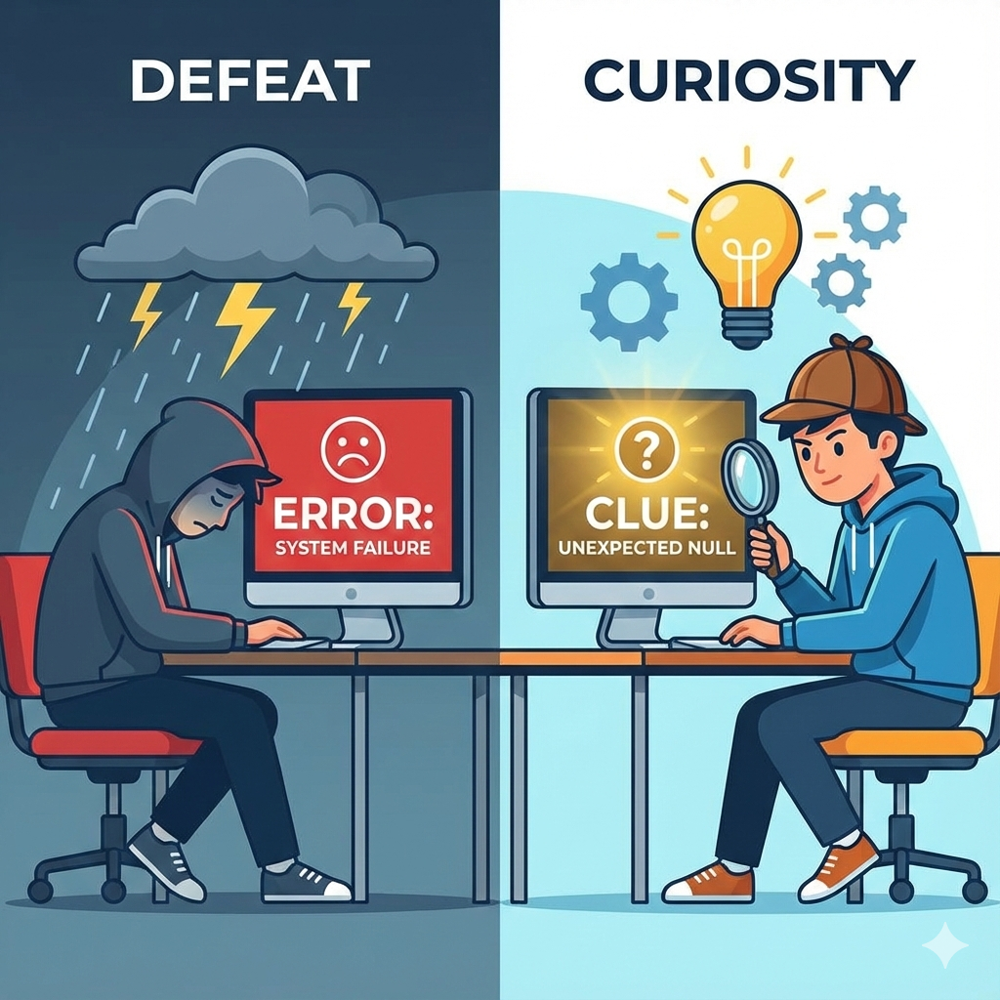
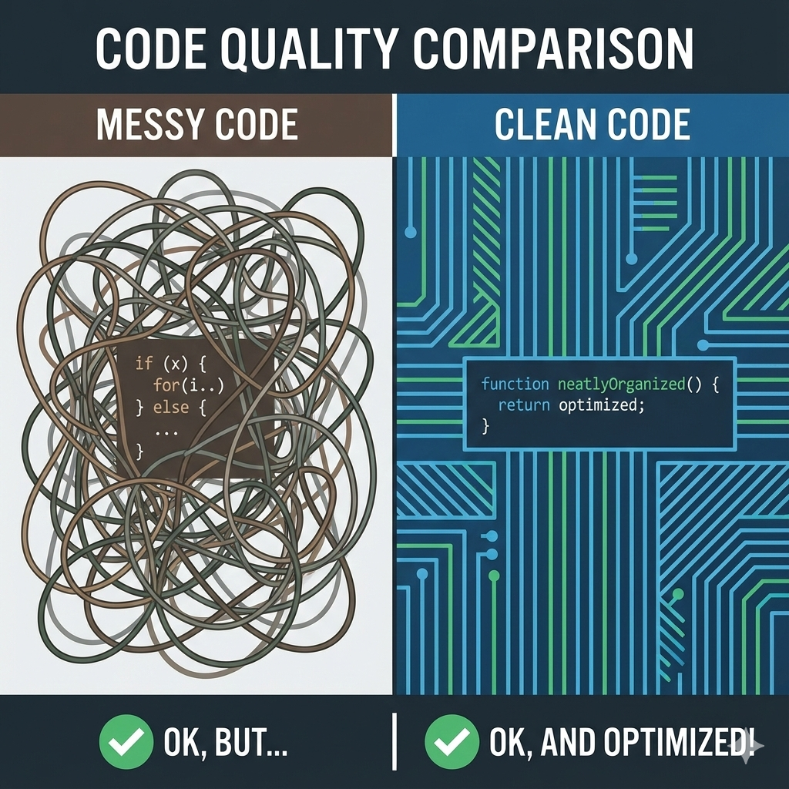

<style>
/* --- 布局辅助样式 --- */
.columns {
  display: grid;
  grid-template-columns: repeat(2, minmax(0, 1fr));
  gap: 1rem;
}
.columns pre code {
  white-space: pre-wrap !important;
  overflow-wrap: break-word !important;
}
/* --- 列表缩进样式修正 --- */
ul, ol {
  padding-inline-start: 25px; /* 减小列表的左侧缩进 */
}
.columns.ratio-4-6 { grid-template-columns: 4fr 6fr; }
.columns.ratio-6-4 { grid-template-columns: 6fr 4fr; }
.columns.ratio-3-7 { grid-template-columns: 3fr 7fr; }
.columns.ratio-7-3 { grid-template-columns: 7fr 3fr; }
.align-top    { display: flex; align-items: flex-start; }
.align-middle { display: flex; align-items: center; }
.align-bottom { display: flex; align-items: flex-end; }
.align-left   { display: flex; justify-content: flex-start; }
.align-center { display: flex; justify-content: center; }
.align-right  { display: flex; justify-content: flex-end; }
.align-top-left     { display: flex; justify-content: flex-start; align-items: flex-start; }
.align-top-center   { display: flex; justify-content: center;  align-items: flex-start; }
.align-top-right    { display: flex; justify-content: flex-end;   align-items: flex-start; }
.align-middle-left  { display: flex; justify-content: flex-start; align-items: center; }
.align-middle-center{ display: flex; justify-content: center;  align-items: center; }
.align-middle-right { display: flex; justify-content: flex-end;   align-items: center; }
.align-bottom-left  { display: flex; justify-content: flex-start; align-items: flex-end; }
.align-bottom-center{ display: flex; justify-content: center;  align-items: flex-end; }
.align-bottom-right { display: flex; justify-content: flex-end;   align-items: flex-end; }
.tip {
  background-color: #f0f8ff;
  border-left: 5px solid #1e90ff;
  padding: 15px 15px 0.1px; 
}
.insight {
  background-color: #eefcff; 
  border-left: 5px solid #17a2b8; 
  padding: 15px 15px 0.1px; 
}
.key-point {
  background-color: #fffbe6; 
  border-left: 5px solid #ffc107; 
  padding: 15px 15px 0.1px; 
}
.tip p, .tip li,
.insight p, .insight li,
.key-point p, .key-point li {
  font-size: inherit !important;
}
.styled-div p, 
.styled-div li, 
.styled-div ol, 
.styled-div ul, 
.styled-div blockquote {
  font-size: inherit !important;
}
</style>


<style scoped>
h1{
  color: #F5F5F5; /* 设置文字颜色为白色 */
  text-shadow: 2px 2px 8px rgba(0, 0, 0, 0.8); /* 添加一个柔和的深色阴影 */
}
h2 {
  color: #E0E0E0; /* 设置文字颜色为白色 */
  text-shadow: 2px 2px 8px rgba(0, 0, 0, 0.8); /* 添加一个柔和的深色阴影 */
}
.course-title {
  position: absolute;
  top: 60px;
  left: 80px;
  background-color: rgba(0, 0, 0, 0.4);
  color: #fff;
  padding: 8px 15px;
  border-radius: 5px;
  font-size: 22px;
  font-weight: bold;
  letter-spacing: 1px;
  border-left: 5px solid #4CAF50; /* 用一条强调色作为装饰 */
}
</style>

<div class="course-title">AI赋能软件开发</div>

# 模块三: 代码复用与人机协作
## 第10节课: 与AI结对调试——成为AI的“项目经理”

<div style="position: absolute; bottom: 40px; left: 80px; color: rgba(255, 255, 255, 0.8); font-size: 18px; font-family: sans-serif;">
南昌大学计算机系 黎鹰
</div>

<!--
- **类型**: 逐字稿
- **内容**: |
  各位老师好！欢迎来到我们模块三的第二节课。
  在上一节课，我们学会了如何扮演“架构师”，用函数将代码封装成积木。今天，我们将再次迎来角色升级，学习一项在AI时代至关重要的人机协作技能——与AI结对调试。
  我们将学习如何看懂程序出错时的“天书”，并从容地指挥AI去修复问题，从而真正成为AI开发团队的“项目经理”。
-->

<!--
- **类型**: 教学设计
- **内容**: |
  ### 教学时间: 1分钟
  ### 开场：成为AI的“项目经理”
  本页作为课程开场，核心目标是点明本节课的核心技能——调试(Debugging)，并通过引入“项目经理”这一新的角色定位，将一个看似枯燥的技术活动包装成一次有趣的能力升级，从而激发学员的学习兴趣。

  **核心要点**:
  1. **点明主题**: 清晰地揭示本节课的主题是“与AI结对调试”。
  2. **角色升级**: 引入“项目经理”的新角色，让学员对即将学习的技能有更高的价值认同。
  3. **建立期待**: 预示着学员将从“使用者”升级为“管理者”，激发其学习动机。
-->

<!--
- **类型**: 解释
- **内容**: |
  ### 调试在软件开发中的位置
  **调试 (Debugging)** 是识别、定位和修复软件中错误（即“Bug”）的过程。它是软件开发生命周期（Software Development Life Cycle, SDLC）中不可或缺的一环。

  一个典型的编程流程是“编码 -> 测试 -> 调试”的循环。程序员编写代码实现功能，测试人员（或程序员自己）验证功能是否符合预期。一旦发现不符合预期的行为（Bug），调试就开始了。

  在AI辅助开发的时代，这个流程并未改变，只是每个环节的角色发生了变化。AI可以极大地加速“编码”和“调试”环节，但“测试”（发现问题）和“定义问题”（向AI准确描述问题）的责任，更多地落在了人类开发者身上。本节课学习的，正是如何高效地与AI协同完成“调试”这个关键环节。
-->

---

## **回顾：当“积木”本身就是坏的**

<div class="columns ratio-6-4">
<div style="font-size: 0.9em;">

在上一节课，我们学会了用“函数”来封装代码，将程序重构得清晰、优雅。

我们学会了创造和使用“功能积木”。

但是，一个严峻的问题摆在我们面前：

**如果AI给我们的“积木”（函数），本身就是坏的、有缺陷的，该怎么办？**

当程序因为一个未知的错误（我们称之为“**Bug**”）而崩溃时，屏幕上会打印出一堆天书般的“**错误信息**”。

我们该如何面对它？是恐惧，放弃，还是将它看作一次解谜的挑战？

</div>
<div class="align-middle-center">



</div>
</div>

<!--
- **类型**: 逐字稿
- **内容**: |
  让我们回顾一下上节课留下的那个悬念。
  我们已经学会了如何创造和使用“功能积木”，也就是函数。
  但是，一个非常严峻、也非常现实的问题摆在我们面前：如果AI给我们的，或者我们自己写的这个“积木”，它本身就是坏的、有缺陷的，该怎么办？
  在编程的世界里，这种缺陷我们称之为“Bug”。当Bug发生时，程序往往会崩溃，并且在屏幕上打印出一堆像天书一样的“错误信息”。
  我相信，这是所有编程初学者最恐惧的时刻。面对这些看不懂的红色文字，我们该怎么办？是感到挫败和恐惧，甚至放弃？还是，我们可以把它看作一次有趣的解谜挑战？
  这节课，我们就来学习如何征服它。
-->

<!--
- **类型**: 教学设计
- **内容**: |
  ### 教学时间: 2分钟
  ### 回顾痛点：当“积木”本身就是坏的
  本页的核心目标是承上启下，通过重现上一节课结尾留下的“积木出错”这一痛点，来正式引入“Bug”和“错误信息”这两个核心概念，并为后续的“心态转变”教学环节做好心理铺垫。

  **核心要点**:
  1. **连接过去**: 紧接上一课的结尾，让课程内容衔接更紧密。
  2. **引入概念**: 正式定义“Bug”和“错误信息”，让学员对要解决的问题有清晰的认知。
  3. **引导思考**: 通过设问“是恐惧，放弃，还是挑战？”，引导学员初步思考如何面对错误，为下一页的“心态转变”做准备。
-->

<!--
- **类型**: 解释
- **内容**: |
  ### Bug, Error, Failure
  在软件工程中，这三个词有细微但重要的区别：
  - **错误 (Error)**: 指的是程序员在编码过程中犯下的一个具体错误。例如，在字典中写错了一个键名，或者在计算时用错了公式。这是导致问题的“**因**”。
  - **缺陷 (Defect / Bug)**: 指的是由于“错误”而存在于软件内部的、潜在的、未被发现的问题。它就像一个埋在代码里的“地雷”。
  - **失效 (Failure)**: 指的是当程序运行时，这个“缺陷”被触发，导致程序产生了不符合预期的行为（例如程序崩溃、计算结果错误等）。这是用户能观察到的“**果**”。

  我们的任务，就是根据“失效”的现象（如程序崩溃），去反向追踪，定位并修复那个最初的“错误”。这个过程，就是调试。
-->

---

## **本节课目标：成为AI的“项目经理”**

本节课，我们将学习一项在AI时代至关重要的“元技能”：**调试 (Debugging)**。

但我们不是要成为传统的“调试工程师”，而是要升级为AI的“**项目经理**”或“**品控主管**”。

### **你的新能力：**
1.  **阅读“事故报告”**
    - 学会从Python的错误信息（Traceback）中，像侦探一样提取出“**哪里出错了**”和“**为什么出错**”的关键线索。
2.  **指导“AI程序员”修复**
    - 学会如何将错误信息转化为清晰的指令，**引导AI定位并修复它自己写的Bug**。

**最终，你将不再畏惧任何错误信息，而是能从容地指挥AI解决问题。**

<!--
- **类型**: 逐字稿
- **内容**: |
  所以，我们这节课的目标，就是学习一项在AI时代至关重要的“元技能”——调试。
  但请注意，我们的目标不是让大家成为传统的、需要逐行检查代码的“调试工程师”。我们的目标是再次升级，成为AI的“项目经理”或“品控主管”。
  你将获得两项核心能力：
  第一，学会阅读程序的“事故报告”。也就是那些错误信息。我们将学习如何像一个侦探一样，从里面提取出“哪里出错了”和“为什么出错”的关键线索。
  第二，也是最重要的，学会指导你的“AI程序员”去修复问题。我们将学习如何把错误信息，翻译成清晰的指令，引导AI自己去定位和修复它写的Bug。
  最终，你将不再畏惧任何错误，而是能从容地指挥AI解决任何问题。
-->

<!--
- **类型**: 教学设计
- **内容**: |
  ### 教学时间: 2分钟
  ### 设定目标：成为AI的“项目经理”
  本页旨在明确本节课的核心学习目标与新的角色定位。通过将“调试”这一技术活动，包装成“项目管理”和“品控”的高阶能力，清晰地定义学员将获得的“阅读事故报告”和“指导AI修复”这两项核心能力，从而提升学员的学习价值感。

  **核心要点**:
  1. **能力升级**: 将“调试”重新定义为一项“元技能”，强调其重要性。
  2. **角色重塑**: 提出“项目经理”或“品控主管”的新角色，让学员的自我认同从“执行者”转向“管理者”。
  3. **明确产出**: 将学习目标分解为“阅读报告”和“指导修复”两个具体、可操作的能力点。
-->

<!--
- **类型**: 解释
- **内容**: |
  ### 根本原因分析 (Root Cause Analysis)
  调试的核心，不仅仅是“修复Bug”，更是进行“**根本原因分析 (RCA)**”。

  一个Bug的表象（失效）和其根本原因（错误）可能相距甚远。例如：
  - **表象 (Symptom)**: 程序在运行时，因为`KeyError`而崩溃。
  - **直接原因 (Direct Cause)**: 试图访问一个不存在的字典键。
  - **根本原因 (Root Cause)**: 可能是数据输入时就错了，也可能是之前的逻辑计算错了，还可能是两个模块的接口定义不一致。

  一个优秀的开发者或项目经理，不会满足于仅仅修复直接原因（例如，用一个`if`语句简单地跳过错误），而是会刨根问底，找到并修复根本原因，以防止同类问题再次发生。我们向AI提问时，也应该引导它进行更深层次的根本原因分析。
-->

---

## **心态转变：错误不是“失败”，而是“线索”**

<div class="columns ratio-6-4">
<div style="font-size: 0.9em;">

在面对程序错误时，人类的本能反应是：
- “我做错了什么？”
- “我把一切都搞砸了！”
- “我不适合学编程...”

**这是成为优秀开发者的最大心理障碍。**

我们需要一次彻底的**心态转变**：
> 程序错误，不是对你个人能力的“**评判**”，而是程序写给你的一封“**求助信**”。它在用自己唯一的方式，笨拙地告诉你：“我在某某地方遇到了麻烦，请帮帮我！”

**错误信息，不是“失败”的标志，而是通往解决方案的“线索”。**

</div>
<div class="align-middle-center">



</div>
</div>

<!--
- **类型**: 逐字稿
- **内容**: |
  在学习具体技术之前，我们必须先完成一次最重要的、也是最困难的转变——心态的转变。
  当看到程序报错时，我们很多人的本能反应是负面的：“天啊，我做错了什么？”“我把一切都搞砸了！”“我是不是不适合学编程？”……这种自我怀疑和挫败感，是成为优秀开发者的最大心理障碍。
  从今天起，我希望大家能进行一次彻底的心态转变。你要告诉自己：程序报错，不是在“评判”我，不是在说我有多笨。它是在向我“求助”！程序在用它唯一会的、一种很笨拙的方式，告诉我：“主人，我在某个地方遇到了麻烦，我不知道该怎么办了，请帮帮我！”
  所以，从现在开始，请把错误信息，看作是程序寄给你的“求助信”，是通往解决方案的、唯一的、宝贵的“线索”！
-->

<!--
- **类型**: 教学设计
- **内容**: |
  ### 教学时间: 2分钟
  ### 心态转变：错误不是“失败”，而是“线索”
  本页是进行调试教学前最重要的一步心理建设。核心目标是通过强烈的“心态对比”和生动的“比喻”，帮助学员克服对错误的本能恐惧和挫败感，建立积极、健康的调试心态。

  **核心要点**:
  1. **共情与破除**: 首先描述学员可能有的负面“本能反应”，引发共鸣，然后明确指出这是“最大心理障碍”，必须破除。
  2. **重塑认知**: 将错误信息比作“求助信”和“线索”，将负面的“失败”感，转变为积极的“解谜”感。
  3. **价值判断**: 明确指出“错误信息是通往解决方案的唯一线索”，提升其在学员心中的价值。
-->

<!--
- **类型**: 解释
- **内容**: |
  ### 成长型心态与编程
  本页倡导的，是心理学家卡罗尔·德韦克提出的“**成长型心态 (Growth Mindset)**”。
  - **固定型心态 (Fixed Mindset)**: 认为人的智力、能力是固定不变的。遇到错误时，会认为“我不擅长这个”，并倾向于放弃。
  - **成长型心态 (Growth Mindset)**: 认为人的能力可以通过努力和学习来提升。遇到错误时，会将其视为一次学习和成长的机会。

  编程，特别是调试，是锻炼“成长型心态”的最佳实践之一。因为在编程世界里，犯错是常态，从错误中学习是进步的唯一途径。每一次成功调试，都是一次“我的能力得到了提升”的直接反馈，能极大地强化成长型心态。将调试看作解谜游戏，而非对个人能力的审判，是保持学习热情和韧性的关键。
-->

---

## **案发现场：Python的“事故报告” (Traceback)**

当程序崩溃时，Python会打印一份详细的“事故报告”，我们称之为 **Traceback**。它看起来很吓人，但其实充满了破案的关键线索。

<div style="font-size: 0.7em; background-color: #1e1e1e; color: #d4d4d4; padding: 15px; border-radius: 5px; border: 1px solid #333;">
<pre><code>Traceback (most recent call last):
  File "C:/Users/Hawk/game.py", line 52, in &lt;module&gt;
    player_location = handle_go(command, world, player_location)
  File "C:/Users/Hawk/game.py", line 28, in handle_go
    new_location_data = world[new_location_id]
KeyError: 'market'</code></pre>
</div>

这就像一份**法医报告**，虽然专业，但只要掌握了阅读方法，就能快速定位“案发过程”和“致命伤”。

<!--
- **类型**: 样式替换
- **版本**: [handout, teacher]
- **查找**: |
    <div style="font-size: 0.7em;
- **替换**: |
    <div style="font-size: 0.6em;
-->

<!--
- **类型**: 逐字稿
- **内容**: |
  心态调整好了，我们现在就直面这个“案发现场”。
  当Python程序崩溃时，它打印出来的这份详细的“事故报告”，有一个专业名称，叫做“Traceback”，翻译过来就是“回溯”或“追溯”。
  我知道，它看起来很吓人，一堆英文，还有行号。但请相信我，它其实充满了破案的关键线索。
  你可以把它想象成一份“法医报告”。虽然里面有很多专业术语，但只要我们掌握了阅读方法，就能从里面快速定位“案发过程”和“致命伤”。
-->

<!--
- **类型**: 教学设计
- **内容**: |
  ### 教学时间: 2分钟
  ### 案发现场：Python的“事故报告” (Traceback)
  本页旨在正式引入Traceback，让学员对错误信息有一个初步的、具象的认识。核心是通过比喻和视觉呈现，降低学员对这堆“天书”的天然畏惧感。

  **核心要点**:
  1. **正式引入**: 给出错误信息的专有名称“Traceback”。
  2. **比喻祛魅**: 将Traceback比作“事故报告”或“法医报告”，延续“侦探解谜”的课程叙事，使其显得不那么可怕。
  3. **直面恐惧**: 直接展示一个真实的、看起来很吓人的Traceback截图，让学员直面它，然后立刻告诉他们“这可以被读懂”，帮助他们建立掌控感。
-->

<!--
- **类型**: 解释
- **内容**: |
  ### 调用栈 (Call Stack)
  要理解Traceback，首先要理解“**调用栈**”的概念。

  程序在调用函数时，会像堆盘子一样，把函数调用信息一层层地往上堆。例如，主模块调用了`handle_go`函数，这个“调用栈”看起来就是：
  ```
  | handle_go |  <-- 栈顶 (当前正在执行)
  |-----------|
  |   主模块   |  <-- 栈底
  +-----------+
  ```
  当`handle_go`函数内部发生崩溃时，Python会把整个“调用栈”的情况，**按照代码的执行顺序（从最初的调用开始）**，原封不动地打印出来，形成我们看到的Traceback。

  这份报告的**打印顺序**是“**从栈底到栈顶**”的：
  - Traceback的**最上方**，是程序执行的**起点**（栈底）。
  - Traceback的**最下方**，是导致崩溃的**终点**（栈顶）。

  因此，我们推荐的**阅读方法**正好相反，采用“**从下往上**”的侦探式读法，因为最关键的线索（“致命伤”和“案发现场”）都在报告的最底部。

  Traceback的最后一行，即`KeyError: 'market'`，就是导致程序崩溃的那个异常（Exception）。
-->

---

## **如何阅读“事故报告”：三步破案法**

面对一长串的Traceback，不要慌张。我们只需要像侦探一样，关注三个核心线索：

<div class="columns">
<div>

<div style="font-size: 0.7em; background-color: #1e1e1e; color: #d4d4d4; padding: 15px; border-radius: 5px; border: 1px solid #333;">
<pre><code>Traceback (most recent call last):
  File "C:/Users/Hawk/game.py", line 52, in &lt;module&gt;
    player_location = handle_go(command, world, player_location)
  File "C:/Users/Hawk/game.py", line 28, in handle_go
    <span style="background-color: rgba(255, 255, 0, 0.2);">new_location_data = world[new_location_id]</span>
<span style="background-color: rgba(255, 0, 0, 0.3);">KeyError: 'market'</span></code></pre>
</div>

1.  **看最后一行：确定“死因” (What)**
    - `KeyError: 'market'`
    - **解读**：最致命的伤口是`KeyError`，说明我们试图用一个不存在的“钥匙” (`'market'`)去查阅一个字典。

</div>
<div style="font-size: 0.85em;">

2.  **向上看一行：定位“案发现场” (Where)**
    - `File "game.py", line 28, in handle_go`
    - `new_location_data = world[new_location_id]`
    - **解读**：事故直接发生在`game.py`文件的第28行，位于`handle_go`函数内部。

3.  **再向上看：追溯“调用链” (How)**
    - `File "game.py", line 52, in <module>`
    - `player_location = handle_go(...)`
    - **解读**：程序是从第52行调用`handle_go`函数时，才引发了这起“命案”的。

</div>
</div>

<!--
- **类型**: 样式替换
- **版本**: [handout, teacher]
- **查找**: |
    <div class="columns">
- **替换**: |
    <div class="columns styled-div" style="font-size: 0.7em;">
-->

<!--
- **类型**: 逐字稿
- **内容**: |
  那么，这份“法医报告”到底该怎么读呢？非常简单，我们只需要用“三步破案法”。
  第一步，**看最后一行**。这是最关键的，它告诉我们最终的“死因”是什么。这里是`KeyError: 'market'`。`KeyError`的意思是“钥匙错误”，说明我们想用一个叫`'market'`的钥匙，去查阅一个字典，但那个字典里没有这个钥匙。
  第二步，**向上看一行**。这里定位了精准的“案发现场”。它告诉我们，事故发生在`game.py`文件的第28行，位于`handle_go`函数内部，出问题的就是这行代码`new_location_data = world[new_location_id]`。
  第三步，**再向上看**。这里是追溯整个“调用链”，告诉我们这起“命案”是如何一步步发生的。报告显示，程序是从主程序的第52行，调用了`handle_go`函数，然后才在函数内部出了问题。
  通过这三步，What, Where, How，整个案件的来龙去脉就一清二楚了。
-->

<!--
- **类型**: 教学设计
- **内容**: |
  ### 教学时间: 3分钟
  ### 如何阅读“事故报告”：三步破案法
  本页是本节课最核心的技能教学点，旨在教授学员一套阅读和理解Traceback的标准化方法。通过“三步破案法”，将看似无序的错误信息结构化，使其变得可读、可解。

  **核心要点**:
  1. **方法论**: 提出简单、易记的“三步破案法”（看最后、向上看、再向上看），并分别对应“What, Where, How”三个关键问题。
  2. **可视化教学**: 在真实的Traceback截图上，通过高亮不同区域，直观地展示三个步骤分别对应哪些信息。
  3. **翻译解读**: 对每个步骤提取出的信息，都用通俗易懂的“大白话”进行解读，帮助学员跨越专业术语的障碍。
-->

<!--
- **类型**: 解释
- **内容**: |
  ### 常见Python异常类型
  Traceback的最后一行被称为“**异常 (Exception)**”。学会识别常见的异常类型，能帮助你更快地定位问题。
  - **`KeyError`**: 试图访问字典中不存在的键。
  - **`IndexError`**: 试图访问列表中不存在的索引（例如，列表长度为3，你却试图访问第5个元素）。
  - **`NameError`**: 使用了一个未被定义的变量名。
  - **`TypeError`**: 对一个变量执行了它不支持的操作（例如，尝试将一个数字和一个字符串相加）。
  - **`ValueError`**: 传递给函数的参数类型正确，但值不合适（例如，`int('abc')`）。
  - **`AttributeError`**: 试图访问一个对象不存在的属性或方法（例如，一个列表变量没有`.keys()`方法）。
  - **`FileNotFoundError`**: 试图打开一个不存在的文件。

  当你遇到不认识的异常类型时，直接将它复制粘贴问AI，是最高效的学习方法。
-->

---

## **人机协作新模式：AI侦探工作流**

<div class="columns ratio-6-4">
<div style="font-size: 0.85em;">

我们不需要自己成为“福尔摩斯”。我们只需要扮演好“**报案人**”和“**总指挥**”的角色。

面对任何错误，都严格遵守以下“**AI侦探工作流**”：

1.  **保护现场，收集证据**
    - **完整地**复制从`Traceback`开始到最后一行错误信息的所有内容。不要遗漏，也不要自己解读。

2.  **向“AI侦探”报案**
    - 将完整的错误信息，**原封不动地**粘贴给你的AI助手。

3.  **清晰下达指令**
    - 使用我们为你准备的“报案模板”，清晰地提出你的诉求。

</div>
<div class="align-middle-center">


</div>
</div>

<!--
- **类型**: 逐字稿
- **内容**: |
  好，现在我们已经能读懂“法医报告”了。但记住，我们的角色是“项目经理”，不是“福尔摩斯”。我们不需要自己去破案。
  我们要做的，是建立一套高效的、与我们的“AI侦探”协作的工作流程。
  这个工作流非常简单，只有三步，但必须严格遵守：
  第一步，保护现场，收集证据。也就是把终端里从`Traceback`开始到最后一行错误的所有内容，**完整地**复制下来。不要自己解读，不要只复制最后一行，要全部复制。
  第二步，向“AI侦探”报案。把刚才复制的完整信息，**原封不动地**粘贴给你的AI助手。
  第三步，清晰下达指令。使用我们接下来要讲的“报案模板”，告诉AI你需要它做什么。
  记住这个流程，你就能调动AI的全部能力来为你服务。
-->

<!--
- **类型**: 教学设计
- **内容**: |
  ### 教学时间: 2分钟
  ### 人机协作：AI侦探工作流
  本页旨在建立一套与AI协作解决Bug的标准化流程。核心是让学员明白，他们不需要自己成为“侦探”，而是要学会如何高效地“报案”，将专业的工作交给AI。

  **核心要点**:
  1. **流程标准化**: 提出“AI侦探工作流”这一概念，并将其分解为“收集证据、报案、下达指令”三个简单、可执行的步骤。
  2. **强调纪律**: 明确要求“完整地”复制和“原封不动地”粘贴错误信息，将其作为一项必须遵守的纪律，这是确保AI获得足够上下文的关键。
  3. **角色定位**: 再次强化“报案人”和“总指挥”的角色，让学员明确自己在流程中的位置和职责。
-->

<!--
- **类型**: 解释
- **内容**: |
  ### 上下文的重要性
  为什么“完整地”和“原封不动地”复制Traceback如此重要？因为Traceback为AI提供了解决问题所需的**完整上下文**。

  - **`KeyError: 'market'`** 告诉AI问题是“键错误”。
  - **`new_location_data = world[new_location_id]`** 告诉AI这个键错误发生在哪段代码。
  - **`handle_go`** 告诉AI这段代码属于哪个函数。
  - **`player_location = handle_go(...)`** 告诉AI这个函数是在哪里被调用的。

  缺少任何一环，AI都可能无法准确地定位问题。例如，如果你只告诉AI“我遇到了一个KeyError”，它可能会给出一个非常笼统的、与你游戏逻辑无关的回答。只有提供了完整的Traceback，AI才能像一个真正的“侦探”一样，掌握全部线索，从而给出精准的分析和解决方案。
-->

---

## **“报案模板”：如何向AI高效求助**
<div style="font-size: 0.82em;">

向AI求助时，提供**上下文**和**清晰的问题**至关重要。你可以套用以下模板：

> **报案模板 (Prompt Template):**
>
> 你好，我的Python程序崩溃了。
>
> **这是我的目标：**
> （简单描述你本来想做什么，例如：“我正在写一个文本游戏，想实现玩家从A点移动到B点的功能。”）
>
> **这是完整的错误信息：**
> ```
> (在此处粘贴你复制的完整Traceback)
> ```
>
> **请帮我分析：**
> 1.  这个错误`KeyError: 'market'`在我的游戏场景里，具体代表什么意思？
> 2.  根据错误信息，问题的根源最可能出在哪段代码？
> 3.  请给我一个修复这个问题的具体代码建议。
</div>

<!--
- **类型**: 逐字稿
- **内容**: |
  这是我们“AI侦探工作流”的第三步，也是最能体现你“项目经理”能力的一步：如何清晰地下达指令。
  一个好的指令，也就是一个好的Prompt，应该包含三个部分。我们已经为大家准备好了一个万能的“报案模板”。
  第一部分，“这是我的目标”。用一两句话告诉AI，你本来想做什么。这为AI提供了业务层面的上下文。
  第二部分，“这是完整的错误信息”。把你刚才复制的Traceback原封不动地粘贴在这里。这是技术层面的核心证据。(如果你已经粘贴了错误信息，可以改成“前面是完整的错误信息”)
  第三部分，“请帮我分析”。向AI提出具体、结构化的问题。不要只问“怎么办？”，而是引导它思考：这个错误在我的场景里是什么意思？根源可能在哪里？请给我具体的修复建议。
  这个模板，能引导AI给出高质量、结构化的回答，而不是泛泛而谈。
-->

<!--
- **类型**: 教学设计
- **内容**: |
  ### 教学时间: 2分钟
  ### “报案模板”：如何向AI高效求助
  本页旨在为学员提供一个高质量、可复用的调试Prompt模板。核心是教会学员，一个好的求助Prompt应该包含哪些要素，从而极大地提升AI回答的准确性和有效性。

  **核心要点**:
  1. **提供模板**: 给予一个结构清晰、可直接套用的“报案模板”，降低学员的提问门槛。
  2. **结构化输入**: 模板包含“目标（上下文）”、“错误信息（证据）”、“分析请求（诉求）”三部分，这本身就是对高质量Prompt构成要素的一次教学。
  3. **引导式提问**: 模板中的“分析请求”部分，被分解为三个具体问题（什么意思、哪里出错、如何修复），这会引导AI提供结构更清晰、内容更丰富的回答。
-->

<!--
- **类型**: 解释
- **内容**: |
  ### 专业的Bug报告
  这个“报案模板”实际上是一个简化版的、专业的“**Bug报告**”。在真实的软件开发团队中，测试人员或用户提交的Bug报告通常包含以下要素：
  - **标题 (Title)**: 简明扼要地描述问题。
  - **复现步骤 (Steps to Reproduce)**: 清晰地描述如何一步步地触发这个Bug。我们的“目标”描述和代码上下文起到了类似的作用。
  - **预期行为 (Expected Behavior)**: 描述在这些步骤下，程序本应该如何表现。
  - **实际行为 (Actual Behavior)**: 描述程序实际上是如何表现的（例如，程序崩溃，并附上完整的错误信息）。
  - **环境 (Environment)**: 描述问题发生时的环境（如操作系统、软件版本等）。

  学会编写包含清晰上下文、预期和实际结果的Prompt，不仅能让你更高效地与AI协作，也能让你在未来与人类同事协作时，成为一个更受欢迎的、更专业的团队成员。
-->

---

## **动手环节(1/3)：布置“案发现场”**
<div style="font-size: 0.88em;">

现在，让我们亲手制造一起“悬案”，并指挥我们的“AI侦探”来侦破它。

### **第一步：布置“案发现场” (制造Bug)**
1.  打开我们上一节课的游戏脚本。
2.  在`world`字典中，找到一个地点的`exits`出口定义。
3.  **故意**将其中一个出口的目的地，改成一个**不存在**的地点ID。
    ```python
    'guangchang': {
        'description': '这里是扬州广场...',
        # 将'chaguan'改成一个不存在的'market'
        'exits': {'east': 'market'}, 
        'items': [...]
    },
    # (我们的world里并没有'market'这个地点)
    ```
<div class="tip">

💡 **目的**：主动、可控地犯一次错，可以彻底消除对“不小心犯错”的恐惧。我们是在为“AI侦探”准备一个练手的靶子。
</div>
</div>

<!--
- **类型**: 样式替换
- **版本**: [handout, teacher]
- **查找**: |
    <div class="tip">
- **替换**: |
    <div class="tip" style="font-size: 0.6em;">
-->

<!--
- **类型**: 逐字稿
- **内容**: |
  好了，理论和工具我们都掌握了。现在，进入动手实践环节！
  我们将亲手制造一起“悬案”，然后指挥我们的“AI侦探”来侦破它。
  第一步，布置“案发现场”。请大家打开上一节课我们重构好的游戏脚本，或者我们为大家准备的这节课起始版本。找到`world`字典里，‘guangchang’（扬州广场）的出口定义。我们故意把其中一个出口，比如东边的出口，从一个存在的地方，改成一个不存在的地点ID，比如`'market'`（市场）。我们的游戏世界里，并没有定义`market`这个地点。
  大家可能会问，为什么要故意犯错？因为主动、可控地犯一次错，可以彻底消除我们对“不小心犯错”的恐惧。我们不是在搞破坏，我们是在为我们的“AI侦探”，精心准备一个练手的靶子。
-->

<!--
- **类型**: 教学设计
- **内容**: |
  ### 教学时间: 2分钟
  ### 动手环节(1/3)：布置“案发现场”
  本页的核心是引导学员亲手、故意地制造一个Bug。这种“主动犯错”的体验，旨在帮助学员克服对程序错误的天然恐惧感，并为接下来的“侦破”环节准备好清晰的“案发现场”和关键证据（Bug）。

  **核心要点**:
  1. **主动犯错**: 让学员“故意”制造一个错误，将消极的“犯错”行为，转变为一次积极、可控的“实验”。
  2. **清晰指引**: 提供非常清晰、简单的“制造Bug”的步骤，确保所有学员都能成功复现“案发现场”。
-->

<!--
- **类型**: 解释
- **内容**: |
  ### 调试的“消防演习”
  我们“故意”制造一个Bug，这个行为在教学和训练中具有深刻的意义。我们可以把它理解为一次调试的“**消防演习 (Fire Drill)**”。

  进行消防演习的目的，不是因为真的发生了火灾，而是在一个安全、可控的环境下，预演和练习标准的应急处理流程（例如，如何找到并跑到安全出口）。这样，当真正的火灾发生时，我们才不会惊慌失措。

  同理，我们在这里故意制造一个可预期的、简单的Bug，就是为了进行一次“调试演习”。通过这次演习，我们熟悉了“警报”（Traceback）响起时的标准应对流程（观察信息、复制信息、向AI求助）。

  当未来我们真的在自己的项目中遇到意料之外的“火情”（真正的Bug）时，我们就能凭借这次演练的经验，从容不迫地应对，而不是手足无措。
-->

---

## **动手环节(2/3)：触发“案件”并报案**

“案发现场”已经布置完毕，现在我们来触发它，并正式向“AI侦探”报案。

### **第二步：触发“案件”**
1.  运行你的游戏脚本。
2.  输入指令，尝试从“扬州广场”向东走 (`/go east`)。
3.  **观察**：程序崩溃，并打印出一长串`Traceback`信息。这是破案的关键证据！

### **第三步：向“AI侦探”报案**
1.  **完整地**复制终端里所有的`Traceback`错误信息。
2.  启动AI助手。
3.  套用我们刚才学习的“**报案模板**”，将你的目标和完整的错误信息粘贴进去，然后发送。

<!--
- **类型**: 逐字稿
- **内容**: |
  “案发现场”已经布置好了。现在，我们来触发它。
  请大家运行你的游戏脚本。然后，输入指令`/go east`，尝试从扬州广场往东走，去那个我们刚刚捏造出来的、不存在的`market`。
  你会观察到，程序“砰”的一声崩溃了，并且在终端里打印出了一长串红色的Traceback信息。这就是我们期待的、最关键的破案证据！
  接下来，就进入我们的“AI侦探工作流”的报案环节。
  第一，完整地复制所有错误信息。第二，打开你的AI助手。第三，套用我们刚才的“报案模板”，把你的目标（比如“我想让玩家能正常移动”）、以及完整的错误信息，都粘贴进去，然后发送给AI。
  现在，就看我们的AI侦探如何表演了。
-->

<!--
- **类型**: 教学设计
- **内容**: |
  ### 教学时间: 3分钟
  ### 动手环节(2/3)：触发“案件”并报案
  本页旨在引导学员完整地实践“AI侦探工作流”的前半部分：获取错误信息，并使用标准模板向AI求助。这是将理论流程转化为核心实践能力的关键一步。

  **核心要点**:
  1. **获取证据**: 引导学员通过实际操作，获得一份真实、完整的Traceback“事故报告”。
  2. **流程演练**: 让学员亲手实践“复制错误 -> 套用模板 -> 发送求助”的标准化报案流程。
  3. **强化纪律**: 再次强调“完整地”复制错误信息的重要性。
-->

<!--
- **类型**: 解释
- **内容**: |
  ### 复现Bug的重要性
  我们刚才做的“触发案件”的步骤，在专业术语中叫做“**复现Bug (Reproduce a Bug)**”。

  能够稳定地复现一个Bug，是成功修复它的前提。如果一个Bug只是偶尔出现，无法找到必现的触发路径，那么定位和修复它将变得极其困难。

  一个好的Bug报告，其核心价值就在于提供了一套清晰、可靠的“复现步骤”。它能让接手这个问题的开发者（无论是人类还是AI）在自己的环境中，百分之百地重现问题发生时的场景，从而为分析和调试提供了坚实的基础。
-->

---

## **动手环节(3/3)：“结案”并思考**
<div style="font-size: 0.95em;">

AI侦探已经提交了它的分析报告，现在轮到我们扮演“品控主管”的角色，来审查并做出决策。

### **第四步：审查“AI侦探”的报告**
1.  **阅读AI的解释**：它是否清晰地告诉你`KeyError`意味着你尝试访问一个不存在的字典键？它是否指出了问题在于`'market'`这个ID在`world`字典里找不到？
2.  **审查AI的解决方案**：AI可能会提出几种修复方案：
    - **方案A (修正数据)**：建议你将`'market'`改回一个存在的地点，或者在`world`里新增一个`'market'`地点。
    - **方案B (增加防御性代码)**：建议在尝试访问`world[new_location_id]`之前，先用`if new_location_id in world:`来检查一下该地点是否存在。
3.  **采纳并验证**：选择你认为更合适的方案，指挥AI（或自己动手）修改代码，然后重新运行，确认Bug已被修复。这个过程，我们称之为“**结案**”。

**思考：** 方案A和方案B，哪一种更好？为什么？
</div>

<!--
- **类型**: 逐字稿
- **内容**: |
  好了，AI侦探已经给出了它的分析报告。现在，我们进入最后一步：审查报告，并“结案”。
  请大家仔细阅读AI的解释。它有没有像我们刚才分析的那样，告诉你`KeyError`是什么意思？有没有指出问题的根源在于`'market'`这个地点不存在？
  然后，重点看它给出的解决方案。它很可能会给出两种方案。方案A是“修正数据”，也就是让你去改`world`字典，把错误的数据改对。方案B是“增加防御性代码”，也就是在移动之前，先检查一下目标地点存不存在，如果不存在就不移动。
  现在，请大家作为“品控主管”，思考一下，这两种方案，你觉得哪一种更好？为什么？
  选择你认为更合适的方案，让AI帮你修改代码。然后，重新运行程序，再次尝试`/go east`，确认程序不会再崩溃了。这个确认修复的过程，我们就称之为“结案”。
-->

<!--
- **类型**: 教学设计
- **内容**: |
  ### 教学时间: 4分钟
  ### 动手环节(3/3)：审查报告并“结案”
  本页是动手环节的收尾，核心是引导学员学会批判性地阅读AI的分析，并在多种解决方案中做出选择，最终验证修复，完成从“发现问题”到“解决问题”的完整闭环。

  **核心要点**:
  1. **培养批判性思维**: 引导学员审查AI报告，并思考不同解决方案（修正数据 vs. 防御性代码）的优劣，培养其决策能力。
  2. **完成闭环**: 强调“采纳并验证”是必不可少的最后一步，让学员获得“成功破案”的成就感。
  3. **引导深度思考**: 最后的“思考题”引导学员进行方案的权衡，这是一个更高层次的工程思维训练。
-->

<!--
- **类型**: 解释
- **内容**: |
  ### 防御性编程 (Defensive Programming)
  AI给出的方案B，体现了一种重要的编程思想——“**防御性编程**”。

  它的核心思想是：**不信任任何来自外部的数据**。函数的编写者应该假定所有传入的参数都可能是无效的、错误的，并编写代码来处理这些异常情况，以保证程序在任何情况下都不会崩溃。

  - **方案A (修正数据)**: 治标不治本。它只修复了当前这一个数据错误。如果未来因为其他原因，又出现了一个指向不存在地点的出口，程序依然会崩溃。
  - **方案B (增加防御性代码)**: 从根本上解决了问题。它为`handle_go`函数增加了一层“装甲”，使得无论数据如何错误，该函数本身都足够健壮（Robust），不会再因为同样的原因而崩溃。

  在大多数情况下，**增加防御性代码（方案B）是比仅仅修正当前数据（方案A）更优秀、更专业的解决方案**。它提升了代码的“**健壮性 (Robustness)**”。
-->

---

## **你的新角色：AI的“项目经理”**

<div class="columns ratio-6-4">
<div style="font-size: 0.78em;">

祝贺你！通过刚才的“破案”过程，你已经完成了又一次重要的**角色升级**。

你不再是那个面对错误手足无措的“学徒”，而是升级成为了AI开发团队的“**项目经理 (Project Manager)**”或“**品控主管 (QA Lead)**”。

**你的核心价值在于：**
- **发现并报告问题**：在程序运行中发现不符合预期的行为（Bug）。
- **定义问题**：将模糊的“程序出错了”，转化为包含清晰上下文和错误信息的“**Bug报告**”。
- **验证修复**：在AI“程序员”提交修复后，负责测试和验证问题是否已真正解决。

你负责**把控质量、管理流程**，而AI负责**具体执行**。

</div>
<div class="align-middle-center">


</div>
</div>


<!--
- **类型**: 样式替换
- **版本**: [handout, teacher]
- **查找**: |
    <div style="font-size: 0.7em;
- **替换**: |
    <div style="font-size: 0.6em;
-->

<!--
- **类型**: 逐字稿
- **内容**: |
  祝贺大家！通过刚才完整的“报案-破案-结案”过程，你们已经完成了又一次重要的角色升级。

  你可能已经注意到，在这几节课里，我们不断地在切换角色：从设计功能的“架构师”，到寻找线索的“侦探”，现在又成为了“项目经理”。
  但这并非混乱，这恰恰是AI时代开发的核心！在传统公司里，这些是不同的岗位，但在AI赋能的新模式下，我们一个人就能扮演所有角色。
  今天，你通过定义问题、委派任务、验证修复，就在扮演这个团队中最高级的“项目经理”角色。我们的核心价值，不是深入细节修修补补，而是管理整个流程、把控最终质量。
  在这个新的人机协作模式中，你负责出思想、定方向，而AI，则负责具体的执行。
-->

<!--
- **类型**: 教学设计
- **内容**: |
  ### 教学时间: 2分钟
  ### 角色升级：AI的“项目经理”
  本页的核心目标是**点明并升华“一人分饰多角”的理念**，将之前课程中不断切换的角色统一为AI时代开发者的核心能力，并最终将学员的身份固化在最高阶的“项目经理”上。

  **核心要点**:
  1. **统一困惑**: 主动点出学员在角色切换中的困惑，并将其重新定义为一种高级能力，完成“Aha!”时刻的塑造。
  2. **职责定义**: 清晰地定义了“项目经理”作为最高阶角色的三项核心价值：发现问题、定义问题、验证修复。
  3. **强化新范式**: 再次强调“你负责规划，AI负责执行”的人机协作新范式，巩固学员的管理者身份认同。
-->

<!--
- **类型**: 解释
- **内容**: |
  ### AI时代的全能开发者：一人身兼多职
  你可能已经注意到，在这门课程中，我们不断地为你赋予新的角色：从最初的“魔法师”，到后来的“架构师”，再到本节课的“项目经理”和“品控主管”。你可能会感到困惑：我到底是谁？

  这正是本课程希望传达的核心思想。在传统的大型软件开发团队中，项目经理（PM）、架构师、程序员、测试工程师（QA）等角色的确是由不同的人承担的。

  但是，**AI赋能的软件开发，催生了一种全新的、更高效的“一人团队”模式**。特别是对于我们教学和科研中所需的不那么复杂的软件项目，你和你的AI助手，完全可以共同承担以上所有角色：
  - 当你思考如何用函数组织代码时，你就是**架构师**。
  - 当你发现并报告Bug时，你就是**品控主管 (QA)**。
  - 而当你定义问题、向AI委派修复任务、并最终验证结果时，你就在扮演**项目经理**的角色。

  所以，角色的切换并非混乱，**这正是AI时代开发者的核心能力：根据任务的不同，灵活地切换自己的角色，并主导整个人机协作的流程**。“项目经理”是我们现阶段最重要的角色，因为它代表了最高层级的管理和规划能力。
-->

---

## **本节总结：我们获得了什么？**

<div class="columns ratio-6-4">
<div style="font-size: 0.78em;">

在本节课，我们直面了编程中最令人畏惧、却也最有价值的部分——**错误**。

- **一种新心态：错误即线索**
  - 我们克服了对错误信息的恐惧，学会了将其视为解决问题的宝贵线索。

- **一项新技能：阅读Traceback**
  - 掌握了从Python“事故报告”中提取“死因”、“地点”、“过程”的三步破案法。

- **一个新流程：AI侦探工作流**
  - 建立了一套标准的、高效的、与AI协作解决Bug的流程。

- **一个新角色：项目经理**
  - 你学会了如何“报告问题”和“验证修复”，将自己从“执行者”提升为了“**管理者**”。

</div>
<div class="align-middle-center">


</div>
</div>

<!--
- **类型**: 逐字稿
- **内容**: |
  好了，我们来盘点一下本节课的收获。
  今天，我们一起直面了编程中最令人畏惧，但也最有价值的部分——错误。
  我们收获了一种全新的心态：错误即线索，不再恐惧，而是当作一次解谜游戏。
  我们掌握了一项新技能：阅读Traceback，学会了三步破案法。
  我们建立了一个新流程：AI侦探工作流，学会了如何高效地向AI“报案”。
  最重要的是，我们解锁了一个新角色：项目经理。我们学会了如何报告问题和验证修复，将自己从一个程序的执行者，提升为了AI的管理者。
  这些收获，都已放入你们的宝箱，请收好！
-->

<!--
- **类型**: 教学设计
- **内容**: |
  ### 教学时间: 1分钟
  ### 总结：盘点本节课收获
  本页旨在通过结构化的清单和可视化的“宝箱”，为学员系统性地总结本节课在心态、技能、流程和角色上的核心收获，强化其获得感。

  **核心要点**:
  1. **多维度总结**: 从“心态”、“技能”、“流程”、“角色”四个维度进行总结，层次清晰，让学员的收获感更立体。
  2. **关键词强化**: 再次强调“错误即线索”、“Traceback”、“AI侦探工作流”、“项目经理”等本节课的核心关键词。
  3. **正向反馈**: 使用“宝箱”图片和积极的措辞，给予学员强烈的正向激励和满足感。
-->

<!--
- **类型**: 解释
- **内容**: |
  ### 调试的价值
  调试不仅仅是修复错误，它还有更深远的价值：
  1.  **加深对代码的理解**: 调试过程会迫使你去阅读和理解那些你平时可能一扫而过的代码，让你真正搞懂程序的运行机制。
  2.  **提升代码质量**: 在修复Bug的过程中，你往往会发现代码中其他潜在的问题或可以改进的地方，从而进行重构，提升整体代码质量。
  3.  **锻炼逻辑思维**: 调试是一个纯粹的逻辑推理过程，需要你根据已有的线索（Traceback、程序行为）进行假设、验证、排除，是锻炼分析和解决问题能力的最佳方式。

  可以说，一个程序员的成长，很大程度上是由他调试过的Bug的数量和难度决定的。
-->

---

## **下一步预告：当代码“能跑”，但“不好”**

<div class="columns ratio-6-4">
<div style="font-size: 0.88em;">

我们已经学会了如何修复那些让程序“崩溃”的**功能性Bug**。

但是，还存在另一种更隐蔽的问题：

**如果一段代码能够正常运行，没有报错，但它写得非常糟糕——难以阅读、难以修改、效率低下——我们该怎么办？**

- 我们如何判断一段代码的“好”与“坏”？
- 我们如何让AI为同一个问题，提供多种不同的解决方案，并向我们解释其优劣？
- 我们如何指挥AI，将一段“能跑”的代码，**重构**为一段“优雅”的代码？

下一节课，我们将学习一项更高级的“品控”技能：**AI代码审查 (AI Code Review)**。

</div>
<div class="align-middle-center">


</div>
</div>

<!--
- **类型**: 逐字稿
- **内容**: |
  我们已经学会了如何修复那些让程序“崩溃”的功能性Bug。
  但是，作为一名追求卓越的“项目经理”，我们很快会遇到一个更隐蔽、也更高级的问题：
  如果一段代码，它能正常运行，不报错，但就是写得非常糟糕，比如逻辑混乱、难以阅读、难以修改，我们该怎么办？
  我们如何判断代码的“好”与“坏”？我们如何让AI给我们提供多种不同的、更优雅的解决方案？我们又如何指挥AI，把一段仅仅“能跑”的代码，重构成一段“优雅”的代码？
  这就是我们下一节课要探讨的主题，一项更高级的“品控”技能——AI代码审查。我们下节课见！
-->

<!--
- **类型**: 教学设计
- **内容**: |
  ### 教学时间: 1分钟
  ### 承前启后：预告“AI代码审查”
  本页作为课程结尾，核心是承上启下。通过提出一个更深层次的、关于代码“质量”的新痛点，自然地引出下一节课“代码审查”的主题，并预告新的活动形式，激发学员的学习期待。

  **核心要点**:
  1. **制造新痛点**: 提出一个更高级的问题：“能跑”不等于“好”，将学员的关注点从“功能实现”引向“质量提升”。
  2. **引出新主题**: 清晰地预告下一节课的主题是“AI代码审查 (AI Code Review)”，这是一个更高级的“品控”活动。
  3. **建立新期待**: 通过设问，引出“判断好坏”、“寻求多种方案”、“重构”等下一节课的精彩看点，维持学员的学习热情。
-->

<!--
- **类型**: 解释
- **内容**: |
  ### 功能性需求 vs. 非功能性需求
  软件开发中的需求，通常分为两类：
  - **功能性需求 (Functional Requirements)**: 定义了系统“**做什么**”。例如，“程序在输入`/go east`后，玩家应该移动到东边的房间”。我们之前修复的Bug，就属于功能性需求未被满足的情况。
  - **非功能性需求 (Non-functional Requirements)**: 定义了系统“**应该如何是**”。它描述的是系统的质量属性，而不是具体功能。例如：
    - **可读性 (Readability)**: 代码应该易于理解。
    - **可维护性 (Maintainability)**: 代码应该易于修改和扩展。
    - **性能 (Performance)**: 程序响应应该足够快。
    - **健壮性 (Robustness)**: 程序在遇到异常输入时，不应该崩溃。

  下一节课我们要学习的“代码审查”，其核心就是检查代码在满足“功能性需求”的同时，是否也满足了重要的“非功能性需求”。
-->
