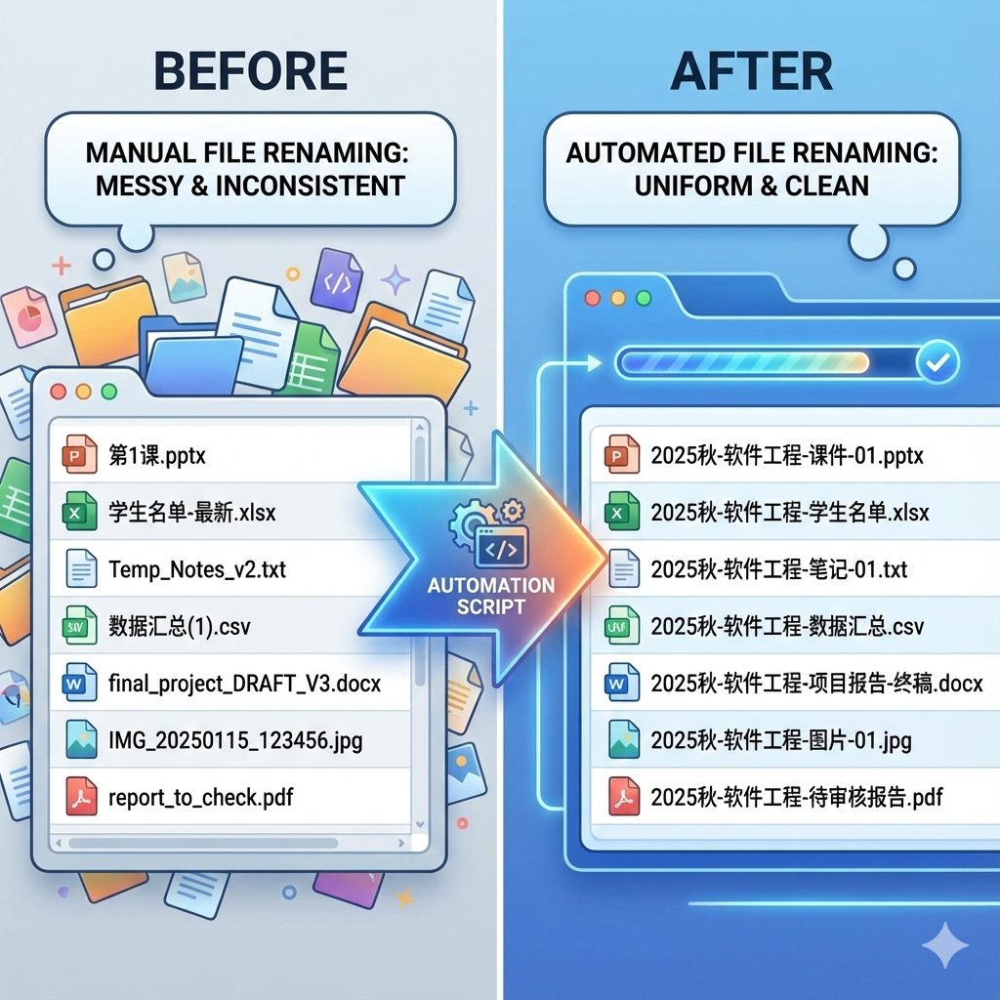
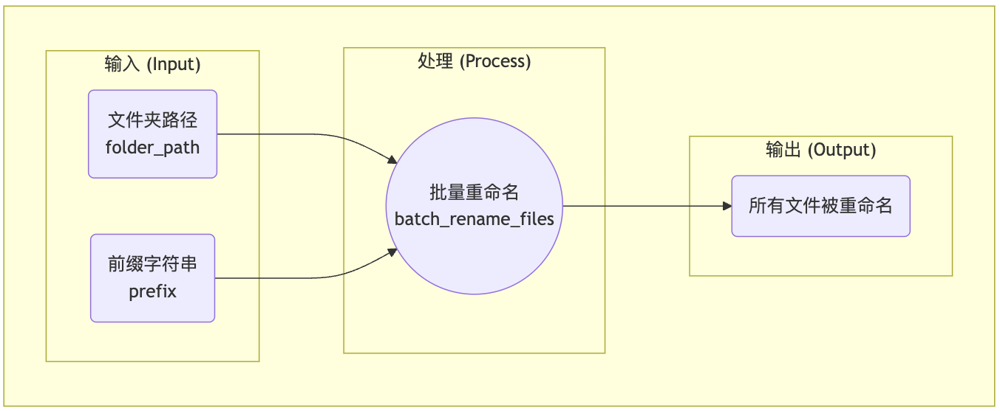
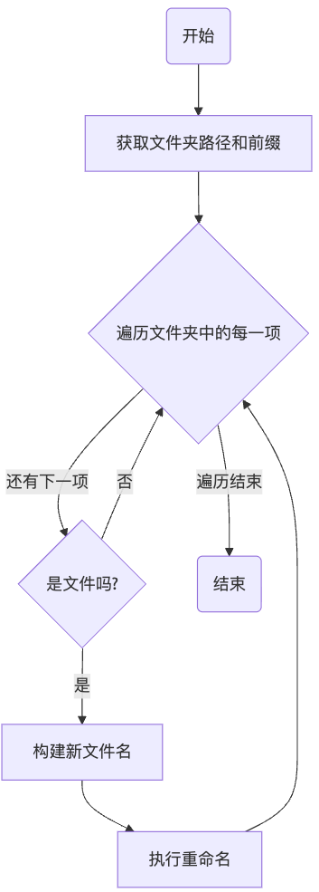
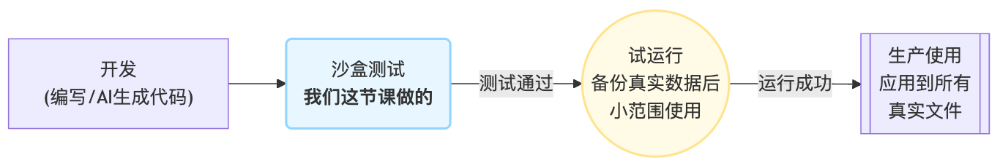
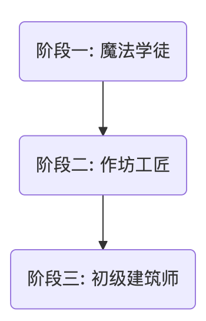

AI赋能软件开发

# 模块三: 代码复用与人机协作
## 第12节课: 模块收官项目：批量文件整理助手

南昌大学计算机系 黎鹰

<!--
- **类型**: 逐字稿
- **内容**: |
  各位老师好！欢迎来到我们模块三的最后一节课，也是我们的收官项目课！
  今天，我们将综合运用本模块学到的所有高级技能，来完成一个非常实用的、能真正解决我们教学工作痛点的工具——批量文件整理助手。
  让我们开始这次最终的试炼吧！
-->

<!--
- **类型**: 教学设计
- **内容**: |
  ### 教学时间: 1分钟
  ### 开场：模块收官项目
  本页作为课程开场，核心目标是宣告模块三最终项目的开始，并点明项目主题——一个极具现实意义和实用价值的“批量文件整理助手”，从而激发学员的参与感和成就动机。

  **核心要点**:
  1. **点明主题**: 清晰地揭示本节课是模块的“收官项目”。
  2. **项目定调**: 将项目定位为一个实用的、解决真实痛点的工具，提升其在学员心中的价值。
  3. **建立期待**: 预示着学员将要综合运用本模块所学，完成一次最终的、有价值的挑战。
-->

<!--
- **类型**: 解释
- **内容**: |
  ### 自动化脚本 (Automation Script)
  我们今天要编写的“批量文件整理助手”，在行业中通常被称为“**自动化脚本**”。

  自动化脚本是一种旨在自动执行一系列重复性、常规性任务的程序。它的核心价值在于**将人力从枯燥、易错的重复劳动中解放出来，极大地提升工作效率**。

  常见的自动化脚本应用场景包括：
  - **文件管理**: 如我们今天要做的，批量重命名、移动、复制、删除文件。
  - **数据处理**: 自动从Excel中读取数据，进行计算，并生成报告。
  - **系统管理**: 定时备份数据库、检查服务器状态。
  - **Web自动化**: 自动登录网站、填写表单、抓取信息。

  学会编写自动化脚本，是程序员提升个人生产力的“必备魔法”。
-->

---

## **回顾：你已是“AI开发主管”**

在模块三的前三节课，我们作为“AI开发主管”，已经掌握了提升代码品质的核心方法，完成了从“能运行”到“高品质”的思维转变。

我们掌握了作为一名“**AI开发主管**”的全部核心技能：

- **封装与授权 (函数)**
  - 你能将混乱的逻辑打包成清晰的“功能积木”。
- **品控与纠错 (调试)**
  - 你能从容地将“事故报告”交给AI，并指导它修复问题。
- **评审与决策 (审查)**
  - 你能挑战AI，在多个方案中权衡利弊，做出最佳决策。

今天，我们将迎来对这些高级技能的**最终试炼**。

<!--
- **类型**: 逐字稿
- **内容**: |
  在开始最终试炼之前，让我们先回顾一下，在本模块中，我们作为“AI开发主管”，实现了怎样的专业能力升级。
  我们已经不再是那个只能写出“能运行就行”的代码的初级主管，而是掌握了三大核心“品质管理”要诀，向着专业迈出了一大步。
  这三大要诀就是：
  通过函数，我们学会了“封装与授权”，把任务分解打包。
  通过调试，我们学会了“品控与纠错”，管理AI的失误。
  通过代码审查，我们学会了“评审与决策”，在不同方案中做出权衡。
  今天，就是对我们作为“AI开发主管”的全部核心素养的最终检验。
-->

<!--
- **类型**: 教学设计
- **内容**: |
  ### 教学时间: 1分钟
  ### 回顾技能：你已是“AI开发主管”
  本页旨在通过快速回顾本模块的核心技能，来巩固学员的“AI开发主管”新身份，并为接下来的“最终试炼”设定一个充满信心和仪式感的基调。

  **核心要点**:
  1. **巩固身份**: 再次强调“AI开发主管”的角色，并将其与本模块的三大核心技能（封装、纠错、评审）强绑定。
  2. **能力梳理**: 将三个核心技能包装成更高级的“领导力”概念（授权、品控、决策），提升学员的自我效能感。
  3. **设定基调**: 将最终项目定位为对这些高级技能的“最终试炼”，激发学员迎接挑战的信心和荣誉感。
-->

<!--
- **类型**: 解释
- **内容**: |
  ### 技术主管 (Tech Lead) 的角色
  本模块中我们扮演的“AI开发主管”，在软件行业中通常对应“**技术主管 (Tech Lead)**”或“**首席开发 (Lead Developer)**”的角色。

  技术主管不仅是优秀的程序员，更是团队的技术核心和领导者。其职责超越了单纯的编码，主要包括：

  1.  **技术决策 (Technical Decision-Making)**: 负责关键的技术选型、架构设计和代码质量标准制定。（对应我们的“评审与决策”）
  2.  **任务分解与分配 (Task Breakdown & Delegation)**: 将复杂的业务需求分解为可执行的开发任务。（对应我们的“封装与授权”）
  3.  **代码审查与质量保证 (Code Review & Quality Assurance)**: 确保团队产出的代码符合规范、健壮且易于维护。（对应我们的“品控与纠错”）
  4.  **指导与赋能 (Mentorship & Empowerment)**: 帮助团队成员成长，提升整个团队的技术水平。

  通过本模块的学习，你实践了作为一名技术主管所需的核心能力，完成了从“执行者”到“领导者”的关键转变。
-->

---

## **项目使命：解决一个真实世界的“烦恼”**

我们今天的项目，不再是构建虚拟世界，而是要解决一个老师们在日常工作中频繁遇到的真实烦恼：

**教学文件命名不统一**

想象一下你一个学期的教学资料文件夹，里面的文件名五花八门：
- `第1课.pptx`
- `学生名单-最新.xlsx`
- `课程总结.md`

当这些文件被传来传去，或从压缩包解压后，我们很难一眼看出它们属于哪个学期、哪门课程。

**我们的目标**：指挥AI编写一个“**批量文件重命名助手**”，一键为指定文件夹里的所有文件，都加上统一、清晰的前缀，例如 `2025秋-软件工程-`。

<!--
- **类型**: 逐字稿
- **内容**: |
  我们今天的项目使命，非常明确。我们不再构建虚拟的武侠世界，而是要用我们学到的编程能力，解决一个在座各位老师都可能频繁遇到的真实烦恼——教学文件命名不统一。
  大家可以想象一下自己的教学资料文件夹，是不是也像这样，文件名五花八门？当文件一多，或者传来传去，就完全乱了套。
  所以，我们今天的目标，就是指挥AI，为我们打造一个“批量文件重命名助手”。它可以一键为指定文件夹里的所有文件，都加上一个统一、清晰的前缀，比如“2025秋-软件工程-”。
  这是一个能让你在未来工作中，真正用得上、能提升效率的实用工具！
-->

<!--
- **类型**: 教学设计
- **内容**: |
  ### 教学时间: 2分钟
  ### 项目使命：解决真实世界的“烦恼”
  本页旨在引入项目背景，通过连接一个教师群体普遍存在的真实痛点（教学文件命名不统一），来阐明新项目的现实意义和应用价值，从而激发学员的内在学习动机。

  **核心要点**:
  1. **痛点切入**: 从一个非常贴近教师日常工作的“文件命名”痛点切入，能迅速引发共鸣。
  2. **价值主张**: 清晰地定义项目的目标是“一键为所有文件添加统一前缀”，这是一个非常有吸引力的价值主张。
  3. **效果可视化**: 通过“Before/After”的视觉对比，直观地展示项目的最终效果，让学员产生“我也想要这个工具”的强烈愿望。
-->

<!--
- **类型**: 解释
- **内容**: |
  ### 需求分析 (Requirements Analysis)
  在任何软件项目开始之前，首要任务都是进行“**需求分析**”。需求分析的核心是回答以下问题：
  1.  **要解决什么问题？(Problem)**：文件命名混乱，难以管理。
  2.  **谁是用户？(User)**：教师、行政人员等需要管理大量文件的用户。
  3.  **核心功能是什么？(Features)**：为指定文件夹下的所有文件批量添加前缀。
  4.  **成功的标准是什么？(Acceptance Criteria)**：运行脚本后，目标文件夹内的所有文件（非文件夹）都被正确添加了前缀。

  一个清晰的需求分析，是项目成功的基石。它为后续的设计、开发和测试提供了明确的方向和目标。我们现在做的，就是一次迷你的需求分析实践。
-->

---

## **第一步(1/2)：蓝图设计——明确输入与输出(IPO)**

在思考“如何做”之前，我们必须先彻底搞清楚“做什么”。一个专业的开发者，会花费大量时间来明确定义程序的**输入(Input)**和**输出(Output)**。

这就像做菜，你必须先弄清要用哪些食材（输入），以及最终想做出什么菜（输出），然后才能设计菜谱（处理流程）。

<!--
- **类型**: 样式替换
- **版本**: [handout, teacher]
- **查找**: |
    ![height:350px]
- **替换**: |
    ![height:300px]
-->

<!--
- **类型**: 逐字稿
- **内容**: |
  好，项目目标明确了。现在，我们以“AI开发主管”的身份，开始专业的设计流程。
  在思考“如何做”之前，我们必须先彻底搞清楚“做什么”。一个专业的开发者，会先花时间明确定义程序的“输入”和“输出”。
  这就像做菜，你得先想好需要哪些食材（输入），以及最终要做成什么菜（输出），然后才能去设计菜谱（也就是处理流程）。
  对于我们的重命名助手，输入很明确：一个需要处理的“文件夹路径”，和一个要添加的“前缀字符串”。
  输出也很明确：这个文件夹里的所有文件都被成功重命名。
  中间的处理过程，我们可以把它想象成一个黑箱，暂时命名为`batch_rename_files`。
  这个输入-处理-输出模型，也就是IPO模型，是程序设计最基础、最重要的思维框架。
-->

<!--
- **类型**: 教学设计
- **内容**: |
  ### 教学时间: 2分钟
  ### 蓝图设计(1/2)：明确输入与输出(IPO)
  本页旨在将原有的“蓝图设计”环节一分为二，首先聚焦于最重要的IPO（输入-处理-输出）分析。通过Mermaid图，让学员直观地理解，在设计任何算法前，都必须先清晰地定义它的“输入”和“输出”，这是专业软件开发的基石。

  **核心要点**:
  1. **强调IPO优先**: 明确传递“先定义输入输出，再设计处理过程”的核心思想。
  2. **可视化分析**: 使用Mermaid图代替纯文本，将IPO模型更直观地呈现出来。
  3. **建立心智模型**: 强化“做菜”的比喻，帮助学员建立“输入-处理-输出”的心智模型。
-->

<!--
- **类型**: 解释
- **内容**: |
  ### IPO模型
  **IPO (Input-Process-Output)** 模型是计算思维中最基本、最核心的思维框架之一。它描述了一个程序最基础的结构：
  - **输入 (Input)**: 程序从外部世界获取数据。数据来源可以是用户键盘输入、文件、数据库、网络请求等。
  - **处理 (Process)**: 程序对输入的数据进行一系列的计算、转换、操作。这是程序的核心逻辑所在。
  - **输出 (Output)**: 程序将处理后的结果返回给外部世界。输出形式可以是显示在屏幕上、写入文件、存入数据库等。

  在开始编写任何复杂程序前，先用IPO模型画出草图，清晰地定义程序的边界和核心功能，是一种能极大提升开发效率和成功率的专业习惯。
-->

---

## **第一步(2/2)：蓝图设计——设计处理流程**

当我们清晰地定义了输入和输出后，就可以开始设计连接两者的“桥梁”——**处理流程 (Process)**。

**处理流程 (文字描述):**
1.  获取目标文件夹的路径和指定的前缀。
2.  遍历该文件夹中的**每一项**。
3.  构建该项的完整路径，并判断**如果**它是一个**文件**（而不是子文件夹）：
4.  构建出它的**新文件名** (前缀 + 原文件名)。
5.  构建出完整的新文件路径。
6.  将该文件从“旧的完整路径”**重命名**为“新的完整路径”。

<!--
- **类型**: 逐字稿
- **内容**: |
  输入和输出明确后，我们就可以来设计中间的“处理流程”了。
  我们可以先用自然语言，像写操作手册一样，把步骤描述出来：
  首先，获取文件夹路径和前缀。然后，遍历这个文件夹里的每一项。在遍历的过程中，我们需要判断，如果这一项是个文件，而不是子文件夹，那我们就为它构建一个新的文件名，然后执行重命名操作。如果不是文件，那就跳过，继续处理下一项。直到所有项都处理完毕，程序结束。
  这个文字描述，就是我们算法的“伪代码”。
  更进一步，我们可以把这个流程，用右边的“流程图”给画出来。流程图能更清晰地展示出程序中的“循环”和“判断”结构。
  有了这份详细的蓝图，我们向AI下达指令时，就会胸有成竹。
-->

<!--
- **类型**: 教学设计
- **内容**: |
  ### 教学时间: 2分钟
  ### 蓝图设计(2/2)：设计处理流程
  本页是“蓝图设计”的第二部分，专注于将文字化的“处理流程”转化为可视化的“流程图”。这能帮助学员更深入地理解算法的逻辑、循环和分支，并为下一步编写精确的Prompt打下坚实基础。

  **核心要点**:
  1. **算法可视化**: 使用Mermaid流程图，将抽象的文字步骤转化为具体的逻辑流程图。
  2. **深化逻辑理解**: 流程图能清晰地展示循环（回到“遍历”）和条件分支（“是文件吗？”），帮助学员理解程序的核心控制流。
  3. **连接下一步**: 一个清晰的流程图，本身就是一份完美的“伪代码”，可以直接翻译为下一步的“终极指令”。
-->

<!--
- **类型**: 解释
- **内容**: |
  ### 伪代码与流程图
  在编写实际代码之前，使用“**伪代码**”或“**流程图**”来规划算法，是两种非常常见的专业实践。
  - **伪代码 (Pseudocode)**: 一种使用自然语言（夹杂少量代码格式）来描述算法逻辑的方法。它忽略了具体编程语言的语法细节，只关注算法的核心步骤和逻辑。我们左侧的“处理流程”就是一份伪代码。
  - **流程图 (Flowchart)**: 一种使用标准化的图形符号来表示算法或流程的图表。它能非常直观地展示程序中的顺序、选择（分支）和重复（循环）结构。
    - **椭圆形/圆角矩形**: 代表流程的开始或结束。
    - **矩形**: 代表一个处理步骤。
    - **菱形**: 代表一个判断或决策点。

  这两种工具都能帮助我们在动手编码前，理清思路，发现潜在的逻辑问题，并为后续与AI（或同事）的沟通提供一份清晰的设计文档。
-->

---

## **第二步：向AI咨询，发现“新工具”**

我们的算法蓝图需要一些我们从未接触过的能力：如何“遍历文件夹”？如何“重命名文件”？

这时，我们不需要去Google搜索，而是直接向我们的“**全能技术顾问**”——AI——提问。

> **探索性Prompt:**
>
> “你好，我想用Python写一个批量重命名文件的脚本。请问我需要用到哪些工具（比如标准库或模块），来实现以下操作：
> 1.  列出某个文件夹里的所有文件名？
> 2.  将一个文件从旧名字重命名为新名字？”

**AI的回答**：它会告诉你，Python的内置`os`模块，就是处理这些操作系统相关任务的“瑞士军刀”。

<!--
- **类型**: 逐字稿
- **内容**: |
  蓝图设计好了，但我们很快会发现一个问题：我们的知识储备里，好像还不知道具体用什么代码来实现“遍历文件夹”和“重命名文件”。
  怎么办？去Google或百度上大海捞针吗？不需要！
  现在，我们有了一个“全能技术顾问”——AI。我们可以直接向它提问，来探索未知的领域。
  我们可以发送这样的“探索性Prompt”：“你好，我想用Python写一个批量重命名文件的脚本。请问我需要用到哪些工具，来实现‘列出所有文件名’和‘重命名文件’这两个操作？”
  注意，我们不是让它直接写代码，而是问它“需要用什么工具”。这是一种更高阶的提问技巧。
  AI会立刻告诉我们，Python里有一个内置的`os`模块，就是专门处理这类与操作系统打交道的任务的“瑞士军刀”。
-->

<!--
- **类型**: 教学设计
- **内容**: |
  ### 教学时间: 2分钟
  ### 技术探索：向AI顾问咨询“新工具”
  本页旨在教授学员一项重要的元技能：当遇到未知领域时，如何向AI提问以寻找解决问题所需的合适工具。这体现了从“让AI直接给答案”到“让AI帮我找工具”的思维转变。

  **核心要点**:
  1. **示范“探索性Prompt”**: 这个Prompt不要求AI直接写代码，而是询问“需要用到哪些工具”，这是一种更高层次、更具探索性的提问方式。
  2. **角色重塑**: 将AI定位为“全能技术顾问”，引导学员学会在遇到新问题时，首先向AI寻求方向性指导，而不是盲目搜索。
  3. **引入新知识**: 通过提问，自然地引出本项目所需的核心工具——Python的`os`模块。
-->

<!--
- **类型**: 解释
- **内容**: |
  ### “学习如何学习”的元技能
  在信息爆炸的时代，掌握“**学习如何学习 (Learning how to learn)**”的元技能，比单纯记忆知识点更重要。在编程领域，这意味着：
  - **承认未知**: 承认自己不可能知道所有的库、函数和API。
  - **定义问题**: 能够将一个大的目标，分解为需要特定工具才能解决的、更小的问题（例如，“批量重命名”被分解为“遍历文件夹”和“执行重命名”）。
  - **有效提问**: 知道如何向搜索引擎或AI提出精准的问题，以寻找解决这些小问题的工具。

  本页的“探索性Prompt”，就是一次“定义问题”和“有效提问”的实践。掌握了这种能力，你就能在AI的辅助下，不断地扩展自己的能力边界，进入任何新的编程领域。
-->

---

## **新工具介绍：`os`模块**

`os`模块提供了我们完成任务所需的所有“工具”：

- **`os.listdir(path)`**
  - **作用**：列出指定`path`文件夹内的所有文件和文件夹名，返回一个**列表**。
- **`os.path.join(path, filename)`**
  - **作用**：智能地将文件夹路径和文件名拼接成一个完整的绝对路径。（比手动拼接更健壮！）
- **`os.path.isfile(full_path)`**
  - **作用**：判断一个给定的完整路径是否是一个**文件**，返回`True`或`False`。
- **`os.rename(source_path, destination_path)`**
  - **作用**：重命名或**移动**一个文件/文件夹。我们将用它来完成重命名。

<!--
- **类型**: 逐字稿
- **内容**: |
  在AI的指引下，我们认识了这个新朋友——`os`模块。我们来看一下它为我们提供了哪些完成任务所必需的“工具”。
  首先，`os.listdir()`，它可以列出指定文件夹里的所有项目，并把名字放在一个列表里返回给我们。这完美地对应了我们蓝图里的“遍历”步骤。
  其次，`os.path.join()`，它可以智能地把文件夹路径和文件名拼接成一个完整的路径。这比我们自己用加号拼接更专业、更健壮，因为它会自动处理不同操作系统（Windows和macOS）下路径分隔符不同的问题。
  然后，`os.path.isfile()`，它可以判断一个路径到底是不是一个文件。这对应了我们蓝图里的“菱形”判断步骤。
  最后，`os.rename()`，它可以将一个文件从旧路径重命名为新路径。这就是我们最终要使用的“武器”。
  有了这些工具，我们的蓝图就可以从纸面走向现实了。
-->

<!--
- **类型**: 教学设计
- **内容**: |
  ### 教学时间: 2分钟
  ### 知识讲解：`os`模块——与操作系统对话
  本页旨在快速介绍`os`模块中本次项目所需的核心函数。教学重点不是让学员记住所有细节，而是让他们对这些“新工具”的存在和大致用途有一个清晰的印象，以便在下一步编写Prompt时能够“言之有物”。

  **核心要点**:
  1. **清单式教学**: 以“工具清单”的形式，清晰地列出每个函数的作用，便于快速查阅。
  2. **聚焦核心**: 只列出与本项目直接相关的函数，避免信息过载。
  3. **建立联系**: 每个函数都直接对应了“算法蓝图”中的某一个步骤（如`os.listdir`对应“遍历文件夹”），让知识学以致用。
-->

<!--
- **类型**: 解释
- **内容**: |
  ### 标准库 (Standard Library)
  `os`模块是Python“**标准库**”的一部分。

  “标准库”是指随着Python解释器一同安装的、一组经过验证的、高质量的模块和函数集合。这意味着，只要你安装了Python，就可以直接`import os`来使用它，而不需要像第三方库那样额外通过`pip install`等命令来安装。

  Python拥有一个“**自带电池 (batteries included)**”的强大标准库，涵盖了从文件操作、网络通信、数据压缩到日期时间处理等各种常见任务。熟悉标准库，能让你在不引入任何外部依赖的情况下，完成大量实用工作。

  `os.path`是`os`模块中的一个子模块，专门用于处理文件路径相关的操作。使用`os.path.join()`而不是手动拼接字符串，是一个非常重要的、体现专业性的编程习惯。
-->

---

## **第三步(1/3): 从“愿景”到“指令”——提出初始想法**

我们已经有了清晰的蓝图和工具，但要一次性写出完美的“终极指令”，对新手而言依然是巨大的挑战。

一个更轻松、更符合AI协作精神的工作流是：**与AI一起“迭代”出最终的指令**。

这个过程的第一步，不是追求完美，而是先向AI抛出一个简单的、**“愿景驱动”的初始指令**，告诉它我们大致想做什么。

这就像对一个团队成员说：“嘿，我们大概要做个批量重命名的东西”，而不是直接甩给他一份详细的规格书。

> **“愿景驱动”的初始Prompt:**
>
> “你好，我想用Python写一个脚本。
>
> **目标**：批量重命名某个文件夹里的所有文件，为它们统一添加一个前缀字符串。
>
> 你觉得这个任务可行吗？如果让你来做，大致的思路是怎样的？”

<!--
- **类型**: 逐字稿
- **内容**: |
  好了，我们有了蓝图和工具，但要把这一切转化为一份完美的、滴水不漏的终极指令，对于刚刚接触这些概念的我们来说，挑战还是太大了。
  别担心，我们完全没必要自己苦思冥想。一个更轻松、更符合AI协作精神的工作流是：与AI一起，一步步“迭代”出这份最终的指令。
  第一步，就是先抛弃“一次写对”的压力，向AI抛出一个非常简单的、“愿景驱动”的初始指令。就像右边这样，只告诉它我们的大目标，然后用开放式的问题，比如“你觉得可行吗？”、“你的思路是怎样的？”，来启动对话。
  这就像是和AI进行一次“头脑风暴”的开场。
-->

<!--
- **类型**: 教学设计
- **内容**: |
  ### 教学时间: 2分钟
  ### 第三步(1/3): 提出“愿景驱动”的初始指令
  本页旨在引入一个全新的、更平滑的Prompt设计流程，解决了“终极指令”对新手而言过于困难的痛点。核心是教给学员如何从一个简单的“愿景驱动”指令开始，与AI进行协作。

  **核心要点**: 
  1. **降低门槛**: 明确指出“一次性写出完美指令是困难的”，承认学员的潜在痛点，并提供解决方案。
  2. **引入新流程**: 提出“与AI迭代出指令”的新工作流。
  3. **示范“愿景驱动”Prompt**: 提供一个非常简单、开放式的初始Prompt范例，极大地降低了学员的心理负担和操作门槛。
-->

<!--
- **类型**: 解释
- **内容**: |
  ### 愿景驱动 vs. 设计驱动
  在与AI协作编写代码时，我们可以大致采用两种Prompt模式：
  - **愿景驱动 (Vision-Driven)**: 你只向AI描述你最终想要实现的“**愿景**”或“**目标**”，而不关心具体的实现步骤和技术细节。这种模式非常适合项目的初期探索和头脑风暴阶段。它的优点是简单快速，缺点是AI的输出不确定性高。
  - **设计驱动 (Design-Driven)**: 你向AI提供一份详尽的“**设计规格**”，精确地告诉AI每一步应该做什么、使用什么工具。这种模式适合在思路清晰后，需要精确控制代码产出的阶段。它的优点是输出结果高度可控、可预测，缺点是需要前期投入更多思考。

  一个专业的AI协作者，会根据项目阶段，灵活地在这两种模式之间切换。我们现在学习的，就是如何从“愿景驱动”平滑过渡到“设计驱动”。
-->

---

## **第三步(2/3): 引导AI思考“边界情况”**

在收到初始指令后，AI可能会给你一个简单的实现思路（比如直接使用`os.listdir`和`os.rename`）。

此时，我们的职责不是马上写代码，而是扮演“**压力测试工程师**”的角色，引导AI思考方案中潜在的“**边界情况**”和“**风险**”。

这是从普通使用者到专业开发者的关键一步。

> **“挑战边界”的追问Prompt:**
>
> “你的思路听起来不错。但在实际操作中，这个方案有没有什么需要特别注意的‘**边界情况**’或**可能出错**的地方？
>
> 比如：
> 1.  如果文件夹里除了文件，还有**子文件夹**怎么办？
> 2.  如果遇到像`.DS_Store`这样的**隐藏文件**怎么办？
> 3.  如果脚本不小心被**重复执行**了两次，文件名会不会被加上两次前缀？
>
> 请帮我分析这些风险，并提出你的优化建议。”

<!--
- **类型**: 逐字稿
- **内容**: |
  AI收到我们的初始想法后，可能会给我们一个简单的思路。这时，我们千万不要急着就让它写代码。
  我们的职责，是扮演“压力测试工程师”的角色，去挑战它的初步方案。我们可以像右边这样，向AI追问：“你的方案有没有什么需要注意的‘边界情况’或者可能出错的地方？”
  我们可以主动举一些例子，比如“有子文件夹怎么办？”、“有隐藏文件怎么办？”、“脚本重复执行了怎么办？”。
  这个追问的过程，至关重要。它能迫使AI思考得更周全，从而生成更健壮、更专业的代码。这也是我们作为“开发主管”价值的体现。
-->

<!--
- **类型**: 教学设计
- **内容**: |
  ### 教学时间: 3分钟
  ### 第三步(2/3): 引导AI思考“边界情况”
  本页是“迭代式Prompt”流程的核心环节。它旨在教会学员如何通过“挑战边界”的追问，引导AI从一个简单的方案走向一个更健壮、更周全的方案。

  **核心要点**: 
  1. **角色扮演**: 引入“压力测试工程师”的新角色，让学员理解自己此时的职责是“找茬”，而不是“接受”。
  2. **教授核心思维**: 明确提出“边界情况”这一专业软件开发的核心概念。
  3. **示范追问Prompt**: 提供一个结构化的“追问Prompt”，其中包含了具体的、可举一反三的例子（子文件夹、隐藏文件、重复执行），极具实践指导价值。
-->

<!--
- **类型**: 解释
- **内容**: |
  ### 边界情况 (Edge Cases)
  “**边界情况**”是软件测试中的一个核心概念，指的是那些发生在输入值范围的“边缘”或极端情况下的场景。

  例如，对于我们的重命名脚本：
  - **类型边界**: 文件夹内容物不是普通文件（而是子文件夹、快捷方式等）。
  - **命名边界**: 文件名本身就很特殊（如隐藏文件`.DS_Store`，没有后缀名的文件，名字超长的文件）。
  - **状态边界**: 系统处于某种特殊状态（文件夹为空，文件正在被其他程序占用，脚本被重复执行）。

  新手程序员往往只关注“**正常路径 (Happy Path)**”（即一切顺利的情况），而专业的开发者会花费大量精力去思考和处理各种“边界情况”，因为绝大多数的Bug都隐藏在这些角落里。学会主动思考边界情况，是专业素养的体现。
-->

---

## **第三步(3/3): 请求AI整合生成“终极指令”**

经过几轮讨论，我们和AI已经对需求达成了共识，并考虑了各种细节。

现在，我们不必亲自费力去总结，可以把这个任务也交给AI！

我们可以“**升维思考**”，要求AI扮演“**需求分析师**”，将我们刚才的所有讨论，整理成一份高质量的、给“AI程序员”看的“终极指令”。

这是一种强大的“**元能力**”：**利用AI来优化我们与AI自身的沟通**。

> **“生成指令”的元Prompt:**
>
> “非常好！我们现在已经把各种情况都考虑清楚了。
>
> 现在，请你**扮演一名专业的‘需求分析师’**，将我们从开始到现在的所有讨论，包括：
> 1.  最初的**核心目标** (加前缀)
> 2.  后来补充的各种**边界情况处理** (跳过子文件夹、跳过隐藏文件、避免重复添加前缀)
> 3.  以及你建议使用的**技术工具** (`os`模块)
>
> 全部整理成一份**清晰、详尽、高质量、步骤化**的开发指令(Prompt)。
>
> 这份指令的目标读者是另一位‘AI程序员’，所以它必须足够精确，没有任何歧义。”

<!--
- **类型**: 样式替换
- **版本**: [handout, teacher]
- **查找**: |
    

- **替换**: |
    

-->

<!--
- **类型**: 逐字稿
- **内容**: |
  好了，经过几轮讨论，我们和AI已经把所有细节都聊透了。现在是不是要我们自己来总结，写成一份完美的Prompt呢？
  不，我们可以把这个工作也交给AI！
  我们可以向它发出一个更高级的指令，一个“元指令”。就像右边这样：“非常好！现在请你扮演一名‘需求分析师’，把我们刚才所有的讨论，全部整理成一份清晰、详尽、高质量的开发指令，这份指令是给另一个‘AI程序员’去看的。”
  这是一种非常强大的思维：利用AI来优化我们和AI自己的沟通。我们不仅让AI当“程序员”，还让它当“需求分析师”来帮我们写Prompt。
-->

<!--
- **类型**: 教学设计
- **内容**: |
  ### 教学时间: 3分钟
  ### 第三步(3/3): 请求AI整合生成“终极指令”
  本页是本课程“Prompt工程”教学的升华。它直接响应了用户的核心建议，即“让AI帮助写出Prompt”，并将其包装成一种高级的“元能力”。

  **核心要点**: 
  1. **思维升维**: 引入“元能力”和“利用AI优化与AI的沟通”的概念，让学员感受到一种思维上的跃迁。
  2. **角色扮演升级**: 让AI扮演“需求分析师”，来为“AI程序员”写指令，这个比喻生动地解释了这种“元操作”的本质。
  3. **示范“元Prompt”**: 提供一个非常具体、强大、可操作性极强的“元Prompt”范例，它清晰地指示AI去“总结讨论”并“生成指令”。
-->

<!--
- **类型**: 解释
- **内容**: |
  ### 元认知与元Prompting (Meta-cognition & Meta-Prompting)
  “**元认知 (Meta-cognition)**”指的是“关于认知的认知”，通俗讲就是“对自己思考过程的思考”。它包括对自身学习、记忆、解决问题等认知活动的监控和调节。

  我们将这个概念迁移到与AI的互动中，就产生了“**元Prompting**”：**编写旨在生成或优化其他Prompt的Prompt**。

  当你向AI发出“请帮我把这个问题描述得更清晰”或“请把我们的对话总结成一份开发需求文档”这类指令时，你就是在进行“元Prompting”。

  这标志着你与AI的协作进入了一个新的层次：
  - **基础协作**: 你思考，AI执行。
  - **元协作**: 你与AI一起思考“如何更好地思考”，你引导AI帮助你优化你对AI下达的指令。

  掌握元协作，是AI时代保持人类认知优势的关键。
-->

---

## **第四步：审查并执行AI生成的“终极指令”**

在我们发出了“生成指令”的元Prompt后，AI“需求分析师”就会为我们生成一份融合了我们所有讨论成果的“终极指令”。

这份指令现在成为了我们指导“AI程序员”工作的最终蓝图。我们的任务，是**最后审查一遍**，然后将其发送给AI（甚至可以是同一个AI），让它生成最终脚本。

> **AI生成的终极指令 (审查稿):**
>
> 请为我编写一个Python脚本，名为`batch_renamer.py`，用于给文件批量添加前缀。
>
> 1.  导入`os`模块。
> 2.  定义一个名为 `batch_rename_files` 的函数，它接收 `folder_path` 和 `prefix` 两个字符串作为参数。
> 3.  在函数内部，使用 `os.listdir()` 遍历指定 `folder_path` 下的所有项目。
> 4.  在循环中，构建每个项目的完整路径，并用 `os.path.isfile()` 判断它是否是一个文件。
> 5.  为增加代码健壮性，请只重命名文件，不要对子文件夹进行操作。同时，跳过以`.`开头的隐藏文件。
> 6.  在重命名之前，增加一个判断：如果文件名**已经**以指定`prefix`开头，就跳过这个文件，并打印一条提示信息，避免重复添加前缀。
> 7.  构建新的文件名（`prefix + original_filename`），并基于此构建完整的新文件路径。
> 8.  使用 `os.rename()` 将文件从旧路径重命名为新路径，并打印出重命名的过程，例如：“已重命名: a.txt -> 2025-final-a.txt”。
> 9.  在脚本的**最末尾**，定义两个变量：`TARGET_FOLDER = "./test_folder"` 和 `PREFIX = "2025秋-软件工程-"`。
> 10. 最后，调用 `batch_rename_files(TARGET_FOLDER, PREFIX)` 函数来执行脚本。

<!--
- **类型**: 样式替换
- **版本**: [handout, teacher]
- **查找**: |
    

- **替换**: |
    

-->

<!--
- **类型**: 逐字稿
- **内容**: |
  在我们发出了“生成指令”的元Prompt后，AI“需求分析师”就会为我们生成一份像这样的，融合了我们所有讨论成果的“终极指令”。
  这份指令现在成为了我们指导“AI程序员”工作的最终蓝图。
  我们作为开发主管的最后一步，就是审查这份由AI助理准备好的指令，看看有没有遗漏。比如，我们之前讨论的“避免重复执行”，它有没有写进去？（看第6点）。
  确认无误后，我们就可以把这份完美的指令，发给AI，让它生成最终的脚本代码了。
-->

<!--
- **类型**: 教学设计
- **内容**: |
  ### 教学时间: 2分钟
  ### 第四步：审查并执行AI生成的“终极指令”
  本页将原有的“第三步”转变为新流程的“第四步”。其核心教学目标，从“如何从零编写复杂指令”，转变为“如何审查AI生成的指令，并用它来驱动最终的编码”，这极大地降低了学员的认知负荷。

  **核心要点**: 
  1. **角色转换**: 学员的角色从“指令的创作者”变成了“指令的审查者”，更贴合“开发主管”的身份。
  2. **成果展示**: 将“终极指令”定位为前序步骤的产出物，让学员对“与AI协作设计Prompt”的流程有直观的成果感知。
  3. **强调审查**: 引导学员在执行前，要对AI生成的指令进行最后一次审查，培养严谨的工作习惯。
-->

<!--
- **类型**: 解释
- **内容**: |
  ### 指令审查 (Prompt Review)
  在我们我们将一份最终的、复杂的指令交给AI执行之前，进行最后一次“**指令审查**”，是一个能极大提升协作效率和准确性的好习惯。

  这与开发流程中的“**代码审查 (Code Review)**”异曲同工。它的目的是：
  1.  **确认完整性**: 检查指令是否遗漏了我们在讨论中提到的任何关键需求或边界情况。
  2.  **检查清晰度**: 确保指令的每一步描述都清晰、无歧义，不会让AI产生误解。
  3.  **最终确认**: 作为项目的“决策者”，这是你为“即将执行的复杂操作”做的最后一次“Go/No-Go”决策。

  经过审查的、高质量的指令，是获得高质量代码输出的最重要保障。
-->

---

## **动手环节：批量重命名你的“课程文件”**

在开始动手之前，我们需要建立一个重要的专业认知：一个正规的软件项目，其开发、测试和生产环境是严格分离的。我们编写的任何工具，都必须先在一个安全的“沙盒”环境中进行充分测试，确保它完全符合预期后，才能应用到真实的、重要的数据上。

测试通过后，在我们将工具应用于真实的、海量的课程文件之前，通常还会有一个“**试运行**”阶段。在这个阶段，我们会选择一小部分不那么重要但真实的文件进行操作，并**提前做好数据备份**。这是为了防范那些在沙盒测试中未能发现的、意料之外的BUG，是保障数据安全的最后一道防线。

我们今天的实践，主要就是模拟流程图中的“**沙盒测试**”这个过程。

<!--
- **类型**: 逐字稿
- **内容**: |
  在大家开始动手之前，我必须先强调一个极其重要的专业认知。
  我们写的这个脚本，是有“破坏力”的，它会真实地修改你电脑上的文件。所以，我们绝不能直接在自己宝贵的教学资料上运行它。
  一个专业的开发流程，开发、测试和真实使用（生产）的环境是严格分离的。我们必须先在一个安全的“沙盒”环境里进行充分测试。
  测试通过后，在应用于真实文件之前，我们还会进行一次小范围的“试运行”，并且一定要提前做好数据备份！这是保障数据安全的最后一道防线。
  我们今天的实践，主要就是模拟这个流程中的“沙盒测试”环节。
-->

<!--
- **类型**: 教学设计
- **内容**: |
  ### 教学时间: 2分钟
  ### 植入专业思想：沙盒与数据安全
  本页在最终动手环节前，插入一个关于“专业素养”和“安全意识”的教学点。这对于一个要操作真实文件的脚本来说至关重要。

  **核心要点**:
  1. **风险预警**: 明确告知学员，操作文件的脚本具有“破坏性”，建立其风险意识。
  2. **引入专业流程**: 引入“沙盒测试”、“试运行”、“数据备份”等专业概念，培养学员严谨、负责的工程思想。
  3. **流程可视化**: 通过Mermaid流程图，清晰地展示从开发到生产的各个阶段，并明确标出本节课实践所处的环节。
-->

<!--
- **类型**: 解释
- **内容**: |
  ### 开发、测试与生产环境
  在软件工程中，为了保证软件质量和系统稳定，通常会设置多个独立的环境：
  - **开发环境 (Development)**: 开发者本地的开发机器。代码在这里被编写和初步调试。
  - **测试环境 (Testing / Staging / QA)**: 一个专门用于测试的环境，其配置应尽可能地与生产环境相似。我们创建的`test_folder`就是一个最简化的测试环境。
  - **生产环境 (Production)**: 软件最终部署和运行，为真实用户提供服务的环境。这是最关键的环境，任何操作都必须慎之又慎。

  “**不要在生产环境做测试**”是所有程序员都必须遵守的铁律。我们今天的实践，就是在模拟这一专业流程，先在安全的“测试环境”中验证我们的工具。
-->

---

### **第一步：创建“沙盒环境”与“测试数据”**

在你的项目根目录下，创建一个名为`test_folder`的文件夹，这就是我们的“沙盒”。然后，在AI助手中，使用以下指令，在沙盒中创建一些用于测试的空白文件：

> 请帮我在`./test_folder/`目录下，创建以下几个空白文件：`课程大纲.docx`, `第1课讲义.pptx`, `学生名单.xlsx`。

### **第二步：执行“重命名脚本”**
1.  向AI发送我们上一页的“**终极指令**”，让它生成`batch_renamer.py`脚本。
2.  **审查代码**：花一分钟时间，对照你的指令，检查AI生成的代码逻辑是否完全符合你的设计。
3.  在VS Code的终端中，运行这个脚本：`python batch_renamer.py`

### **第三步：验证“测试结果”**
- 查看你的`test_folder`“沙盒”。
- 所有测试文件的名字是否都成功地被加上了你设定的前缀？（例如：`2025秋-软件工程-课程大纲.docx`）

<!--
- **类型**: 逐字稿
- **内容**: |
  好了，现在我们正式开始动手！
  第一步，创建我们的“沙盒环境”。请大家在你的项目根目录下，手动创建一个名为`test_folder`的文件夹。然后，我们可以指挥AI，帮我们在这个沙盒里创建一些用于测试的空白文件。你可以直接复制这里的指令发给AI。
  第二步，执行脚本。向AI发送我们上一页那份详细的“终极指令”，让它为你生成`batch_renamer.py`这个脚本。拿到代码后，花一分钟时间，扮演一次“代码审查员”，对照你的指令，看看AI的实现是不是完全符合你的设计。确认无误后，在VS Code的终端里，输入`python batch_renamer.py`来运行它。
  第三步，验证结果。回到你的文件浏览器，查看`test_folder`文件夹。里面的文件名是不是都像我们预期的那样，被成功地加上了前缀？
  如果一切顺利，恭喜你，你已经成功地指挥AI，为你打造了一个实用的自动化工具！
-->

<!--
- **类型**: 教学设计
- **内容**: |
  ### 教学时间: 18分钟
  ### 动手环节：见证混乱变为有序
  本页是本模块的最终动手实践环节，旨在引导学员完成项目的全部流程，从准备“实验材料”，到执行脚本，再到最终验证结果，亲眼见证“混乱变为有序”的奇迹，从而获得巨大的成就感。这是本节课耗时最长的部分，需要给予学员充分的探索和试错时间。

  **核心要点**:
  1. **专业思想植入**: 在动手前通过文字和流程图，强调“沙盒”、“试运行”、“数据备份”等概念，培养学员的专业素养和安全意识。
  2. **学以致用**: 让学员综合运用本模块学到的所有技能（Prompt编写、代码审查、终端操作）来完成一个完整的项目。
  3. **即时反馈**: 项目的最终结果（文件被自动重命名）是即时的、可见的、符合预期的，能给予学员最强烈的正向反馈。
-->

<!--
- **类型**: 解释
- **内容**: |
  ### 脚本的配置与执行
  我们通过在脚本末尾定义`TARGET_FOLDER`和`PREFIX`变量的方式，来“配置”这个脚本的行为。这是一种简单直接的配置方法。

  在更复杂的应用中，配置信息通常会通过更灵活的方式提供，例如：
  - **命令行参数 (Command-line Arguments)**: 允许用户在运行脚本时，通过命令行直接传入参数，例如 `python renamer.py --folder /path/to/folder --prefix "MyPrefix-"`。这需要使用`argparse`等模块。
  - **配置文件 (Configuration Files)**: 将配置信息写入一个单独的文件（如`.ini`, `.json`, `.yaml`），脚本启动时读取这个文件。这使得修改配置无需修改代码。
  - **环境变量 (Environment Variables)**: 从操作系统环境变量中读取配置。

  我们目前的硬编码方式虽然简单，但理解这些更高级的配置方式，是编写更通用、更专业工具的基础。
-->

---

## **模块三总结：你已是合格的“AI开发主管”**

**祝贺你，完成了模块三的终极试炼！**

让我们回顾一下在本模块，你作为“AI开发主管”所掌握的三大核心领导力：

- **封装与授权 (函数)**
  - 你学会了将复杂任务分解，并“授权”给一个个独立的函数去执行。
- **品控与纠错 (调试)**
  - 你学会了管理AI的“失误”，通过分析报告和清晰指令，引导其修复问题。
- **评审与决策 (审查)**
  - 你学会了评估AI的不同方案，并基于权衡做出最终的架构决策。

你已经不再是AI的简单使用者，而是能**驾驭AI**，主导项目从设计、实现、到质量把控全流程的**领导者**。

<!--
- **类型**: 逐字稿
- **内容**: |
  （在学员完成实践后）
  祝贺大家，成功完成了模块三的终极试炼！
  让我们一起回顾一下，在这个模块，你作为“AI开发主管”，掌握了哪些核心的领导力。
  通过学习函数，你学会了“封装与授权”，将任务分解。
  通过学习调试，你学会了“品控与纠错”，管理AI的失误。
  通过学习代码审查，你学会了“评审与决策”，在不同方案中做权衡。
  可以说，你已经不再是AI的一个简单使用者，而是能真正驾驭AI，主导项目从设计、实现到质量把控全流程的领导者。为你自己的成长喝彩！
-->

<!--
- **类型**: 教学设计
- **内容**: |
  ### 教学时间: 2分钟
  ### 模块总结：合格的“AI开发主管”
  本页旨在对整个模块三的学习成果进行系统性总结和价值升华。通过再次强调“AI开发主管”的角色，并将本模块的三个核心主题（函数、调试、审查）包装成更高阶的“领导力”，来极大地提升学员的成就感和价值认同。

  **核心要点**:
  1. **价值升华**: 将技术技能（函数、调试、审查）包装成管理能力（授权、品控、决策），让学员认识到自己学到的不仅是技术，更是思想。
  2. **巩固身份**: 再次肯定学员“AI开发主管”和“领导者”的新身份，完成本模块的角色塑造闭环。
  3. **系统总结**: 清晰地回顾本模块的三个核心部分，帮助学员建立对所学知识的整体性认知。
-->

<!--
- **类型**: 解释
- **内容**: |
  ### 从编码到工程的思维转变
  模块三的核心，是引导你完成一次从“**编码思维**”到“**工程思维**”的转变。
  - **编码思维**更关注“**如何用代码实现一个特定的功能**”。它的产出是“能跑的代码”。
  - **工程思维**则更关注“**如何系统性地、高质量地构建和维护一个软件产品**”。它需要考虑代码的可读性、可维护性、健壮性、团队协作等一系列超越功能本身的因素。它的产出是“高质量的、可持续发展的代码”。

  你所学习的函数封装、调试流程、代码审查，都是“工程思维”的重要组成部分。具备了工程思维，你才能真正地“驾驭”AI，构建出可靠、有价值的软件应用，而不仅仅是生成一些一次性的小玩具。
-->

---

## **课程成长路径：从“魔法学徒”到“作坊工匠”**

| 阶段 | 目标 | 对应模块 |
| :--- | :--- | :--- |
| **魔法学徒** | 掌握编程基础，学习封装复用 | 模块 1-3 ✅ |
| **作坊工匠** | 处理真实数据，构建交互工具 | 模块 4-6 |
| **初级建筑师** | 构建综合项目，转化教学设计 | 模块 7-8 |

**我们已经成功完成了“魔法学徒”阶段的全部修行！**
你不仅掌握了编程的基础规则，更学会了封装与复用代码的核心思想。

<!--
- **类型**: 逐字稿
- **内容**: |
  让我们再次回到我们的课程成长路径图。
  随着模块三的结束，我非常荣幸地向大家宣布：我们已经成功完成了“魔法学徒”阶段的全部修行！
  你不仅掌握了编程的变量、条件、循环这些基础规则，更重要的是，学会了封装与复用代码的核心思想。
  接下来，我们将进入一个全新的阶段——“作坊工匠”。我们将开始学习如何处理真实的、外部的数据，并构建有交互界面的工具。
-->

<!--
- **类型**: 教学设计
- **内容**: |
  ### 教学时间: 1分钟
  ### 里程碑：完成“魔法学徒”阶段
  本页旨在通过更新“课程成长路径图”，清晰地标记出学员已完成的学习进度，为他们提供一个里程碑式的成就感，并为下一阶段的学习做铺垫。

  **核心要点**:
  1. **进度可视化**: 在成长路径图上用一个清晰的“✅”标记出已完成的“魔法学徒”阶段，让学员对自己的成长有直观、清晰的感知。
  2. **给予成就感**: 明确宣告“我们已经成功完成了...全部修行！”，给予学员阶段性成功的正向反馈。
  3. **承前启后**: 为模块三画上一个圆满的句号，并自然地将学员的视线引向下一阶段“作坊工匠”。
-->

<!--
- **类型**: 解释
- **内容**: |
  ### 学习阶段的划分
  本课程的三个阶段划分，借鉴了“**认知学徒制 (Cognitive Apprenticeship)**”的理念，旨在模拟传统手工艺中“学徒-工匠-大师”的成长路径。
  - **魔法学徒 (模块1-3)**: 核心是**模仿与内化**。你通过模仿老师和AI，学习编程的基本“招式”（语法）和“心法”（思想），并完成一些结构化的练习。
  - **作坊工匠 (模块4-6)**: 核心是**实践与应用**。你开始使用更专业的工具（如Pandas），处理更真实、更复杂的“原材料”（数据），并能独立打造出有实用价值的“作品”（数据报告、Web应用）。
  - **初级建筑师 (模块7-8)**: 核心是**综合与创新**。你将综合运用所有知识和技能，设计并建造一个完整的、解决特定领域问题的“建筑”（综合项目），并开始思考如何将自己的能力传授给他人（教学设计）。
-->

---

## **下一步预告：模块四 - AI数据分析师(上)**

到目前为止，我们所有的“数据”都来自于我们自己在代码中“**硬编码**”的`world`字典，或是简单的文件名。

但现实世界中，更有价值的数据，往往存在于**外部文件**中，例如：
- 一份包含全班学生成绩的 **Excel 表格**。
- 一份从网站下载的、包含数千行数据的 **CSV 文件**。

**我们如何指挥AI：**
- 读取并理解这些复杂的表格数据？
- 从海量数据中，筛选出我们关心的特定行和列？
- 对数据进行清洗、统计，并发现其中的规律？

在下一个模块，我们将开启全新的篇章，学习如何成为一名“**AI数据分析师**”，并认识一个数据科学领域最强大的工具——**Pandas**！

<!--
- **类型**: 逐字稿
- **内容**: |
  在结束今天的课程前，让我们展望一下下一段更精彩的旅程。
  到目前为止，我们处理的数据，要么是我们自己在代码里写的字典，要么是简单的文件名。但现实世界中，更有价值的数据，往往存在于外部的Excel表格或CSV文件中。比如我们的学生成绩单、科研数据等等。
  我们如何指挥AI去读取和理解这些复杂的表格数据？如何从海量数据中筛选出我们想要的信息？又如何对数据进行清洗、统计，并发现其中的规律？
  在下一个模块，我们将开启一个全新的篇章，学习如何成为一名“AI数据分析师”，并认识一个在数据科学领域最强大的工具——Pandas库！
  请大家保持期待，我们模块四见！
-->

<!--
- **类型**: 教学设计
- **内容**: |
  ### 教学时间: 1分钟
  ### 承前启后：预告“AI数据分析师”
  本页作为模块结尾，核心是承上启下。通过指出当前项目在“数据来源”上的局限性，制造出对处理真实世界复杂数据（Excel, CSV）的新需求，从而为下一模块“数据分析”建立强烈的学习动机。

  **核心要点**:
  1. **制造新痛点**: 指出当前项目处理的数据过于简单（硬编码、文件名），与真实世界的复杂数据形成对比，创造学习新知识的内在需求。
  2. **引出新主题**: 通过设问，引出数据分析的核心任务（读取、筛选、清洗、统计）。
  3. **建立新期待**: 预告下一模块全新的角色“AI数据分析师”和强大的新工具“Pandas”，最大限度地激发学员的学习期待。
-->

<!--
- **类型**: 解释
- **内容**: |
  ### 数据分析与Pandas简介
  - **数据分析 (Data Analysis)**: 是一个对数据进行检查、清洗、转换和建模的过程，目的是发现有用信息、提出结论并支持决策。它是当今几乎所有行业（科研、商业、教育等）都需要的核心能力。
  - **结构化数据 (Structured Data)**: 指高度组织化的、通常是表格形式的数据，其中数据被组织成行和列。Excel和CSV文件都是典型的结构化数据。
  - **Pandas**: 是Python生态中最流行的数据分析和处理库。它提供了一种名为`DataFrame`的核心数据结构，可以让你像操作Excel表格一样，轻松、高效地对数据进行读取、筛选、分组、聚合等各种复杂操作。学习Pandas，是进入数据科学世界的“入场券”。
-->

---

# 课后练习

*小提示：你已经是合格的“AI开发主管”了！ 尝试将下面的需求，像设计蓝图一样拆解成清晰的步骤，然后指挥你的AI助手来完成开发和调试。*

---

## ****课后练习：让你的“文件助手”更智能 (基础)****

我们已经完成了一个实用的批量重命名工具。但是，一个“智能”的助手，应该更懂得“偷懒”和“猜测”用户的意图。

请向你的AI助手提出新的需求，对`batch_renamer.py`进行迭代升级。

#### **挑战一：更灵活的路径处理**
> *“如果用户在运行时，不提供`folder_path`参数，我们的脚本应该默认处理运行脚本时所在的文件夹。请为`batch_rename_files`函数增加这个默认行为。”*

**思考**：这需要修改函数的哪个部分？`os.getcwd()` 也许能派上用场。

<!--
- **类型**: 样式替换
- **版本**: [handout, teacher]
- **查找**: |
    

- **替换**: |
    

-->

---

## ****课后练习：让你的“文件助手”更智能 (进阶)****

#### **挑战二：更友好的前缀参数**
> *“除了现有的`prefix`参数，我希望函数能支持更友好的`semester_name`（学期名称）和`course_name`（课程名称）参数。当这些参数被提供时，它们会自动组合成`prefix`，例如 `2025秋-软件工程-`。”*

**思考**：函数的定义（参数列表）需要做什么改变？函数内部如何根据不同的输入参数来决定最终的`prefix`？

<!--
- **类型**: 样式替换
- **版本**: [handout, teacher]
- **查找**: |
    

- **替换**: |
    

-->

---

## ****课后练习：让你的“文件助手”更智能 (挑战)****

#### **挑战三：智能的“学期名”生成**
> *“如果用户没有提供`semester_name`，我希望脚本能根据当前的系统日期，自动生成学期名称。规则如下：”*
> - *如果当前月份在9月到1月之间，学期为 `{当年}秋` (例如 2025年11月 -> `2025秋`)。*
> - *如果当前月份在3月到6月之间，学期为 `{上一年}春` (例如 2025年4月 -> `2024春`)。*
> - *如果当前月份在7月到8月之间，学期为 `{当年}夏` (例如 2025年7月 -> `2025夏`)。*
> - *如果当前是2月，则让用户从两个学期中选择一个（例如，提示用户输入‘1’代表‘2024秋’，输入‘2’代表‘2025春’）。*

**思考**：你需要什么新“工具”来获取当前日期？（提示：向AI询问`datetime`模块）。这个逻辑用`if-elif-else`结构会非常清晰。对于2月份的选择，你该如何实现用户交互？（提示：`input()`函数）

<!--
- **类型**: 样式替换
- **版本**: [handout, teacher]
- **查找**: |
    

- **替换**: |
    

-->

---

## ****课后练习：让你的“文件助手”更智能 (终极挑战)****

#### **挑战四：智能的“课程名”猜测**
> *“如果用户没有提供`prefix`和`course_name`，我希望脚本能变得更‘聪明’一点。它应该分析当前的文件夹路径，并从中**模糊匹配**出可能的课程名称。例如，如果脚本在`/Users/teacher/Documents/MyCourses/Software_Engineering_2025/`路径下运行，它应该能猜出课程名是‘Software Engineering’。”*

**思考**：这是一个开放性挑战！你该如何向AI描述这个“模糊匹配”的需求？是基于文件夹名称的关键词？还是需要一个预设的课程列表？尝试设计你的方案并指挥AI实现。

<!--
- **类型**: 样式替换
- **版本**: [handout, teacher]
- **查找**: |
    

- **替换**: |
    

-->
