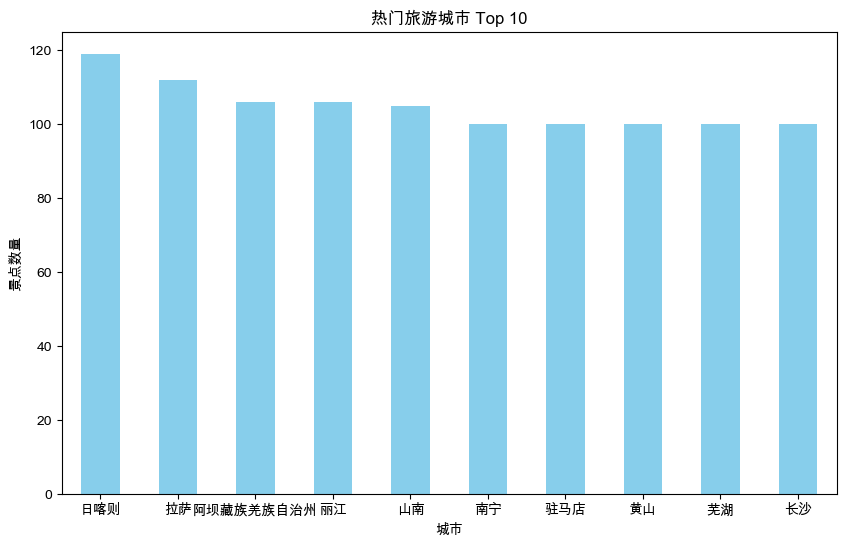

<style>
/* --- 布局辅助样式 --- */
.rows {
  display: grid;
  grid-template-rows: repeat(2, minmax(0, 1fr));
  gap: 1rem;
}
.columns {
  display: grid;
  grid-template-columns: repeat(2, minmax(0, 1fr));
  gap: 1rem;
}
.columns pre code {
  white-space: pre-wrap !important;
  overflow-wrap: break-word !important;
}
/* --- 列表缩进样式修正 --- */
ul, ol {
  padding-inline-start: 25px; /* 减小列表的左侧缩进 */
}
.columns.ratio-4-6 { grid-template-columns: 4fr 6fr; }
.columns.ratio-6-4 { grid-template-columns: 6fr 4fr; }
.columns.ratio-3-7 { grid-template-columns: 3fr 7fr; }
.columns.ratio-7-3 { grid-template-columns: 7fr 3fr; }
.align-top    { display: flex; align-items: flex-start; }
.align-middle { display: flex; align-items: center; }
.align-bottom { display: flex; align-items: flex-end; }
.align-left   { display: flex; justify-content: flex-start; }
.align-center { display: flex; justify-content: center; }
.align-right  { display: flex; justify-content: flex-end; }
.align-top-left     { display: flex; justify-content: flex-start; align-items: flex-start; }
.align-top-center   { display: flex; justify-content: center;  align-items: flex-start; }
.align-top-right    { display: flex; justify-content: flex-end;   align-items: flex-start; }
.align-middle-left  { display: flex; justify-content: flex-start; align-items: center; }
.align-middle-center{ display: flex; justify-content: center;  align-items: center; }
.align-middle-right { display: flex; justify-content: flex-end;   align-items: center; }
.align-bottom-left  { display: flex; justify-content: flex-start; align-items: flex-end; }
.align-bottom-center{ display: flex; justify-content: center;  align-items: flex-end; }
.align-bottom-right { display: flex; justify-content: flex-end;   align-items: flex-end; }
.tip {
  background-color: #f0f8ff;
  border-left: 5px solid #1e90ff;
  padding: 15px 15px 0.1px; 
}
.insight {
  background-color: #eefcff; 
  border-left: 5px solid #17a2b8; 
  padding: 15px 15px 0.1px; 
}
.key-point {
  background-color: #fffbe6; 
  border-left: 5px solid #ffc107; 
  padding: 15px 15px 0.1px; 
}
.tip p, .tip li,
.insight p, .insight li,
.key-point p, .key-point li {
  font-size: inherit !important;
}
.styled-div p, 
.styled-div li, 
.styled-div ol, 
.styled-div ul, 
.styled-div blockquote {
  font-size: inherit !important;
}
</style>


<style scoped>
h1{
  color: #F5F5F5;
  text-shadow: 2px 2px 8px rgba(0, 0, 0, 0.8);
}
h2 {
  color: #E0E0E0;
  text-shadow: 2px 2px 8px rgba(0, 0, 0, 0.8);
}
.course-title {
  position: absolute;
  top: 60px;
  left: 80px;
  background-color: rgba(0, 0, 0, 0.4);
  color: #fff;
  padding: 8px 15px;
  border-radius: 5px;
  font-size: 22px;
  font-weight: bold;
  letter-spacing: 1px;
  border-left: 5px solid #4CAF50;
}
</style>

<div class="course-title">AI赋能软件开发</div>

# 模块五: AI数据分析师(下)
## 第17节课: 可视化入门——让数据“被看见”

<div style="position: absolute; bottom: 40px; left: 80px; color: rgba(255, 255, 255, 0.8); font-size: 18px; font-family: sans-serif;">
南昌大学计算机系 黎鹰
</div>

<!--
- **类型**: 逐字稿
- **内容**: |
  (1分钟) 各位老师好！欢迎来到模块五。
  在上一模块，我们学会了如何清洗和统计数据。但沉睡在表格里的数字很难打动人，今天我们要学习如何让数据“被看见”。
  本模块的主题是“可视化”。我们将使用一份真实的“中国旅游景点数据”，通过绘图来回答“暑假去哪玩？”、“哪里性价比最高？”等有趣的问题。
  第17节课，我们先从最基础的柱状图开始，绘制你的第一张“数据地图”。
-->

<!--
- **类型**: 教学设计
- **内容**: |
  ### 教学时间: 1分钟
  ### 环节: 导入 (Introduction)
  **模块衔接**: 从“数据处理”平滑过渡到“数据展示”。
  **价值主张**: 强调可视化对于“观点表达”和“辅助决策”的重要性。
-->

<!--
- **类型**: 解释
- **内容**: |
  ### 为什么需要可视化？(The "Why" of Visualization)
  **双重编码理论 (Dual Coding Theory)**: 心理学家 Allan Paivio 提出，人脑有两套独立的认知系统：一套处理语言（Verbal），一套处理图像（Visual）。同时调动这两套系统，能显著提升记忆和理解效果。
  
  **图片优势效应 (Picture Superiority Effect)**: 研究表明，人类大脑处理视觉信息的速度比处理文本快 60,000 倍。
  1.  **发现模式 (Pattern Recognition)**: 帮助**您**快速从海量数据中识别趋势、异常和相关性。
  2.  **讲述故事 (Storytelling)**: 用直观的图形更有力地传达**您**的观点。
  3.  **辅助决策 (Decision Support)**: 将复杂信息简化，降低决策时的**认知负荷 (Cognitive Load)**。
  
  本节课我们将使用 Python 中最基础的绘图库 **Matplotlib**。它是 Python 可视化的基石，虽然代码略显繁琐，但理解它有助于您掌握绘图的底层逻辑。
-->

---

## **问题导入：海量数据的认知挑战**

<div class="columns ratio-6-4">
<div>

**场景**：制定全家暑期出游计划。
面对网上铺天盖地的营销软文，我们决定**回归数据**，从 **30,000+** 条真实景点数据中寻找答案。

**痛点**：
面对如此海量的数据，试图通过**人眼**在密密麻麻的表格中寻找规律（比如：哪个城市5A景区最多？），几乎是一个**不可能完成的任务**。

*   ❌ **效率极低**：需要逐行阅读，耗时费力。
*   ❌ **难以比较**：无法直观感知数据之间的数量差异。

</div>
<div class="align-middle-center">


</div>
</div>

<!--
- **类型**: 逐字稿
- **内容**: |
  (2分钟) 来看一个真实场景。暑假要到了，全家想出去玩。
  网上的攻略五花八门。作为一名严谨的教师，我们决定不信广告信数据。
  我们找来了这份包含全国3万多条景点的原始数据表，想看看中国到底哪里旅游资源最丰富。
  但是，面对这几万行数据，光靠眼睛看，可能看一天也看不出名堂。
  在大数据时代，传统的“盯着表格看”的方法已经失效了。
  但如果我把这些数据变成右边这张图呢？（展示柱状图）
  是不是一目了然？北京、重庆、西安，高低立判。这就是可视化的力量：它将抽象的数字瞬间转化为我们可以认知的图形，支持我们做出理性的决策。
-->

<!--
- **类型**: 教学设计
- **内容**: |
  ### 教学时间: 2分钟
  ### 环节: 痛点 (Pain Point)
  通过“3秒挑战”，让学员切身体会表格数据的局限性，从而产生对可视化的强烈需求。
-->

<!--
- **类型**: 解释
- **内容**: |
  ### 认知负荷与可视化 (Cognitive Load & Visualization)
  **工作记忆 (Working Memory)**: 认知心理学认为，人脑的工作记忆容量非常有限（通常为 7±2 个单位）。当**您**面对成千上万行的表格时，试图在脑中构建整体图像会瞬间耗尽认知资源，导致“认知超载”。
  
  **前注意属性 (Preattentive Attributes)**: 可视化利用了人脑强大的视觉皮层，将“阅读数字”转化为“模式识别”。例如，人眼能瞬间识别出**长度**（柱子高低）、**颜色**（深浅）、**位置**（散点分布）。
  这种转化绕过了工作记忆的瓶颈，实现了 **“瞬间认知”**。对于教育工作者来说，这意味着**您**可以用一张图表，在几秒钟内让听众（学生、家长、领导）理解复杂的教学数据。
-->

---

## **愿景：从表格到“数据驾驶舱”**

<div class="align-top-center">


</div>

<div class="insight" style="font-size:0.8em">

🌟 **目标**: 这就是我们作为“AI数据分析师”的终极形态 —— 将冰冷的数据，变成辅助决策的**智慧大脑**。
</div>

<!--
- **类型**: 样式替换
- **版本**: [handout, teacher]
- **查找**: |
    <div class="insight">
- **替换**: |
    <div class='insight' style="margin-top: 1rem;font-size: 0.6em;">
-->

<!--
- **类型**: 逐字稿
- **内容**: |
  (1分钟) 在开始敲代码之前，我想先请大家看一张图。
  (展示驾驶舱图)
  这就是我们学习可视化的终极目标。
  想象一下，当你的校长或领导问你：“我们学校的科研情况怎么样？”或者“这个学科的发展趋势如何？”
  你不再是扔给他一个Excel表，而是展示这样一个“驾驶舱”。
  所有的关键指标、趋势、分布，尽收眼底。
  今天，我们就从最基础的柱状图开始，一步步向这个目标迈进。
-->

<!--
- **类型**: 教学设计
- **内容**: |
  ### 教学时间: 1分钟
  ### 环节: 愿景 (Vision)
  展示最终的高级形态（Dashboard），为枯燥的基础学习提供动力。
-->

<!--
- **类型**: 解释
- **内容**: |
  ### 商业智能 (BI) 仪表盘
  图中展示的通常被称为 **BI Dashboard (商业智能仪表盘)**。它将企业的关键绩效指标 (KPI) 以图形化的方式集中展示。
  虽然我们本节课只学习画单张图表，但这种“将多个图表组合起来讲述一个完整故事”的思维，是数据分析的高级境界。
-->

---

## **1. 引入：海量数据的认知挑战**

<div class="columns">

<div>

### ❌ 这种数据怎么看？
*(密密麻麻的 3000 行 Excel)*
- 北京, 故宫, 5A...
- 上海, 迪士尼, 5A...
- 三亚, 天涯海角, 4A...

**分析目标**: 找出全国 **5A景区最多** 的城市。

</div>

<div>

### ✅ 一图胜千言
*(一张清晰的横向柱状图)*
- 北京: ██████████
- 重庆: ████████
- 西安: ██████

**结论**: 可视化不是为了绘图，是为了**瞬间认知**。

</div>

</div>

<!--
- **类型**: 逐字稿
- **内容**: |
  (1分钟) 我们再来做个直接的对比。
  左边是你以前看数据的方式，右边是你将来展示数据的方式。
  如果要找出5A景区最多的城市，看左边可能要花半小时，还要拿笔统计。看右边，只需要0.5秒。
  大家记住：可视化不是为了绘图而绘图，它的核心目的是“降低认知成本”，让人一眼就能看懂。
-->

<!--
- **类型**: 教学设计
- **内容**: |
  ### 教学时间: 1分钟
  ### 环节: 对比 (Contrast)
  通过Before/After的直接对比，强化可视化的价值。
-->

<!--
- **类型**: 解释
- **内容**: |
  ### 前注意属性 (Preattentive Attributes)
  右图之所以能被“瞬间认知”，是因为它利用了人眼的**前注意属性**。
  这是 Colin Ware 在《Information Visualization: Perception for Design》中提出的核心概念。
  
  **四大核心属性**:
  1.  **形式 (Form)**: 长度、宽度、方向、形状。
  2.  **颜色 (Color)**: 色相、饱和度。
  3.  **位置 (Position)**: 二维空间位置。
  4.  **运动 (Motion)**: 闪烁、移动。
  
  **教学应用**: 当**您**制作教学PPT或展示科研成果时，应有意识地利用这些属性（如用**红色**高亮关键数据，用**长条**表示显著差异）来引导观众的视线，降低他们的理解成本。
-->

---

## **2. 环境搭建与数据加载**

我们将使用一份包含 **3万条** 真实记录的 **中国旅游景点数据集**。

<div class="columns">
<div>

### **任务**
我们不需要死记硬背 `read_csv` 的语法。
直接告诉 AI 你的文件在哪里，让它帮你写代码。

### **AI 指令 (Prompt)**
> "我有一份数据文件，路径是 `data/china_tourism.csv`。
> 请帮我用 pandas 读取它，并打印前 5 行看看数据长什么样。
> 同时，请导入画图需要的 matplotlib 库。"

</div>
<div>

### **AI 生成的代码**
```python
import pandas as pd
import matplotlib.pyplot as plt 

# 读取数据
df = pd.read_csv('data/china_tourism.csv')

# 检查前5行
print(df.head())
```

**预期输出**:
```text
  City          名字  Level ...
0 北京    故宫博物院     5A ...
```

</div>
</div>

<!--
- **类型**: 逐字稿
- **内容**: |
  (2分钟) 接下来我们开始干活。
  别担心记不住代码，**AI就是您的外脑**。
  您不需要去背诵怎么读CSV文件。您只需要清晰地告诉AI：“文件在哪里，我要做什么”。
  大家试着把这段话发给AI，看看它是不是立刻就把代码写好了？
  这就是AI时代的编程方式：**您负责指挥，AI负责实现**。
-->

<!--
- **类型**: 教学设计
- **内容**: |
  ### 教学时间: 2分钟
  ### 环节: 支架 (Scaffolding)
  通过简单的环境搭建，降低学员的畏难情绪。
-->

<!--
- **类型**: 解释
- **内容**: |
  ### Pandas与Matplotlib：数据科学的双璧
  - **Pandas**: 名字来源于 "Panel Data"（面板数据）。它是 Python 数据分析的**瑞士军刀**，提供了类似于 Excel 的数据结构 (DataFrame) 和操作接口。
  - **Matplotlib**: 名字来源于 "MATLAB Plotting Library"。它的设计初衷是在 Python 中复刻 MATLAB 强大的绘图功能。
  
  **架构关系**:
  Matplotlib 是底层绘图引擎，功能强大但 API 繁琐（需要写很多行代码来配置坐标轴、图例等）。
  Pandas 在 Matplotlib 之上封装了一层高级接口 (`df.plot()`)，让**您**可以直接针对 DataFrame 绘图，大大简化了代码量。
  这体现了软件工程中的**分层设计 (Layered Architecture)** 思想：底层负责灵活强大，上层负责简单易用。
-->

---

## **⚠️ 技术贴士：中文显示的本地化配置**

<div class="columns">
<div>

**解决方案**: 这是通用的 **“标准配置”**，**无需理解原理**，建议将此段配置保存，**每次画图前复制粘贴**即可。

</div>
<div>


```python
# --- 解决中文乱码的标准配置 ---

# 设置中文字体 (自动适配 Windows/Mac)
plt.rcParams['font.sans-serif'] = ['SimHei', 'Arial Unicode MS'] 

# 解决负号显示为方块的问题
plt.rcParams['axes.unicode_minus'] = False 
```

</div>
</div>
<div class="tip">

💡 **常见问题**: Python 绘图库默认不支持中文，直接画图会显示为方块 (□□□)。
</div>

<!--
- **类型**: 样式替换
- **版本**: [handout, teacher]
- **查找**: |
    <div class="tip">
- **替换**: |
    <div class='tip' style="margin-top: 1rem;font-size: 0.6em;">
-->

<!--
- **类型**: 逐字稿
- **内容**: |
  (3分钟) 在开始画图前，我们需要做一个小小的“启动仪式”。
  如果您直接用Python画中文图表，字符可能会显示为乱码（方块）。这是因为Python的绘图库默认只适配英文字体。
  解决办法很简单，就是指定使用中文字体。
  这段代码不需要理解原理，建议大家把它保存在常用的代码片段库中。每次画图前，把它复制粘贴到代码的开头，即可解决问题。
  注意区分Windows和Mac系统，所调用的字体文件略有不同。
-->

<!--
- **类型**: 教学设计
- **内容**: |
  ### 教学时间: 3分钟
  ### 环节: 常见错误 (Common Errors)
  提前解决技术障碍，避免学员在实操时因乱码产生挫败感。
-->

<!--
- **类型**: 解释
- **内容**: |
  ### 为什么会有中文乱码？(The Encoding Problem)
  这是一个经典的**国际化 (i18n)** 问题。
  
  **字体文件 (Font File)**: 计算机绘图需要字体文件（如 `.ttf`）来描述每个字符的形状（字形，Glyph）。
  **Matplotlib 的默认设置**: 它默认使用的字体（如 `DejaVu Sans`）只包含 ASCII 字符（英文、数字、标点），**不包含**庞大的中文字符集（CJK）。
  
  **方块 (Tofu)**: 当程序试图绘制“北京”两个字时，它在默认字体中找不到对应的字形描述，就会显示为一个“缺失符号”（通常是方块，俗称 Tofu）。
  
  **解决方案**: 代码 `plt.rcParams['font.sans-serif'] = ['SimHei']` 的作用就是修改全局配置，告诉 Matplotlib：“请去加载 `SimHei`（黑体）这个字体文件”，从而正确渲染中文。
-->

---

## **3. 任务一：旅游资源分布分析 (计数与柱状图)**

<div class="columns ratio-4-6">
<div>

### **场景**
暑假想带孩子去一个景点**最密集**的地方，优化交通时间成本。

### **数据逻辑**
我们要做的动作叫 **“计数” (Counting)**。
即：统计 `City` 列中，每个城市出现了多少次。

</div>
<div>

### **AI 指令 (Prompt)**

> "请帮我统计 `City` 这一列中，各个城市出现的次数。
> 然后取前 10 名，画一个**柱状图 (Bar Chart)**。
> 标题设为 '热门旅游城市 Top 10'，颜色设为天蓝色。"

</div>
</div>

<!--
- **类型**: 逐字稿
- **内容**: |
  (3分钟) 第一个任务：我们要寻找“景点最多”的城市。
  在数据层面，这本质上是一个**“计数” (Counting)** 的过程。也就是统计 `City` 这一列中，“北京”出现了几次，“上海”出现了几次。
  这就像**您**统计全班同学的籍贯一样，数一数每个省有多少人。
  我们指挥 AI 来完成。指令很简单：统计 City 列的频次，取前 10 名，并绘制柱状图。
-->

<!--
- **类型**: 教学设计
- **内容**: |
  ### 教学时间: 3分钟
  ### 环节: 任务 (Task)
  从简单任务入手，建立信心。
-->

<!--
- **类型**: 解释
- **内容**: |
  ### 原始数据 vs. 聚合数据 (Raw vs. Aggregated Data)
  这是数据分析中一对核心概念，理解它们的区别至关重要。
  
  - **原始数据 (Raw Data)**: 未经处理的记录。每一行代表一个具体的实体（如一个景点、一次交易）。
    - **类比**: **您**收上来的几百份**学生试卷**，每一份都是独立的。
  - **聚合数据 (Aggregated Data)**: 经过统计汇总后的数据。每一行代表一个类别（如一个城市、一个班级）。
    - **类比**: **您** 统计出的 **“各分数段人数表”** 或 **“班级平均分表”**。
  
  **思维跃迁**: 画图（尤其是统计图表）通常都是基于**聚合数据**进行的。从关注“个例”（Raw）转向关注“整体分布”（Aggregated），是**您**成为数据分析师的关键思维跃迁。
-->

---

## **代码解析：`.value_counts()`**

<div class="columns">
<div>

```python
# 1. 统计 + 排序 + 取前10
# value_counts() 自动按数量降序排列
top_cities = df['City'].value_counts().head(10)

# 2. 画图 (kind='bar')
# figsize=(10, 6) 控制图片大小
# rot=0 让x轴标签横向显示，提升阅读体验
top_cities.plot(kind='bar', figsize=(10, 6), 
                color='skyblue', rot=0)

plt.title('热门旅游城市 Top 10')
plt.xlabel('城市')
plt.ylabel('景点数量')
plt.show()
```

</div>
<div>

### **关键点**
*   **`value_counts()`**: 数据分析高频函数，专门用于统计分类数据的频次。
*   **`kind='bar'`**: 指定绘制“柱状图”。
*   **`plt.show()`**: 显示图表。

</div>
</div>

<!--
- **类型**: 逐字稿
- **内容**: |
  (5分钟) 看看AI生成的代码。核心就是 `value_counts()` 函数，它非常智能，不仅完成了计数，还自动按降序排列。
  画图的代码也很直观，`plot(kind='bar')`，即指定图表类型为柱状图。
  **不用被这些参数吓倒**，您只需要关注 `kind` 这个词，它决定了图的样子。
  大家可以在自己的电脑上运行一下，生成的图表是否直观展示了Top 10城市的排名？
-->

<!--
- **类型**: 教学设计
- **内容**: |
  ### 教学时间: 5分钟
  ### 环节: 代码解读 (Walkthrough)
  重点解释 `kind` 和 `head()`，让学员理解代码与图表的对应关系。
-->

<!--
- **类型**: 解释
- **内容**: |
  ### Pandas 绘图接口设计
  Pandas 采用了**面向对象**的封装方式，将绘图功能集成在 DataFrame 对象上。
  
  - **`df.plot()`**: 这是入口函数。
  - **`kind` 参数**: 这是一个**多态 (Polymorphism)** 设计。通过改变这个参数，同一个函数可以表现出完全不同的行为（画出不同类型的图）。
    - `kind='bar'`: 垂直柱状图 (Vertical Bar Plot)
    - `kind='barh'`: 水平柱状图 (Horizontal Bar Plot)
    - `kind='line'`: 折线图 (Line Plot)
  
  **`rot=0`**: 这是一个细节优化。默认情况下，Pandas 为了防止标签重叠，会将 x 轴标签旋转 90 度。但这对于中文阅读非常不友好。将其设为 0，强制标签水平放置，体现了**用户体验 (UX)** 优先的设计思维。
-->

---

## **3. 旅游资源分布分析结果**

<div class="columns ratio-4-6" style="font-size:0.8em">
<div>

### **图表解读**
*   **Top 1**: 日喀则以绝对优势位居榜首，拉萨紧随其后。
*   **趋势**: 热门城市多集中在**西藏、云南**等自然风光与民族文化浓郁的地区。
*   **意外发现**: 驻马店等非传统热门城市上榜，说明 A 级景区数量多并不完全等同于游客热度高。

### **价值**
这张图瞬间帮我们从 3000 多条数据中锁定 **“资源最丰富”** 的地区，为目的地选择提供了第一手依据。

</div>
<div class="align-middle-center">



</div>
</div>

<!--
- **类型**: 逐字稿
- **内容**: |
  (2分钟) 来看结果。这张图很有意思。
  排第一的竟然是日喀则，第二是拉萨。这说明西藏的A级景区密度非常高。
  丽江、山南紧随其后。
  这让我们一眼就看出来了：如果你喜欢自然风光和民族文化，往西南、西北走准没错。
  这就是可视化的力量，它把枯燥的计数变成了直观的决策地图。
-->

<!--
- **类型**: 教学设计
- **内容**: |
  ### 教学时间: 2分钟
  ### 环节: 结果解读 (Interpretation)
  引导学员学会“看图说话”，从简单的排名中提取有价值的业务信息（如地域分布规律）。
-->

<!--
- **类型**: 解释
- **内容**: |
  ### 帕累托法则 (Pareto Principle)
  这张图表揭示了旅游资源分布的极度不均衡性，这符合著名的**帕累托法则**，也称为**二八定律 (80/20 Rule)**。
  
  **历史背景**: 1906年，意大利经济学家 **Vilfredo Pareto** 发现，意大利 80% 的土地由 20% 的人口所有。后来这一规律被推广到各个领域。
  
  **数据洞察**: 在本案例中，少数几个头部城市（如日喀则、拉萨、丽江）占据了绝大多数的 5A/4A 景区资源。
  **应用**: 理解这种“幂律分布” (Power Law Distribution) 是进行商业分析（如识别核心客户）或政策制定（如资源倾斜）的基础。
-->

---

## **4. 核心任务二：旅游成本分析 (分组与聚合)**

<div class="columns ratio-4-6">
<div>

### **场景**
预算有限，希望识别门票价格较高的城市，进行规避。
**哪个城市的平均门票价格最高？**

### **数据逻辑：分组聚合**
1.  **拆分**: 将数据按“城市”分组。
2.  **计算**: 计算每组的“平均价格”。
3.  **排序**: 按价格从高到低排列。

</div>
<div>

### **AI 指令 (Prompt)**

> "我有一列 `City` (城市) 和一列 `Sold_Price` (价格)。
> 请帮我按城市分组 (`groupby`)，计算每个城市的**平均价格**。
> 然后**从高到低排序**，取前 10 名。
> 最后画一个**横向柱状图 (barh)**，方便阅读城市名。"

</div>
</div>

<!--
- **类型**: 逐字稿
- **内容**: |
  (5分钟) 第二个任务稍微复杂一点。我们要分析“价格”维度。
  这里单纯计数是不够的，我们需要计算**“平均值”**。
  这就涉及到一个重要的数据思维：**分组聚合 (Group By)**。
  它的逻辑是：
  1.  **拆分**：先把所有单据按“城市”分开。
  2.  **计算**：对每一堆单据计算“平均金额”。
  3.  **合并**：最后把结果排个序。
  这就像**您**计算班级平均分：先按班级把试卷分开，再算每个班的平均分。对应的代码指令就是 `groupby`。
-->

<!--
- **类型**: 教学设计
- **内容**: |
  ### 教学时间: 5分钟
  ### 环节: 进阶任务 (Advanced Task)
  引入 `groupby`，这是数据分析中最重要的概念之一。
-->

<!--
- **类型**: 解释
- **内容**: |
  ### “拆分-应用-合并” (Split-Apply-Combine)
  这是数据科学大师 **Hadley Wickham** (R语言 ggplot2 作者) 提出的著名策略，是处理分组运算的标准范式。
  
  **过程详解**:
  1.  **Split (拆分)**: 将数据集按某个键（如 `City`）切分成多个小块。
      - *类比*: 将全校试卷按 **“班级”** 分堆。
  2.  **Apply (应用)**: 对每个小块独立应用一个函数（如 `mean()`）。
      - *类比*: 计算每一堆试卷的 **“平均分”**。
  3.  **Combine (合并)**: 将计算结果重新组合成一个新的数据结构。
      - *类比*: 填入一张新的 **“年级成绩表”**。
  
  Pandas 的 `groupby` 函数完美实现了这一策略，让**您**能用一行代码完成这个复杂的“分治”过程。
-->

---

## **代码解析：`.groupby()`**

```python
# 1. 分组 -> 计算平均值 -> 排序 -> 取前10
# groupby('City'): 按城市分组
# ['Sold_Price'].mean(): 计算价格平均值
expensive_cities = df.groupby('City')['Sold_Price'].mean() \
                     .sort_values(ascending=False).head(10)

# 2. 画横向柱状图 (kind='barh')
# alpha=0.8 设置透明度，视觉效果更柔和
expensive_cities.plot(kind='barh', figsize=(10, 6), color='salmon', alpha=0.8)

plt.title('平均门票价格最贵的城市 Top 10')
plt.xlabel('平均价格 (元)')
plt.show()
```

<div class="insight">

💡 **技巧**: 当标签（城市名）较长时，使用**横向柱状图 (`barh`)** 阅读体验更好。
</div>

<!--
- **类型**: 样式替换
- **版本**: [handout, teacher]
- **查找**: |
    <div class="insight">
- **替换**: |
    <div class='insight' style="margin-top: 1rem;font-size: 0.6em;">
-->

<!--
- **类型**: 逐字稿
- **内容**: |
  (5分钟) 这段代码逻辑清晰。
  `groupby('City')` 执行分组，`['Sold_Price'].mean()` 执行计算。
  注意这里我们使用了 `barh`（Horizontal Bar），即横向柱状图。对于中文标签较长的情况，横向排版能避免标签重叠，提升阅读体验。
  运行一下，看看平均价格最高的城市是否符合您的预期？
-->

<!--
- **类型**: 教学设计
- **内容**: |
  ### 教学时间: 5分钟
  ### 环节: 视觉优化 (Visual Optimization)
  教授横向柱状图的适用场景（长标签），培养学员对阅读体验的关注。
-->

<!--
- **类型**: 解释
- **内容**: |
  ### 为什么用 barh？(Visual Ergonomics)
  这是一个**视觉人体工程学**的问题。
  
  **阅读习惯**: 人眼的自然阅读顺序是从左到右、从上到下。
  **标签可读性**: 
  - **垂直柱状图 (Bar)**: x轴标签空间有限。当标签很长（如“阿坝藏族羌族自治州”）时，必须旋转或换行，导致阅读困难。
  - **水平柱状图 (Barh)**: y轴标签有充足的横向空间，可以完整展示长文本，且符合从左到右的阅读流。
  
  **最佳实践**: 当分类标签超过 5-7 个字符，或者类别数量较多（>10）时，优先选择 **横向柱状图**。
-->

---

## **4. 旅游成本分析结果**

<div class="columns ratio-4-6" style="font-size:0.8em">
<div>

### **图表解读**
*   **Top 3**: **甘孜**以接近 300 元的均价遥遥领先，**三沙**、**林芝**紧随其后。
*   **规律**: “最贵”的城市主要集中在**西部高原**（甘孜、林芝、怒江、迪庆）和**稀缺海岛**（三沙）。
*   **商业乐园**: 广州、珠海的上榜，主要是由长隆等大型商业主题乐园的高票价拉动的。

### **洞察**
“贵”通常意味着**稀缺**（高原/海岛）或**高投入**（大型乐园）。

</div>
<div class="align-middle-center">


</div>
</div>

<!--
- **类型**: 逐字稿
- **内容**: |
  (2分钟) 看看这张图，谁是“钱包刺客”？
  甘孜、林芝、三沙。这告诉我们要去这些地方玩，预算得备足了。
  为什么它们贵？因为它们要么是高原，要么是海岛，资源极度稀缺，维护成本极高。
  另外，像广州、珠海进榜，是因为那里有长隆这样的大型游乐园。
  所以，数据不仅告诉我们“多少钱”，还暗示了“钱花哪儿了”。
-->

<!--
- **类型**: 教学设计
- **内容**: |
  ### 教学时间: 2分钟
  ### 环节: 结果验证 (Verification)
  通过分析高价城市的分布规律，让学员理解数据背后的地理与经济逻辑。
-->

<!--
- **类型**: 解释
- **内容**: |
  ### 稀缺性溢价 (Scarcity Premium)
  价格不仅仅是成本的反映，更是 **供需关系**的体现。
  
  **经济学原理**: 
  - **供给侧**: 甘孜、三沙拥有不可复制的自然资源（高原、纯净海岛），供给极度有限。
  - **需求侧**: 随着消费升级，人们对独特体验的追求增加。
  
  这种供需失衡导致了 **“稀缺性溢价”**。对于数据分析师来说，看到高价异常值时，不要急着认为是数据错误，先思考一下背后是否存在这种“稀缺性”逻辑。
  这提醒**您**：数据分析不能脱离 **领域知识 (Domain Knowledge)**，否则容易得出肤浅甚至错误的结论。
-->

---

## **5. 任务三：不同等级景区数量对比**

<div class="columns ratio-4-6">
<div>

### **任务**
我们只看了城市和价格，还没看过 **景区等级** (`Level`)。
1.  统计全国 **5A、4A、3A** 景区各有多少个？
2.  画一个 **饼图 (Pie Chart)** 来展示比例。

</div>

<div>

### **AI 指令**
> "请帮我统计 `Level` 列中每个等级的数量。
> 然后画一个**饼图 (Pie Chart)**。
> 标题设为 '中国A级景区等级分布'。"

</div>
</div>

<!--
- **类型**: 逐字稿
- **内容**: |
  (2分钟) 在总结之前，请大家进行一个小练习。
  我们还有一列重要数据没看过，就是“景区等级”。
  请大家指挥 AI，统计一下 5A、4A、3A 各有多少个，并且画一个**饼图 (Pie Chart)**。
  饼图最适合用来展示**“占比”**。大家试试看，能不能直观地展示出各等级景区的比例关系？
-->

<!--
- **类型**: 教学设计
- **内容**: |
  ### 教学时间: 2分钟
  ### 环节: 练习 (Practice)
  发布练习任务，引导学员独立思考 AI 指令。
-->

<!--
- **类型**: 解释
- **内容**: |
  ### 饼图的争议与适用性 (The Pie Chart Controversy)
  数据可视化界对饼图褒贬不一。Edward Tufte 等大师认为饼图难以精确比较面积。
  **适用场景**: 当**您**关注的是“部分与整体的关系” (Part-to-Whole)，且类别较少（<5个）时，饼图依然是最直观的选择。
  **最佳实践**: 如果类别过多，饼图会变得难以阅读（“碎盘子”效应），此时应优先选择**条形图**。
-->

---

## **代码解析：饼图绘制**

<div class="columns">
<div>

```python
# 1. 统计
level_counts = df['Level'].value_counts()

# 2. 画饼图 (kind='pie')
# autopct='%1.1f%%' 显示百分比
level_counts.plot(kind='pie', figsize=(6, 6), 
                  autopct='%1.1f%%', title='等级分布')
plt.ylabel('') # 去掉Y轴标签更美观
plt.show()
```

</div>
<div>

### **关键点**
*   **`kind='pie'`**: 指定绘制饼图。
*   **`autopct`**: 自动计算并显示百分比，`%1.1f%%` 表示保留一位小数。
*   **`plt.ylabel('')`**: 饼图默认会显示Y轴标签，通常为了美观会将其隐藏。

</div>
</div>

<!--
- **类型**: 逐字稿
- **内容**: |
  (3分钟) 来看看代码。
  核心依然是 `value_counts()` 统计数量。
  画图时，我们用了 `kind='pie'`。
  注意这个 `autopct` 参数，它是用来显示百分比的，虽然看起来有点复杂，但AI会帮我们写好。
  另外，为了图表好看，我们通常会把Y轴的标签给去掉。
-->

<!--
- **类型**: 教学设计
- **内容**: |
  ### 教学时间: 3分钟
  ### 环节: 代码解读 (Walkthrough)
  讲解饼图特有的参数设置（如百分比显示）。
-->

<!--
- **类型**: 解释
- **内容**: |
  ### 格式化字符串 (Format String)
  `autopct='%1.1f%%'` 中的 `%1.1f` 是 Python 经典的 C 风格格式化符号 (C-style Formatting)，虽然现在推荐用 f-string，但在 Matplotlib 等老牌库中依然广泛使用。
  - `%`: 占位符开始。
  - `1.1`: 总宽度至少1位，保留1位小数。
  - `f`: 浮点数 (float)。
  - `%%`: 转义字符，输出一个字面量的百分号。
  
  **绘图美学 (Aesthetics)**:
  `plt.ylabel('')` 的作用是移除 Y 轴标签。虽然在数学上饼图没有 Y 轴，但 Pandas 绘图函数默认会把列名作为 Y 轴标签打印在图表左侧。这在饼图中显得多余且破坏美感，因此我们习惯性地将其隐藏。这体现了 **“少即是多” (Less is More)** 的设计原则。
-->

---

## **5. 景区等级分布分析结果**

<div class="columns">
<div>

### **图表解读**
*   **占比最大**: **3A景区**占据了半壁江山（约56.8%），是A级景区的主力军。
*   **中坚力量**: **4A景区**占比约为25%，提供了丰富的高质量旅游选择。
*   **金字塔尖**: **5A景区**最为稀缺，仅占约2.4%，代表了国内顶级旅游资源。

### **洞察**
中国旅游景区等级分布呈现出典型的**钻石型结构**，中间等级（3A）数量最多。

</div>
<div class="align-middle-center">


</div>
</div>

<!--
- **类型**: 逐字稿
- **内容**: |
  (2分钟) 来看这张饼图，非常直观。
  蓝色这一大块，超过一半都是3A景区。
  橙色这块是4A，占了四分之一。
  而红色的5A景区，只有小小的一条缝，才2.4%。
  这说明什么？说明优质旅游资源是稀缺的，5A真的是“百里挑一”。
-->

<!--
- **类型**: 教学设计
- **内容**: |
  ### 教学时间: 2分钟
  ### 环节: 结果解读 (Interpretation)
  通过饼图直观展示“金字塔结构”，强化稀缺性概念。
-->

<!--
- **类型**: 解释
- **内容**: |
  ### 结构化分析 (Structural Analysis)
  通过饼图，**您**不仅看到了“各有多少”，更看到了数据的 **“结构” (Structure)**。
  这种 **中间大、两头小**的结构（3A最多，5A和1A较少）在社会科学中非常常见，类似于**正态分布 (Normal Distribution)** 的钟形曲线。
  
  **产业洞察**:
  - **5A (塔尖)**: 稀缺资源，主打品牌溢价。
  - **3A/4A (塔身)**: 中坚力量，主打性价比和大众市场。
  
  这种从图形到结构的思维跃迁，是数据分析师的核心素养。
-->

---

## **6. 课程小结**

<div class="columns">
<div>

### **我们学到了什么？**
1.  **中文配置**: 复制粘贴 `plt.rcParams`。
2.  **数量排名**: 使用 **柱状图** (bar) 展示 Top 10。
3.  **分类比较**: 使用 **条形图** (barh) 展示长标签数据。
4.  **占比分析**: 使用 **饼图** (pie) 展示整体结构。

</div>
<div>

### **下节课预告**
我们现在只能看到“哪里多”、“哪里贵”。
但 **“贵真的代表好吗？”**
下节课，我们将化身侦探，用 **散点图**、**直方图** 和 **箱线图**，去挖掘数据背后更深层的秘密关系与分布规律！

</div>
</div>

<!--
- **类型**: 逐字稿
- **内容**: |
  (1分钟) 好，时间到。这节课我们一口气学会了柱状图、条形图和饼图。
  大家已经掌握了看数据的“上帝视角”。
  但是，作为分析师，光看表面是不够的。下节课，我们要深入数据内部，用散点图、直方图和箱线图，去侦破变量之间更复杂的关系。
  下节课见！
-->

<!--
- **类型**: 教学设计
- **内容**: |
  ### 教学时间: 1分钟
  ### 环节: 总结 (Summary)
  回顾知识点，并抛出下节课的悬念，保持学员兴趣。
-->

<!--
- **类型**: 解释
- **内容**: |
  ### 图表选择指南 (Chart Selection Guide)
  这是数据可视化的核心方法论，通常被称为 **"Visual Vocabulary" (视觉词汇)**。
  
  1.  **比较 (Comparison)**: 
      - 项目少: **柱状图 (Bar)**
      - 项目多/标签长: **条形图 (Barh)**
  2.  **构成 (Composition)**: 
      - 静态占比: **饼图 (Pie)**
      - 随时间变化: 堆叠柱状图 (Stacked Bar)
  3.  **分布 (Distribution)**: **直方图 (Histogram)**, **箱线图 (Boxplot)** (下节课重点)
  4.  **关系 (Relationship)**: **散点图 (Scatter)** (下节课重点)
  
  掌握这个分类体系，**您**就能应对 80% 的日常分析需求。
-->