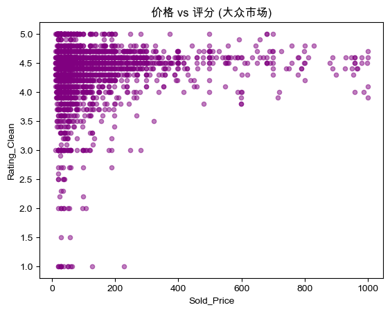
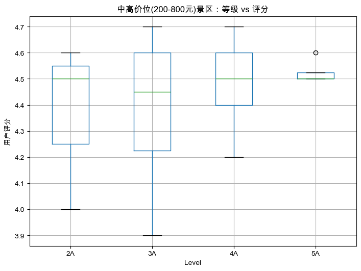

## **引入：验证经验假设**

<div class="columns ratio-6-4">
<div>

**思考**：
在我们的潜意识里，是不是觉得“价格与质量成正比”？
**门票越贵的景区，评分就应该越高吗？**

*   ❌ **直觉**：这只是一个**假设 (Hypothesis)**。
*   ✅ **数据**：分析师不信直觉，只信**证据**。

**侦探工具**：散点图 (Scatter Plot)。

</div>
<div class="align-middle-center">


</div>
</div>

<div class="styled-box design-box">
<strong class="box-title">[教学设计]</strong>

### 教学时间: 2分钟
### 环节: 认知冲突 (Cognitive Conflict)
利用大众常识（一分钱一分货）与可能的数据事实制造冲突，提高学员的探究欲望。

</div>

---

## **本课学习目标**

<div class="columns">
<div>

学完这节课，你将能够：

1.  **思维**: 从“看结果”进阶到“找关系”。
2.  **工具**: 掌握 **散点图 (Scatter)** 和 **直方图 (Hist)** 的绘制。
3.  **实战**: 验证“价格越高，体验越好”的假设是否成立。
4.  **技能**: 使用多条件筛选 (`df[(A) & (B)]`) 寻找高性价比数据。

</div>
<div class="align-middle-center">


</div>
</div>

<div class="styled-box design-box">
<strong class="box-title">[教学设计]</strong>

### 教学时间: 1分钟
### 环节: 目标 (Objective)
明确本节课将掌握的核心图表类型和分析思维。

</div>

---

## **任务一：价格 vs 评分 (散点图实战)**

<div class="columns ratio-4-6" style="font-size:0.8em">
<div>

### **场景**
我们要在一张图上把所有 **3000多个** 收费景点都画出来。
看看它们是排成一条线（有关系），还是散落一地（没关系）。

### **AI 指令 (Prompt)**
> "请帮我画一个**散点图 (Scatter Plot)**：
> - **X轴**: `Sold_Price` (价格)
> - **Y轴**: `Rating_Clean` (评分)
> - 设置点的**透明度 (alpha)** 为 0.5，以免点太密集看不清。"

</div>
<div>

### **代码解析**
```python
# kind='scatter'
# alpha=0.5 让重叠的点颜色变深
df.plot(kind='scatter', x='Sold_Price', y='Rating_Clean', 
        alpha=0.5, color='purple')

plt.title('价格 vs 评分：寻找高性价比景点')
plt.xlabel('门票价格')
plt.ylabel('用户评分')
plt.grid(True) # 加网格更好看
plt.show()
```

</div>
</div>

<div class="styled-box design-box">
<strong class="box-title">[教学设计]</strong>

### 教学时间: 5分钟
### 环节: 任务 (Task)
指导学员使用 `kind='scatter'` 绘制散点图，并强调 `alpha` 参数在处理大数据量时的重要性。

</div>

---

## **侦探时刻：你看到了什么？**

<div class="columns" style="font-size:0.8em">
<div>

### **图表解读**
*   **直觉预期**: 点应该均匀分布，或者排成一条线。
*   **实际看到的**: 
    1.  **图形畸形**: 大部分点都挤在左边一条狭长的区域里。
    2.  **右侧空旷**: 极少数几个点跑到了最右边（价格极高）。
    3.  **底部堆积**: 有很多评分为 0 的点。

### **初步判断**
这张图 **“生病了”**！
异常值（天价）和无效值（0分）严重干扰了我们的视线，导致我们看不清大部分正常景点的分布规律。

</div>
<div>


<div class='insight' style="margin-top: 1rem;font-size: 0.6em;">

💡 **洞察**: 在得出结论之前，我们必须先**清洗数据**。
</div>

</div>
</div>

<div class="styled-box design-box">
<strong class="box-title">[教学设计]</strong>

### 教学时间: 3分钟
### 环节: 诊断 (Diagnosis)
引导学员发现“原始图表”的缺陷，引出数据清洗的必要性，培养严谨的数据态度。

</div>

---

## **优化迭代：清洗后再看真相**

<div class="columns ratio-4-6">
<div>

### **清洗策略**
为了分析 **“付费景点的性价比”**，我们需要做三件事：
1.  **去天价**: 过滤价格 > 1000 的高端套餐。
2.  **去杂项**: 过滤价格 < 10 的电子导览/代金券。
3.  **去零分**: 过滤评分 = 0 的景点（暂无评分）。

</div>
<div>

### **代码实现**
```python
# 多条件筛选：保留 有评分、收费合理(10-1000元)的景点
df_filtered = df[
    (df['Rating_Clean'] > 0) & 
    (df['Sold_Price'] > 10) & 
    (df['Sold_Price'] < 1000)
]

df_filtered.plot(kind='scatter', 
                 x='Sold_Price', y='Rating_Clean', 
                 alpha=0.5, color='purple')
plt.show()
```

</div>
</div>

<div class="styled-box design-box">
<strong class="box-title">[教学设计]</strong>

### 教学时间: 2分钟
### 环节: 迭代 (Iteration)
展示清洗逻辑与代码，强调“为了什么目标（分析性价比）而清洗”。

</div>

---

## **现在的真相：复杂的关系**

<div class="columns">
<div>

### **市场规律解读**
清洗后的图揭示了更有趣的市场规律：

1.  **低价区 (0-200元)**：**良莠不齐**。既有高分宝藏，也有低分雷区。选低价需“慧眼”。
2.  **中高价区 (200-800元)**：**品质收敛**。低分点消失，分数集中在高分段。**花钱能买到“下限保障”**。
3.  **高价区 (>800元)**：**边际效应**。价格再高，评分未线性上升，反而因用户高期待而略有回落。

</div>
<div class="align-middle-center">



</div>
</div>

<div class="styled-box design-box">
<strong class="box-title">[教学设计]</strong>

### 教学时间: 3分钟
### 环节: 洞察 (Insight)
深度解读图表形态，将数据现象转化为商业或生活常识。

</div>

---

## **任务二：寻找“高性价比标杆” (多条件筛选)**

<div class="columns ratio-4-6" style="font-size:0.8em">
<div>

### **场景**
既然图上有“宝藏区”（左上角），怎么把它们的名字找出来？

### **AI 指令 (Prompt)**
> "请帮我筛选出那些 **'高分低价'** 的景点。
> 条件是：
> 1. `Rating_Clean` 大于等于 4.8
> 2. `Sold_Price` 在 **50 到 200** 之间 (大众消费主力区)
> 
> 请列出这些景点的名字、城市和价格，按**评分从高到低**排序。"

</div>
<div>

### **代码解析**
```python
# 两个条件中间用 & 连接
# 每个条件必须加括号 ()，这是语法硬性规定
bargain_spots = df[ 
    (df['Rating_Clean'] >= 4.8) & 
    (df['Sold_Price'] >= 50) &
    (df['Sold_Price'] <= 200)
]

# 排序并显示
print(bargain_spots.sort_values('Rating_Clean', ascending=False) \
      [['名字', 'City', 'Sold_Price', 'Rating_Clean']].head(10))
```
<div class='tip' style="margin-top: 1rem;font-size: 0.6em;">

💡 **思考**: 有些景点虽然是 5.0 分，但可能非常小众（评分人数少），存在偶然性。在进阶分析中，通常需要引入 **“评论数”** 作为置信度门槛。
</div>

</div>
</div>

<div class="styled-box design-box">
<strong class="box-title">[教学设计]</strong>

### 教学时间: 5分钟
### 环节: 技能迁移 (Transfer)
复习模块四的筛选技能，并引入新的复杂逻辑（多条件与/或）。

</div>

---

## **任务二结果：高性价比宝藏榜**

<div class="columns">
<div>

### **榜单解读**
*   **特征分析**: 相比于低价区（<50元）多为公园/博物馆，这个区间（50-200元）涌现了大量 **“高成本体验型”旅游项目**，如**漂流、索道、海洋世界、溶洞**。
*   **价值发现**: 这些项目运营成本较高，能在这个价格段拿到高分，说明 **“物超所值”**。

### **⚠️ 避坑指南**
*   **样本量陷阱**: 某些 5.0 分景点可能只有寥寥几人评价（小众景点）。
*   **进阶技巧**: 在真实业务中，通常会要求 **“评论数 > 50”** 才纳入榜单，以确保评分的可靠性。

</div>
<div>

| 景点名称 | 城市 | 价格 |
| :--- | :--- | :--- |
| 九泷十八滩漂流 | 韶关 | 138 |
| 云丘山玉皇顶索道 | 临汾 | 70 |
| 阳泉海洋世界 | 阳泉 | 78 |
| 抚顺苏子河漂流 | 抚顺 | 73 |
| 石龙大峡谷 | 梧州 | 50 |
| 武进太湖湾景区 | 常州 | 60 |

*(注：均为评分>4.8的真实数据)*

</div>
</div>

<div class="styled-box design-box">
<strong class="box-title">[教学设计]</strong>

### 教学时间: 2分钟
### 环节: 结果验证 (Verification)
解读分析结果，并指出数据分析中的常见陷阱（样本量），培养批判性思维。

</div>

---

## **任务三：评分是否存在偏态分布？(直方图)**

<div class="columns ratio-4-6">
<div>

### **场景**
你可能会发现，怎么筛出来全是 4.8 分以上的？是不是大家的评分都很高？
我想看看**大部分景点的评分**到底在哪个区间？

### **工具：直方图 (Histogram)**
它可以告诉我们数据的**分布形状**。

</div>
<div>

### **AI 指令 (Prompt)**
> "请帮我画一个**直方图 (Histogram)**，看看 `Rating_Clean` 这一列的分布情况。
> 将数据分成 20 个区间 (bins=20)。"

### **代码解析**
```python
# kind='hist'
# 过滤掉0分（无评分）的数据
df[df['Rating_Clean'] > 0]['Rating_Clean'].plot(
    kind='hist', bins=20, 
    color='teal', edgecolor='black'
)

plt.title('全国景点评分分布图')
plt.show()
```

</div>
</div>

<div class="styled-box design-box">
<strong class="box-title">[教学设计]</strong>

### 教学时间: 5分钟
### 环节: 批判性思维 (Critical Thinking)
引导学员质疑数据（评分是否虚高），并引入直方图作为验证工具。

</div>

---

## **侦探分析：直方图解读**

<div class="columns">
<div>

### **观察**
*   图像严重**左偏**（高高的柱子集中在右侧）。
*   绝大多数评分都在 **4.0 - 5.0** 之间。
*   3.0 分以下的景点极少。

### **结论**
*   **评分虚高**: 确实存在，这被称为 **“评分通胀”**。
*   **决策调整**: 在选景点时，**4.0 分可能只是及格线**，4.5 分以上才算优秀。

</div>
<div class="align-middle-center">


</div>
</div>

<div class="styled-box design-box">
<strong class="box-title">[教学设计]</strong>

### 教学时间: 2分钟
### 环节: 结论 (Conclusion)
从图形形态推导出业务含义（评分通胀），完成分析闭环。

</div>

---

## **任务四：深入对比：5A真的比4A贵吗？**

<div class="columns ratio-4-6" style="font-size:0.8em">
<div>

### **任务**
我们想对比 **不同等级** 景区的价格分布。
看看 5A 景区是不是整体都比 4A 贵？

### **AI 指令**
> "请帮我画一个**箱线图 (Boxplot)**。
> - **X轴**: `Level` (景区等级)。
> - **Y轴**: `Sold_Price` (门票价格)。
> - **过滤**: 价格 大于 10 且 小于 300 的数据（去掉极端值）。"

</div>
<div>

### **参考示范**
```python
# 箱线图 (kind='box')
# by='Level': 按等级分组画箱子
# column='Sold_Price': 画价格的箱子
# 过滤掉极端高价(>300)和免费(0)的数据，只看收费景点的分布
df_paid = df[(df['Sold_Price'] < 300) & (df['Sold_Price'] > 10)]

df_paid.boxplot(
    by='Level', 
    column='Sold_Price', 
    figsize=(8, 6)
)

plt.title('不同等级景区价格对比')
plt.suptitle('') # 去掉默认生成的标题
plt.show()
```

</div>
</div>

<div class="styled-box design-box">
<strong class="box-title">[教学设计]</strong>

### 教学时间: 5分钟
### 环节: 练习 (Practice)
引入箱线图，解决“分组对比分布”的高级需求。

</div>

---

## **结论：等级即溢价**

<div class="columns" style="font-size:0.9em">
<div>

### **图表解读**
*   **阶梯式上升**: 从 1A 到 5A，箱子的位置（绿色中位数线）明显呈**台阶式上升**。
*   **5A的溢价**: 5A 景区的箱体明显高于其他等级，说明其起步价和均价都显著更高。

### **洞察**
虽然“评分”和“价格”没明显关系，但 **“官方等级”和“价格”呈现显著的正相关**。
*   **金字招牌**: “5A”是高价门票的关键原因。
*   **定价策略**: 等级越高，市场接受的溢价越高。

</div>
<div class="align-middle-center">


</div>
</div>

<div class="styled-box design-box">
<strong class="box-title">[教学设计]</strong>

### 教学时间: 2分钟
### 环节: 总结 (Conclusion)
通过清晰的图表形态验证假设，得出“等级与价格正相关”的商业结论。

</div>

---

## **任务五：景区等级越高体验越好吗？**

<div class="columns ratio-4-6">
<div>

### **场景**
5A 景区确实贵，但贵得有道理吗？
我们锁定 **200-800元** 的“中高消费”区间，看看在这个价位段，5A 的体验（评分）是否真的碾压 4A？

</div>
<div>

### **代码实现**
```python
# 1. 筛选中高价位数据
df_mid_high = df[(df['Sold_Price'] >= 200) & 
                 (df['Sold_Price'] <= 800) &
                 (df['Rating_Clean'] > 0)]

# 2. 绘制箱线图：等级 vs 评分
df_mid_high.boxplot(
    by='Level', 
    column='Rating_Clean', 
    figsize=(8, 6)
)
plt.show()
```

</div>
</div>

<div class="styled-box design-box">
<strong class="box-title">[教学设计]</strong>

### 教学时间: 3分钟
### 环节: 实验 (Experiment)
引入“控制变量法”，引导学员在特定价格区间内进行公平对比。

</div>

---

## **任务五结果：破解等级迷思**

<div class="columns" style="font-size:0.8em">
<div>

### **图表深度解读**
1.  **评分趋同**: 在 200-800 元区间，2A/3A/4A 的中位数与 5A **差异极小**。只要钱花到位了，体验通常都不差。
2.  **5A的价值**: 5A 的箱体极扁（方差小），说明**品质极度稳定**。选 5A 不一定最惊喜，但绝对**不踩雷**。
3.  **低A的机会**: 2A/3A/4A 虽然波动大，但上限高。同等高价下，它们往往是**特色鲜明的小众精品**。

### **决策建议**
*   **求稳（带长辈/客户）**: 选 **5A**。
*   **求新（个人/情侣）**: 选 **高价位的 3A/4A**。

</div>
<div class="align-middle-center">



</div>
</div>

<div class="styled-box design-box">
<strong class="box-title">[教学设计]</strong>

### 教学时间: 2分钟
### 环节: 洞察 (Insight)
深度解读图表形态，将数据现象转化为商业或生活常识。

</div>

---

## **6. 课程小结**

<div class="columns">
<div>

### **我们学到了什么？**
1.  **找关系**: `scatter` (散点图) -> 验证假设。
2.  **看分布**: `hist` (直方图) -> 发现虚高。
3.  **做对比**: `boxplot` (箱线图) -> 价格分层。
4.  **核心思维**: 数据分析 = 提出假设 + 画图验证。

</div>
<div>

### **下节课预告**
现在的图表只能看“两个变量”。
下节课，我们将进阶为 **“高级分析师”**。
引入 **Seaborn**，用 **小提琴图** 和 **成对关系图**，一眼看清数据中错综复杂的**多维关系**！

</div>
</div>

<div class="styled-box design-box">
<strong class="box-title">[教学设计]</strong>

### 教学时间: 1分钟
### 环节: 总结 (Summary)
回顾本课核心——三种图表与三种侦探思维。

</div>