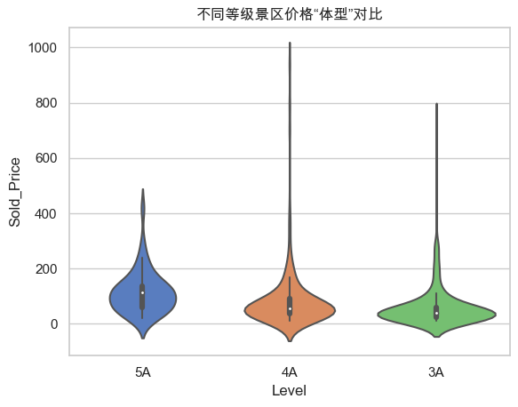
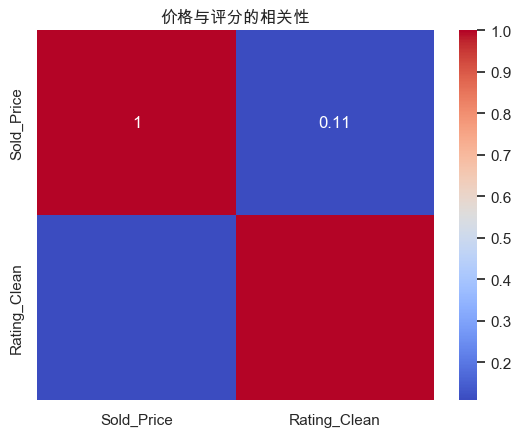
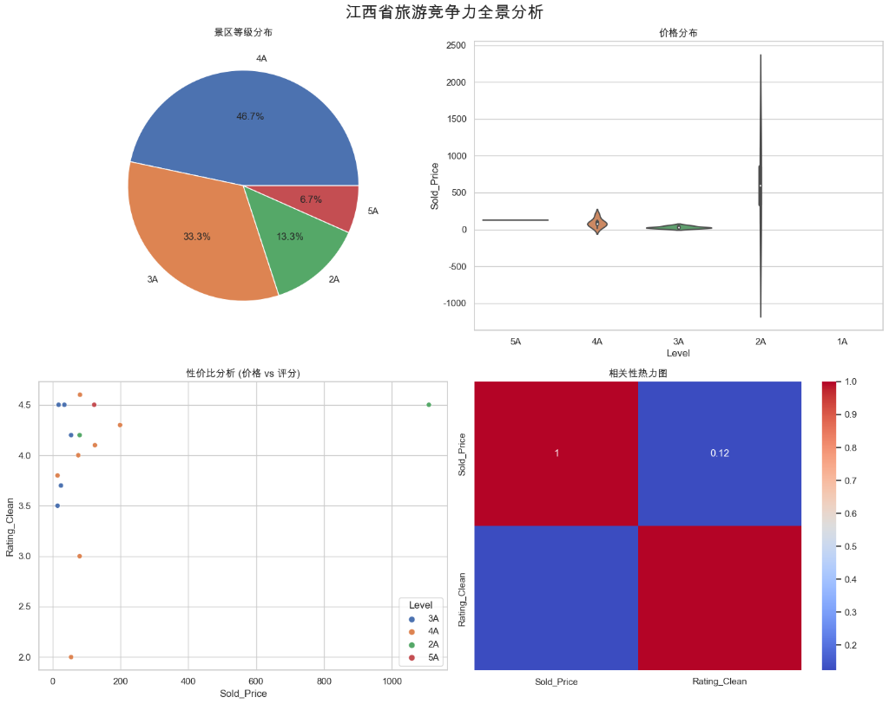

<style>
/* --- 布局辅助样式 --- */
.columns {
  display: grid;
  grid-template-columns: repeat(2, minmax(0, 1fr));
  gap: 1rem;
}
.columns pre code {
  white-space: pre-wrap !important;
  overflow-wrap: break-word !important;
}
/* --- 列表缩进样式修正 --- */
ul, ol {
  padding-inline-start: 25px; /* 减小列表的左侧缩进 */
}
.columns.ratio-4-6 { grid-template-columns: 4fr 6fr; }
.columns.ratio-6-4 { grid-template-columns: 6fr 4fr; }
.columns.ratio-3-7 { grid-template-columns: 3fr 7fr; }
.columns.ratio-7-3 { grid-template-columns: 7fr 3fr; }
.align-top    { display: flex; align-items: flex-start; }
.align-middle { display: flex; align-items: center; }
.align-bottom { display: flex; align-items: flex-end; }
.align-left   { display: flex; justify-content: flex-start; }
.align-center { display: flex; justify-content: center; }
.align-right  { display: flex; justify-content: flex-end; }
.align-top-left     { display: flex; justify-content: flex-start; align-items: flex-start; }
.align-top-center   { display: flex; justify-content: center;  align-items: flex-start; }
.align-top-right    { display: flex; justify-content: flex-end;   align-items: flex-start; }
.align-middle-left  { display: flex; justify-content: flex-start; align-items: center; }
.align-middle-center{ display: flex; justify-content: center;  align-items: center; }
.align-middle-right { display: flex; justify-content: flex-end;   align-items: center; }
.align-bottom-left  { display: flex; justify-content: flex-start; align-items: flex-end; }
.align-bottom-center{ display: flex; justify-content: center;  align-items: flex-end; }
.align-bottom-right { display: flex; justify-content: flex-end;   align-items: flex-end; }
.tip {
  background-color: #f0f8ff;
  border-left: 5px solid #1e90ff;
  padding: 15px 15px 0.1px; 
}
.insight {
  background-color: #eefcff; 
  border-left: 5px solid #17a2b8; 
  padding: 15px 15px 0.1px; 
}
.key-point {
  background-color: #fffbe6; 
  border-left: 5px solid #ffc107; 
  padding: 15px 15px 0.1px; 
}
.tip p, .tip li,
.insight p, .insight li,
.key-point p, .key-point li {
  font-size: inherit !important;
}
.styled-div p, 
.styled-div li, 
.styled-div ol, 
.styled-div ul, 
.styled-div blockquote {
  font-size: inherit !important;
}
</style>


<style scoped>
h1{
  color: #F5F5F5;
  text-shadow: 2px 2px 8px rgba(0, 0, 0, 0.8);
}
h2 {
  color: #E0E0E0;
  text-shadow: 2px 2px 8px rgba(0, 0, 0, 0.8);
}
.course-title {
  position: absolute;
  top: 60px;
  left: 80px;
  background-color: rgba(0, 0, 0, 0.4);
  color: #fff;
  padding: 8px 15px;
  border-radius: 5px;
  font-size: 22px;
  font-weight: bold;
  letter-spacing: 1px;
  border-left: 5px solid #4CAF50;
}
</style>

<div class="course-title">AI赋能软件开发</div>

# 模块五: AI数据分析师(下)
## 第19节课: 高阶可视化——不仅要准，还要美

<div style="position: absolute; bottom: 40px; left: 80px; color: rgba(255, 255, 255, 0.8); font-size: 18px; font-family: sans-serif;">
南昌大学计算机系 黎鹰
</div>

<!--
- **类型**: 逐字稿
- **内容**: |
  (1分钟) 各位老师，大家好。
  在前两节课中，我们掌握了基础绘图技能。但作为专业的数据分析师，我们不仅要追求数据的准确性，还要追求表达的艺术性。
  今天，我们将升级工具箱，引入强大的 **Seaborn** 库。它能帮我们画出 Excel 难以实现的“高颜值”图表，比如优雅的小提琴图和信息密度极高的成对关系图。
-->

<!--
- **类型**: 教学设计
- **内容**: |
  ### 教学时间: 1分钟
  ### 环节: 导入 (Introduction)
  **回顾**: Matplotlib 虽好，但代码繁琐且样式朴素。
  **引入**: Seaborn —— 专为统计绘图设计的高级库。
-->

<!--
- **类型**: 解释
- **内容**: |
  ### Seaborn vs Matplotlib
  如果说 Matplotlib 是手动挡汽车（功能强大但操作复杂），那么 Seaborn 就是自动挡跑车（操作简单且颜值高）。
  Seaborn 是建立在 Matplotlib 之上的，它简化了许多常见统计图形的绘制过程，并自带了非常美观的配色方案。
-->

---

## **本课学习目标**

<div class="columns">
<div>

学完这节课，你将能够：

1.  **审美升级**: 从“统计图表”进阶到“信息图表”。
2.  **工具升级**: 掌握 **Seaborn** 的高级绘图功能。
3.  **技能**:
    - 绘制 **小提琴图 (Violin Plot)** 展示分布。
    - 绘制 **成对关系图 (PairPlot)** 展示多维关系。
    - 体验用**一行代码**完成数据全景扫描的快感。

</div>
<div class="align-middle-center">


</div>
</div>

<!--
- **类型**: 逐字稿
- **内容**: |
  (1分钟) 今天的目标是实现“审美”和“效率”的双重升级。
  我们将学习两个新图表：小提琴图和成对关系图。
  特别是成对关系图，它能让你体会到什么叫“一行代码，全局概览”。
-->

<!--
- **类型**: 教学设计
- **内容**: |
  ### 教学时间: 1分钟
  ### 环节: 目标 (Objective)
  本节课的重点从“功能实现”转向“视觉表达”和“复杂数据关系的展示”。
-->

<!--
- **类型**: 解释
- **内容**: |
  ### 声明式绘图 (Declarative Visualization)
  Seaborn 的设计哲学是“声明式”的。
  你只需要告诉它“我想画Level和Sold_Price的关系”，而不需要像在Matplotlib中那样详细规定“画一条线，起点在哪终点在哪”。这让我们能更专注于分析逻辑。
-->

---

## **1. 任务一：美学升级——Seaborn 小提琴图**

<div class="columns ratio-4-6">
<div>

### **痛点：箱线图样式单调**
我们想对比 5A/4A 景区的价格分布。
- **箱线图 (Boxplot)**: 只能看中位数，看不到分布形状。
- **小提琴图 (Violin Plot)**: = 箱线图 + 直方图。既能看“胖瘦”（分布），又能看“高低”（价格）。

### **工具：Seaborn**
Python 可视化界的**美学典范**。

</div>
<div>

```python
import seaborn as sns
import matplotlib.pyplot as plt

# 设置一个好看的主题
sns.set_theme(style="whitegrid")

# 依然要配置中文
plt.rcParams['font.sans-serif'] = ['SimHei', 'Arial Unicode MS']
plt.rcParams['axes.unicode_minus'] = False
```

</div>
</div>

<!--
- **类型**: 逐字稿
- **内容**: |
  (3分钟) 让我们先来解决一个痛点：图表不够直观。
  之前大家画过箱线图，虽然专业，但对非统计学背景的受众来说，它太抽象了。
  我们要画它的升级版——**小提琴图**。它就像把数据的分布形状描绘了出来，哪里“胖”就说明哪里数据多。
  为了画出这种高级图表，我们需要请出 Python 可视化界的“美学担当”——Seaborn。
-->

<!--
- **类型**: 教学设计
- **内容**: |
  ### 教学时间: 3分钟
  ### 环节: 概念引入 (Concept)
  对比箱线图和小提琴图，突出小提琴图在“展示分布密度”上的优势。
-->

<!--
- **类型**: 解释
- **内容**: |
  ### 核密度估计 (KDE)
  小提琴图优美的轮廓线其实是数据的 **核密度估计 (Kernel Density Estimation)** 曲线。
  简单来说，它就像把直方图的锯齿抹平了，变成了一条光滑的曲线，能更优雅地展示数据在不同数值上的密集程度。
-->

---

## **AI 指令：绘制小提琴图**

<div class="columns ratio-4-6"  style="font-size:0.9em">
<div>

### **AI 指令 (Prompt)**

> "请使用 seaborn 库画一个**小提琴图 (Violin Plot)**。
> - **X轴**: `Level` (景区等级)，顺序为 ['5A', '4A', '3A']。
> - **Y轴**: `Sold_Price` (门票价格)。
> - **过滤**: 去掉价格 > 1000 的极端值、价格 < 10 的杂项。
> - **配色**: 使用 'muted' 调色板。"

</div>
<div>

### **代码解析**
```python
# 1. 过滤异常值 (保留 10-1000 元之间的数据)
df_clean = df[(df['Sold_Price'] < 1000) & 
              (df['Sold_Price'] > 10)]

# 2. 画图
sns.violinplot(data=df_clean, 
               x='Level', y='Sold_Price', 
               order=['5A', '4A', '3A'], 
               palette='muted')

plt.title('不同等级景区价格“体型”对比')
plt.show()
```

</div>
</div>

<!--
- **类型**: 逐字稿
- **内容**: |
  (5分钟) 看看这段指令。我们不仅告诉AI要画什么，还指定了X轴的顺序。
  运行代码，大家看这张图。
  5A的那把琴，“肚子”位置很高，说明整体贵。
  3A的那把琴，“分布集中在低价区间”，说明大量景点是免费或低价的。
  这就是可视化的魅力，一眼看穿数据的“体型”。
-->

<!--
- **类型**: 教学设计
- **内容**: |
  ### 教学时间: 5分钟
  ### 环节: 实操 (Practice)
  重点讲解 `order` 参数（控制X轴顺序）和 `palette` 参数（配色方案）。
-->

<!--
- **类型**: 解释
- **内容**: |
  ### 调色板 (Palette)
  Seaborn 提供了非常丰富的内置调色板。
  - `muted`: 柔和色调。
  - `bright`: 明亮色调。
  - `pastel`: 粉笔色调（适合打印）。
  - `coolwarm`: 冷暖渐变（适合热力图）。
  选择合适的配色是提升图表专业度的第一步。
-->

---

## **任务一结果：不同等级的价格“体型”**

<div class="columns ratio-6-4" style="font-size:0.9em">
<div>

### **图表解读**
1.  **5A (头重脚轻)**: 蓝色小提琴有一个长长的“脖子”伸向高价区。说明 5A 景区**整体上限极高**。
2.  **4A (一枝独秀)**: 橙色小提琴虽然重心较低，但有一根极细的“尖刺”伸向了比 5A 更高的价格区。这说明个别 4A 景区（可能是高端小众景点）的价格甚至超过了 5A。
3.  **3A (大肚便便)**: 绿色小提琴的“肚子”贴在底部（低价区）。说明绝大多数 3A 景区都是**平价甚至免费**的。

### **洞察**
*   **等级溢价**: 5A 的“长脖子”证明了品牌溢价的存在。
*   **市场分层**: 3A 主打亲民，5A 主打高端，市场定位泾渭分明。
*   **隐形冠军**: 4A 中的“尖刺”提示我们，某些细分领域的精品项目（如高端民宿）定价能力超越了 5A。

</div>
<div class="align-middle-center">



</div>
</div>

<!--
- **类型**: 逐字稿
- **内容**: |
  (2分钟) 来看结果。这张图是不是比箱线图生动多了？
  大家看最左边蓝色的 5A，它像一把吉他，上面长长的脖子伸到了 500 块。说明 5A 整体天花板很高。
  但请注意中间橙色的 4A，虽然它重心低，但有一根极细的刺直接冲到了最顶端！这说明个别 4A 景区（比如一些高端民宿或探险项目）比 5A 还要贵。
  再看最右边绿色的 3A，它像一个大肚子的不倒翁，肚子全贴在地上。
  这就是“体型”告诉我们的秘密：不仅要看平均值，还要看极值。
-->

<!--
- **类型**: 教学设计
- **内容**: |
  ### 教学时间: 2分钟
  ### 环节: 结果解读 (Interpretation)
  引导学员通过观察小提琴的“胖瘦”和“高低”，理解数据的分布特征。
-->

<!--
- **类型**: 解释
- **内容**: |
  ### 概率密度 (Probability Density)
  小提琴图的宽度代表了**概率密度**。
  “肚子”越宽，说明数据落在该价格区间的概率越大（即景点数量越多）。
  “脖子”越长，说明数据的**长尾分布 (Long Tail)** 越明显，即存在少量的极端高价。
-->

---

## **2. 任务二：全局概览——成对关系图 (PairPlot)**

<div class="columns">
<div>

### **场景：数据全景扫描**
我们想看：**“价格、评分、等级这三个变量之间，到底有什么错综复杂的关系？”**

如果用散点图，我们要画：
*   价格 vs 评分
*   价格 vs 等级
*   评分 vs 等级 ...

**PairPlot** 可以**一行代码画出所有关系**。

</div>
<div class="align-middle-center">


</div>
</div>

<!--
- **类型**: 逐字稿
- **内容**: |
  (3分钟) 接下来，我们将引入一个真正的“高维分析利器”——**PairPlot (成对关系图)**。
  拿到一份新数据时，资深分析师的第一反应往往就是画这个图。
  它可以**一行代码**把所有变量两两之间的关系全部展示出来，实现对数据的“全景扫描”。
-->

<!--
- **类型**: 教学设计
- **内容**: |
  ### 教学时间: 3分钟
  ### 环节: 场景 (Scenario)
  从“单点突破”转向“全网扫描”，介绍 PairPlot 的强大功能。
-->

<!--
- **类型**: 解释
- **内容**: |
  ### 矩阵散点图 (Scatter Matrix)
  PairPlot 本质上是一个 n*n 的矩阵。
  - **对角线上**: 是单变量的分布图（自己和自己比，如直方图）。
  - **非对角线上**: 是双变量的散点图（两两相比）。
  这种图表能极快地暴露数据集中潜藏的相关性或聚类模式。
-->

---

## **AI 指令：绘制成对关系图 (进阶)**

<div class="columns">
<div>

**请向 AI 发送以下指令**：

> "我想对数据进行全景扫描。
> 请使用 `sns.pairplot` 画出 **成对关系图**。
> - **分析变量**：`Sold_Price` (价格) 和 `Rating_Clean` (评分)。
> - **分类变量**：`Level` (用 `hue` 参数根据等级上不同的颜色)。
> - **数据源**：使用 `df_clean`，并**进一步过滤掉评分=0**的数据。"

</div>
<div>

### **代码实现**
```python
# 1. 准备数据：过滤掉评分=0的记录
df_pair = df_clean[df_clean['Rating_Clean'] > 0]

# 2. 绘制成对关系图
# hue='Level': 按照等级着色 (5A=蓝, 4A=橙...)
sns.pairplot(df_pair, 
             vars=['Sold_Price', 'Rating_Clean'], 
             hue='Level',
             height=3)
plt.show()
```

</div>
</div>

<!--
- **类型**: 逐字稿
- **内容**: |
  (5分钟) 这个指令非常简单，但结果非常震撼。
  大家运行一下。
  你会看到一张图表矩阵。
  对角线上是分布图（直方图），非对角线上是散点图。
  而且因为我们加了 `hue='Level'`，不同等级的景区被染成了不同的颜色。
  你能一眼看出5A景区在价格和评分上的独特分布吗？
-->

<!--
- **类型**: 教学设计
- **内容**: |
  ### 教学时间: 5分钟
  ### 环节: 体验 (Experience)
  让学员体验 `hue` 参数（颜色映射）在区分数据类别时的强大作用。
-->

<!--
- **类型**: 解释
- **内容**: |
  ### 维度增加 (Adding Dimensions)
  普通的散点图只能展示 X 和 Y 两个维度。
  通过 `hue`（颜色）、`size`（点的大小）、`style`（点的形状），我们可以将 3维甚至 4维、5维 的信息压缩到一张二维平面图中。
  在本例中，我们同时看到了：价格(X)、评分(Y)、等级(Color) 三个维度的信息。
-->

---

## **任务二结果：多维关系的“全景图”**

<div class="columns" style="font-size:0.8em">
<div>

### **图表解读**
1.  **对角线 (单变量分布)**: 
    - **左上角 (价格)**: 绝大多数景点都很便宜（右偏分布）。
    - **右下角 (评分)**: 绝大多数景点都是高分（左偏分布）。
2.  **非对角线 (双变量关系 - 分段看)**:
1.  **低价区 (<200)**: **良莠不齐**。既有满分评价，也有低分巨坑（散点上下分布极广）。
2.  **中价区 (200-800)**: **品质收敛**。低分点消失了！说明多花钱确实能买到“下限保障”（避雷）。
3.  **高价区 (>800)**: **边际效应递减**。价格虽高，但评分并没有继续上升，反而因为期望过高而难以打出满分。

### **洞察**
*   **非线性关系**: 价格和评分不是简单的正比关系，而是呈现出复杂的**倒U型**或**收敛**趋势。
*   **消费决策**: 预算有限选低价（需慧眼识珠），追求稳妥选中价（花钱买下限）。

</div>
<div>


</div>
</div>

<!--
- **类型**: 样式替换
- **版本**: [handout, teacher]
- **查找**: |
    <div>
- **替换**: |
    <div class="styled-div" style="font-size:0.55em">
-->

<!--
- **类型**: 逐字稿
- **内容**: |
  (2分钟) 来看这张全景图，尤其是左下角的散点图。
  乍一看是一团散沙，但如果我们**分段**来看，就会发现秘密。
  你们看左边（便宜的），点很散，说明便宜的景点里，有好有坏，需要你像侦探一样去淘。
  再看中间（几百块的），底下的低分点不见了！这说明什么？说明“一分钱一分货”是有道理的，多花钱能帮你避开雷区。
  最后看最右边（最贵的），评分反而没有那么高了。因为大家花了那么多钱，期待值太高，稍微有点瑕疵就不买账了。
-->

<!--
- **类型**: 教学设计
- **内容**: |
  ### 教学时间: 2分钟
  ### 环节: 结果解读 (Interpretation)
  引导学员学会看矩阵图：先看对角线（分布），再看非对角线（关系）。
-->

<!--
- **类型**: 解释
- **内容**: |
  ### 矩阵图的阅读逻辑 (Reading Logic)
  PairPlot 将多维数据展开为一个 **N x N 矩阵**，阅读时需区分两个区域：
  1.  **非对角线 (Off-diagonal)**: **看关系 (Relationship)**。
      - **坐标**: (1,2) 和 (2,1)。
      - **图表**: **散点图**。展示两个不同变量（如 价格 vs 评分）是如何相互影响的。
  2.  **主对角线 (Diagonal)**: **看分布 (Distribution)**。
      - **图表**: **密度图 (KDE)**。你可以把它看作是数据的“山峰”。
      - **坐标轴**:
        - **横轴 (X-axis)**: 变量的值（如：价格 100元）。
        - **纵轴 (Y-axis)**: **密度 (Density)**。简单理解就是“浓度”。
          - **高度**: 代表样本的**密集程度**。峰值越高，说明聚集在这里的景点越多。
          - **面积**: 曲线下的总面积代表**样本总数** (100%)。
      - **怎么看**:
        - **(1,1) 价格分布**: 山峰集中在**横轴左侧**（低价区）。解读：**绝大多数景点都很便宜**。
        - **(2,2) 评分分布**: 山峰集中在**横轴右侧**（高分区）。解读：**绝大多数景点评分都很高**。
-->

---

## **3. 任务三：量化关系——相关系数热力图**

<div class="columns ratio-4-6" style="font-size:0.8em">
<div>

### **任务**
PairPlot 让我们看到了关系，那能不能**量化**这种关系？
请计算变量之间的 **相关系数 (Correlation)** 并可视化。

### **AI 指令**
> "请计算 `Sold_Price` 和 `Rating_Clean` 的相关系数。
> 并用 `sns.heatmap` 画出**相关系数矩阵的热力图**。
> 显示数值 (`annot=True`)。"

</div>
<div>

### **参考示范**
```python
# 1. 计算相关系数矩阵
corr_matrix = df_clean[['Sold_Price', 'Rating_Clean']].corr()

# 2. 画热力图
sns.heatmap(corr_matrix, annot=True, cmap='coolwarm')
plt.title('价格与评分的相关性')
plt.show()
```

</div>
</div>

<!--
- **类型**: 逐字稿
- **内容**: |
  (5分钟) 最后给大家一个小练习。
  我们看到了关系，现在来算算这个关系的“数值”。
  请指挥AI画一个相关系数热力图。
  如果颜色越红（或越蓝），说明相关性越强。大家看看，价格和评分的相关系数是多少？是不是接近0？这验证了我们之前的猜想。
-->

<!--
- **类型**: 教学设计
- **内容**: |
  ### 教学时间: 5分钟
  ### 环节: 练习 (Practice)
  从“定性观察”走向“定量计算”，引入热力图。
-->

<!--
- **类型**: 解释
- **内容**: |
  ### 皮尔逊相关系数 (Pearson Correlation)
  `.corr()` 默认计算的是皮尔逊系数，它衡量的是**线性相关性**。
  **重要假设**: 皮尔逊系数假设变量之间存在线性关系。如果关系是非线性的（如抛物线），系数可能为0，但实际上两者紧密相关。
  **安斯库姆四重奏 (Anscombe's Quartet)**: 正如我们在 **Lesson 2** 中所见，四组数据可能拥有相同的统计特性（如相关系数），但图形分布截然不同。这再次提醒我们：**不要盲目迷信数字**，必须结合可视化（如 PairPlot）来交叉验证。
-->

---

## **任务三结果：量化关系的“体检单”**

<div class="columns" style="font-size:0.8em">
<div>

### **图表解读**
*   **0.11 (弱相关)**: 价格和评分的相关系数仅为 **0.11**。
*   **接近 0**: 说明两者几乎**线性无关**。
*   **颜色**: 呈现**冷色调**（蓝色），直观地反映了相关性极低（远离 1.0 的红色热区）。

### **洞察**
*   **高价 $\neq$ 高分**: 数据的弱相关性表明，昂贵的门票并不意味着游客会有更高的满意度（性价比才是关键）。
*   **多因素驱动**: 游客的满意度可能更多取决于服务、景观、拥挤度等其他因素，而非单纯的价格。

</div>
<div class="align-middle-center">



</div>
</div>

<!--
- **类型**: 逐字稿
- **内容**: |
  (2分钟) 结果出来了，系数是 **0.11**。
  这是一个非常小的数字，几乎接近于0。
  这就像体检单上的指标一样，它用数字告诉我们：**价格高低，和评分高低，几乎没有半毛钱关系。**
  所以，作为管理者，别指望涨价能带来好评，也别指望降价能挽回口碑。服务质量才是硬道理。
-->

<!--
- **类型**: 教学设计
- **内容**: |
  ### 教学时间: 2分钟
  ### 环节: 结果解读 (Interpretation)
  强化“弱相关”的概念，并引导学员思考背后的业务含义（多因素影响）。
-->

<!--
- **类型**: 解释
- **内容**: |
  ### 相关性 != 因果性 (Correlation != Causation)
  即使系数很高（比如 0.9），也不能说明“价格导致了评分高”。
  更何况这里系数很低 (0.11)，说明两者在统计学上几乎是独立的。
  这提醒我们在做决策时，不能单一归因。
-->

---

## **4. 任务四：综合案例——江西省全景报告**

<div class="columns" style="font-size:0.9em">
<div>

### **从“单点”到“全景”**
前面我们学习了各种图表（柱状图、散点图、小提琴图）。
现在，让我们把这些“积木”组合起来，为一个省份（以 **江西省** 为例）制作一份全方位的“体检报告”。

### **分析目标 (3D View)**
1.  **资源 (Quantity)**: A 级景区结构是怎样的？
2.  **消费 (Cost)**: 门票价格分布如何？
3.  **口碑 (Value)**: 性价比如何？

**成果**: 一张包含 4 个子图的 **高清全景报告**。

</div>
<div class="align-middle-center">


</div>
</div>

<!--
- **类型**: 逐字稿
- **内容**: | 
  (2分钟) 技能都学完了，现在请大家完成最后一个**终极挑战**。
  请你把之前学的柱状图、散点图、小提琴图全都用上，来给一个省份做全方位的体检。
  这里我们以“江西省”为例。
  请尝试从资源、消费、口碑三个维度，在一张图上画出它的全貌。这才是数据分析师该交付的最终作品。
-->

<!--
- **类型**: 教学设计
- **内容**: |
  ### 教学时间: 2分钟
  ### 环节: 综合练习 (Comprehensive Practice)
  **目的**: 让学员综合运用所学技能解决复杂问题，完成从“点”到“面”的跃升。
-->

<!--
- **类型**: 解释
- **内容**: |
  ### 综合项目 (Capstone Project)
  在布鲁姆教育目标分类法 (Bloom's Taxonomy) 中，**“创造 (Create)”** 是最高阶的认知目标。
  本环节的设计意图，就是希望读者能从“理解”和“应用”碎片化知识，跃升到“综合”运用多种技能来解决复杂问题。
  它不引入新知识，而是强调知识的**整合 (Integration)** 和**迁移 (Transfer)**。
-->

---

## **版面规划与 AI 指令**

<div class="columns" style="font-size:0.85em">
<div>

### **版面设计 (2x2 布局)**
*   **左上**: **饼图** (景区等级占比)
*   **右上**: **小提琴图** (价格分布形状)
*   **左下**: **散点图** (价格 vs 评分)
*   **右下**: **热力图** (相关性强度)

### **关键 AI 指令**
> "请帮我筛选出 `df` 中属于 '江西省' 的数据。
> **过滤掉价格<10及评分=0的异常值**。
> 画一个 2x2 的组合图：
> 饼图、小提琴图、散点图、热力图。
> 设置总标题为 '江西省旅游竞争力全景分析'。"

</div>
<div>

### **代码实现**
```python
# 1. 数据准备 (江西11地市)
jiangxi_cities = ['南昌', '九江', '景德镇', '上饶', '赣州', 
                  '宜春', '吉安', '抚州', '萍乡', '新余', '鹰潭']
# 筛选并清洗数据
df_jx = df[df['City'].isin(jiangxi_cities) &
           (df['Sold_Price'] > 10) &
           (df['Rating_Clean'] > 0)]

# 2. 创建画布
fig, axes = plt.subplots(2, 2, figsize=(15, 12))

# 3. 绘制子图
# 左上：饼图
df_jx['Level'].value_counts().plot(kind='pie', autopct='%1.1f%%', ax=axes[0,0])
axes[0,0].set_ylabel('')
# 右上：小提琴图
sns.violinplot(data=df_jx, x='Level', y='Sold_Price', 
               order=['5A','4A','3A','2A','1A'], ax=axes[0,1])
# 左下：散点图
sns.scatterplot(data=df_jx, x='Sold_Price', y='Rating_Clean', 
                hue='Level', ax=axes[1,0])
# 右下：热力图
sns.heatmap(df_jx[['Sold_Price', 'Rating_Clean']].corr(), 
            annot=True, cmap='coolwarm', ax=axes[1,1])

# 4. 调整布局
plt.suptitle('江西省旅游竞争力全景分析', fontsize=20)
plt.tight_layout()
plt.show()
```

</div>
</div>

<!--
- **类型**: 逐字稿
- **内容**: | 
  (5分钟) 大家看这段代码。
  首先，我们需要告诉AI哪些城市属于江西。
  然后，我们用 `plt.subplots(2, 2)` 创建了一个四宫格的画布。
  接下来，就像填空一样，把我们之前学过的饼图、小提琴图、散点图，分别画在指定的位置上（ax=...）。
  最后，加个大标题，一张专业的报告就生成了。
-->

<!--
- **类型**: 教学设计
- **内容**: |
  ### 教学时间: 5分钟
  ### 环节: 代码走查 (Code Walkthrough)
  重点讲解 `subplots` 布局和 `ax` 参数的使用，展示如何将多个图表组合在一起。
-->

<!--
- **类型**: 解释
- **内容**: |
  ### 仪表板设计 (Dashboard Design)
  将多个图表组合在一起不仅仅是技术实现，更是一种设计艺术。
  **信息层级 (Information Hierarchy)**: 
  - 左上角通常是最重要的位置（饼图：总体结构）。
  - 右上展示细节（小提琴图：分布特征）。
  - 左下展示深度关系（散点图：相关性）。
  - 右下角展示量化指标（热力图：相关系数）。
  这种布局符合用户的 **“F型”阅读习惯 (F-Shaped Pattern)**：
  用户浏览页面时，视线通常先水平扫视顶部（第一行），然后视线略微下移进行第二次较短的水平扫视，最后垂直扫描左侧内容。因此，**左上角**和**顶部**是视觉关注度最高的区域，适合放置核心结论或总体概览。
-->

---

## **任务四结果：江西省全景报告**

<div class="columns ratio-4-6" style="font-size:0.65em">
<div>

### **图表解读**
1.  **资源 (左上)**: **4A级景区**占据半壁江山 (46.7%)，是江西旅游的中坚力量。5A级 (6.7%) 稀缺且珍贵。
2.  **消费 (右上)**: 价格分布极不均匀。**2A级**价格跨度最大（有平价也有高价），而**5A级**价格相对集中。
3.  **口碑 (左下)**: **性价比之王**出现在低价区。高分景点（>4.5分）大多集中在 200元以下。
4.  **关系 (右下)**: 相关系数 **0.12**，再次验证了“高价不等于高分”的普遍规律。

### **洞察**
*   **江西旅游画像**: 一个以 **4A级景区** 为主导，**性价比极高** 的旅游目的地。
*   **建议**: 重点挖掘 4A 级景区中的“隐形冠军”（低价高分），避开高价低分的“坑”。

</div>
<div class="align-middle-center">



</div>
</div>

<!--
- **类型**: 样式替换
- **版本**: [handout, teacher]
- **查找**: |
    <div>
- **替换**: |
    <div class="styled-div" style="font-size:0.8em">
-->

<!--
- **类型**: 逐字稿
- **内容**: |
  (3分钟) 看这张图，我们能一眼看清江西旅游的家底：
  首先，**4A级景区**是绝对的主力，占了快一半。
  其次，看价格，**5A级**虽然贵，但价格很稳；反而是**2A级**，价格差异巨大，这里面水很深，需要仔细挑。
  最后看口碑，大家发现没有？那些评分最高的景点，往往不是最贵的，而是那些**100元附近**的良心景点。
  这就是数据分析的魅力，它让我们不再盲目跟风，而是理性决策。
-->

<!--
- **类型**: 教学设计
- **内容**: |
  ### 教学时间: 2分钟
  ### 环节: 总结 (Summary)
  回顾全景图的各个部分，强调“多视图协同”在揭示复杂问题中的作用。
-->

<!--
- **类型**: 解释
- **内容**: |
  ### 数据讲故事 (Data Storytelling)
  数据分析的终局不是“图表”，而是“故事”。
  这张全景图其实在讲述一个关于江西旅游的故事：
  “虽然我没有那么多顶级的5A（饼图），但我有海量的4A（饼图），而且价格丰俭由人（小提琴图），只要你肯淘，就能在低价区找到高分宝藏（散点图）。”
  **您**在制作报告时，也要学会像这样把碎片化的图表串联成一条逻辑线索。
  ### 为什么要做全景分析？
  单一图表只能看到大象的一条腿。
  只有把不同维度的图表组合在一起，才能拼凑出大象的全貌。
  这就是**Dashboard (仪表盘)** 的雏形，也是商业分析报告的标准形式。
-->

---

## **5. 课程小结**

<div class="columns">
<div>

### **我们学到了什么？**
1.  **高级绘图**: Seaborn 的小提琴图与成对关系图。
2.  **多维分析**: 从单变量到多变量的关系探索。
3.  **综合应用**: 如何将多个图表组合成一份全景报告。

</div>
<div>

### **下节课预告 (实战工作坊)**
掌握了分析工具后，最重要的是将其**迁移**到您关注的领域。
下节课，我们将进行**实战演练**。
邀请您选择一个感兴趣的省份，从数据探查到可视化，亲手制作一份**完整的数据洞察报告**。

</div>
</div>

<!--
- **类型**: 逐字稿
- **内容**: |
  (1分钟) 总结一下。今天我们深入探讨了Seaborn的高级绘图功能，并演示了如何构建全景报告。
  理论需要结合实践。下节课，我们将开启实战工作坊。
  邀请各位老师选择一个感兴趣的省份，亲自体验从数据筛选到图表呈现的全过程，完成一份属于您自己的数据分析作品。
  下节课见！
-->

<!--
- **类型**: 教学设计
- **内容**: |
  ### 教学时间: 1分钟
  ### 环节: 结业 (Conclusion)
  总结本课核心知识点，并预告下一节课的实战环节，激发学员的期待感。
-->

<!--
- **类型**: 解释
- **内容**: |
  ### 数据素养 (Data Literacy)
  Gartner 将数据素养定义为：阅读、书写和交流数据的能力。
  通过本模块的学习，**您**已经从一个单纯的“数据消费者”（看报表）进化为“数据生产者”（做报表）。
  这种能力的跃迁，将极大地扩展**您**在数字化时代的教学和科研边界。
-->