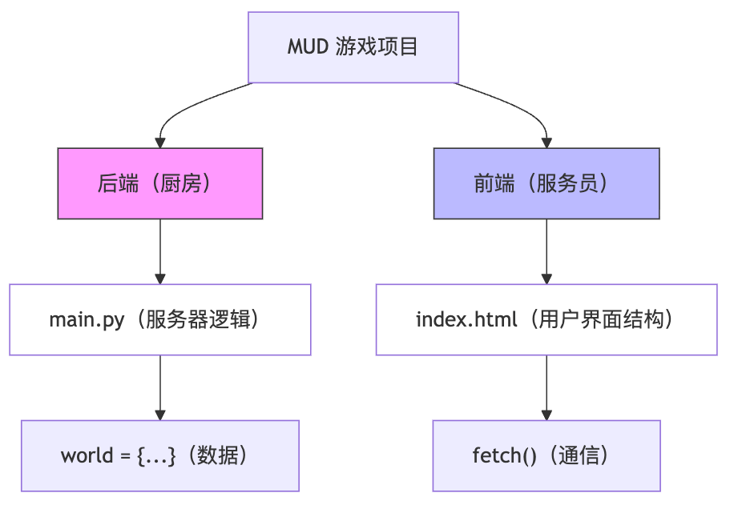

<style>
/* --- 布局辅助样式 --- */
.columns {
  display: grid;
  grid-template-columns: repeat(2, minmax(0, 1fr));
  gap: 1rem;
}
.columns pre code {
  white-space: pre-wrap !important;
  overflow-wrap: break-word !important;
}
/* --- 列表缩进样式修正 --- */
ul, ol {
  padding-inline-start: 25px; /* 减小列表的左侧缩进 */
}
.columns.ratio-4-6 { grid-template-columns: 4fr 6fr; }
.columns.ratio-6-4 { grid-template-columns: 6fr 4fr; }
.columns.ratio-3-7 { grid-template-columns: 3fr 7fr; }
.columns.ratio-7-3 { grid-template-columns: 7fr 3fr; }
.align-top    { display: flex; align-items: flex-start; }
.align-middle { display: flex; align-items: center; }
.align-bottom { display: flex; align-items: flex-end; }
.align-left   { display: flex; justify-content: flex-start; }
.align-center { display: flex; justify-content: center; }
.align-right  { display: flex; justify-content: flex-end; }
.align-top-left     { display: flex; justify-content: flex-start; align-items: flex-start; }
.align-top-center   { display: flex; justify-content: center;  align-items: flex-start; }
.align-top-right    { display: flex; justify-content: flex-end;   align-items: flex-start; }
.align-middle-left  { display: flex; justify-content: flex-start; align-items: center; }
.align-middle-center{ display: flex; justify-content: center;  align-items: center; }
.align-middle-right { display: flex; justify-content: flex-end;   align-items: center; }
.align-bottom-left  { display: flex; justify-content: flex-start; align-items: flex-end; }
.align-bottom-center{ display: flex; justify-content: center;  align-items: flex-end; }
.align-bottom-right { display: flex; justify-content: flex-end;   align-items: flex-end; }
.tip {
  background-color: #f0f8ff;
  border-left: 5px solid #1e90ff;
  padding: 15px;
}
.insight {
  background-color: #eefcff; 
  border-left: 5px solid #17a2b8; 
  padding: 15px; 
}
.key-point {
  background-color: #fffbe6; 
  border-left: 5px solid #ffc107; 
  padding: 15px; 
}
.tip p, .tip li,
.insight p, .insight li,
.key-point p, .key-point li {
  font-size: inherit !important;
}
.styled-div p, 
.styled-div li, 
.styled-div ol, 
.styled-div ul, 
.styled-div blockquote {
  font-size: inherit !important;
}
</style>


<style scoped>
h1{
  color: #F5F5F5;
  text-shadow: 2px 2px 8px rgba(0, 0, 0, 0.8);
}
h2 {
  color: #E0E0E0;
  text-shadow: 2px 2px 8px rgba(0, 0, 0, 0.8);
}
.course-title {
  position: absolute;
  top: 60px;
  left: 80px;
  background-color: rgba(0, 0, 0, 0.4);
  color: #fff;
  padding: 8px 15px;
  border-radius: 5px;
  font-size: 22px;
  font-weight: bold;
  letter-spacing: 1px;
  border-left: 5px solid #4CAF50;
}
</style>

<div class="course-title">AI赋能软件开发</div>

# 模块六: Python+Web开发入门
## 第23节课: 案例拆解——从脚本到应用 (MUD游戏Web化)

<div style="position: absolute; bottom: 40px; left: 80px; color: rgba(255, 255, 255, 0.8); font-size: 18px; font-family: sans-serif;">
南昌大学计算机系 黎鹰
</div>

<!--
- **类型**: 逐字稿
- **内容**: |
  (2分钟) 各位老师好！欢迎来到 模块六 的第3课，也就是第23节课。
  这节课我们综合运用前两节课的知识，进行一次**系统重构 (System Refactoring)**。
  我们要把大家在 模块二 写的那个“文字冒险游戏 (MUD)”，从黑漆漆的命令行里“拯救”出来，改造成一个现代化的 Web 应用。
  这不仅是界面的升级，更是**架构的升维**。我们将亲手拆解一个单机脚本，将其重组为标准的 **Web 应用** 架构。
-->

<!--
- **类型**: 教学设计
- **内容**: |
  ### 教学时间: 2分钟
  ### 环节: 导入 (Introduction)
  **教学策略**: **旧瓶装新酒**。
  利用学员熟悉的旧案例（MUD游戏）作为抓手，降低新知识（Web 架构重构）的认知门槛。
  **核心目标**: 激发学员将“个人玩具”升级为“互联网产品”的渴望。
-->

<!--
- **类型**: 解释
- **内容**: |
  ### 重构 (Refactoring)
  重构是软件工程的核心活动之一。它指的是**在不改变软件外部行为（功能）的前提下，改善其内部结构**。
  
  今天我们做的略有不同，我们在重构内部架构（从单机到 Web）的同时，也升级了外部表现（从文字到 GUI）。这是理解“软件演化”的最佳实践。
-->

---

## **1. 对比：进化前 vs 进化后**

<div class="columns" style="font-size: 0.92em;">
<div>

### **Before: 命令行脚本 (CLI)**
*   **界面**: 黑底白字，枯燥。
*   **操作**: 必须敲键盘 (`/go north`)。
*   **局限**: 只能在自己的终端里跑，没法手机玩。
*   **运行模式**: `While True` 死循环。

### **After: Web 应用 (Web App)**
*   **界面**: 图文并茂，直观。
*   **操作**: 点击按钮 (👆北)。
*   **优势**: 发个链接给朋友，手机也能玩。
*   **运行模式**: **事件驱动 (Request/Response)**。

</div>
<div class="align-middle-center">


</div>
</div>

<!--
- **类型**: 样式替换
- **版本**: [handout, teacher]
- **查找**: |
    <div>
- **替换**: |
    <div class="styled-div" style="font-size: 0.7em;">
-->

<!--
- **类型**: 逐字稿
- **内容**: |
  (3分钟) 请看大屏幕。左边是我们过去的“脚本”，右边是我们今天的“Web应用”。
  它们最本质的区别不在于有没有图片，而在于**控制权的反转**。
  - **脚本**: 像一个**独裁者**。它通过 `while True` 死循环控制一切，它不问你，你没法说话。
  - **Web应用**: 像一个**服务生**。它平时静静地等待（监听），一旦你点击按钮（触发事件），它立刻响应。
  这种模式叫 **事件驱动 (Event-Driven)**，它是所有现代 GUI 程序（网页、App）的灵魂。
-->

<!--
- **类型**: 教学设计
- **内容**: |
  ### 教学时间: 3分钟
  ### 环节: 思维范式转变 (Paradigm Shift)
  **核心概念**: **控制流 (Control Flow)** 的变化。
  **教学目标**: 帮助学员打破线性的“过程式编程”思维，建立非线性的“事件驱动”思维。
-->

<!--
- **类型**: 解释
- **内容**: |
  ### 事件驱动架构 (Event-Driven Architecture)
  在 Web 开发中，程序不再是“从头跑到尾”。
  
  - **Server (后端)**: 处于 **Passive (被动)** 状态。它启动后就进入“监听模式”，等待 HTTP 请求。
  - **Client (前端)**: 处于 **Active (主动)** 状态。用户的点击行为触发请求，推动业务逻辑向前走。
  
  理解这种 **“请求-响应”** 的心跳节奏，是理解 Web 开发的关键。
-->

---

## **2.1 第一步：产品定义 (Define)**


<div class="columns" style="font-size: 0.9em;">
<div>

### **角色：产品经理 (PM)**
*   **任务**: 梳理 MUD 游戏的核心玩法，输出结构化的需求文档。
*   **Prompt**:
    > "你是一位资深游戏策划。
    > 请把命令行 MUD 游戏重构为 Web 版。
    > **核心玩法**: 
    > 1. 探索: 进房间看描述。
    > 2. 社交: 看其他玩家。
    > 3. 移动: 点击按钮移动。
    > 请输出 **User Stories (需求故事)**。"

</div>
<div>

### **PM 产出 (Requirements)**
1.  **US-01 漫游**: 玩家能看到当前房间描述。
2.  **US-02 邂逅**: 玩家能看到同房间的人。
3.  **US-03 行动**: 玩家能通过点击按钮改变位置。
4.  **US-04 身份**: 玩家需要有唯一名字。

</div>
</div>

<!--
- **类型**: 逐字稿
- **内容**: |
  (2分钟) 开发的第一步永远不是写代码，而是**明确需求**。
  现在，请大家带上 **产品经理 (PM)** 的帽子。
  面对旧代码，我们要进行“考古挖掘”：它的核心玩法是什么？
  请大家指挥 AI，把这些模糊的“玩法描述”（如到处走走），转化为结构化的 **User Stories (用户故事)**。
  例如：“作为一个玩家，我希望点击北向按钮，以便于移动到广场。”
  这种标准化的描述，是后续开发不跑偏的基石。
-->

<!--
- **类型**: 教学设计
- **内容**: |
  ### 教学时间: 2分钟
  ### 环节: 需求定义 (Requirement Elicitation)
  **教学目标**: 体验 **User Story Mapping**。
  **关键点**: 引导学员从“技术视角”（我要写个函数）切换到“用户视角”（我要实现什么价值）。
-->

<!--
- **类型**: 解释
- **内容**: |
  ### 用户故事 (User Story)
  敏捷开发中的标准需求格式：`As a <User>, I want to <Action>, so that <Value>`.
  
  它的价值在于**Context (语境)**。
  单纯说“我要个按钮”是苍白的；但说“我要个按钮来移动”，开发人员（AI）就知道这个按钮背后需要连接移动逻辑。
-->

---

## **2.2 交付物解析：需求与数据**

<div class="columns">
<div>

### **技术拆解**
*   **User Story (用户故事)**: 是敏捷开发的核心。它不谈技术细节，只谈“谁(Who) 要做什么(What) 达到什么目的(Why)”。
*   **数据模型映射**:
    *   US-01 -> `World Map` (固定字典)
    *   US-02/04 -> `Player Session` (动态字典)

</div>
<div>

### **AI 生成的数据结构**
```python
# World Map (Static)
world = {
    "广场": {"desc": "...", "exits": {...}},
    "客栈": {"desc": "...", "exits": {...}}
}

# Player Session (Dynamic)
players = {
    "GuoJing": {"loc": "广场"},
    "HuangRong": {"loc": "客栈"}
}
```

</div>
</div>

<!--
- **类型**: 逐字稿
- **内容**: |
  (2分钟) 需求明确后，我们需要将其翻译为**数据模型**。
  请看右侧代码，这是整个游戏的**骨架**。
  我们把世界抽象为两类数据：
  1.  **静态数据 (World)**: 这里的房间、描述，一旦服务器启动就不会变。
  2.  **动态数据 (Players)**: 谁在哪里？这是随时间变化的**状态 (State)**。
  这一步叫 **领域建模 (Domain Modeling)**，做好了这一步，逻辑实现就水到渠成了。
-->

<!--
- **类型**: 教学设计
- **内容**: |
  ### 教学时间: 3分钟
  ### 环节: 领域建模 (Domain Modeling)
  **教学目标**: 培养 **抽象能力 (Abstraction)**。
  **难点突破**: 区分 Config (配置) 与 State (状态)。
  - 地图是配置 -> 放在代码里或配置文件里。
  - 位置是状态 -> 放在内存或数据库里。
-->

<!--
- **类型**: 解释
- **内容**: |
  ### 领域模型：现实的投影
  编程的本质是**对现实世界的模拟**。
  
  - 现实中的“广场”，在 Python 里就是一个 `Dict`。
  - 现实中的“移动”，就是修改 `players` 字典里 `GuoJing` 的 `loc` 字段。
  
  当你能熟练地把现实事物映射为数据结构时，你就掌握了后端开发的精髓。
-->

---

## **2.3 效果演示：需求文档概览**

<div style="font-size: 0.72em;">

# 需求规格说明书 (PRD) - MUD Game Web 2.0

## 1. 核心用户故事 (User Stories)

| ID | 角色 (As a...) | 需求 (I want to...) | 价值 (So that...) |
| :--- | :--- | :--- | :--- |
| **US-01** | **探索者** | 查看当前房间的文字描述 | 获得沉浸式体验 (Immersion) |
| **US-02** | **社交者** | 看见同一房间内的其他玩家 | 产生多人在线的连接感 |
| **US-03** | **玩家** | 点击按钮(东/南/西/北)移动 | 降低操作门槛(无需打字) |
| **US-04** | **访客** | 拥有唯一的江湖名号 | 在游戏世界中建立身份标识 |

## 2. 非功能需求 (NFR)
*   **接入效率**: 无需安装 App，手机扫码即玩。
*   **响应速度**: 移动反馈需要在 200ms 内完成。
*   **兼容性**: 适配 iOS/Android 手机浏览器视图。

</div>

<!--
- **类型**: 教学设计
- **内容**: |
  ### 教学时间: 1分钟
  ### 环节: 成果展示 (Showcase)
  **可视化**: 展示 Markdown 格式的需求文档，强调其专业性。
-->

<!--
- **类型**: 逐字稿
- **内容**: |
  (1分钟) 这就是 AI 帮我们生成的“作战地图”。
  在过去，写文档是件苦差事。但现在，AI 可以在几秒钟内生成这份结构清晰、逻辑严密的文档。
  这份文档不仅是给人看的，更是**给 AI 看的**。
  稍后，我们将把这份文档作为 Prompt 的一部分喂回给 AI，让它“看着文档写代码”。
-->

<!--
- **类型**: 解释
- **内容**: |
  ### 文档驱动开发 (Document-Driven)
  在 AI 时代，文档的重要性不降反升。
  
  因为文档成为了人与 AI 协作的**中间介质**。
  - 人类负责 Review 文档（人类检查逻辑对不对）。
  - AI 负责 Implement 文档（人类检查代码对不对）。
  一份高质量的文档，是生成高质量代码的前提。
-->

---

## **3.1 第二步：架构设计 (Design)**

<div class="columns">
<div>

### **角色：架构师 (Architect)**
*   **任务**: 将模糊的需求转化为精确的 **API 契约 (Contract)**。
*   **Prompt**:
    > "作为架构师，请基于上述需求设计 API 接口：
    > 1. **User Action**: 登录、移动、查看状态。
    > 2. **Response**: 必须是 JSON 格式。
    > 请输出 **API 列表** 和 **返回示例**。"

</div>
<div>

### **Arch 产出 (API Schema)**
1.  `POST /login`: 注册及心跳。
2.  `POST /move`: 改变 `players` 字典中的位置。
3.  `GET /state`: 获取当前 `world` 描述和 `players` 列表。

</div>
</div>

<!--
- **类型**: 逐字稿
- **内容**: |
  (2分钟) 第二步，我们切换到 **架构师 (Architect)** 的视角。
  我们的任务是设计前后端的 **“交接方式”**。
  在代码的世界里，这叫 **API 契约 (Contract)**。
  我们需要定义清楚：前端发什么暗号（URL），后端回什么暗语（JSON）。
  这个环节至关重要，因为它划清了 **系统边界**：
  - 后端边界：负责逻辑计算。
  - 前端边界：负责界面展示。
-->

<!--
- **类型**: 教学设计
- **内容**: |
  ### 教学时间: 2分钟
  ### 环节: 架构设计 (System Design)
  **教学目标**: 建立 **Interface (接口)** 意识。
  **策略**: 使用“契约”隐喻。强调在动工前，必须先签合同（定义接口），否则就会出现“烂尾楼”。
-->

<!--
- **类型**: 解释
- **内容**: |
  ### 系统边界 (System Boundaries)
  架构设计的核心就是**划界**。
  
  API (Application Programming Interface) 就是这道界线上的**窗口**。
  通过 API，我们将复杂的后端逻辑**封装 (Encapsulate)** 起来，只暴露简单的调用方式给前端。这是降低系统复杂度的不二法门。
-->

---

## **3.2 交付物解析：API 契约**

<div class="columns">
<div>

### **技术拆解**
*   **为什么不需要数据库？**
    *   为了教学简化，我们用 **内存变量** (`world`, `players`) 模拟数据库。
    *   **优点**: 零依赖，代码短。
    *   **缺点**: 重启后数据丢失 (这是 MVP 版本的权衡)。
*   **RESTful 风格**:
    *   **GET** 获取状态 (幂等)。
    *   **POST** 改变状态 (副作用)。

</div>
<div>

### **JSON 契约示例**
```json
// GET /state?uid=GuoJing
{
    "code": 200,
    "data": {
        "description": "这里是...",
        "exits": ["north", "west"],
        "others": ["HuangRong"]
    }
}
```
*这个 JSON 就是前后端开发的“法律依据”。*

</div>
</div>

<!--
- **类型**: 逐字稿
- **内容**: |
  (2分钟) 大家可能会问：我们要装数据库吗？
  为了快速验证想法，我们暂时采用 **MVP (最小可行性产品)** 策略：直接用内存里的变量来存数据。
  这意味着服务器一重启，数据就没了。这在生产环境是不可接受的，但在原型阶段是**最高效**的。
  另外，请注意我们的 API 风格：
  - **GET**: 只是看看，不改变世界。这里幂等(Idempotent) 是一个数学和计算机科学概念，指一个操作或函数无论执行一次还是多次，它产生的最终效果与只执行一次是相同的，不会对系统状态造成额外改变或累积的副作用。 
  - **POST**: 要搞事情，会改变世界（比如移动了位置）。
-->

<!--
- **类型**: 教学设计
- **内容**: |
  ### 教学时间: 3分钟
  ### 环节: 技术决策 (Technical Decision)
  **关键点**: **权衡 (Trade-off)**。
  教会学员在“完美架构”（加数据库）和“快速交付”（用内存）之间做选择。
  **工程思维**: 没有最好的架构，只有最适合当下的架构。
-->

<!--
- **类型**: 解释
- **内容**: |
  ### 内存存储 vs 持久化
  - **内存 (RAM)**: 像黑板。读写极快，但擦了（重启）就没了。
  - **硬盘 (DB)**: 像笔记本。读写慢，但能永久保存。
  
  在 MVP 阶段，我们为了追求速度，有意牺牲了持久性。这是一种**有意识的技术负债**。
-->

---

## **3.3 效果演示：API 架构图**


<!--
- **类型**: 教学设计
- **内容**: |
  ### 教学时间: 1分钟
  ### 环节: 可视化 (Visualization)
  **目的**: 强化对数据流 (Data Flow) 的理解。
-->

<!--
- **类型**: 逐字稿
- **内容**: |
  (1分钟) 同样，我们让 AI 把这个设计画成了图。
  这张图展示了数据的**生命周期**：
  从指尖点击开始 -> 变成网络信号 -> 进入 Python 函数处理 -> 修改内存数据 -> 最后返回 JSON。
  这就是我们程序的“血液循环”。
-->

<!--
- **类型**: 解释
- **内容**: |
  ### 数据流图 (Data Flow Diagram)
  对于初学者，代码是平面的，很难看清逻辑。
  图表则是立体的。通过追踪数据的流动方向，我们能瞬间理解系统的运作机理。
-->

---

## **4.1 第三步：编程实现 (Generate)**

<div class="columns">
<div>

### **角色：AI 工程师 (AI Worker)**
*   **任务**: 根据 API 契约，并行开发前后端代码。
*   **Prompt (Backend)**:
    > "你是一位 Python 专家。
    > 请基于设计好的 API，用 FastAPI 实现后端逻辑。
    > **数据**: 使用全局字典 `world` 和 `players`。
    > **逻辑**: `move` 接口要检查 `exits` 是否存在，合法才移动。"

</div>
<div style="font-size: 0.9em;">

### **Prompt (Frontend)**
> "你是一位前端专家。
> 请编写单文件 `index.html`。
> 1. **登录页**: 输入名字，调用 `/login`。
> 2. **主界面**: 
>    *   显示房间描述 (大字)。
>    *   显示 'North/South/...' 按钮组。
>    *   显示 '这里还有: [玩家列表]'。
>    *   **Fetch API**: 与后端进行数据交互。
> 3. **交互**: 点击按钮调用 `/move`，然后刷新 `/state`。"

</div>
</div>

<!--
- **类型**: 样式替换
- **版本**: [handout, teacher]
- **查找**: |
    <div style="font-size: 0.9em;">
- **替换**: |
    <div class="styled-div" style="font-size: 0.6em;">
-->

<!--
- **类型**: 逐字稿
- **内容**: |
  (3分钟) 设计图纸敲定，现在我们进入**施工阶段**。
  作为技术总监，你的任务是**调度** AI 工程师。
  我们采用 **Prompt Chaining (提示词链)** 策略：
  先把刚才生成的《API 契约》喂给 AI，然后明确指令：
  “请严格按照这份契约，实现后端 FastAPI 代码。”
  “请严格按照这份契约，实现前端 HTML 代码。”
  **上下文 (Context)** 给得越足，AI 写出的代码就越精准。
-->

<!--
- **类型**: 教学设计
- **内容**: |
  ### 教学时间: 3分钟
  ### 环节: 智能编排 (AI Orchestration)
  **关键点**: **Context Injection (上下文注入)**。
  展示“如何让 AI 读懂文档”。这是从“瞎聊”到“工程化生成”的分水岭。
-->

<!--
- **类型**: 解释
- **内容**: |
  ### 提示词链 (Prompt Chaining)
  解决复杂任务时，不要试图用一句话搞定。
  
  将任务拆解为 **Define -> Design -> Code** 的链条。
  上一步的输出（文档），直接作为下一步的输入（Prompt）。这样可以最大程度减少 AI 的幻觉，保证逻辑的连贯性。
-->

---

## **4.2 交付物解析：前后端代码**

<div class="columns">
<div>

### **后端 (FastAPI)**
*   **核心**: `main.py`
*   **特点**:
    *   `@app.post("/login")`: 处理玩家登录。
    *   `@app.post("/move")`: 处理玩家移动。
    *   `@app.get("/state")`: 获取当前房间状态。
    *   **CORS**: 允许前端跨域访问。

</div>
<div>

### **前端 (HTML/JS)**
*   **核心**: `index.html`
*   **特点**:
    *   **Fetch API**: 与后端进行数据交互。
    *   **DOM 操作**: 动态更新页面内容。
    *   **事件监听**: 响应按钮点击。
    *   **单页应用 (SPA)** 雏形。

</div>
</div>

<!--
- **类型**: 逐字稿
- **内容**: |
  (2分钟) 代码生成了，我们来做一次 **Code Review**。
  左边是**后端**，它是**大脑**，负责处理逻辑（如：判断能不能移动）。
  右边是**前端**，它是**面孔**，负责展示信息（如：更新房间描述）。
  它们之间唯一的联系就是 `fetch('/api')`。这种**松耦合 (Loose Coupling)** 的结构，让我们可以随意更换前端皮肤，而不影响后端逻辑。
-->

<!--
- **类型**: 教学设计
- **内容**: |
  ### 教学时间: 2分钟
  ### 环节: 架构解析 (Architecture Walkthrough)
  **教学目标**: 理解 **分层架构 (Layered Architecture)**。
  **关键点**: 区分“逻辑层”与“表现层”。
-->

<!--
- **类型**: 解释
- **内容**: |
  ### SPA (Single Page Application)
  我们生成的这个网页是一个典型的 **SPA (单页应用)**。
  
  - **传统网页**: 点击链接 -> 屏幕白一下 -> 加载新页面 (多页)。
  - **SPA**: 点击按钮 -> 偷偷找服务器要数据 -> **局部刷新**页面文字 (单页)。
  
  这种技术让网页拥有了像原生 App 一样丝滑的体验。
-->

---

## **4.3 效果演示：代码结构与关键片段**

<div class="align-center">



</div>

<!--
- **类型**: 教学设计
- **内容**: |
  ### 教学时间: 1分钟
  ### 环节: 工程规范 (Best Practices)
  展示标准的工程目录结构，潜移默化地培养规范意识。
-->

<!--
- **类型**: 逐字稿
- **内容**: |
  (2分钟) AI 交付给我们的不仅仅是代码，而是一个完整的**工程**。
  大家看这个目录结构：后端逻辑放在 `main.py`，前端界面放在 `index.html`。
  这就叫 **关注点分离 (Separation of Concerns)**。
  就像厨房里，切菜区和烹饪区是分开的。井井有条，才不会手忙脚乱。
-->

<!--
- **类型**: 解释
- **内容**: |
  ### 工程化思维 (Engineering Mindset)
  新手写代码往往是“一锅乱炖”（所有代码在一个文件里）。
  专家写代码讲究“各归其位”。
  - **模块化**: 把大问题拆成小文件。
  - **结构化**: 用文件夹管理不同类型的文件。
  这是管理复杂系统的必经之路。
-->

---

## **5.1 第四步：产品验证 (Verify - QA)**

<div class="columns">
<div>

### **角色：测试经理 (QA)**
*   **任务**: 模拟真实用户使用，确保功能符合 US (用户故事)。
*   **测试策略**:
    1.  **单人流程**: 进得去、走得动。
    2.  **多人流程**: 开两个浏览器，互相能看见。

</div>
<div>

### **QA 产出 (Test Report)**
*   [x] 登录功能正常。
*   [x] 移动功能正常。
*   [ ] **Bug**: 两个人名字一样会冲突！ -> *Next Iteration*。

</div>
</div>

<!--
- **类型**: 解释
- **内容**: |
  ### 极限编程 (XP) 精神
  敏捷开发中的极限编程提倡 **"Test Everything"**。
  
  当你发现一个 Bug 时，第一反应不应该是修代码，而是**写一个测试用例**复现它。
  这样，这个 Bug 就永远不会再出现（因为有测试守门）。
-->

<!--
- **类型**: 逐字稿
- **内容**: |
  (3分钟) 代码生成完毕，但作为 **QA (质量负责人)**，我们的工作才刚刚开始。
  请大家进行 **UAT (用户验收测试)**。
  不要只测“能跑通”的路径，要测“边界情况”。
  比如：两个玩家同时进一个房间，名字一样会怎样？一个人掉线了会怎样？
  只有经得起“折腾”的软件，才是好软件。
-->

<!--
- **类型**: 教学设计
- **内容**: |
  ### 教学时间: 3分钟
  ### 环节: 验收测试 (User Acceptance Testing)
  **核心理念**: **质量内建 (Built-in Quality)**。
  引导学员从“写完即完成”的作业思维，转变为“交付高质量产品”的工程思维。
-->

---

## **5.2 交付物解析：多维度验证**

<div class="columns">
<div>

### **1. 浏览器 Network 面板**
*   按 F12 -> Network。
*   看 `fetch` 请求：
    *   **Status 200** = 成功。
    *   **Status 4xx/5xx** = 失败。
*   *这是 QA 的显微镜。*

</div>
<div>

### **2. 后端日志 (Console)**
```text
INFO:     127.0.0.1:51686 - "GET /state?uid=GuoJing HTTP/1.1" 200 OK
INFO:     127.0.0.1:51688 - "POST /move?uid=HuangRong" 200 OK
```
*   实时监控谁在做什么操作。
*   如果报错，这里会打印 Python Traceback。

</div>
</div>

<!--
- **类型**: 逐字稿
- **内容**: |
  (2分钟) 当出现问题时，不要盯着屏幕发呆。我们需要打开**“黑匣子”**。
  - **前端显微镜**: 浏览器中按 F12 打开 Network 面板。它能告诉你：你发出去的请求，服务器到底收到了没有？
  - **后端行车记录仪**: 控制台日志。它能告诉你：服务器处理请求时，是不是哪里报错崩溃了？
  掌握这两个工具，你就拥有了**透视**系统的能力。
-->

<!--
- **类型**: 解释
- **内容**: |
  ### 可观测性 (Observability)
  现代软件系统非常复杂，我们无法直接看到内部状态。
  因此，我们需要通过系统的**外部输出**（日志、监控指标、Trace）来推断内部状态。这就是可观测性。
  对于 Web 开发，HTTP 状态码（200, 404, 500）就是最基础的可观测指标。
-->

<!--
- **类型**: 教学设计
- **内容**: |
  ### 教学时间: 2分钟
  ### 环节: 调试技巧 (Debugging Strategy)
  **教学目标**: 培养 **可观测性 (Observability)** 意识。
  告诉学员：由于系统是分层的，Bug 可能藏在任何一层。必须通过日志和监控来定位问题，而不是靠猜。
-->

---

## **5.3 效果演示：联网对战**


<!--
- **类型**: 逐字稿
- **内容**: |
  (3分钟) 让我们来体验一下“元宇宙”的雏形。
  左边的浏览器是郭靖，右边是黄蓉。
  当郭靖在“客栈”喊了一句话，黄蓉的屏幕上立刻就能显示出来。
  虽然界面简陋，但它已经具备了多人在线游戏 (MMO) 的核心要素：**共享世界**和**实时同步**。
-->

<!--
- **类型**: 解释
- **内容**: |
  ### 状态同步 (State Synchronization)
  这是网络游戏最难的地方。
  我们需要保证所有玩家看到的“世界”是一致的。
  在本例中，我们通过**轮询 (Polling)**（前端每隔几秒问一次服务器）来实现简易同步。虽然效率不高，但逻辑清晰，非常适合教学。
-->

<!--
- **类型**: 教学设计
- **内容**: |
  ### 教学时间: 1分钟
  ### 环节: 成果展示 (Showcase)
  演示多人互动的实时性，强化“网络应用”的价值感。
-->

---

## **5.4 课堂体验：扫码加入 (Classroom Activity)**

<div class="columns" style="font-size: 0.8em;">
<div>

### **零安装体验 (Zero Footprint)**
*   老师在讲台运行 `python main.py` 并打开网页。
*   **登录界面**会自动显示一个 **QR Code**。
*   其他人拿出手机，打开微信/相机 **扫一扫**。
*   **无需安装App**，直接进入名为“MUD江湖”的网页游戏。
*   大家可以在里面用 **喊话功能** 互相聊天！

### **此时此刻的架构**
*   **Server**: 老师的电脑 (运行 FastAPI)。
*   **Client**: 全班几十台手机 (运行浏览器)。
*   **Network**: 教室局域网 (Wi-Fi)。
*   **Interaction**: 实时高频并发。

</div>
<div class="align-middle-center">


</div>
</div>

<!--
- **类型**: 样式替换
- **版本**: [handout, teacher]
- **查找**: |
    <div>
- **替换**: |
    <div class="styled-div" style="font-size: 0.7em;">
-->

<!--
- **类型**: 教学设计
- **内容**: |
  ### 教学时间: 5分钟
  ### 环节: 互动高潮 (Wow Moment)
  **体验设计**: 利用 Web 技术的 **无处不在 (Ubiquity)** 特性。
  当学生发现不需要安装任何 App，只需扫码就能进入老师写的游戏时，这种**低门槛的连接感**会带来巨大的成就感冲击。这是任何单机脚本无法比拟的。
-->

<!--
- **类型**: 逐字稿
- **内容**: |
  (5分钟) 现在，请拿出你们的手机，扫描屏幕上的二维码。
  不需要安装 App，不需要配置环境。
  只要我们在同一个 Wi-Fi 下，你们的手机就能直接连上我的电脑，进入这个“MUD 江湖”。
  这就是 Web 技术统治世界的秘密：**极致的分发效率**。
-->

<!--
- **类型**: 解释
- **内容**: |
  ### 局域网访问原理 (LAN Access)
  为什么你的手机能访问电脑上的网页？
  
  因为你的 FastAPI 服务监听了 `0.0.0.0` (所有地址)，这意味着它向整个局域网敞开了大门。
  只要手机和电脑在同一个 Wi-Fi 下（IP 网段相同），手机就能通过 `http://电脑IP:8000` 找到并访问你的服务。这打破了“只能在自己电脑上看”的限制。
-->

---

## **6. 文档驱动的开发范式 (Documentation-Driven Development)**

<div class="columns">
<div style="font-size: 0.75em;">

### **Step 1: 先写文档 (Docs First)**
*   不要上来就写代码。
*   先用 Prompt 让 AI 生成 `requirements.md` (需求) 和 `api_spec.json` (契约)。
*   **文档即源码**：文档变了，代码必须重成。

### **Step 2: 人工评审 (Review)**
*   **必须步骤**！
*   检查 AI 生成的文档逻辑漏洞。
*   Review 文档比 Review 代码快 10 倍。

### **Step 3: 生成代码 (Generate)**
*   把改好的文档喂回给 AI。
*   Prompt: "请严格按照 `api_spec.json` 实现后端代码..."

</div>
<div>

### **Project Structure (文档中心)**
```text
my_web_tool/
├── docs/            <-- 核心资产
│   ├── requirements.md
│   ├── api_spec.json
│   └── architecture.md
├── backend/         <-- 衍生品
│   ├── main.py      (AI 生成)
│   └── logic.py
├── frontend/        <-- 衍生品
│   └── index.html   (AI 生成)
└── requirements.txt
```
*   **理念**: **Docs is the Truth**. Code is just an artifact.

</div>
</div>


<!--
- **类型**: 样式替换
- **版本**: [handout, teacher]
- **查找**: |
    <div style="font-size: 0.75em;">
- **替换**: |
    <div class="styled-div" style="font-size: 0.5em;">
-->

<!--
- **类型**: 逐字稿
- **内容**: |
  (3分钟) 课程最后，我们要总结这套“武功秘籍”。
  大家发现没有？我们今天大部分时间都在**写文档**（需求、API），而不是写代码。
  这就是 **文档驱动开发 (DDD)**。
  在 AI 时代，代码变得极其廉价，生成代码只需要几秒钟最多几分钟。
  真正昂贵的是**精准的描述**。
  **文档就是你的源代码**。只要文档是对的，代码就是对的。
-->

<!--
- **类型**: 教学设计
- **内容**: |
  ### 教学时间: 5分钟
  ### 环节: 范式总结 (Paradigm Summary)
  **核心理念**: **Single Source of Truth (单一事实来源)**。
  教导学员将文档视为项目的核心资产，而代码只是文档的某种“编译产物”。这种观念彻底改变了人与 AI 的协作方式。
-->

<!--
- **类型**: 解释
- **内容**: |
  ### 为什么要先写文档？
  因为自然语言（文档）是人类最擅长的，而编程语言（代码）是 AI 最擅长的。
  
  通过“写文档 -> AI 生成代码”的流程，我们最大化了双方的优势：
  - 人类负责**定义与决策**（在文档层面）。
  - AI 负责**实现与细节**（在代码层面）。
-->

---

## **课程小结**

<div class="columns" style="font-size: 0.9em;">
<div>

### **本次成就**
1.  **解耦**: 终于把“业务逻辑”和“界面显示”分开了。
2.  **服务化**: 你的游戏现在是一个 API 服务，理论上可以对接任何设备。
3.  **全栈**: 你刚刚完成了一次包含了 Backend (FastAPI) 和 Frontend (HTML/JS) 的全栈开发！

### **Thinking...**
但是，**如果服务器断电重启，玩家数据会怎样？**
*(数据瞬间蒸发！这就需要**数据库**来实现**持久化**。)*

</div>
<div class="align-middle-center">


</div>
</div>

<!--
- **类型**: 样式替换
- **版本**: [handout, teacher]
- **查找**: |
    <div class="columns" style="font-size: 0.9em;">
- **替换**: |
    <div class="columns" style="font-size: 0.8em;">
-->

<!--
- **类型**: 逐字稿
- **内容**: |
  (1分钟) 各位老师，今天我们完成了一次里程碑式的跨越。我们亲手将一个“单机脚本”进化为了“网络应用”。
  大家现在已经掌握了全栈开发的雏形：前端负责**交互**，后端负责**逻辑**，API 负责**通讯**。
  但请大家思考一个问题：如果我现在重启服务器，刚才注册的“郭靖”还在吗？
  不在了。因为我们的数据只存在于**内存**中，一断电就“失忆”。
  如何给程序装上“永久记忆”？接下来的挑战环节，我们安排了需要解决这个问题的赛道**。
-->

<!--
- **类型**: 教学设计
- **内容**: |
  ### 教学时间: 2分钟
  ### 环节: 总结与展望 (Summary & Outlook)
  **教学目标**: 构建 **"分层架构 (Layered Architecture)"** 的完整认知。
  **教学策略**: **缺憾营销**。
  指出当前 MVP 系统的“致命伤”（无持久化），从而激发学员对下一阶段（数据库模块）的强烈求知欲。
-->

<!--
- **类型**: 解释
- **内容**: |
  ### 应用架构的三驾马车 (Three-Tier Architecture)
  一个成熟的软件系统通常包含三层：
  1.  **表现层 (Presentation)**: 浏览器/HTML (已掌握)。
  2.  **业务逻辑层 (Logic)**: Python/FastAPI (已掌握)。
  3.  **数据持久层 (Data)**: Database (**缺席**)。
  
  我们今天其实是用“内存变量”临时客串了第三层。真正的企业级开发，必须引入数据库来确保数据安全和持久保存。
-->

