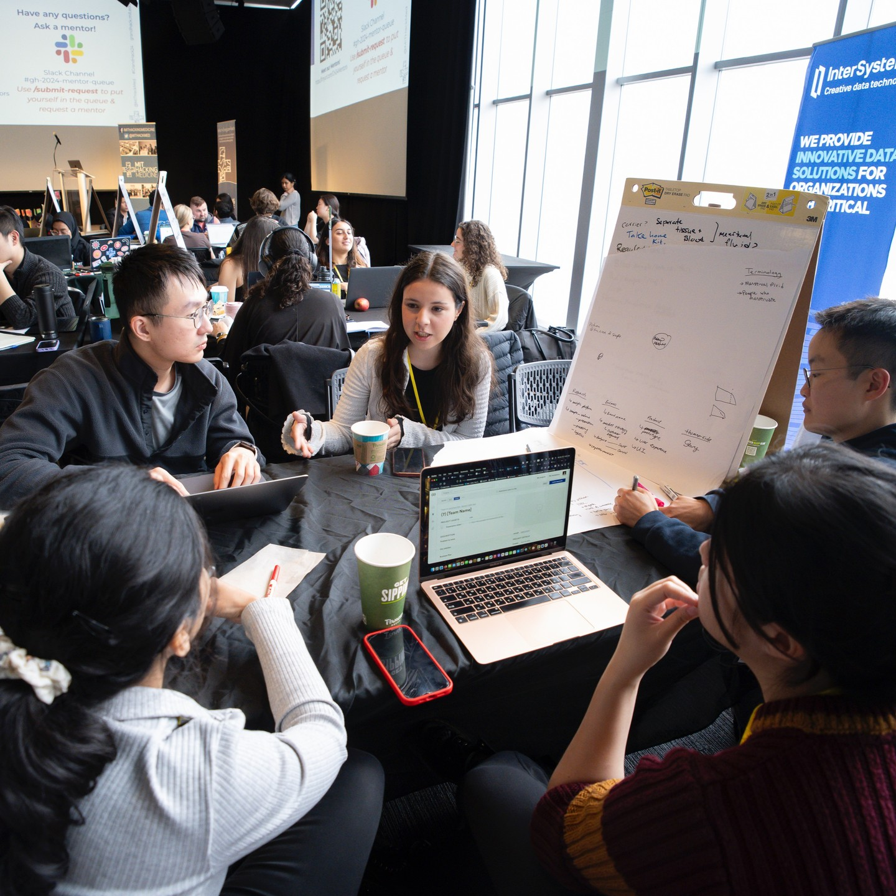
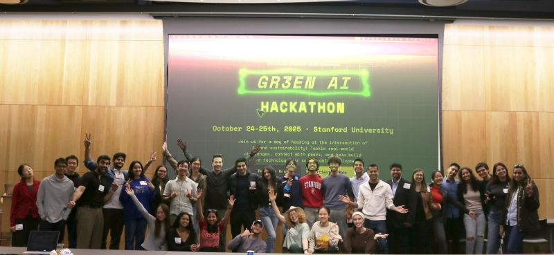
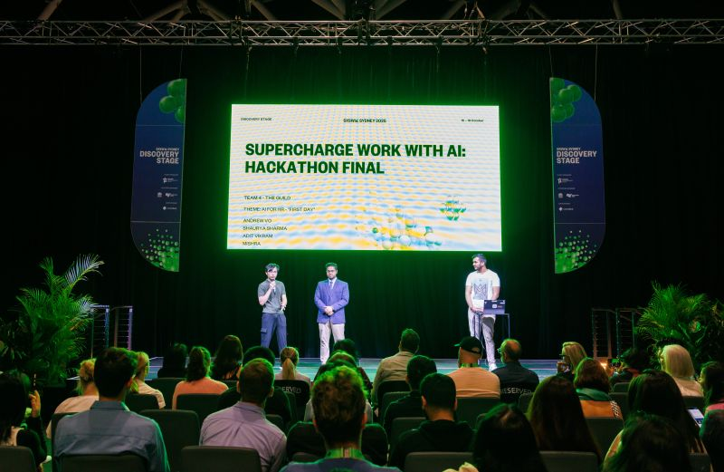

## **模块七 设计理念: 为什么是黑客松?**

<div class="columns" style="font-size: 0.6em;">

<div>

### 💡 核心理念: 以赛促学
我们要的不是答卷，而是**作品**。

*   **打破“完美主义”**: 
    在这里，**"Done is better than perfect"**。我们接受不完美的代码，只求解决真实的问题 (MVP)。
*   **构建实践共同体**:
    编程不是孤独的修行。在接下来的8节课里，我们将**组队**，在互相 Debug 中建立战友般的情谊。

</div>
<div>

### 🚀 AI 带来的红利
过去，黑客松是程序员的专利。 
现在，**AI 抹平了技术鸿沟**。

*   **门槛降维**: 
    你不需要背诵算法。你只需要有**创意**和**Prompt能力**。
*   **角色升级**:
    你不再是技术的**旁观者**，你是指挥 AI 干活的 **“产品经理”**。

</div>
</div>

<div class="styled-box design-box">
<strong class="box-title">[教学设计]</strong>

### 教学时间: 2分钟
### 环节: 理念对齐 (Mindset)
**角色转换**: 引导学员从“被动学习者”转变为“主动创造者”。
**减压**: 强调 MVP (最小可行性产品) 概念，降低学员对代码完美的心理负担。

</div>

---

## **什么是黑客松 (Hackathon)?**
### **一场思想与技术的马拉松**

<div class="columns">
<div>

### 🧩 词源解密
*   **Hack (钻研)**: 不是“攻击电脑”，而是指用巧妙、非常规的方法解决难题。
*   **Marathon (马拉松)**: 指在集中的短时间内（如24-48小时），高强度地冲刺一个目标。

</div>
<div>

### 💡 核心定义
**“一群人，在有限的时间内，为了解决一个具体问题，把想法变成原型的活动。”**

它不是单纯的编程比赛，更像是一个 **“48小时创业实验”**。
在这里，想法 (Idea) 和 执行 (Execution) 同等重要。

</div>
</div>

<div class="tip" style="font-size: 0.6em;">

**为什么适合老师？**
因为**教学就是一场持续的 Hack**。
我们每天都在用有限的资源去解决（Hack）无穷尽的学生问题（Marathon）。

</div>

<div class="styled-box design-box">
<strong class="box-title">[教学设计]</strong>

### 教学时间: 2分钟
### 环节: 概念辨析 (Concept)
**正本清源**: 纠正大众对“黑客”的刻板印象，将其重构为“创新者”的正面形象。

</div>

---

## **案例 1: MIT Hacking Medicine (Grand Hack)**
### **核心逻辑: 痛点比代码更值钱**
<div class="columns" style="font-size:0.86em">
<div>

**“全球最大的医疗吐槽大会”**
*   **现场直击**: 每年春季，波士顿。台上站的不是黑客，而是医生、护士，甚至是推着轮椅的病人。
*   **游戏规则**: 
    1.  **痛点路演 (Pitch)**: 医生抱怨“医院里这点事太烦了”。
    2.  **认领任务**: 工程师和设计师举手：“这事我能用技术解决”。
*   **成功故事**: PillPack (被亚马逊$10亿收购) 就诞生于此——它的创始人不是去写复杂的算法，而是解决了“老年人记不住吃药”这个简单的痛点。

</div>

<div>

<div class="align-middle-center">


</div>

*(MIT Grand Hack 现场，跨学科团队正在便利贴墙前讨论)*

</div>

</div>

<div class="styled-box design-box">
<strong class="box-title">[教学设计]</strong>

### 教学时间: 2分钟
### 环节: 案例教学 (Case Study)
**价值导向**: 通过 PillPack 的案例，扭转学员“我技术不行，没法参加黑客松”的误区。
强调**领域知识 (Domain Knowledge)** 的价值。

</div>

---

## **MIT 的跨学科黑客松宇宙**

<div class="columns">
<div>

### **不仅仅是医学，万物皆可 Hack**
### **🎨 MIT Hacking Arts (艺术黑客松)**
*   **核心**: 探索**科技与创意产业**的边界。
*   **参与者**: 艺术家、设计师、音乐人与工程师混搭。
*   **挑战**: 如何用 AI 辅助作曲？如何用 VR 重塑舞台表演？
*   **启示**: 艺术教育 + 技术 = 新的感官体验。

</div>
<div>

### **⚖️ MIT Policy Hackathon (政策黑客松)**
*   **核心**: 用**数据科学**解决**社会问题**。
*   **参与者**: 政治学、法学、社会学与数据专家组队。
*   **挑战**: 城市交通公平性分析、公共卫生资源分配。
*   **启示**: 这里的“产品”是**政策建议书**，而不仅是代码。

</div>
</div>

<div class="tip" style="font-size: 0.6em;">

**给老师们的启示**
无论你是教**美术、音乐**，还是**思政、管理**，黑客松都是你们 **“打破边界”** 的工具。

</div>

<div class="styled-box design-box">
<strong class="box-title">[教学设计]</strong>

### 教学时间: 2分钟
### 环节: 视野拓展 (Expansion)
**去魅**: 展示非理工科领域的黑客松案例，让文科、艺术类背景的教师也能找到归属感。

</div>

---

## **案例 2: Stanford Green AI Hackathon**
### **核心逻辑: 领域专家 (Domain Experts) 的胜利**

<div class="columns" style="font-size:0.95em">
<div>

**“懂环境比懂 AI 更重要”**
*   **跨界现场**: 
    这是一场**能源政策系**学生与 **CS系** 学生的联谊。
    *   **专业学生**: 提供“森林火灾蔓延模型”的专业知识。
    *   **程序员**: 用 AI 去训练卫星图像模型。
*   **启示**: 
    在 AI 时代，**掌握领域知识 (Domain Knowledge)** 的人才是拿着地图的人，程序员只是负责开车的司机。

</div>
<div class="align-center">




</div>
</div>

<div class="styled-box design-box">
<strong class="box-title">[教学设计]</strong>

### 教学时间: 1分钟
### 环节: 角色赋能 (Empowerment)
**主次倒置**: 强调在特定场景下，非技术背景的领域专家(SME)比纯技术人员更具核心竞争力，增强老师们的职业自信。

</div>

---

## **案例 3: Harvard GenAI Hackathon**

<div class="columns" style="font-size:0.95em">
<div>

### **核心逻辑: 英语是新的编程语言**
**“No Coding Experience Required”**
*   **口号**: 这是一个**不允许**写复杂底层代码的比赛。
*   **玩法**: 
    *   参赛者使用 **AI Sandbox** (类似我们课上的平台)。
    *   比拼谁的 **Prompt** 写得好，谁的**创意**（Use Case）更落地。
*   **你的角色**: 
    你不需要成为架构师，你只需要成为最好的 **“AI 驯化师”**。

</div>
<div style="display: grid; grid-template-columns: 1fr 1fr; gap:10px 10px; align-content: center; line-height: 0; height: 100%;">
  
  
  
  
  
  
</div>
</div>

<div class="styled-box design-box">
<strong class="box-title">[教学设计]</strong>

### 教学时间: 1分钟
### 环节: 信心建立 (Confidence)
**点题**: 回扣课程主题 "AI-Empowered"，再次强调 Prompt Engineering 的重要性，消除技术焦虑。

</div>

---

## **模块七 学习路线图: 从“看懂”到“创造”**

<div class="columns">
<div>

我们将用4节课的时间，完成AI应用黑客松的**启动**阶段：

*   **Step 1: AI之眼 (Vision)** <span style="color: #666; font-size: 0.9em;">*(Lesson 25)*</span>
    让计算机学会“看图”，这是感知的起点。
*   **Step 2: 云端大脑 (Brain)** <span style="color: #666; font-size: 0.9em;">*(Lesson 26)*</span>
    接入 DeepSeek/GPT，获得逻辑推理能力。
*   **Step 3: 创意组合 (Idea)** <span style="color: #666; font-size: 0.9em;">*(Lesson 27)*</span>
    **黑客松组队**！混合智能（感知+大脑）构思产品。
*   **Step 4: 工程落地 (Build)** <span style="color: #666; font-size: 0.9em;">*(Lesson 28)*</span>
    调试、优化、准备 Demo。

</div>
<div>


<div class="tip" style="font-size: 0.6em;">

**通关目标**
本模块结束时，每组将产出一个 **MVP (最小可行性产品)** 的原型代码。
我们将在 **Module 8** 的 Demo Day 上分享作品！

</div>

</div>
</div>

<div class="styled-box design-box">
<strong class="box-title">[教学设计]</strong>

### 教学时间: 2分钟
### 环节: 路线图 (Roadmap)
**结构化思维**: 给出清晰的里程碑 (Milestones)，让学员知道每一步在做什么，终点在哪里。

</div>

---

## **本节课学习目标**

<div class="columns" style="font-size:0.95em">
<div>

1.  **原理**: 理解 AI 视觉模型(VLM)是如何“看图说话”的。
2.  **体验 Florence-2**: 运行 Microsoft 的 **Florence-2-base** 模型，生成详细的图像描述。
3.  **视觉提示词 (Visual Prompting)**: 学习如何通过 Task Token (如 `<MORE_DETAILED_CAPTION>`) 精确控制 AI 的输出。

### **课前准备**
请确认项目根目录下的 `models/florence-2-base` 文件夹已准备就绪。

</div>
<div>


<div class="tip" style="font-size: 0.6em;">

**什么是 VLM (Vision-Language Model)?**
它是一个打破了视觉和语言界限的超级大脑。
它不仅“看见”了像素，还理解了像素背后的**语义**，并能像人类一样用语言表达出来。

</div>

</div>
</div>

<div class="styled-box design-box">
<strong class="box-title">[教学设计]</strong>

### 教学时间: 1分钟
### 环节: 目标 (Objective)
**脚手架 (Scaffolding)**: 直接提供预训练好的模型 (Florence-2)，跳过复杂的训练过程，让学员直接体验推理 (Inference) 的乐趣。

</div>

---

## **1. 思考: 计算机怎么“看”世界？**

<div class="columns">
<div>

当你看到右边这张图，你会说：
**"这是一只双色猫。"**

但在计算机眼里，它其实是一个巨大的数字矩阵：
`[[255, 128, 0], [254, 130, 5], ...]`

**AI 的工作，就是找到这堆数字背后的规律，然后告诉我们：这是猫。**

</div>
<div>


</div>
</div>

<div class="styled-box design-box">
<strong class="box-title">[教学设计]</strong>

### 教学时间: 2分钟
### 环节: 概念 (Concept)
**反差对比**: 强调人类视觉的直觉性 vs 机器视觉的计算性。
展示像素矩阵，让学员理解为什么计算机视觉 (CV) 曾经那么难。

</div>

---

## **2. 核心工具: Hugging Face Transformers**

<div class="columns"  style="font-size:0.83em">
<div>

这节课我们要认识两个新朋友：`AutoModel` 和 `AutoProcessor`。
它们是 Hugging Face 的两员大将：
*   **Processor (翻译官)**: 负责把图片和提示词“翻译”成电脑能懂的数字。
*   **Model (大脑)**: 负责用这些数字进行思考和生成。

我们通过简明的三步走方式来完成任务：

1.  **准备 (Processor)**: 把图片和提示词转化成电脑能懂的数字。
2.  **生成 (Generate)**: 运行模型，生成一串代表答案的数字代码 (Token IDs)。
3.  **翻译 (Decode)**: 查字典，把这些数字代码变回人类的文字。

</div>
<div>


</div>

</div>

<div class="styled-box design-box">
<strong class="box-title">[教学设计]</strong>

### 教学时间: 3分钟
### 环节: 概念 (Concept)
**拟人化**: 使用 "翻译官" 和 "大脑" 的比喻。
复习 Pipeline 概念，强调知识迁移：之前学过的 NLP 工具现在依然好用。

</div>

---

## **3. 你的第一个视觉脚本:看图说话**

<div class="columns ratio-4-6" style="font-size:0.9em">
<div>

**任务目标**: 
编写 `lesson25_vision_demo.py`，识别当前目录下的一张图片 `test_image.jpg`。

### **🧠 Prompt 策略 (Strategy)**

*   **Role**: Python 开发者
*   **Model**: `microsoft/Florence-2-base` (VLM)
*   **Task**: `image-to-text` (详细描述)
*   **Path**: 本地路径 (`./models/florence-2-base`)

</div>
<div>

**Prompt 指令**:
> "请帮我写一个 Python 脚本。
> 1. **场景**: 我已经把 Florence-2 模型下载到了本地文件夹 `./models/florence-2-base`。
> 2. **任务**: 请加载这个本地模型，并对 `test_image.jpg` 进行**详细描述** (使用 `<MORE_DETAILED_CAPTION>`)。
> 3. **注意**: 加载时请允许运行远程代码 (`trust_remote_code=True`)。"
<div class="insight" style="font-size: 0.6em;">

**关键提示**:
Florence-2 是一个**生成式模型**，它不是在做选择题（分类），而是在做**问答题**（看图说话）。

</div>
</div>
</div>

<div class="styled-box design-box">
<strong class="box-title">[教学设计]</strong>

### 教学时间: 2分钟
### 环节: 动手 (Lab)
**关键细节**: 强调 `trust_remote_code` 和 Task Token。
这些是实际工程中容易踩坑的地方。

</div>

---

<style scoped>
pre code {
  font-size: 40px !important; /* 尝试设置一个更大的值 */
  line-height: 1.3 !important; /* 压缩行间距，防止被挤出屏幕 */
}
</style>

## **4. 代码解析 (Code Analysis)**

<div class="columns">
<div>

```python
from transformers import AutoProcessor, AutoModelForCausalLM
from PIL import Image

# 1. 加载大脑 (VLM)
model_id = "./models/florence-2-base"
model = AutoModelForCausalLM.from_pretrained(model_id, 
            trust_remote_code=True).eval()
processor = AutoProcessor.from_pretrained(model_id, 
            trust_remote_code=True)

# 2. 睁开眼睛 (Image)
image = Image.open("test_image.jpg")

# 3. 思考 (Generate)
prompt = "<MORE_DETAILED_CAPTION>"
inputs = processor(text=prompt, images=image, return_tensors="pt")

generated_ids = model.generate(
    input_ids=inputs["input_ids"],
    pixel_values=inputs["pixel_values"],
    max_new_tokens=1024,
    num_beams=3
)

# 4. 说话 (Decode)
text = processor.batch_decode(generated_ids, 
    skip_special_tokens=False)[0]
print(text)
```

</div>
<div>

### **关键点解读**

1.  **`eval()`**: 
    告诉模型“现在是考试时间”，不要学习（训练），全心全意做题（推理）。
2.  **`trust_remote_code=True`**:
    允许加载微软编写的自定义模型代码（因为它是新架构，不是标准库的一部分）。
3.  **`<MORE_DETAILED_CAPTION>`**:
    这是**咒语** (Task Token)。你告诉模型“我要更详细的”，它就会详细描述画面细节。

</div>
</div>

<div class="styled-box design-box">
<strong class="box-title">[教学设计]</strong>

### 教学时间: 5分钟
### 环节: 代码走查 (Code Review)
重点解释 PIL 的作用，这是处理图像必不可少的库。让学员理解 `Image.open` 是将文件转化为内存对象的步骤。

</div>

---

## **5. 进阶挑战: 把刚才的脚本变成手机能用的 App**

<div class="columns"  style="font-size:0.95em">
<div>

### **编写提示词 (Prompting)**
### **🧠 提示词策略 (Thinking)**
1.  **明确角色**: 你是 Python 全栈工程师。
2.  **融合知识**: 显式告知 AI 要结合 **Module 6 (FastAPI)** 和 **Module 7 (VLM)**。
3.  **约束条件**:
    *   接收 `UploadFile` (手机传图片)。
    *   使用 `processor` 处理图片和文本 (`<MORE_DETAILED_CAPTION>`)。
    *   **关键**: 只要返回生成的文本描述即可，不要复杂的 HTML。

</div>
<div style="font-size:0.92em">

### **📝 提示词示范 (Action)**

> "**我需要把刚才的 Florence-2 脚本封装成一个 API。**
>
> 1. 使用 `FastAPI` 创建一个 POST 接口 `/upload`。
> 2. 接收手机上传的图片 (`UploadFile`)。
> 3. **核心逻辑**: 读取文件字节流，用 `PIL.Image` 打开，然后喂给 `model` 和 `processor`。
> 4. 不需要写前端页面，我直接用 Swagger UI 测试。
> 5. 打印出启动命令 (host=0.0.0.0)。"

</div>
</div>

<div class="styled-box design-box">
<strong class="box-title">[教学设计]</strong>

### 教学时间: 2分钟
### 环节: 知识融合 (Synthesis)
**螺旋上升**: 将 Module 7 的新知识 (CV) 与 Module 6 的旧知识 (Web API) 结合。
这有助于巩固旧知，同时让新知立刻有落地场景。

</div>

---

<style scoped>
pre code {
  font-size: 40px !important; /* 尝试设置一个更大的值 */
  line-height: 1.1 !important; /* 压缩行间距，防止被挤出屏幕 */
}
</style>

## **6. 手机扫码体验**

<div class="columns">

<div>

### **连接 Module 6 + Module 7**
```python
# lesson25_mobile_demo.py
from fastapi import FastAPI, UploadFile, File
# ... (省略 import)

# 1. 预加载 Florence-2 (全局变量)
# ... (加载代码略) ...

@app.post("/upload")
async def upload_image(file: UploadFile = File(...)):
    # 2. 读取 + 转换
    contents = await file.read()
    image = Image.open(io.BytesIO(contents)).convert("RGB")
    
    # 3. 运行 VLM
    inputs = processor(text="<MORE_DETAILED_CAPTION>", 
        images=image, return_tensors="pt")
    # ... (generate 代码) ...
    
    return {"label": caption}
```

</div>

<div>

### **体验步骤**

1.  **运行服务**: 确保电脑和手机在同一 WiFi。
2.  **生成二维码**: 使用我们的工具脚本 (或此时手动输入 http://电脑IP:8000/docs)。
3.  **手机扫码**: 打开 Swagger UI，点击 `/upload` -> `Try it out`。
4.  **拍照上传**: 从图库选择文件上传，或者直接调用手机摄像头拍照。

</div>
</div>

<div class="tip" style="font-size:0.6em">

**原理揭秘**
*   **FastAPI**: 负责接收 HTTP 请求（就像 Module 6 讲的点餐服务）。
*   **io.BytesIO**: **内存里的“虚拟文件”**。它把下载到的数据在内存中直接转换成文件格式，这样不需要存到硬盘上，程序就能直接读取图片。

</div>

<div class="styled-box design-box">
<strong class="box-title">[教学设计]</strong>

### 教学时间: 5分钟
### 环节: 互动实验 (Interactive Lab)
**Aha Moment**: 从“枯燥的代码”到“手机能用的功能”，这是学员成就感最强的时刻。
**技术难点**: 预判网络连接问题 (Host/IP)，做好现场支持准备。

</div>

---

## **7. 迭代优化：给 API 穿上外衣**

光有 API 还不够，Swagger UI 给开发者看还行，给用户看太简陋了。
让我们用 AI **一句话生成** 一个漂亮的前端界面。

### **Prompt Strategy (Frontend)**
<div class="columns" style="font-size:0.7em">
<div>

描述需求：
> "我有一个 FastAPI 后端，地址是 `/upload` (POST)，接收 `file` 字段。
> 请帮我写一个单文件的 `index.html`。
> **要求**:
> 1.  **暗黑模式 (Dark Mode)**，科技感 UI。
> 2.  中间有一个大大的**相机图标**，手机点击可以调起摄像头。
> 3.  使用 `fetch` 异步上传图片，并在下方显示返回的 `label` 文字。
> 4.  增加 Loading 动画。"

</div>
<div>

<div class="tip" style="font-size: 0.8em;">

**为什么这样做？**
*   **前后端分离**: 我们专注于写好 Python 逻辑 (后端)。
*   **AI 赋能**: 繁琐的 HTML/CSS/JS 让 AI 去写，它有超越人类的前端开发能力。
*   **快速原型**: 5分钟就能把一个 API 变成一个 App。

</div>

</div>
</div>

<div class="styled-box design-box">
<strong class="box-title">[教学设计]</strong>

### 教学时间: 2分钟
### 环节: 前端赋能 (Frontend Empowerment)
**AI Role**: 强调 AI 是你的“前端合伙人”。你负责逻辑，它负责颜值。

</div>

---

## **8. 代码揭秘：如何托管前端？**

只需要增加 **3行代码**，FastAPI 就能变成 Web 服务器。

```python
from fastapi.responses import HTMLResponse
import pathlib

# 新增路由: 访问根目录 "/" 时
@app.get("/", response_class=HTMLResponse)
def home():
    # 就像读txt文件一样读取 html
    html_content = pathlib.Path("index.html").read_text(encoding="utf-8")
    return html_content
```

<div class="insight" style="font-size: 0.6em;">

**原理解析**:
当用户访问 `http://ip:8000/` 时，FastAPI 读取本地的 `index.html` 文件内容，并告诉浏览器："这是一段 HTML 代码 (`response_class=HTMLResponse`)，请渲染它，而不是把它当成文本显示。"

</div>

<div class="styled-box design-box">
<strong class="box-title">[教学设计]</strong>

### 教学时间: 2分钟
### 环节: 部署 (Deployment)
**极简主义**: 展示用 Python 托管静态文件的最简单方法，避免引入 Nginx 等复杂概念，降低心智负担。

</div>

---

## **9. 最终实验: 你的第一个 AI App**

请运行 **Web应用化** 的脚本，拿起手机扫描屏幕上的二维码（或手动输入网址），然后把镜头对准身边的万物！

**思考题 (Think-Pair-Share)**:
1.  **细节**: 它不仅仅说 "Laptop" (笔记本)，它有没有说颜色、品牌、或者是屏幕上的内容？
2.  **关系**: 试着拍两个人，它能说出 "Two people talking" (两个人在交谈) 吗？
3.  **幻觉**: 拍一张复杂的抽象画，听听它是怎么一本正经胡说八道的。

<div class="key-point" style="font-size: 0.6em;">

**实验观察**:
Florence-2 是一个强力的 VLM。与计算机视觉技术早期的分类模型不同，它试图**理解**整个场景。
你会发现它不仅能识别**物体 (Objects)**，还能识别**属性 (Attributes)** 和 **关系 (Relationships)**。
这就是现代 AI 的魅力——它开始有了“语义理解”能力。

</div>

<div class="styled-box design-box">
<strong class="box-title">[教学设计]</strong>

### 教学时间: 3分钟
### 环节: 探究 (Inquiry)
**引导观察**: 引导学员关注 AI 的“理解能力”而非单纯的“识别标签”。
鼓励学员发现 AI 的幻觉 (Hallucination)，建立客观的 AI 认知。

</div>

---

## **课程小结**
### **关键点**
<div class="columns" style="font-size:0.8em">
<div>

1.  **VLM (Vision-Language Model)**: AI 的能力从简单的物体分类 (Tagging) 进化到了场景理解与描述 (Captioning)。
2.  **Florence-2**: 微软的小型神级模型，证明了小模型也能有大智慧。
3.  **本地部署**: 即使是这么强的生成模型，在你的笔记本上也能流畅运行。

### **下节预告**
我们的 VLM 虽然能看懂图，但它生成的是**英文**描述，这对我们的中文教学场景不够友好。
下节课，我们将学习**Pipeline 思维 (流水线)**：把 VLM 的输出，喂给另一个擅长翻译的 AI。
搭建一条 **“视觉 -> 翻译”** 的自动化流水线！

</div>
<div>


</div>
</div>

<div class="styled-box design-box">
<strong class="box-title">[教学设计]</strong>

### 教学时间: 1分钟
### 环节: 总结与升华 (Conclusion)
**技术向善**: 引导学员思考技术的社会价值，将单纯的代码学习提升到“解决社会问题”的人文高度。

</div>