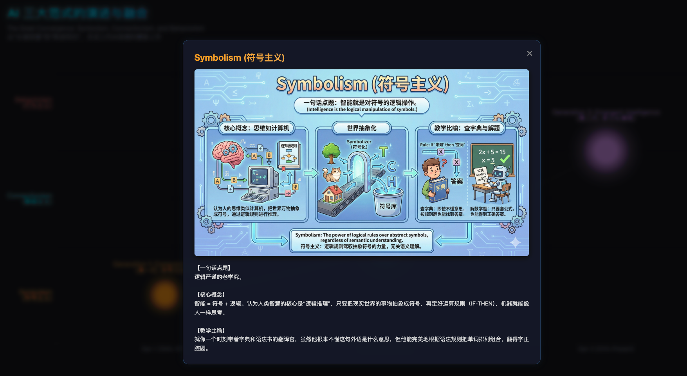
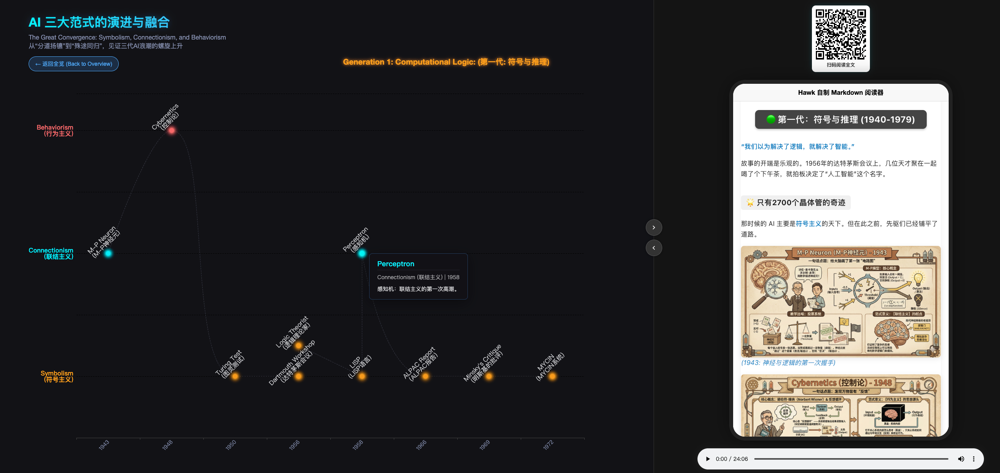
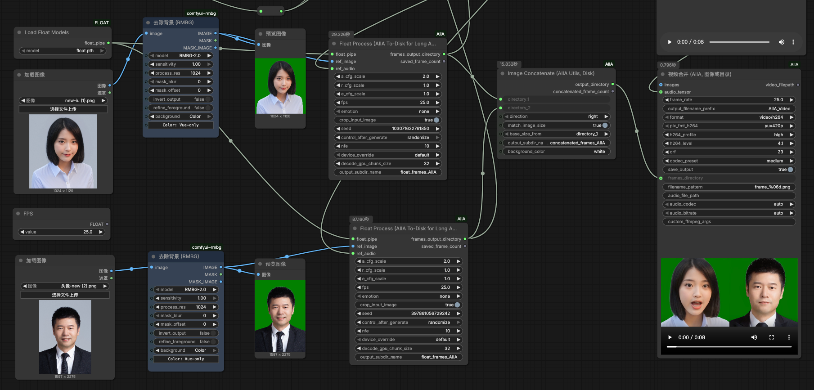
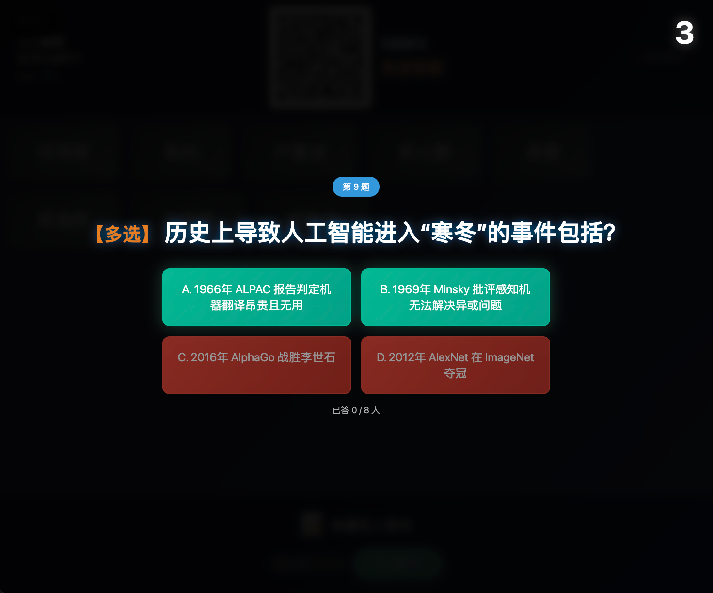

## **Part 1: 课程复盘——从代码到思维 (Retrospective)**

### **我们学到了什么? (What)**
*   **M1**: 破冰，指挥 AI 写出第一行代码。
*   **M2-3**: **结构化思维** (变量/循环/函数)。
*   **M4-5**: **数据思维** (用数据说话)。
*   **M6**: **系统思维** (Web 架构)。
*   **M7**: **产品思维** (黑客松 MVP)。

### **核心思维跃迁 (Mindset Shift)**
1.  **抽象 (Abstraction)**:
    *   把复杂的具体问题，提炼成变量和函数。
2.  **分解 (Decomposition)**:
    *   把大项目拆解为小任务 (Task Breakdown)。
3.  **模式识别 (Pattern Recognition)**:
    *   发现重复的工作，交给循环或 AI 去做。

<strong class="box-title">[教学设计]</strong>

### 教学时间: 2分钟
### 环节: 复盘导入 (Retrospective)
**策略**: 使用**概念地图 (Concept Map)** 将过去7个模块的知识串联起来，形成一个完整的知识网络。
强调"思维"比"技能"更重要，为后续的教学法升级做铺垫。

---

## **双页教学法复盘 (Strategy vs Analysis)**

还记得我们的标准教学模式吗？这也是人机协作的最佳范式。

### **Slide A: Strategy (谋)**
*   **Role**: 你是产品经理/架构师。
*   **Prompt**: 用自然语言清晰定义目标和约束。
*   **关键**: 只要你描述得够清楚，AI 就能实现。

### **Slide B: Analysis (断)**
*   **Role**: 你是代码审查员 (Reviewer)。
*   **Code**: 对 AI 的产出进行验证和优化。
*   **关键**: 不要盲信 AI，保持批判性思维。

**这不仅是写代码的方法，更是未来处理任何复杂任务的标准流程：**
**定义问题 (Human) -> 生成方案 (AI) -> 优化方案 (Human) -> 执行方案 (AI) -> 评估决策 (Human)**

<strong class="box-title">[教学设计]</strong>

### 教学时间: 2分钟
### 环节: 方法论提炼 (Methodology)
**策略**: 将之前零散的实践经验，上升为一套可复用的方法论。
**元认知 (Metacognition)**: 帮助学员意识到"我是怎么学会的"，而不仅仅是"我学会了什么"。

---

## **Part 2: 智慧课程——用计算思维重构教学**

很多老师问：“我教的是文科/理科，不是计算机，怎么用这些技术？”

### **什么是“智慧课程”?**
不是简单的“PPT+视频”，而是：
1.  **个性化 (Personalized)**: 懂每个学生的进度。
2.  **交互式 (Interactive)**: 不止是看，更要动手玩。
3.  **数据驱动 (Data-Driven)**: 用数据反馈优化教学。

### **AI 赋能的三个层次**
*   **L1: 备课助手** (生成教案、PPT、习题)
*   **L2: 课堂助教** (实时问答、作业批改)
*   **L3: 课程重构** (把知识点转化为可交互的软件工具)

<strong class="box-title">[教学设计]</strong>

### 教学时间: 2分钟
### 环节: 概念引入 (Concept Introduction)
**策略**: **渐进式升维**。先承认学员的疑虑（"这跟我有什么关系"），再给出清晰的分层框架，让学员定位自己可以切入的层次。
避免"技术吓退"，强调从 L1 入手也完全可以。

---

## **境界一：传统展示 (Static) —— “搬运工”**

### **特征**
*   **形式**: 普通 PPT 列表 / 纯文本文档。
*   **交互**: 零交互。
*   **本质**: 信息的简单搬运与堆砌。

### **痛点**
*   **信息过载**: 学生被大量抽象概念（如“符号主义”、“联结主义”）淹没。
*   **认知停滞**: 停留在 **Store (存储)** 层面。知识记在笔记里，没进脑子。

<strong>👩‍🏫 教师角色</strong> 
文档朗读器。

<strong class="box-title">[教学设计]</strong>

### 教学时间: 1分钟
### 环节: 反面案例 (Anti-pattern)
**策略**: **通过对比产生洞见**。先展示最低级的形态，让学员产生"这不就是我平时的课件吗"的认知冲突，为后续的升级做铺垫。

---

## **👀 境界一示例：人工智能发展简史 (文字密集型)**

### 第一阶段：符号与推理 (1943-1979)
*   **1943** M-P神经元：联结主义数学模型起点
*   **1948** 控制论：维纳提出反馈与交互
*   **1950** 图灵测试：定义机器智能的标准
*   **1956** 达特茅斯会议：AI 概念正式诞生
*   **1956** 逻辑理论家：首个证明定理的程序
*   **1958** LISP语言：符号处理的基石
*   **1958** 感知机：联结主义的第一次高潮
*   **1966** ALPAC报告：机器翻译失败，寒冬I
*   **1969** 明斯基批评：证明感知机局限性
*   **1972** MYCIN系统：专家系统兴起

### 第二阶段：知识与专家 (1980-2009)
*   **1980** XCON系统：专家系统商业化巅峰
*   **1986** 反向传播(BP)：复活联结主义
*   **1989** Q-Learning：强化学习形式化
*   **1997** 深蓝：符号主义战胜人类棋王
*   **1997** LSTM：解决序列长依赖问题
*   **1998** LeNet-5：CNN开启视觉识别时代
*   **2006** 深度置信网：Hinton开启深度学习
*   **2009** ImageNet：大数据时代的燃料

### 第三阶段：学习与涌现 (2010-2025)
*   **2012** AlexNet：深度学习全面爆发
*   **2013** DQN：感知与决策的初步融合
*   **2014** GAN：生成对抗网络诞生
*   **2015** ResNet：识别精度首次超越人类
*   **2016** AlphaGo：三派合一的里程碑
*   **2017** Transformer：注意力机制统治NLP
*   **2020** GPT-3：大模型涌现通用智能
*   **2022** ChatGPT：RLHF引入人类反馈
*   **2024** Sora：世界模型理解物理规律
*   **2025** 具身智能：AI进入物理世界

**教学反思**：
典型的“仓库型”课件。虽然逻辑结构（分三列）有了，但信息密度过大，学生在课堂上根本来不及阅读，只能机械地拍照。缺乏视觉焦点和逻辑流动。

<strong class="box-title">[教学设计]</strong>

### 教学时间: 1分钟
### 环节: 活体案例 (Live Demo)
**策略**: 用一个真实的"反面教材"让学员产生代入感。很多老师自己的课件就是这样的，这能引发反思。

---

## **境界二：美学升级 (Aesthetic) —— “设计师”**

### **特征**
*   **形式**: 精美的信息图 (Infographic) / 设计感强的 Keynote。
*   **交互**: 视觉冲击，但仍是单向输出。
*   **本质**: 信息的“美颜”处理。

### **提升**
*   **降低认知负荷**: 用**Nano Banana Pro**等工具生成可视化的知识脉络。
*   **认知升级**: 达到 **View (观看)** 层面。好看，能因起兴趣，但看过即忘。

<strong>👩‍🏫 教师角色</strong> 
视觉设计师。

<strong class="box-title">[教学设计]</strong>

### 教学时间: 2分钟
### 环节: 渐进式升级 (Progressive Enhancement)
**策略**: 承认进步，但指出局限。避免"全盘否定"带来的挫败感，让学员看到自己目前处于哪个阶段。

---

## **🎨 境界二示例：AI 生成的精美图表**

> *“哇，这个图好漂亮！”*
>
> 😮 **学生反应**：多看两眼，但不知道内容之间有什么深层联系。

<strong class="box-title">[教学设计]</strong>

### 教学时间: 30秒
### 环节: 快速过渡 (Quick Transition)
**策略**: 用实际图片快速印证前页观点，不做过多停留。

---

## **境界三：交互重构 (Interactive) —— “工程师”**

### **特征**
*   **形式**: **Web 交互网页** (如 ECharts Timeline)。
*   **交互**: 点击、拖拽、下钻、筛选。
*   **本质**: 知识的**结构化**与**动态化**。

### **提升**
*   **主动探索**: 学生不再是被动接收，而是主动去“玩”数据。
*   **空间建模**: "萤火虫"动效暗示了知识的流动。
*   **认知升级**: 达到 **Explore (探索)** 层面。动手操作，建立时空坐标系。

<strong>👩‍🏫 教师角色</strong> 
产品经理 / 工程师。

<strong class="box-title">[教学设计]</strong>

### 教学时间: 2分钟
### 环节: 核心跃迁 (Critical Transition)
**策略**: **划重点**。明确告诉学员：境界三是本课程的核心目标。这也是"课程即软件"理念的具体落地。

---

## **🖱️ 境界三示例：ECharts 交互式图表**

> *“原来点击这里可以看到它背后的逻辑！”*
>
> 🤩 **学生反应**：主动点击 Y 轴标签，探索“符号主义”是什么。

<strong class="box-title">[教学设计]</strong>

### 教学时间: 30秒
### 环节: 成果展示 (Showcase)
**策略**: 用我们自己做的案例来说明"能做到什么"，增强学员信心。

---

## **境界四：智慧融合 (Intelligent) —— “架构师”**

### **特征**
*   **形式**: **双模态融合** (交互图表 + 深度文章/播客)。
*   **交互**: 沉浸式体验，千人千面 (未来)。
*   **本质**: 知识的**深度内化**与**情感连接**。

### **提升**
*   **全景叙事**: 不仅有骨架 (Timeline)，还有血肉 (WeChat Article)。
*   **多维刺激**: 视觉(图表) + 逻辑(文章) + 听觉(播客) 同时作用。
*   **认知升级**: 达到 **Immerse (沉浸)** 层面。不仅懂了知识，更懂了历史的厚重感。

<strong>👩‍🏫 教师角色</strong> 
智慧课程架构师。

<strong class="box-title">[教学设计]</strong>

### 教学时间: 2分钟
### 环节: 愿景展示 (Vision)
**策略**: **点燃火花**。虽然境界四需要更高的综合能力，但先让学员看到"天花板"在哪里，激发向往。

---

## **🧠 境界四示例：全景式知识产品**

> *“这不只是一节课，这是一个探索 AI 的旅程。”*
>
> 🤯 **学生反应**：深刻理解了“寒冬”与“盛夏”的周期律，形成长时记忆。

<strong class="box-title">[教学设计]</strong>

### 教学时间: 30秒
### 环节: 具象展示 (Concrete Example)
**策略**: 用实际产品说话，避免空谈概念。

---

## **境界五：数智分身 (Embodied) —— “造物主”**

### **特征**
*   **形式**: **AI 驱动的数字人** (Digital Avatar)。
*   **交互**: 实时语音对话、情绪共鸣、千人千问。
*   **本质**: 教师形象与智慧的**数字化永生**。

### **提升**
*   **无限分身**: 老师不再受时间限制，可以同时给100个学生“一对一”辅导。
*   **情感连接**: 激情四射的讲解 + 温暖的眼神交流，打破网课的冰冷感。
*   **认知升级**: 达到 **Co-evolve (共生)** 层面。师生共同在与 AI 的对话中生成新知识。

<strong>👩‍🏫 教师角色</strong> 
数字生命造物主。

<strong class="box-title">[教学设计]</strong>

### 教学时间: 2分钟
### 环节: 未来愿景 (Future Vision)
**策略**: **种下一颗种子**。虽然境界五对大多数老师来说还比较遥远，但让他们知道"未来已来"，保持对技术的敏感度。

---

## **🧞‍♂️ 境界五示例：AI 驱动的数字讲师**

(场景：屏幕里的“数字黎鹰”正在激情演讲，并通过麦克风回答学生的提问)

> *“老师，我还是不懂行为主义。”*
> *数字人微微一笑：“记得你养过的小狗吗？我们来聊聊这一层...”*

<strong>🚧 正在探索中 (Under Construction)</strong> 
目前我们正在探索利用ComfyUI集成最新的 <strong>Sora 2 / HeyGen / Veo 3.1 / RAG</strong> 等技术，将“使用教师形象和语音激情讲课”工具化。
未来，每一个老师都能轻松拥有自己的“数字分身”，实现真正的<strong>7x24小时伴随式教学</strong>。
敬请期待！

<strong class="box-title">[教学设计]</strong>

### 教学时间: 30秒
### 环节: 激发想象 (Inspiration)
**策略**: 用对话模拟来具象化"数字人的人性化"，避免让技术显得冰冷。

---

## **开发中的数字讲师**

<strong class="box-title">[教学设计]</strong>

### 教学时间: 15秒
### 环节: 技术预告 (Tech Preview)
**策略**: 快速闪过，保持神秘感，不做过多技术细节讲解。

---

## **实战演练：你的“智慧课程”大纲**

请拿出纸笔，思考以下问题：

1.  **痛点**: 我现在的课程中，哪个知识点最难讲？最抽象？
2.  **转化**: 如果把这个知识点变成一个**Software** (小工具/网页)，它应该长什么样？
    *   *输入是什么？*
    *   *输出是什么？*
3.  **Prompt**: 我怎么指挥 AI 去把这个工具做出来？

**讲师示例**:
*   **通用场景**: **学科发展史的演变** (无论是物理学的演变、计算机的发展，还是文学流派的更替)。
*   **转化**: 做一个“交互式学科演化轴/地图”。拖动时间轴，地图上的疆域、流派或关键事件自动变化。
*   **实现**: 只要有数据，指挥 AI 用 **ECharts** 等前端库生成一个 **HTML 网页**。无论部署在云端还是本地，学生通过浏览器即可丝滑交互。

<strong class="box-title">[教学设计]</strong>

### 教学时间: 5分钟
### 环节: 动手实践 (Workshop)
**策略**: **脚手架 (Scaffolding)**。通过三个具体的问题（痛点-转化-Prompt）为学员提供思考的抓手，防止他们陷入“不知从何入手”的焦虑。

---

## **🎓 理论引领 I：从“工匠”回归“建筑师” (Pre-class)**

### **传统痛点**
*   **低认知负荷劳动**: 教师 80% 的时间花在找图、排版、做 PPT 动画上。
*   **角色错位**: 教师沦为“文档美工”和“资源搬运工”。

### **教育学原理：ADDIE 模型**
*   **A (Analysis)**: 需求分析
*   **D (Design)**: 教学设计
*   **D (Development)**: 资源开发 ⬅️ **AI 接管**
*   **I (Implementation)**: 实施
*   **E (Evaluation)**: 评价

<strong>💡 核心转变</strong> 
AI 流水线将教师从低效的 <strong>Development</strong> 环节解放出来，使其能回归教育的本质——专注于两端的 <strong>Analysis (分析学生)</strong> 和 <strong>Evaluation (评价效果)</strong>。

<strong class="box-title">[教学设计]</strong>

### 教学时间: 2分钟
### 环节: 理论支撑 (Theory)
**策略**: **学术赋权**。用经典的教育学模型（ADDIE）来支撑前面的实践，让学员感到"我们做的事是有理论依据的"。

---

## **🛡️ 理论引领 II：构建“心理安全区” (In-class)**

### **课堂沉默的真相**
*   **社会压力**: 学生害怕答错、害怕丢脸（Social Pressure）。
*   **对抗张力**: 传统的提问往往带有“考核”性质，形成师生对立。

### **教育学原理：心理安全 (Psychological Safety)**
*   **去中心化**: 匿名弹幕墙创造了平等的发声空间，让内向学生也能“大声”说话。
*   **游戏化 (Gamification)**: 引入 AI 辩论或抢答，将枯燥的测验变为游戏，消除了对错误的恐惧。

<strong>🎮 寓教于乐</strong> 
当批判性思维的训练变得像“打怪升级”一样自然，学习就不再是负担，而是探索。

<strong class="box-title">[教学设计]</strong>

### 教学时间: 2分钟
### 环节: 痛点共鸣 (Empathy)
**策略**: **共情开场**。"学生沉默"是所有老师的共同痛点，从这里切入能快速建立连接。

---

## **🔄 理论引领 III：从“尸检”到“体检” (Post-class)**

### **评价的滞后性**
*   **总结性评价 (Summative)**: 期末考试就像“尸检”，发现了问题也来不及补救。
*   **凭经验教学**: 老师只能凭感觉判断学生懂没懂。

### **教育学原理：形成性评价 (Formative Assessment)**
*   **实时诊断**: 通过学情数据（点击率、停留时长）实时“体检”。
*   **泛在学习 (Ubiquitous Learning)**: “Always Online” 的助教打破了时空边界，实现真正的自适应学习。

<strong>📊 闭环思维</strong> 
数据不是为了监控，而是为了<strong>反馈</strong>。只有形成闭环，教学才能不断迭代优化。

<strong class="box-title">[教学设计]</strong>

### 教学时间: 2分钟
### 环节: 理念升级 (Mindset Shift)
**策略**: **类比法**。用"尸检 vs 体检"这个生动的医学比喻，让抽象的"形成性评价"概念变得具体可感。

---

## **重构你的教学流程 (Workflow)**

不要为了用技术而用技术，要解决**教学痛点**。

### **1. 课前 (Prepare): 智慧内容生产流**

<strong>编程价值</strong>：核心在于<strong>“自动装配”</strong>节点。程序自动将文字与图片合并，一键输出四种格式，实现“一次编写，处处运行”。

<strong class="box-title">[教学设计]</strong>

### 教学时间: 2分钟
### 环节: 流程可视化 (Process Visualization)
**策略**: 用**流程图**展示完整工作流，让学员看到"AI 赋能"不是一个点，而是一条线。

---

### **2. 课中 (Engage): 永不掉线的互动**

#### **基础互动**
*   **📱 扫码签到**: 拒绝代签，结合位置或动态码。
*   **⚡️ 抢答器**: 谁是手速王？

#### **高阶互动**
*   **💬 匿名弹幕墙**: 让社恐学生也能“大声”提问。
*   **🤖 AI 辩论对手**: 引入 AI 反方，与全班进行观点 PK。
*   **💻 实时代码协作**: 像 腾讯文档 一样一起写代码 (Live Share)。

*(示意图: 热闹的课堂互动数据流)*

<strong class="box-title">[教学设计]</strong>

### 教学时间: 1分钟
### 环节: 功能清单 (Feature List)
**策略**: 快速罗列功能，激发想象力（"原来还可以这样玩！"）。

---

### **3. 课后 (Extend): 永远在线的课堂**

*   **📊 学情分析 (Analytics)**:
    *   谁在课上互动最少？谁的作业耗时异常？用数据从“经验主义”走向“实证主义”。
*   **🔄 翻转课堂 (Flipped)**:
    *   利用 **MReader** 将知识点前置。课堂不再是“讲知识”，而是“用知识”。
*   **🌐 Always Online**:
    *   智能助教 24 小时在线答疑，打破时空限制。

<strong class="box-title">[教学设计]</strong>

### 教学时间: 1分钟
### 环节: 闭环强调 (Loop Closure)
**策略**: 将课前-课中-课后连成一个完整的循环，强调"系统思维"。

---

## **课程小结**

**核心观点**:
**Code is a new form of Pedagogy.** (代码是一种新的教学法)
当我们把知识固化为代码，我们就创造了一种可以无限复制、实时交互的“活教材”。
这就是“智慧课程”的本质。

**下节预告**:
接下来两节课，我们将把舞台交给各位老师。看看大家是如何把“编程思维”应用到各自的领域中去的。
**Project Showcase (作品分享会) 即将开始！**

<strong class="box-title">[教学设计]</strong>

### 教学时间: 1分钟
### 环节: 总结与预告 (Summary & Preview)
**策略**: **金句收尾**。用一句朗朗上口的英文金句来锚定本节课的核心信息，让学员带着清晰的主旨离开。

